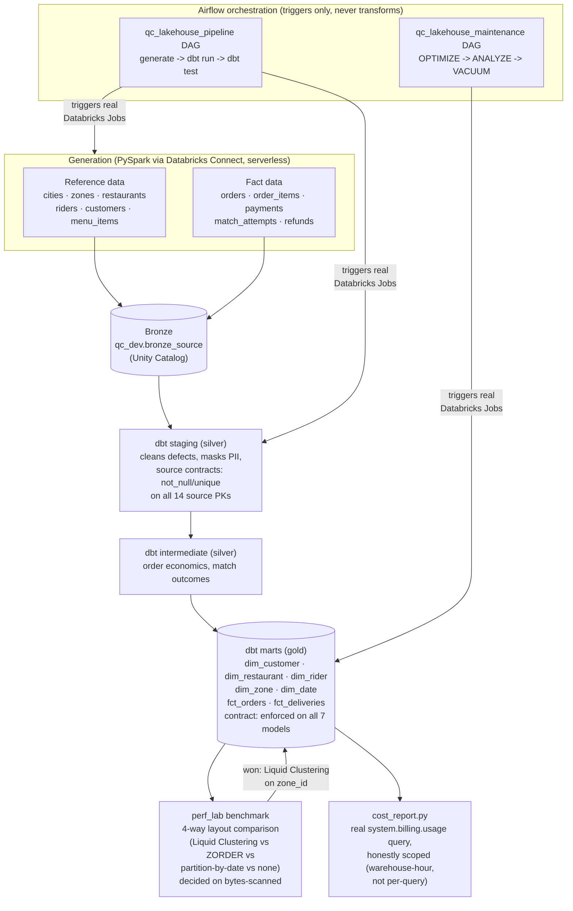

# QC Lakehouse

A quick-commerce delivery data platform built on **Databricks, Apache Spark, dbt, and Apache
Airflow** - a portfolio project designed to demonstrate real data engineering practice, not a
tutorial walkthrough. Every architectural decision below is backed by a live measurement, not
a guess: the production fact table's physical layout was chosen from a real benchmark, PII is
salted (not just hashed), and every write is checkpointed against the exact failure mode the
platform actually produces.

## Architecture



## Tech stack

**Databricks** - serverless Spark (Databricks Connect), SQL Warehouses, Unity Catalog,
Asset Bundles for deployed Jobs, OAuth U2M auth, real cost analysis via
`system.billing.usage`.
**Apache Spark (PySpark)** - the synthetic data generator: deterministic/seeded, explicit
`StructType` schemas (never inferred), broadcast joins, window functions, checkpointed
chunked writes with two independent bailout mechanisms.
**dbt** (`dbt-databricks`) - full medallion architecture (staging -> intermediate -> marts),
`contract: enforced` + `data_type:` on every gold model, `not_null`/`unique` on all 14 bronze
source primary keys, singular tests for cross-table invariants.
**Apache Airflow** - two DAGs orchestrating real Databricks Jobs, idempotent task design, no
transform logic in the scheduler.
**Tooling** - `uv` (dependency management), `pytest` + `ruff` (tests/lint), `make` (task
runner).

## A few engineering decisions worth reading

- **The gold fact table's physical layout was chosen from evidence, not intuition.** A
  dedicated benchmark (`perf_lab/`) wrote a large synthetic `orders` table under 4 different
  physical layouts and measured `system.query.history`-reported bytes-scanned per layout.
  Liquid Clustering on `zone_id` won by a clear margin (420M bytes scanned vs. 552M/616M for
  partition-by-date/no-clustering) and was applied via `dbt`'s own `liquid_clustered_by`
  config - so the decision is durably re-applied on every future `dbt run`, not a one-time
  migration someone could silently revert.
- **PII is salted, not just hashed.** `stg_customers.sql` mixes a per-environment secret
  (`PII_HASH_SALT`, stored as a Databricks Secret, never committed) into the email hash - a
  bare `sha2(email)` is crackable via a rainbow table in seconds; email is low-entropy.
- **The generator is checkpointed against the failure this platform actually produces.**
  Free Edition's quota enforcement doesn't give a cheap, catchable rejection - by the time a
  hard failure surfaces, the damage may already be done. The chunked writer stops cleanly
  (never crashes) on either a slow-chunk threshold *or* a hard Databricks Connect session
  error mid-write, a design forced by a real live failure encountered while building it.
- **Data contracts are enforced, not just documented.** Every gold model declares
  `contract: enforced` with a full `data_type:` per column (traced by hand against the
  generator's own schemas, then live-validated against Databricks - no column got a type it
  wasn't proven to actually produce), and every bronze source table has real `not_null`/
  `unique` tests, not just prose in a README claiming the data is clean.

## Repository structure

Every layer lives in its own real files - nothing here is markdown standing in for code:

```
qc-lakehouse/
├── src/qc_lakehouse/            # Python package: the Spark data generator
│   ├── config.py                #   env/settings loading
│   ├── databricks_session.py    #   Databricks Connect session builder
│   └── generator/                #   entities, schemas, defect injection, fact writer
│       ├── schemas.py            #     explicit PySpark StructTypes (never inferred)
│       ├── customers.py, entities.py, fact_entities.py, fact_writer.py, ...
├── scripts/                      # Executable entry points
│   ├── generate_reference_data.py, generate_fact_data.py
│   ├── resolve_pii_salt.py       #   Databricks Secret -> job task value bridge
│   └── smoke_local.py, smoke_databricks.py
├── perf_lab/                      # Sub-project H: performance & cost lab
│   ├── generate_benchmark_orders.py   # checkpointed large-scale generator
│   ├── run_benchmark_queries.py, apply_winning_layout.py, cost_report.py
├── dbt/qc_lakehouse/
│   ├── models/staging/*.sql       # 1:1 cleaning/masking models + _staging__sources.yml
│   ├── models/intermediate/*.sql  # order economics, match outcomes
│   ├── models/marts/*.sql         # dim_*/fct_* + _marts__models.yml (contract: enforced)
│   └── tests/*.sql                # singular cross-table invariant tests
├── orchestration/dags/
│   ├── qc_lakehouse_pipeline.py    # main Airflow DAG
│   └── qc_lakehouse_maintenance.py # OPTIMIZE/ANALYZE/VACUUM DAG
└── tests/                          # pytest suite (generator, config, dbt-project structure)
```

24 dbt `.sql` models, 5 dbt singular tests, 46 Python files, 9 YAML config files. See
[`qc-lakehouse/README.md`](qc-lakehouse/README.md) for full local setup instructions
(environment, Databricks auth, running the generator/dbt/Airflow yourself).

## Status

**Built:** toolchain setup, reference + fact data generation, dbt medallion transformation,
Airflow orchestration, and a performance/maintenance/cost lab (Sub-projects A, B1/W1a, C, E1,
H). **Not yet built:** additional widen-step data, and further sub-projects (W1b, D, G, F) -
see `docs/superpowers/specs/2026-09-14-qc-lakehouse-databricks-hero-design.md` for the full
planned architecture.

See `docs/superpowers/reports/2026-09-16-best-practices-evaluation.md` for a self-assessment
against 17 data engineering best practices (code discipline, architecture, and efficiency),
kept current as work progresses.
