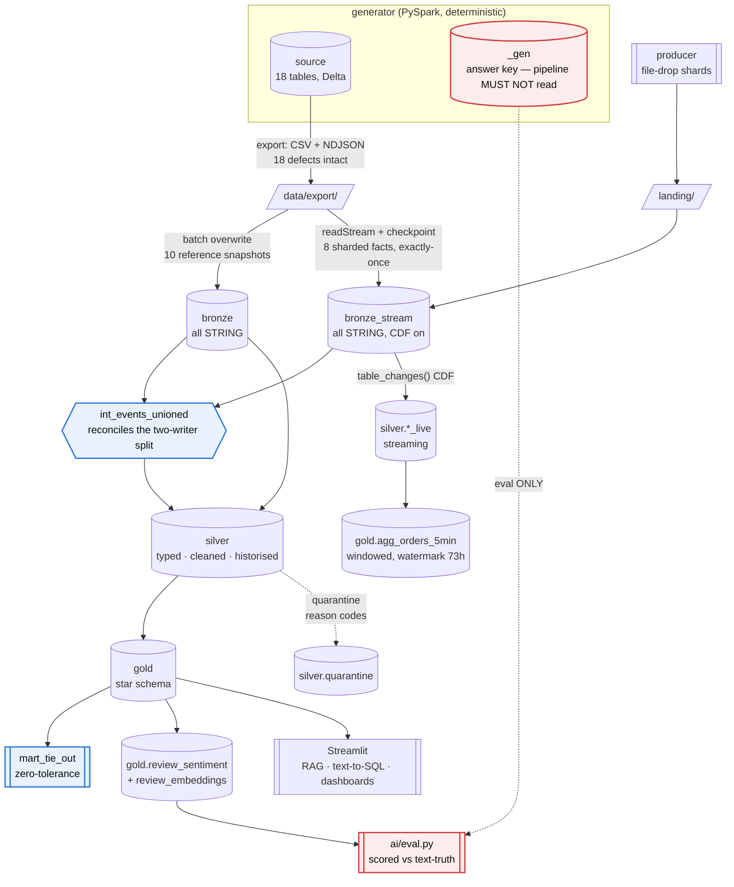

# QC Lakehouse — Local Databricks/Spark/dbt/Airflow Pipeline Implementation Plan

> **For agentic workers:** REQUIRED SUB-SKILL: Use `subagent-driven-development` (recommended) or `executing-plans` to implement this plan task-by-task. Steps use checkbox (`- [ ]`) syntax for tracking.

**Goal:** Build a fully local, runnable lakehouse — generate a defect-rich synthetic dataset, ingest it in both batch and streaming modes onto Delta Lake, transform it through a medallion architecture with dbt, enrich it with a Claude-powered AI/RAG layer, orchestrate everything with Airflow, and prove every optimization claim with measurements — with a Databricks Free Edition parity target and a Docker-later migration path.

**Architecture:** Local-primary. A PySpark 3.5 + Delta Lake 3.3 warehouse on disk (`./warehouse`, real `_delta_log`) is the authoritative execution target; Databricks Free Edition is a *parity target* exercised in Phase 14 for the three things OSS genuinely cannot do (Auto Loader `cloudFiles`, Unity Catalog 3-level namespace, Photon). A single `TARGET=local|databricks` switch flows through one naming/session abstraction so no notebook forks. Batch and streaming share the same silver/gold models via Delta Change Data Feed. Airflow runs locally on the host (no Docker) and drives Spark, dbt, and the AI layer as subprocesses in isolated venvs.

**Tech Stack:** Python 3.12 · JDK 17 · PySpark 3.5.x · delta-spark 3.3.x · **PostgreSQL 16** (Hive metastore + Airflow metadata, via `brew services`) · dbt-core + dbt-spark 1.9.x (`method: session`) + dbt-databricks · Apache Airflow 3.3.x (host-native, LocalExecutor) · Anthropic SDK (`claude-opus-5` + `claude-haiku-4-5`) · OpenAI embeddings (`text-embedding-3-small`) · FAISS · Streamlit · pytest + ruff + mypy · GitHub Actions · Make.

> ## ⚠️ READ REVISION 2 FIRST
>
> This plan was stress-tested after being written. **Revision 2 (immediately below) supersedes eight parts of what follows.** Implementing Phase 0, 2, 11, 12, 13, or 14 as originally written will produce work you have to redo. Every superseded section is listed with its exact replacement.

---

# Revision 2 — grilling outcomes (2026-09-14)

Eight decisions resolved by adversarial review of Revision 1. Four were plan-invalidating.

## Supersedes table

| Section in Rev 1 | Status | Replacement |
|---|---|---|
| G7 (Derby single-writer) | **Retired** | G7′ below |
| ADR-004 (serialize on Derby) | **Retired** | ADR-013 |
| C6 (Derby concurrency guard) | **Retired** | no longer applicable |
| Phase 0 Step 4 (`spark-defaults.conf`) | **Replaced** | R2.3 |
| Phase 0 Step 8 (`config.py`) | **Replaced** | R2.4 — Rev 1 had a real bug |
| Phase 2 Step 6 (`reviews.py`) | **Replaced** | R2.5 |
| Phase 2 Step 4 scope | **Narrowed** | R2.2 spine cut |
| Phase 11 Step 3 (`_plan_metrics`) | **Replaced** | R2.6 |
| Phase 11 (scale) | **Extended** | R2.6 fan-out step |
| Phase 12 Step 12 (`make enrich`) | **Replaced** | R2.7 |
| Phase 13 (`max_active_tasks=1`) | **Relaxed** | R2.8 |
| Phase 14 Step 2 ("needs no edits") | **Corrected** | R2.4 |
| Phase 15 (no CI) | **Extended** | R2.9 |

## New global constraints

| # | Constraint | Rule |
|---|---|---|
| **G7′** | One PostgreSQL 16 instance backs both the Hive metastore and Airflow | `brew services start postgresql@16`; databases `metastore` and `airflow`. Replaces Derby **and** SQLite. Both were single-writer, which forced a serial DAG in the phase whose point is orchestration. |
| **G17** | `make check` is enforced by a pre-commit hook **and** GitHub Actions | A gate nobody runs is not a gate. Fast tier local, full tier in CI. |
| **G18** | Bulk enrichment uses `claude-haiku-4-5`; the eval slice additionally uses `claude-opus-5` | Both results coexist because `(review_id, model, prompt_version)` is the row identity. The comparison is a published finding, not a cost apology. |
| **G19** | Ground truth for the AI eval is **`text_sentiment`**, never `outcome_class` | Rev 1 derived the review text *from* the outcome label, making the eval circular and every sentiment mart tautological. |

## New ADRs

| ID | Decision | Rejected | Why |
|---|---|---|---|
| **ADR-013** | **PostgreSQL 16 via `brew services` backs both the Hive metastore and Airflow's metadata DB. ADR-004 is retired.** | Derby + SQLite (Rev 1); a Postgres container. | Rev 1 called Postgres "a second stateful service to babysit for zero pipeline value." That was wrong twice over. First, Rev 1 had **two** single-writer stores, not one — SQLite is documented as "for development purposes only" and concurrent Airflow tasks hit intermittent `database is locked`. Second, parallelism *is* the deliverable in Phase 13: retries and SLAs are table stakes, but task pools, concurrency limits, and scheduling behaviour are what interviews probe, and a `max_active_tasks=1` DAG cannot demonstrate them. It also makes the ADR-005 Thrift-Server fallback viable for the first time — under Derby, Thrift would hold the metastore and lock out every other process, so the documented fallback could never have worked. Cost: one `brew services` command and a `make clean-warehouse` that drops two databases. |
| **ADR-014** | **Build a thin end-to-end spine before widening.** | Executing Phases 0–15 in order. | Rev 1 produced nothing runnable end-to-end until roughly Phase 8. An abandoned run would leave a generator and no pipeline — which is precisely what `dbtsample` already is, and the failure mode this project exists to correct. The spine (R2.1) is ~15–20 hours and ends with a green tie-out and a running DAG. Every subsequent phase becomes additive. |
| **ADR-015** | **`text_sentiment` and `outcome_class` are independent labels; the corpus contains genuine disagreement, mixed signals, sarcasm, and ambiguity.** | Rev 1's design, where the template pool was selected by the outcome-derived label. | Rev 1's `review_text()` chose from 4 unambiguous templates per class, keyed on `_label(outcome)`. Claude would have scored ~99% and `docs/ai_eval.md` would have proven only that Claude can read English. Worse, `mart_sentiment_vs_operations` would have been tautological — sentiment tracks lateness *because lateness generated it*. Decoupling the two labels makes the eval measure something (agreement on a hard corpus) **and** turns the mart into a real empirical finding (how often does what a customer writes match what measurably happened). Real reviews disagree with operations constantly; modelling that is more faithful, not less. |
| **ADR-016** | **Phase 11 runs against a 20× fan-out (~70M rows, ~2 GB), not the `local` corpus.** | Benchmarking at `local` scale; shrinking `delta.targetFileSize` to fake file counts. | At `local` scale `gps_pings` is ~3.5M rows ≈ 100 MB Parquet. Delta's default `OPTIMIZE` target file size is 1 GB, so the whole table compacts to **one file** — and Z-ORDER's entire benefit is file *skipping*. Every layout would have measured identically and the report would have been flat lines. Shrinking `targetFileSize` to 8 MB makes skipping observable in minutes but rigs the rig: only the ratio means anything, and a sharp reviewer will ask. The fan-out costs ~20–40 min per layout build, run once, and produces numbers at a credible scale. |
| **ADR-017** | **Benchmark cost is measured via the Spark UI REST API (`inputBytes`, `inputRecords`) plus `DESCRIBE DETAIL` for file counts.** | Rev 1's py4j walk over `queryExecution().executedPlan().metrics()`; parsing `explain("formatted")`; a `QueryExecutionListener`. | Rev 1 reached into private JVM internals through py4j in the measurement layer of the phase whose entire value is "measured, not asserted." Metric key names differ across builds, and a silent zero would have made every row in the report a lie. The REST API is documented and stable. Bytes-read is also the *better* evidence of file skipping than file count — if Z-ORDER skips files, bytes read drops proportionally. A harness test asserts `inputBytes > 0` so a broken probe fails loudly. |
| **ADR-018** | **Tiered enrichment: Haiku over the full 55k corpus, Opus over the 2k eval slice.** | Opus over everything; Opus over a 5k sample only. | 55k reviews at Opus rates buys no engineering signal — "I paid for all of it" demonstrates the absence of cost judgment. Sampling alone leaves `mart_sentiment_by_restaurant` covering ~9% of reviews, so per-restaurant aggregates are noise. Tiering gives full-volume marts *and* a model comparison, and it costs nothing extra structurally because `(review_id, model, prompt_version)` was already the row identity. Verify current pricing before running — this plan quotes no figures it has not checked. |
| **ADR-019** | **Public GitHub repo with Actions running `make check`, plus a local pre-commit hook.** | Local-only with a hook; a private repo. | G16 makes commit history a deliverable, and "`make check` is green" is unverifiable to a reader without CI. Public Actions are free, the badge is visible evidence, and it exercises the CI/CD material the `dbt_ultimate_guide_cicd` KB folder covers. Prerequisite: `.envrc` stays gitignored (it is) and no key appears in any committed file — verified by a CI secret-scan step. |
| **ADR-020** | **The streaming path replays generated `source.*` data through a file-drop producer; it is not a live external feed.** | Claiming a live stream; standing up Kafka now. | Named explicitly so it is never overclaimed. Every semantic that matters is genuine — file discovery, checkpoints, exactly-once, watermarks, late data, idempotent sinks, CDF chaining. What is synthetic is the *arrival*, and the README says so. Kafka in Phase 15 changes the source and nothing else. |

---

## R2.1 — Revised phase sequence (supersedes the Phase map's ordering)

The phase *contents* are unchanged. The *order* is.

```
SPINE  (~15-20h, ends with a running, defensible pipeline)
  P0   Toolchain + repo skeleton          [use R2.3, R2.4 -- not Rev 1's versions]
  P6.6 SPIKE: does dbt-spark session write Delta?     <- 15 min, do it 3rd
  P13.1 SPIKE: which Airflow 3 import surface?        <- 5 min, do it 4th
  P1   Platform layer
  P2s  Generator: reference layer + money chain only  [R2.2 -- ~11 cells, not 24]
  P3   Bronze batch ingest
  P6   dbt scaffold + staging (ported tables only)
  P8s  Gold: dim_date, dim_restaurant, fct_orders, fct_payments, mart_tie_out
  P13s Airflow: 6-task batch DAG, retries, SLA, one runbook
  R2.9 CI: pre-commit hook + GitHub Actions
  ---> DEMONSTRABLE HERE. Tie-out reproduces to the cent, DAG runs green in CI.

WIDEN  (each block independently shippable, stop anywhere)
  W1   P2 remainder: order_events, courier_shifts, gps_pings + full export
  W2   P4 streaming bronze  ->  P5 Delta mechanics lab
  W3   P7 incremental + SCD2  ->  P9 tests/contracts/defect matrix
  W4   P10 streaming silver/gold via CDF
  W5   P2 reviews/tickets [R2.5]  ->  P12 AI layer [R2.7]
  W6   P11 optimization lab [R2.6]
  W7   P14 Databricks parity
  W8   P15 narrative + docker migration doc
```

**Why this order.** The two spikes come third and fourth because each invalidates a whole phase if wrong and together cost 20 minutes. W1 precedes W2 because streaming needs the sharded fact exports. W3 precedes W5 because the AI marts depend on `stg_customer_reviews` existing and being tested. W6 is late because it needs gold queries to benchmark. W7 is last-but-one because it validates rather than builds.

## R2.2 — Spine cut for Phase 2 (supersedes Phase 2 Step 4's scope)

"Three tables" is not achievable: `orders` ← `_gen.order_seed` ← `customers` + `restaurants` + `menu_items` + `zones` + `cities` + `fee_schedule`. The dependency closure forces ~11 write-cells.

**Port in the spine** — cells 2, 3, 4, 5, 6 (reference layer), 10 (`_gen.order_seed`), 11 (`order_items`), 12 (`match_attempts`), 13 (`orders`), plus the `payments` and `refunds` cells. Include the read-only gate cells 7, 8, 9 — they are verification and cost nothing.

**Defer to W1** — `order_events`, `courier_shifts`, `gps_pings` (the three highest-volume tables and the three hardest defects) and the export cells for them.

**Verified coupling** (measured, not assumed): all 12 `dbutils` calls are `dbutils.fs.*` and all sit in lines 4127–4568 — the **export cells only**. Same for all 3 `/Volumes` references. `spark.conf.set` appears once (`session.timeZone=UTC`). No `display()`, no notebook magics, no Databricks-only SQL, no `pandas_udf`. Every SQL function used (`xxhash64`, `sequence`, `explode`, `try_cast`, `element_at`, `aggregate`) exists in OSS Spark 3.5. The 23 apparent `st_` geospatial hits were false positives (`first_offer`, `dst_pick`).

So the port splits into **~4,100 lines of near-mechanical rename** (generation cells) and **~470 lines of genuine rewrite** (`dbutils.fs` → `pathlib`/`shutil`, in the export cells). Budget accordingly: the generation port is hours, not days.

## R2.3 — `conf/spark-defaults.conf` (replaces Phase 0 Step 4)

```properties
# Delta Lake wiring. Without these, format("delta") is an unknown source and every
# table silently becomes Parquet -- no _delta_log, no time travel, no MERGE (C7).
spark.sql.extensions                 io.delta.sql.DeltaSparkSessionExtension
spark.sql.catalog.spark_catalog      org.apache.spark.sql.delta.catalog.DeltaCatalog
# G7': the Postgres JDBC driver is now required alongside Delta.
spark.jars.packages                  io.delta:delta-spark_2.12:3.3.0,org.postgresql:postgresql:42.7.4

# G5: Databricks runs ANSI on; Spark 3.5 does not. Matching it is what makes the
# defect-#18 money trap behave identically on both targets (C1).
spark.sql.ansi.enabled               true
spark.sql.session.timeZone           UTC

# G6: one machine, not a cluster.
spark.driver.memory                  8g
spark.sql.shuffle.partitions         16
spark.sql.adaptive.enabled           true

# ---- G7' / ADR-013: PostgreSQL Hive metastore, replacing Derby -----------------
# Multi-writer, so Spark and dbt can run concurrently and Airflow needs no
# max_active_tasks=1. autoCreateAll lets DataNucleus build the schema on first
# connect, so there is no schematool step.
spark.sql.warehouse.dir                        ./warehouse
spark.sql.catalogImplementation                hive
javax.jdo.option.ConnectionURL                 jdbc:postgresql://localhost:5432/metastore
javax.jdo.option.ConnectionDriverName          org.postgresql.Driver
javax.jdo.option.ConnectionUserName            anukuche
javax.jdo.option.ConnectionPassword
datanucleus.schema.autoCreateAll               true
datanucleus.autoCreateSchema                   true
hive.metastore.schema.verification             false
hive.metastore.schema.verification.record.version  false

# C11 / ADR-016: the optimization lab needs an uncontaminated baseline. These stay
# OFF by default and are enabled per-experiment, explicitly, in lab/benchmark.py.
spark.databricks.delta.optimizeWrite.enabled   false
spark.databricks.delta.autoCompact.enabled     false
```

Add to Phase 0 Step 1:

```bash
brew install postgresql@16
brew services start postgresql@16
/opt/homebrew/opt/postgresql@16/bin/createdb metastore
/opt/homebrew/opt/postgresql@16/bin/createdb airflow
/opt/homebrew/opt/postgresql@16/bin/psql -l   # expect both databases listed
```

`brew`'s Postgres uses trust auth on localhost with your macOS username as superuser, hence the blank password. Replace `anukuche` with `$(whoami)` output if it differs.

Add to `.envrc.example`:

```bash
export AIRFLOW__DATABASE__SQL_ALCHEMY_CONN="postgresql+psycopg2://anukuche@localhost:5432/airflow"
export AIRFLOW__CORE__EXECUTOR=LocalExecutor
```

and to the `airflow-venv` Makefile target: `apache-airflow[postgres]==3.3.1` instead of the bare extra, so `psycopg2` is present.

Replace the `clean-warehouse` target:

```makefile
clean-warehouse:  ## Destroy local state. Asks first.
	@read -p "Delete warehouse/, checkpoints/, landing/ AND drop the metastore DB? [y/N] " c; \
	 if [ "$$c" = "y" ]; then \
	   rm -rf warehouse checkpoints landing bad_records; \
	   /opt/homebrew/opt/postgresql@16/bin/dropdb --if-exists metastore; \
	   /opt/homebrew/opt/postgresql@16/bin/createdb metastore; \
	 else echo "aborted"; fi
```

## R2.4 — `src/qcl/config.py` (replaces Phase 0 Step 8) — Rev 1 had a real bug

Rev 1 computed `export = root / "data" / "export"` unconditionally. On Databricks the export must live at `/Volumes/{catalog}/source/export`, and the same applies to `landing`, `checkpoints`, and `bad_records`. **Phase 14 Step 2's claim that the generator "needs no edits" is false as written** — with Rev 1's config it would try to write to a workspace path. Four properties must branch on `target`, exactly as `catalog` already does.

```python
"""Single source of truth for every path, name, and switch in the project.

Nothing else in the codebase reads os.environ. If a value can differ between the
local and databricks targets, it lives here and only here (C2).
"""

from __future__ import annotations

import os
from dataclasses import dataclass
from functools import lru_cache
from pathlib import Path
from typing import Literal

Target = Literal["local", "databricks"]
Scale = Literal["local", "dev", "1x"]

_TARGETS = ("local", "databricks")
_SCALES = ("local", "dev", "1x")


@dataclass(frozen=True)
class Settings:
    root: Path
    target: Target = "local"
    scale: Scale = "local"
    seed: int = 20260909
    start_date: str = "2026-09-07"  # a Monday: 14 days == 2 whole payout cycles

    def __post_init__(self) -> None:
        if self.target not in _TARGETS:
            raise ValueError(f"target must be one of {_TARGETS}, got {self.target!r}")
        if self.scale not in _SCALES:
            raise ValueError(f"scale must be one of {_SCALES}, got {self.scale!r}")

    # ---- names -----------------------------------------------------------------
    @property
    def catalog(self) -> str:
        """Empty locally (Hive is single-catalog); the UC catalog on Databricks."""
        return "qc_dev" if self.target == "databricks" else ""

    @property
    def is_databricks(self) -> bool:
        return self.target == "databricks"

    # ---- paths: these BRANCH on target (the Rev 1 bug) -------------------------
    @property
    def warehouse(self) -> Path:
        # On Databricks the warehouse is Unity Catalog managed storage; no local
        # path is meaningful, so this must never be used there.
        if self.is_databricks:
            raise RuntimeError("warehouse has no meaning on the databricks target")
        return self.root / "warehouse"

    @property
    def export(self) -> Path:
        if self.is_databricks:
            return Path(f"/Volumes/{self.catalog}/source/export")
        return self.root / "data" / "export"

    @property
    def landing(self) -> Path:
        if self.is_databricks:
            return Path(f"/Volumes/{self.catalog}/bronze/landing")
        return self.root / "landing"

    @property
    def checkpoints(self) -> Path:
        # C3: a SIBLING of landing, never a child. On Databricks this is the
        # _autoloader metadata root -- it MUST NOT sit inside the export volume,
        # because Auto Loader lists its input directory.
        if self.is_databricks:
            return Path(f"/Volumes/{self.catalog}/bronze/_autoloader")
        return self.root / "checkpoints"

    @property
    def bad_records(self) -> Path:
        if self.is_databricks:
            return Path(f"/Volumes/{self.catalog}/bronze/_bad_records")
        return self.root / "bad_records"

    @property
    def metastore_url(self) -> str:
        """G7'/ADR-013. Kept here so the Docker migration (Phase 15) changes one
        property rather than grepping spark-defaults.conf."""
        if self.is_databricks:
            raise RuntimeError("Databricks uses Unity Catalog, not a JDBC metastore")
        host = os.environ.get("QCL_PG_HOST", "localhost")
        user = os.environ.get("QCL_PG_USER", os.environ.get("USER", "postgres"))
        return f"jdbc:postgresql://{host}:5432/metastore?user={user}"


@lru_cache(maxsize=1)
def settings() -> Settings:
    return Settings(
        root=Path(os.environ.get("QCL_ROOT", Path(__file__).resolve().parents[2])),
        target=os.environ.get("QCL_TARGET", "local"),  # type: ignore[arg-type]
        scale=os.environ.get("QCL_SCALE", "local"),  # type: ignore[arg-type]
    )
```

Replace Phase 0 Step 6's test file with these, which cover the bug:

```python
# tests/unit/test_config.py
from pathlib import Path

import pytest

from qcl.config import Settings, settings


def test_defaults_are_local(monkeypatch):
    monkeypatch.delenv("QCL_TARGET", raising=False)
    monkeypatch.delenv("QCL_SCALE", raising=False)
    settings.cache_clear()
    s = settings()
    assert s.target == "local" and s.scale == "local"


def test_checkpoints_are_not_inside_landing_on_either_target():
    """C3: file discovery lists the landing dir. Metadata written inside it becomes
    its own input. This must hold on BOTH targets -- on Databricks the Auto Loader
    schemaLocation inside the export volume is the same bug."""
    for target in ("local", "databricks"):
        s = Settings(root=Path("/tmp/qc"), target=target)  # type: ignore[arg-type]
        assert s.landing != s.checkpoints
        assert s.landing not in s.checkpoints.parents
        assert s.export not in s.checkpoints.parents


def test_export_path_branches_on_target():
    """The Rev 1 bug: an unconditional root/data/export would send the Databricks
    generator at a non-writable workspace path."""
    assert Settings(root=Path("/tmp/qc"), target="local").export == Path("/tmp/qc/data/export")
    assert Settings(root=Path("/tmp/qc"), target="databricks").export == Path(
        "/Volumes/qc_dev/source/export"
    )


def test_all_volume_paths_branch_on_target():
    loc = Settings(root=Path("/tmp/qc"), target="local")
    dbx = Settings(root=Path("/tmp/qc"), target="databricks")
    for attr in ("export", "landing", "checkpoints", "bad_records"):
        assert getattr(loc, attr) != getattr(dbx, attr), attr
        assert str(getattr(dbx, attr)).startswith("/Volumes/qc_dev/"), attr


def test_catalog_is_empty_locally_and_set_on_databricks():
    assert Settings(root=Path("/tmp/qc"), target="local").catalog == ""
    assert Settings(root=Path("/tmp/qc"), target="databricks").catalog == "qc_dev"


def test_warehouse_and_metastore_are_meaningless_on_databricks():
    dbx = Settings(root=Path("/tmp/qc"), target="databricks")
    with pytest.raises(RuntimeError):
        _ = dbx.warehouse
    with pytest.raises(RuntimeError):
        _ = dbx.metastore_url


def test_metastore_url_points_at_postgres_not_derby():
    """G7'/ADR-013."""
    url = Settings(root=Path("/tmp/qc"), target="local").metastore_url
    assert url.startswith("jdbc:postgresql://")
    assert "derby" not in url


def test_unknown_target_is_rejected():
    with pytest.raises(ValueError, match="target"):
        Settings(root=Path("/tmp/qc"), target="snowflake")  # type: ignore[arg-type]
```

## R2.5 — `src/qcl/generator/reviews.py` (replaces Phase 2 Step 6) — decoupled truth

```python
"""ADR-015/G19: review text with TWO independent ground-truth labels.

The Rev 1 design chose the template pool FROM the outcome-derived label, so text
and label were 1:1 across 12 unambiguous templates. Claude would have scored ~99%,
proving only that it can read English -- and mart_sentiment_vs_operations would
have been tautological, because sentiment tracked lateness only because lateness
generated it.

Here the two are independent:

  outcome_class   what measurably happened (late / refunded / cancelled / rating).
                  Derived from facts. Lives in _gen.review_truth.
  text_sentiment  what the review actually SAYS. Derived from a reviewer
                  disposition drawn from a SEPARATE hash, so ~18% of reviews
                  disagree with their outcome -- a furious review of an on-time
                  order, a mild note on a refunded one.

Plus two genuinely hard classes the Rev 1 corpus had none of:
  MIXED      "Food was great but the courier was rude"  -- defensibly neutral
  SARCASTIC  "Great, another cold pizza"                -- lexically positive,
                                                            actually negative

Both carry `ambiguous = True`, and eval.py reports accuracy separately on the
ambiguous and unambiguous subsets. An eval that only reports a single blended
number hides exactly the cases that matter.
"""

from __future__ import annotations

from dataclasses import dataclass

import xxhash

_SEED = 20260909
DISAGREE_RATE = 0.18   # share of reviews whose text contradicts the outcome
AMBIGUOUS_RATE = 0.15  # share drawn from the MIXED / SARCASTIC pools

Sentiment = str  # "positive" | "neutral" | "negative"


@dataclass(frozen=True)
class Outcome:
    delivered: bool
    late_minutes: int
    refunded: bool
    courier_rating: int  # 1..5


@dataclass(frozen=True)
class Truth:
    text_sentiment: Sentiment   # what the text says -- the EVAL target (G19)
    outcome_class: Sentiment    # what happened -- the MART's other variable
    agrees: bool
    ambiguous: bool


_CLEAR = {
    "positive": (
        "Food arrived hot and early, courier was great.",
        "Perfect delivery, exactly as ordered. Will use again.",
        "Fast, polite courier and the order was complete.",
        "No complaints at all -- smooth from checkout to doorstep.",
    ),
    "neutral": (
        "Order was fine. Nothing special either way.",
        "Delivery worked. Courier did not follow the drop-off note.",
        "Average experience, would order again if convenient.",
        "Arrived within the window. No issues to report.",
    ),
    "negative": (
        "Over forty minutes late and the food was cold.",
        "Wrong items, had to request a refund. Frustrating.",
        "Courier never called and left the order at the wrong door.",
        "Cancelled after twenty minutes of waiting. Poor service.",
    ),
}

# Defensibly neutral: a genuine positive and a genuine negative in one review.
# A model that forces these to one pole is making a real error, not a coin flip.
_MIXED = (
    "Food was great but the courier was rude about the buzzer.",
    "Arrived cold, though the restaurant did include the free drink.",
    "Fast delivery, wrong drink. Net neutral I suppose.",
    "Courier was lovely; the packaging leaked all over the bag.",
)

# Lexically positive, actually negative. The classic failure mode, and the reason
# a keyword baseline is worth reporting alongside the LLM.
_SARCASTIC = (
    "Great, another cold pizza. Exactly what I paid extra for.",
    "Love waiting an hour for food I could have walked to get.",
    "Fantastic -- third wrong order this week. Really impressive.",
    "Wonderful service, if you enjoy calling support twice.",
)


def _h(rid: int, salt: str) -> int:
    return xxhash.xxh64_intdigest(f"{salt}:{rid}:{_SEED}")


def _outcome_class(o: Outcome) -> Sentiment:
    """What measurably happened. Facts only -- never used as the eval target."""
    if not o.delivered or o.refunded or o.courier_rating <= 2 or o.late_minutes >= 30:
        return "negative"
    if o.late_minutes >= 10 or o.courier_rating == 3:
        return "neutral"
    return "positive"


_FLIP = {"positive": "negative", "negative": "positive", "neutral": "negative"}


def _damage(text: str, rid: int) -> str:
    """Defect #17, the same four damage modes as every other human-entered column,
    so silver's clean_text macro has real work to do here too."""
    mode = _h(rid, "damage") % 25  # ~8% damaged, 4 ways
    return {0: text.upper(), 1: text.lower(), 2: "   " + text, 3: text + "   "}.get(mode, text)


def review(outcome: Outcome, rid: int) -> tuple[str, Truth]:
    oc = _outcome_class(outcome)

    # Ambiguity is drawn from its own hash, independent of the outcome.
    if _h(rid, "ambig") % 1000 < AMBIGUOUS_RATE * 1000:
        pool = _SARCASTIC if _h(rid, "sarc") % 2 else _MIXED
        text = pool[_h(rid, "tmpl") % len(pool)]
        # Sarcasm reads negative; a mixed review reads neutral.
        ts: Sentiment = "negative" if pool is _SARCASTIC else "neutral"
        return _damage(text, rid), Truth(ts, oc, ts == oc, ambiguous=True)

    # Disposition is drawn from ANOTHER independent hash, so text and outcome
    # disagree ~18% of the time -- as real reviews do.
    ts = _FLIP[oc] if _h(rid, "disp") % 1000 < DISAGREE_RATE * 1000 else oc
    text = _CLEAR[ts][_h(rid, "tmpl") % len(_CLEAR[ts])]
    return _damage(text, rid), Truth(ts, oc, ts == oc, ambiguous=False)


def ticket(outcome: Outcome, rid: int) -> tuple[str, Truth]:
    """Tickets exist only for refunded/cancelled orders, so the class balance is
    deliberately skewed. eval.py must report the majority-class baseline or the
    accuracy number is uninterpretable."""
    text, truth = review(outcome, rid)
    prefix = "REFUND REQUEST: " if outcome.refunded else "ISSUE: "
    return prefix + text.strip(), truth
```

**Generator cell changes.** `_gen.review_truth` now carries `review_id, text_sentiment, outcome_class, agrees, ambiguous`. Replace Phase 2 Step 5's tests with ones asserting: text and outcome disagree for a non-trivial share; the disagree rate is within ±3pp of `DISAGREE_RATE`; ambiguous rows exist in both `_MIXED` and `_SARCASTIC`; sarcastic text is lexically positive but labelled negative; determinism on `rid`; and defect-#17 damage present.

**`eval.py` changes.** `score()` targets `text_sentiment` (G19) and returns `accuracy_clear`, `accuracy_ambiguous`, `macro_f1`, `majority_class_accuracy`, and a **keyword-baseline accuracy** (a 20-word positive/negative lexicon). If the LLM does not beat the keyword baseline on the ambiguous subset, that is the finding — and it is a far more interesting one than 99%.

**`mart_sentiment_vs_operations` changes.** Now genuinely empirical: it measures how often `text_sentiment` matches `outcome_class` per city and fee tier, which is a real question ("do our customers' words track our service quality?") rather than a restatement of the generator.

## R2.6 — Phase 11 corrections (replaces Step 3's `_plan_metrics`, adds a fan-out step)

**New Step 0 — build the benchmark corpus (ADR-016).**

```python
# src/qcl/lab/scale.py
"""20x fan-out for the benchmark corpus only (ADR-016).

At `local` scale gps_pings is ~3.5M rows / ~100MB, which OPTIMIZE compacts to ONE
file. Z-ORDER's entire benefit is file SKIPPING, so every layout would measure
identically and the report would be flat lines.

Two rules, both load-bearing:
  1. SHIFT ping_ts per copy. Identical timestamps across copies fake a
     data-skipping win: min/max stats per file become artificially tight and every
     layout looks brilliant.
  2. Hold dimension cardinality FIXED (C12). Offset only courier_id and order_id,
     never city/zone/restaurant counts -- a Z-ORDER over 20x the couriers behaves
     nothing like the real one.
"""

from __future__ import annotations

from pyspark.sql import functions as F

from qcl.platform.naming import qualify

COPIES = 20
COURIER_STRIDE = 100_000     # > max courier_id, so copies never collide
ORDER_STRIDE = 10_000_000    # > max order_id
PING_STRIDE = 1_000_000_000  # > max ping_id


def build(spark, copies: int = COPIES) -> str:  # noqa: ANN001
    src = spark.table(qualify("silver", "stg_gps_pings_inc"))
    target = qualify("gold", "lab_pings_source")
    spark.sql(f"DROP TABLE IF EXISTS {target}")
    (
        src.withColumn("_copy", F.explode(F.sequence(F.lit(0), F.lit(copies - 1))))
        .withColumn("ping_id", F.col("ping_id") + F.col("_copy") * PING_STRIDE)
        .withColumn("courier_id", F.col("courier_id") + F.col("_copy") * COURIER_STRIDE)
        .withColumn("order_id", F.col("order_id") + F.col("_copy") * ORDER_STRIDE)
        # Rule 1: shift time by whole days per copy.
        .withColumn("ping_ts", F.expr("ping_ts + make_interval(0,0,0,_copy,0,0,0)"))
        .withColumn("ping_date", F.to_date("ping_ts"))
        .drop("_copy")
        .write.format("delta")
        .mode("overwrite")
        .saveAsTable(target)
    )
    return target
```

Then `run_all(spark, source_table="gold.lab_pings_source")`. Add a harness test asserting the corpus exceeds 50M rows and 1 GB, so a benchmark run against the un-fanned table fails loudly rather than reporting flat lines.

**Replaces `_plan_metrics` entirely (ADR-017).**

```python
# in src/qcl/lab/benchmark.py -- delete the py4j walk; this replaces it.
"""Cost measurement via the Spark UI REST API.

Rev 1 reached into df._jdf.queryExecution().executedPlan().metrics() -- private
JVM internals whose metric key names differ across builds. A silent zero there
would have made every row of the report a lie, in the phase whose entire value is
"measured, not asserted."

The REST API at :4040/api/v1 is documented and stable. inputBytes is also the
BETTER evidence of file skipping than a file count: if Z-ORDER skips files, bytes
read drops proportionally.
"""

import json
import urllib.request

UI = "http://localhost:4040/api/v1"


def _app_id() -> str:
    with urllib.request.urlopen(f"{UI}/applications", timeout=10) as r:
        return json.load(r)[0]["id"]


def _max_stage_id(app: str) -> int:
    with urllib.request.urlopen(f"{UI}/applications/{app}/stages", timeout=10) as r:
        stages = json.load(r)
    return max((s["stageId"] for s in stages), default=-1)


def _stage_totals(app: str, after_stage_id: int) -> tuple[int, int]:
    """Sum inputBytes/inputRecords over stages created AFTER the marker, so
    concurrent or previous queries cannot contaminate the measurement."""
    with urllib.request.urlopen(f"{UI}/applications/{app}/stages", timeout=10) as r:
        stages = json.load(r)
    rel = [s for s in stages if s["stageId"] > after_stage_id]
    return (
        sum(int(s.get("inputBytes", 0)) for s in rel),
        sum(int(s.get("inputRecords", 0)) for s in rel),
    )


def measure(spark, query_key: str, layout: str, courier_id: int = 4242) -> Measurement:  # noqa: ANN001
    table = _table_for(layout)
    sql = QUERIES[query_key].format(table=table, courier_id=courier_id)
    # Without this, whichever layout is measured SECOND always wins -- and the
    # effect is the OS page cache, not the layout.
    spark.catalog.clearCache()
    spark.sql("SET spark.sql.adaptive.enabled=false")  # AQE masks layout effects

    app = _app_id()
    marker = _max_stage_id(app)
    t0 = time.monotonic()
    rows = spark.sql(sql).count()
    wall = int((time.monotonic() - t0) * 1000)
    nbytes, nrecords = _stage_totals(app, marker)

    st = table_stats(spark, table)
    return Measurement(
        layout=layout, query=query_key,
        bytes_read=nbytes, records_read=nrecords, rows_output=rows,
        wall_ms=wall, num_files_table=st["num_files"], table_bytes=st["size_bytes"],
    )
```

`Measurement` becomes `(layout, query, bytes_read, records_read, rows_output, wall_ms, num_files_table, table_bytes)` — `files_scanned` is gone; `bytes_read` replaces it. Update `to_markdown`'s columns to match. Add a harness test:

```python
def test_a_broken_metrics_probe_fails_loudly(spark):
    """ADR-017. A probe returning zeros would silently invalidate the whole report,
    so assert it produces real numbers rather than trusting it."""
    m = measure(spark, "aggregation", "baseline")
    assert m.bytes_read > 0, "the Spark UI probe returned 0 bytes -- report is invalid"
    assert m.records_read > 0
```

**Note:** the Spark UI binds to port 4040 only while a `SparkContext` is alive, and increments to 4041+ if 4040 is taken. Read the actual port from `spark.sparkContext.uiWebUrl` rather than hardcoding it.

## R2.7 — Tiered enrichment (replaces Phase 12 Step 12's `make enrich`)

```makefile
# ADR-018/G18. Haiku over the full corpus so the sentiment marts have real volume;
# Opus over the eval slice so the comparison is a published finding. Both coexist
# because (review_id, model, prompt_version) is the row identity (C13).
enrich-bulk:  ## Haiku over the full ~55k corpus, via Batches
	QCL_ENRICH_MODEL=claude-haiku-4-5 $(PY) -c "from qcl.platform.session import get_spark; \
	  from qcl.ai import enrich; s=get_spark('enrich-bulk'); \
	  b=enrich.submit(s); print('batch',b); enrich.wait(b); print('merged',enrich.collect(s,b))"

enrich-eval:  ## Opus over the 2k eval slice, same prompt version
	QCL_ENRICH_MODEL=claude-opus-5 $(PY) -c "from qcl.platform.session import get_spark; \
	  from qcl.ai import enrich; s=get_spark('enrich-eval'); \
	  b=enrich.submit(s, limit=2000, eval_slice=True); print('batch',b); \
	  enrich.wait(b); print('merged',enrich.collect(s,b))"

ai-compare:  ## Score both models against text_sentiment and diff them
	$(PY) -c "import json; from qcl.platform.session import get_spark; from qcl.ai.eval import compare; \
	  print(json.dumps(compare(get_spark('ai-compare')), indent=2))"
```

`enrich.MODEL_ID` becomes `enrich.model_id()` reading `QCL_ENRICH_MODEL` and defaulting to `claude-haiku-4-5`. Update `tests/unit/test_enrich_params.py` to assert the default is Haiku, that the env override reaches the request, and that the forbidden-parameter set (`budget_tokens`, `temperature`, `top_p`, `top_k`) is absent for **both** model ids — the Claude 5 family and Haiku 4.5 have different accepted parameters, so `request_params` must be tested against each.

`eval_slice=True` selects a **stable, hash-deterministic** 2,000-row sample (`xxhash64(review_id) % 1000 < 71`) rather than `LIMIT`, so both models score the identical rows — otherwise the comparison is between two different samples and means nothing.

`eval.compare()` returns per-model `accuracy_clear`, `accuracy_ambiguous`, `macro_f1`, `majority_class_accuracy`, `keyword_baseline_accuracy`, plus the delta and the cost per 1,000 rows for each. **Verify current pricing from the Anthropic pricing page before publishing cost figures.** `docs/ai_eval.md` reports the table and answers one question directly: *does the expensive model earn its price on the ambiguous subset?*

## R2.8 — Airflow concurrency (relaxes Phase 13)

With G7′, `max_active_tasks=1` and C6 are gone. Changes to Phase 13:

- `airflow/airflow.cfg`: `sql_alchemy_conn` → Postgres; `executor = LocalExecutor`; `parallelism = 8`; **remove** `max_active_tasks_per_dag = 1`.
- `qc_batch`: drop `max_active_tasks=1`. Parallelise what genuinely can: `ingest_batch` ∥ `ingest_stream_once`; `ai_embed` ∥ `ai_index` after `ai_enrich`. Keep `dbt_snapshot` strictly upstream of `dbt_build_core` (a parallel snapshot races the models that `ref()` it — that constraint was never about Derby).
- Add an Airflow **pool** named `warehouse` with 2 slots, assigned to the Spark and dbt tasks. This is the interesting artifact the serial DAG could not produce: a documented concurrency limit that is a *tuning* decision rather than a hard constraint, and a pool is what an interviewer will ask about.
- `dbt/profiles.yml`: raise `threads` from `1` to `4` on the `local` target.
- `tests/unit/test_dag_integrity.py`: replace `test_every_dag_serialises_spark_and_dbt_work` with `test_warehouse_tasks_use_the_warehouse_pool`, asserting every Spark/dbt task sets `pool="warehouse"`.

## R2.9 — CI and pre-commit (extends Phase 15)

`.git/hooks/pre-commit` — fast tier only, must stay under ~5 seconds:

```bash
#!/usr/bin/env bash
set -euo pipefail
make lint guard-venvs guard-gen
```

`.github/workflows/check.yml`:

```yaml
name: check
on: [push, pull_request]

jobs:
  fast:
    runs-on: ubuntu-latest
    services:
      postgres:                       # G7' -- CI needs the metastore too
        image: postgres:16
        env: {POSTGRES_PASSWORD: postgres, POSTGRES_DB: metastore}
        ports: ["5432:5432"]
        options: >-
          --health-cmd pg_isready --health-interval 10s
          --health-timeout 5s --health-retries 5
    steps:
      - uses: actions/checkout@v4
      - uses: actions/setup-python@v5
        with: {python-version: "3.12"}
      - uses: actions/setup-java@v4
        with: {distribution: temurin, java-version: "17"}
      - name: Guard against committed secrets
        run: |
          ! git grep -nIE 'sk-ant-|sk-proj-|dapi[0-9a-f]{32}' -- . \
            || (echo "ERROR: an API key is committed"; exit 1)
      - run: python -m venv .venv && .venv/bin/pip install -q -e ".[spark,ai,dev]"
      - run: python -m venv .venv-dbt && .venv-dbt/bin/pip install -q "dbt-core==1.9.*" "dbt-spark[session]==1.9.*"
      - run: python -m venv .venv-airflow && .venv-airflow/bin/pip install -q "apache-airflow[postgres]==3.3.1" --constraint "https://raw.githubusercontent.com/apache/airflow/constraints-3.3.1/constraints-3.12.txt" pytest
      - run: make check           # lint, typecheck, venv isolation, guard-gen, unit, dbt unit
      - run: make dag-check

  spark:
    runs-on: ubuntu-latest
    if: github.event_name == 'workflow_dispatch'
    steps: []   # the Spark/integration tier -- manual dispatch, mirrors the fast job
              # plus `make test-spark` after `make generate export`
```

Note the `on:` block needs `workflow_dispatch` added for the `spark` job to be triggerable. Add a status badge to `README.md` — and per ADR-019, the badge is the point: it makes "`make check` is green" verifiable instead of asserted.

---

## Global Constraints

Every task's requirements implicitly include this section. Values are exact and verbatim.

| # | Constraint | Exact value / rule |
|---|---|---|
| G1 | Python interpreter | **3.12** (`/opt/homebrew/bin/python3.12`). Your only current interpreter is **3.14.5**, which PySpark does not support. 3.14 must never be used for any Spark, dbt, or Airflow venv. |
| G2 | Java | **JDK 17** (`brew install openjdk@17`). `java -version` currently **fails** — no runtime installed. `JAVA_HOME` must be exported in `.envrc`/`Makefile`, not assumed. |
| G3 | Spark ↔ Delta pin | `pyspark==3.5.*` with `delta-spark==3.3.*`. Per the Delta release matrix, Delta 3.3.x pairs with Spark 3.5.x and Delta 4.0.x requires Spark 4.0.x. **Never mix majors.** |
| G4 | Three isolated venvs | `.venv` (Spark + generator + AI), `.venv-dbt` (dbt only), `.venv-airflow` (Airflow only). Airflow, dbt-core, and PySpark have mutually incompatible pins on `pydantic`/`jinja2`/`protobuf`. Cross-venv calls go through `BashOperator`/`subprocess`, never `import`. |
| G5 | ANSI mode ON locally | `spark.sql.ansi.enabled=true`. Databricks defaults to ANSI; Spark 3.5 defaults OFF. Without this, `CAST('(20.47)' AS DOUBLE)` returns NULL locally but **throws** on Databricks — the defect-#18 trap silently changes behaviour between targets. |
| G6 | Local Spark sizing | `spark.driver.memory=8g`, `spark.sql.shuffle.partitions=16`, `master=local[*]`. The Databricks default of 200 shuffle partitions produces 200 tiny files per write on one machine and poisons the Phase 11 file-count measurements. |
| G7 | Derby metastore is single-writer | Only **one** JVM may hold `./metastore_db` at a time. Spark tasks and dbt tasks must be **serialized** — no Airflow parallelism across them (ADR-004). |
| G8 | Reserved bronze namespace | Every column bronze adds is prefixed `_bronze_`: `_bronze_ingested_at`, `_bronze_source_file`, `_bronze_batch_id`, `_bronze_rescued`. A pre-flight assert **fails the run** if any source column enters that namespace. Carried verbatim from `dbtsample` D010 — `gps_pings` ships its own `_ingested_at` (defect #4) that an unprefixed column would silently destroy. |
| G9 | Money is exact | `DECIMAL(18,2)` or integer cents. Never `DOUBLE`. Quantize exactly once, `ROUND_HALF_UP`. Carried from `dbtsample` D004. |
| G10 | `platform_revenue` is computed, never a residual | Carried from `dbtsample` D003. A residual makes the four-way invariant a tautology that can never fail. |
| G11 | The answer key is off-limits | Nothing under `dbt/models/` or `src/qcl/{bronze,silver,gold}/` may reference the `_gen` schema. Enforced by `dbt/tests/assert_no_gen_references.sql` + a `make check` grep, not by convention. |
| G12 | Claude model ID | `claude-opus-5` (Claude 5 family, the current most-capable model). Use `thinking={"type": "adaptive"}`. **Never** pass `budget_tokens`, `temperature`, `top_p`, or `top_k` — they return HTTP 400 on this family. No assistant prefill. |
| G13 | Bulk LLM work goes through the Batches API | 50% cost, up to 100,000 requests/batch. Interactive paths (RAG chat, text-to-SQL) use `messages.create` with streaming. |
| G14 | No Docker anywhere | Airflow, Spark, and Kafka-substitutes all run host-native. Every path that *would* be a container is behind a `Makefile` target so Phase 15 can swap it for Compose without touching pipeline code. |
| G15 | Determinism | All generator randomness derives from `xxhash64(row_id, SEED)`. Every write is `overwrite` or an idempotent MERGE. A full re-run must produce byte-identical row counts and money totals. |
| G16 | Commit granularity | One commit per completed step, not per phase. `dbtsample` D001 records that a 3-commit history "argues against the code" — incremental history is a deliverable here. |

---

## Decisions already made for you (write these into `DECISIONS.md` as you go)

These were resolved before planning. Each records the rejected alternative, because that is what makes it an ADR rather than a note.

| ID | Decision | Rejected | Why |
|---|---|---|---|
| **ADR-001** | **Local OSS Spark + Delta is the authoritative target; Databricks Free Edition is a parity target only.** | Databricks-first with local as a toy. | Free Edition is *serverless-only, quota-limited*: exactly **one** SQL warehouse at `2X-Small`, **max 5 concurrent job tasks**, **one active Lakeflow pipeline per type**, no custom compute configuration, and quota overrun **shuts down all workspace compute for the rest of the day**. You cannot tune `spark.conf` on serverless, so the Phase 11 optimization lab — which requires `optimizeWrite`/`autoCompact` **off** for a controlled baseline — is not runnable there at all. Local gives you every knob and zero quota. |
| **ADR-002** | **The AI layer runs locally, never on Databricks.** | Calling Claude/OpenAI from a Databricks notebook. | Free Edition restricts outbound internet to "a limited set of trusted domains." `api.anthropic.com` is not guaranteed reachable, and LinkedIn verification only "unlocks limited... outbound internet access" without removing the restriction. Local execution has no such limit and no quota risk. |
| **ADR-003** | **Auto Loader is Databricks-only; the local equivalent is `readStream` + explicit `checkpointLocation`.** | Pretending `cloudFiles` works in OSS, or skipping streaming locally. | `cloudFiles` is a proprietary Databricks source. OSS `readStream.format("json"/"csv")` with `maxFilesPerTrigger` + `checkpointLocation` + `trigger(availableNow=True)` gives the same exactly-once file-discovery semantics via the same RocksDB-backed offset log. What you lose is file-notification mode and `rescuedDataColumn` (Phase 3 reimplements rescue explicitly, which is a *better* interview answer than "the platform did it"). |
| **ADR-004** | **Spark and dbt tasks are serialized; Derby stays as the metastore.** | Running a local Postgres metastore, or parallelizing the DAG. | Derby permits one JVM writer. A Postgres metastore without Docker means `brew services` — a second stateful service to babysit for zero pipeline value. Serializing costs wall-clock on a dev-scale dataset and nothing else. Revisit if Phase 11 runtimes exceed ~20 minutes. |
| **ADR-005** | **dbt reaches Spark via `dbt-spark` `method: session`, configured through `SPARK_CONF_DIR`.** | Spark Thrift Server; dbt-duckdb over `delta_scan`. | `method: session` runs dbt in-process against the same `SparkSession` and warehouse the notebooks use — one metastore, one warehouse, no extra daemon. Delta support requires the extensions to be present when dbt builds its session, which `SPARK_CONF_DIR=conf/` provides. Thrift Server is the documented **fallback** (Phase 6, Step 6) if session+Delta misbehaves; dbt-duckdb is rejected because it cannot write Delta and would fork the storage layer. |
| **ADR-006** | **Streaming source is file-drop + Delta CDF, not Kafka.** | `brew install kafka`; a Kafka container. | A file-drop producer plus `readStream` exercises every semantic that matters — checkpoints, exactly-once, watermarks, late data, idempotent sinks — with zero services to run. Delta CDF then chains bronze→silver→gold as real streams. Kafka is deferred to Phase 15 alongside Docker, where a broker is one Compose service instead of a hand-managed `brew` daemon. |
| **ADR-007** | **The generator gains `customer_reviews` and `support_tickets`.** | RAG over project docs; RAG over an external corpus. | QuickCommerce has **no text column anywhere** — there is nothing for a RAG layer to retrieve. Generating review/ticket text *deterministically from each order's measurable outcome* (late, refunded, cancelled, low courier rating) means `_gen` holds the true sentiment label. That converts the AI layer from a demo into a **measured** one: you can score Claude's enrichment against an answer key, which no tutorial project does. |
| **ADR-008** | **Embeddings come from OpenAI, generation from Claude.** | Claude for both; local `sentence-transformers` for both. | Anthropic ships no embeddings endpoint — this is a hard capability gap, not a preference. `text-embedding-3-small` (1536-dim) is cheap and batchable over the whole corpus. `sentence-transformers` remains wired as an offline fallback behind `EMBEDDING_BACKEND=openai\|local` so the pipeline still runs with no network. |
| **ADR-009** | **Embeddings live in a Delta table; FAISS is a derived serving index.** | A vector database (Chroma/LanceDB/pgvector). | Storing vectors in `gold.review_embeddings` makes them versioned, time-travelable, and `OPTIMIZE`-able like every other gold asset — the index is a disposable artifact rebuilt from the table. A vector DB would put the AI layer's state outside the lakehouse, which is exactly the architectural mistake the medallion model exists to prevent. |
| **ADR-010** | **Scale preset is `local` (14 days, 20k orders/day), with dimension cardinality unchanged.** | Running `dev` (100k/day) or `1x` (253.8M rows) locally. | 14 days is the floor that contains **two whole weekly payout cycles**, which reconciliation needs (`dbtsample` preset rationale). Dropping to 20k orders/day puts the whole warehouse near ~8–10M rows — minutes, not hours, on one machine. `N_CITIES=5 / N_RESTAURANTS=7500 / N_COURIERS=13000` stay **fixed**, because a Z-ORDER over 1,500 restaurants behaves nothing like one over 7,500 and the Phase 11 benchmark would stop meaning anything. |

---

## Environment reality check (measured 2026-09-14, not assumed)

| Check | Result | Consequence |
|---|---|---|
| `python3 --version` | `Python 3.14.5` | ❌ Unusable for Spark/dbt/Airflow. Phase 0 installs 3.12. |
| `java -version` | *"Unable to locate a Java Runtime"* | ❌ No JVM. Phase 0 installs JDK 17. |
| `which uv` | not found | Phase 0 uses `pip` + `venv`; `uv` optional. |
| Docker | unavailable (user-stated) | Airflow host-native; Kafka deferred. |
| `pyspark` on PyPI | latest `4.2.0`, but we pin `3.5.*` | G3 — Delta 3.3 requires Spark 3.5. |
| `delta-spark` on PyPI | latest `4.4.0`, but we pin `3.3.*` | G3. Delta 4.x needs Spark 4.x. |
| `dbt-spark` on PyPI | `1.11.0` available | Pin `1.9.*` to match dbt-core 1.9 and a documented `session` adapter. |
| `apache-airflow` on PyPI | `3.3.1`, `requires-python !=3.15,>=3.10` | 3.12 OK. Install **must** use the official constraints file. |
| `anthropic` on PyPI | `1.5.0` | Current SDK major. |
| Source assets | `dbtsample/quickcommerce-v2/` — `generator_notebook.py` (4,571 lines, 24 cells), `notebooks/02_ingest_bronze.py`, `dbt/macros/parse_accounting_usd.sql`, `dbt/models/sources.yml`, `DECISIONS.md` (D001–D012), 96 passing unit tests | Ported, not rewritten. |

---

## Repository layout

Project root: **`/Users/anukuche/Documents/random_projects/qc-lakehouse/`** (new git repo, sibling to `dbtsample`).

```
qc-lakehouse/
├── Makefile                         # every command in this plan has a target
├── pyproject.toml                   # src layout, ruff/mypy/pytest config
├── .envrc.example                   # JAVA_HOME, SPARK_CONF_DIR, AIRFLOW_HOME, API keys
├── .gitignore                       # warehouse/, metastore_db/, .venv*/, landing/, *.log
├── DECISIONS.md                     # ADR-001..010 above, then appended as you go
├── datapipelineplan.md              # this file, copied in
├── README.md                        # written last (Phase 15)
│
├── conf/
│   └── spark-defaults.conf          # Delta extensions + ANSI + sizing (ADR-005)
│
├── src/qcl/
│   ├── config.py                    # Settings: TARGET, SCALE, paths, seeds
│   ├── platform/
│   │   ├── session.py               # get_spark() — the single SparkSession factory
│   │   ├── naming.py                # qualify(), local 2-level vs DBX 3-level
│   │   ├── idempotent.py            # txn_write(), merge_upsert()
│   │   └── delta_ops.py             # optimize(), zorder(), vacuum(), analyze()
│   ├── generator/
│   │   ├── presets.py               # local | dev | 1x
│   │   ├── cells.py                 # ported generator, 26 numbered cells
│   │   ├── reviews.py               # ADR-007 text generator + ground truth
│   │   └── export.py                # Delta -> CSV/NDJSON with defects intact
│   ├── bronze/
│   │   ├── batch_ingest.py          # 10 reference CSVs, overwrite
│   │   └── stream_ingest.py         # 8 sharded facts, readStream + checkpoint
│   ├── streaming/
│   │   ├── producer.py              # file-drop event emitter
│   │   ├── silver_stream.py         # CDF-driven bronze->silver
│   │   └── gold_stream.py           # windowed aggregates -> gold
│   ├── quality/
│   │   ├── preflight.py             # G8 namespace assert, header checks
│   │   └── reconcile.py             # four-way money tie-out (Python side)
│   ├── ai/
│   │   ├── enrich.py                # Claude Batches sentiment (G13)
│   │   ├── embed.py                 # OpenAI/local embeddings -> Delta
│   │   ├── index.py                 # FAISS build/load from Delta
│   │   ├── rag.py                   # retrieve + answer
│   │   ├── text2sql.py              # NL -> Spark SQL, guarded
│   │   └── eval.py                  # score enrichment vs _gen answer key
│   └── lab/
│       ├── benchmark.py             # Phase 11 harness
│       └── queries.py               # the 5 fixed benchmark queries
│
├── notebooks/                       # Databricks-importable, one cell per `# COMMAND ----------`
│   ├── 01_generate_source.py
│   ├── 02_ingest_bronze_batch.py
│   ├── 03_ingest_bronze_stream.py
│   ├── 04_delta_mechanics_lab.py
│   ├── 05_optimization_lab.py
│   └── 06_databricks_autoloader.py  # Phase 14 only — cloudFiles, DBX-only
│
├── dbt/
│   ├── dbt_project.yml
│   ├── profiles.yml                 # local (spark/session) + databricks targets
│   ├── packages.yml                 # dbt_utils, dbt_expectations
│   ├── models/
│   │   ├── sources.yml              # ported from dbtsample
│   │   ├── staging/                 # stg_*.sql  (view)
│   │   ├── intermediate/            # int_*.sql  (ephemeral)
│   │   └── marts/
│   │       ├── core/                # dim_*.sql, fct_*.sql (table/incremental)
│   │       ├── finance/             # tie-out + unit economics
│   │       └── ai/                  # tag:ai — sentiment marts
│   ├── snapshots/                   # SCD2: restaurants, couriers, fee_schedule
│   ├── seeds/                       # small lookups + expected tie-out figures
│   ├── macros/                      # parse_accounting_usd, clean_text, normalised_key, +new
│   ├── tests/                       # singular tests incl. assert_no_gen_references
│   └── unit_tests/                  # dbt unit tests (fixtures, no warehouse data)
│
├── airflow/
│   ├── dags/
│   │   ├── qc_batch.py              # generate -> ingest -> dbt -> ai -> publish
│   │   ├── qc_stream_supervisor.py  # start/health/restart the stream
│   │   ├── qc_maintenance.py        # OPTIMIZE / VACUUM / ANALYZE, weekly
│   │   └── qc_databricks.py         # Phase 14 — Databricks provider target
│   ├── plugins/callbacks.py         # alerting + SLA callbacks
│   └── include/                     # bash wrappers that cross venv boundaries
│
├── serving/
│   └── app.py                       # Streamlit: RAG chat + text-to-SQL + dashboards
│
├── docs/
│   ├── data_model.md                # ported + corrected
│   ├── defect_matrix.md             # 18 defects -> model -> test (Phase 9)
│   ├── delta_mechanics.md           # Phase 5 findings
│   ├── benchmark_results.md         # Phase 11 numbers
│   ├── ai_eval.md                   # Phase 12 accuracy vs answer key
│   ├── databricks_parity.md         # Phase 14 what differs and why
│   ├── docker_migration.md          # Phase 15 readiness
│   └── runbooks/                    # one per alert
│
├── tests/
│   ├── unit/                        # no Spark, no network — must stay fast
│   ├── spark/                       # marked `spark`, local session
│   └── integration/                 # end-to-end, marked `integration`
│
├── warehouse/                       # gitignored — Delta tables + _delta_log
├── metastore_db/                    # gitignored — Derby
├── landing/                         # gitignored — streaming file drops
├── checkpoints/                     # gitignored — OUTSIDE landing/ (critical)
└── data/export/                     # gitignored — batch source files
```

---

## Phase map

16 phases. Each ends with a review gate and a green `make check`.

```
P0  Toolchain + repo skeleton
     │
P1  Platform layer (session, naming, idempotency, delta_ops)
     │
P2  Generator port + reviews/tickets + export ────────────┐
     │                                                     │
P3  Bronze batch ingest            P4  Bronze streaming ingest
     │                                     │
     ├──────────────┬──────────────────────┤
     │              │                      │
P5  Delta mechanics lab (_delta_log, time travel, evolution, CDF, constraints)
     │
P6  dbt scaffold + silver staging
     │
P7  dbt silver incremental + SCD2 snapshots
     │
P8  dbt gold star schema + as-of joins + money tie-out
     │
P9  dbt tests/contracts/unit tests/docs + defect traceability matrix
     │
     ├──────────────────────────────┐
P10 Streaming silver/gold (CDF)     P11 Optimization lab (measured)
     │                              │
     └──────────────┬───────────────┘
                    │
P12 AI layer: enrich (Batches) + embed + RAG + text-to-SQL + eval
     │
P13 Airflow orchestration (batch, stream supervisor, maintenance, backfill)
     │
P14 Databricks Free Edition parity target
     │
P15 Docker-later readiness + narrative
```

**Critical ordering facts:**
- **dbt is transform-only.** It starts at bronze. Any step where dbt reads a CSV is wrong (`dbtsample` PROJECT_PLAN §4).
- **P4 must precede P5** — the CDF and checkpoint mechanics demonstrated in P5 need a real stream to have written them.
- **P11 must follow P8** — you cannot benchmark a layout without gold queries to benchmark.
- **P12 depends on P2's `customer_reviews`** (ADR-007), so the reviews cell is not optional in P2.
- **P13 comes late on purpose.** Orchestrating steps that don't work yet produces a DAG that tests the scheduler, not the pipeline.

---

## Cross-phase compatibility matrix

Read this before starting any phase. Each row is a place where two phases can silently disagree, and the guard that catches it.

| # | Interaction | Failure if unguarded | Guard | Owning phase |
|---|---|---|---|---|
| C1 | ANSI mode local vs Databricks (G5) | `parse_accounting_usd` passes locally, throws on DBX — or worse, silently NULLs 100% of refund value | `conf/spark-defaults.conf` sets `ansi.enabled=true`; `tests/spark/test_ansi_contract.py` asserts a raw `CAST('(20.47)' AS DOUBLE)` **raises** | P1 |
| C2 | 2-level (local) vs 3-level (DBX) names | Models compile against `bronze.orders` locally and `qc_dev.bronze.orders` on DBX; hardcoded names break one target | Every reference goes through `qcl.platform.naming.qualify()`; dbt uses `generate_schema_name` + `target.name` | P1, P6 |
| C3 | Checkpoints inside the landing dir | Auto-discovery lists its own metadata as input → infinite growth, corrupt offsets | `checkpoints/` is a **sibling** of `landing/`; `preflight.assert_checkpoints_outside_landing()` fails the run | P4 |
| C4 | Compressing files after ingestion | Gzipping `order_events` post-ingest makes 16 files look brand-new → silent row doubling | `preflight.assert_export_compression_stable()` compares a manifest hash before every stream start | P2, P4 |
| C5 | Bronze metadata column collision (G8) | `_ingested_at` overwrites `gps_pings`' defect-#4 clock with the pipeline time — data destroyed, no error | `preflight.assert_bronze_namespace_free()` reads all export headers and fails on any `_bronze_*` collision | P3 |
| C6 | Derby single-writer (G7) | dbt and a Spark task run concurrently → `Another instance of Derby may have already booted` | Airflow: `max_active_tasks=1` on the `warehouse` pool; `Makefile` targets never background a Spark job | P1, P13 |
| C7 | dbt `file_format` default | dbt-spark defaults to Parquet → silver/gold have **no** `_delta_log`, so time travel, MERGE, and CDF all vanish | `dbt_project.yml` sets `+file_format: delta` at the project root; `tests/spark/test_all_tables_are_delta.py` enumerates the metastore | P6 |
| C8 | dbt incremental strategy | Default `append` duplicates rows on re-run, breaking G15 idempotency and the tie-out | `+incremental_strategy: merge` + `unique_key` on every incremental model; a re-run test asserts identical row count | P7 |
| C9 | Streaming and batch writing the same table | Two writers on one Delta table → concurrent-append conflicts, or batch overwrite deletes streamed rows | Batch writes `bronze.*`; streams write `bronze_stream.*`. Silver unions them via a single `int_events_unioned`. Never the same target path. | P4, P10 |
| C10 | `VACUUM` vs time travel | `VACUUM ... RETAIN 0 HOURS` deletes the files older versions point at → every P5 time-travel demo breaks and readers mid-query fail | `delta_ops.vacuum()` refuses retention < 168 hours unless `allow_unsafe=True` is passed explicitly, and logs the versions it will orphan | P1, P5, P11 |
| C11 | Optimization baseline contaminated | `optimizeWrite`/`autoCompact` on by default means the baseline arrives pre-compacted and every "improvement" is measured against a lie | `lab/benchmark.py` writes the baseline with both **explicitly off** and records the settings in the results file | P11 |
| C12 | Fixed dimension cardinality (ADR-010) | Shrinking `N_RESTAURANTS` for local speed invalidates the Z-ORDER benchmark | `presets.py` asserts `N_CITIES/N_RESTAURANTS/N_COURIERS` are identical across all presets | P2, P11 |
| C13 | LLM enrichment non-determinism vs dbt tests | Sentiment changes between runs → gold tests flap | Enrichment writes to `gold.review_sentiment` **once per `review_id`** via idempotent MERGE keyed on `(review_id, model_id, prompt_version)`; dbt reads it as a source, never regenerates it | P12 |
| C14 | Answer-key leakage (G11) | A model joins `_gen` and "predicts" the label it was handed | `dbt/tests/assert_no_gen_references.sql` + `make check` greps `src/qcl/{bronze,silver,gold}` and `dbt/models` for `_gen` | P6, P12 |
| C15 | Airflow venv isolation (G4) | `pip install apache-airflow` into `.venv` breaks PySpark's `protobuf`/`pydantic` pins hours later | Three venvs; `make check` asserts `apache-airflow` is absent from `.venv` and `pyspark` is absent from `.venv-airflow` | P0, P13 |
| C16 | Free Edition quota (ADR-001) | One overrun kills all workspace compute for the day mid-demo | P14 runs at `SCALE=local` only, uses the single 2X-Small warehouse, ≤5 concurrent job tasks, one pipeline; `docs/databricks_parity.md` records the caps | P14 |
| C17 | Claude API parameter drift (G12) | `budget_tokens`/`temperature` → HTTP 400; assistant prefill → 400 | `ai/enrich.py` and `ai/rag.py` centralize request construction in one `_request_params()` helper; a unit test asserts the forbidden keys are absent | P12 |
| C18 | Airflow 3 import surface | Airflow 3 moved decorators to `airflow.sdk`; Airflow 2 examples fail to parse | P13 Step 1 is an import-probe test that pins the correct symbol before any DAG is written | P13 |

---

## Phase 0 — Toolchain and repo skeleton

**Goal:** A `make check` that passes on a machine where nothing currently works.

**Files:**
- Create: `qc-lakehouse/pyproject.toml`, `Makefile`, `.envrc.example`, `.gitignore`, `DECISIONS.md`, `conf/spark-defaults.conf`, `src/qcl/__init__.py`, `src/qcl/config.py`, `tests/unit/test_config.py`

**Interfaces produced:**
- `qcl.config.Settings` — frozen dataclass with `target: Literal["local","databricks"]`, `scale: Literal["local","dev","1x"]`, `warehouse: Path`, `landing: Path`, `checkpoints: Path`, `export: Path`, `seed: int`, `catalog: str`
- `qcl.config.settings()` → `Settings` (reads env, caches)

- [ ] **Step 1: Install the toolchain**

```bash
brew install python@3.12 openjdk@17
sudo ln -sfn /opt/homebrew/opt/openjdk@17/libexec/openjdk.jdk \
             /Library/Java/JavaVirtualMachines/openjdk-17.jdk
/opt/homebrew/bin/python3.12 --version   # expect: Python 3.12.x
/usr/libexec/java_home -v 17             # expect: a path, not an error
```

- [ ] **Step 2: Create the repo and the three venvs**

```bash
mkdir -p /Users/anukuche/Documents/random_projects/qc-lakehouse
cd /Users/anukuche/Documents/random_projects/qc-lakehouse
git init
/opt/homebrew/bin/python3.12 -m venv .venv
/opt/homebrew/bin/python3.12 -m venv .venv-dbt
/opt/homebrew/bin/python3.12 -m venv .venv-airflow
```

- [ ] **Step 3: Write `pyproject.toml`**

```toml
[project]
name = "qc-lakehouse"
version = "0.1.0"
description = "Local medallion lakehouse: Spark + Delta + dbt + Airflow + Claude"
requires-python = ">=3.12,<3.13"
dependencies = []

[project.optional-dependencies]
spark = ["pyspark==3.5.*", "delta-spark==3.3.*", "xxhash==3.*"]
ai    = ["anthropic==1.*", "openai==2.*", "faiss-cpu==1.*", "numpy==2.*", "streamlit==1.*"]
local-embed = ["sentence-transformers==6.*"]
dev   = ["pytest==8.*", "ruff==0.6.*", "mypy==1.11.*", "pytest-timeout==2.*"]

[build-system]
requires = ["setuptools>=68"]
build-backend = "setuptools.build_meta"

[tool.setuptools.packages.find]
where = ["src"]

[tool.pytest.ini_options]
testpaths = ["tests"]
pythonpath = ["src"]
addopts = "-q --strict-markers --timeout=300"
markers = [
    "spark: requires a local SparkSession (slow)",
    "integration: end-to-end, requires a built warehouse",
    "network: calls an external API (Claude/OpenAI)",
]

[tool.ruff]
line-length = 100
target-version = "py312"
src = ["src", "tests", "notebooks"]

[tool.ruff.lint]
select = ["E", "F", "I", "N", "UP", "B", "SIM", "RUF"]

[tool.ruff.lint.isort]
known-first-party = ["qcl"]

[tool.mypy]
python_version = "3.12"
files = ["src"]
strict = true
warn_unreachable = true
```

- [ ] **Step 4: Write `conf/spark-defaults.conf`** — this file is the whole of ADR-005 and G5/G6

```properties
# Delta Lake wiring. Without these two, `format("delta")` is unknown and every
# table silently becomes Parquet -- no _delta_log, no time travel, no MERGE.
spark.sql.extensions                 io.delta.sql.DeltaSparkSessionExtension
spark.sql.catalog.spark_catalog      org.apache.spark.sql.delta.catalog.DeltaCatalog
spark.jars.packages                  io.delta:delta-spark_2.12:3.3.0

# G5: Databricks runs ANSI on. Spark 3.5 does not. Matching it is what makes the
# defect-#18 money trap behave identically on both targets.
spark.sql.ansi.enabled               true

# G6: one machine, not a cluster.
spark.driver.memory                  8g
spark.sql.shuffle.partitions         16
spark.sql.adaptive.enabled           true

# Local warehouse + Derby metastore (G7: single writer).
spark.sql.warehouse.dir              ./warehouse
spark.sql.catalogImplementation      hive
javax.jdo.option.ConnectionURL       jdbc:derby:;databaseName=./metastore_db;create=true

# C11: the optimization lab needs a clean baseline. These stay OFF by default and
# are turned on per-experiment, explicitly, in lab/benchmark.py.
spark.databricks.delta.optimizeWrite.enabled   false
spark.databricks.delta.autoCompact.enabled     false
```

- [ ] **Step 5: Write `.envrc.example`**

```bash
export JAVA_HOME="$(/usr/libexec/java_home -v 17)"
export PATH="$JAVA_HOME/bin:$PATH"
export SPARK_CONF_DIR="$PWD/conf"          # ADR-005: how dbt's session gets Delta
export PYSPARK_PYTHON="$PWD/.venv/bin/python"
export PYSPARK_DRIVER_PYTHON="$PWD/.venv/bin/python"
export AIRFLOW_HOME="$PWD/airflow"
export QCL_TARGET=local                    # local | databricks
export QCL_SCALE=local                     # local | dev | 1x
export ANTHROPIC_API_KEY="sk-ant-..."
export OPENAI_API_KEY="sk-..."
export EMBEDDING_BACKEND=openai            # openai | local
# Phase 14 only:
export DATABRICKS_HOST="https://<workspace>.cloud.databricks.com"
export DATABRICKS_TOKEN="dapi..."
```

- [ ] **Step 6: Write the failing test**

```python
# tests/unit/test_config.py
from pathlib import Path

from qcl.config import Settings, settings


def test_defaults_are_local(monkeypatch):
    monkeypatch.delenv("QCL_TARGET", raising=False)
    monkeypatch.delenv("QCL_SCALE", raising=False)
    settings.cache_clear()
    s = settings()
    assert s.target == "local"
    assert s.scale == "local"


def test_checkpoints_are_not_inside_landing():
    """C3: Spark lists the landing dir. Metadata written inside it becomes its own input."""
    s = Settings(root=Path("/tmp/qc"))
    assert s.checkpoints.parent == s.root
    assert s.landing not in s.checkpoints.parents


def test_catalog_is_empty_locally_and_set_on_databricks():
    """C2: local Hive is 2-level; Unity Catalog is 3-level."""
    assert Settings(root=Path("/tmp/qc"), target="local").catalog == ""
    assert Settings(root=Path("/tmp/qc"), target="databricks").catalog == "qc_dev"


def test_unknown_target_is_rejected():
    import pytest
    with pytest.raises(ValueError, match="target"):
        Settings(root=Path("/tmp/qc"), target="snowflake")  # type: ignore[arg-type]
```

- [ ] **Step 7: Run it and watch it fail**

```bash
.venv/bin/pip install -q -e ".[dev]"
.venv/bin/pytest tests/unit/test_config.py -v
# Expected: FAIL — ModuleNotFoundError: No module named 'qcl.config'
```

- [ ] **Step 8: Write `src/qcl/config.py`**

```python
"""Single source of truth for every path, name, and switch in the project.

Nothing else in the codebase reads os.environ. If a value can differ between the
local and databricks targets, it lives here and only here (C2).
"""

from __future__ import annotations

import os
from dataclasses import dataclass, field
from functools import lru_cache
from pathlib import Path
from typing import Literal

Target = Literal["local", "databricks"]
Scale = Literal["local", "dev", "1x"]

_TARGETS = ("local", "databricks")
_SCALES = ("local", "dev", "1x")


@dataclass(frozen=True)
class Settings:
    root: Path
    target: Target = "local"
    scale: Scale = "local"
    seed: int = 20260909
    start_date: str = "2026-09-07"  # a Monday: 14 days == 2 whole payout cycles

    # Derived paths. Kept as fields so tests can assert on them structurally.
    warehouse: Path = field(init=False)
    metastore: Path = field(init=False)
    landing: Path = field(init=False)
    checkpoints: Path = field(init=False)
    export: Path = field(init=False)
    bad_records: Path = field(init=False)

    def __post_init__(self) -> None:
        if self.target not in _TARGETS:
            raise ValueError(f"target must be one of {_TARGETS}, got {self.target!r}")
        if self.scale not in _SCALES:
            raise ValueError(f"scale must be one of {_SCALES}, got {self.scale!r}")
        object.__setattr__(self, "warehouse", self.root / "warehouse")
        object.__setattr__(self, "metastore", self.root / "metastore_db")
        object.__setattr__(self, "landing", self.root / "landing")
        # C3: a SIBLING of landing, never a child.
        object.__setattr__(self, "checkpoints", self.root / "checkpoints")
        object.__setattr__(self, "export", self.root / "data" / "export")
        object.__setattr__(self, "bad_records", self.root / "bad_records")

    @property
    def catalog(self) -> str:
        """Empty locally (Hive is single-catalog); the UC catalog on Databricks."""
        return "qc_dev" if self.target == "databricks" else ""

    @property
    def is_databricks(self) -> bool:
        return self.target == "databricks"


@lru_cache(maxsize=1)
def settings() -> Settings:
    return Settings(
        root=Path(os.environ.get("QCL_ROOT", Path(__file__).resolve().parents[2])),
        target=os.environ.get("QCL_TARGET", "local"),  # type: ignore[arg-type]
        scale=os.environ.get("QCL_SCALE", "local"),  # type: ignore[arg-type]
    )
```

- [ ] **Step 9: Run the tests — expect PASS**

```bash
.venv/bin/pytest tests/unit/test_config.py -v
# Expected: 4 passed
```

- [ ] **Step 10: Write the `Makefile`**

```makefile
.DEFAULT_GOAL := help
SHELL := /bin/bash
PY      := .venv/bin/python
PIP     := .venv/bin/pip
DBT     := .venv-dbt/bin/dbt
AIRFLOW := .venv-airflow/bin/airflow
export JAVA_HOME := $(shell /usr/libexec/java_home -v 17)
export SPARK_CONF_DIR := $(PWD)/conf
export PYSPARK_PYTHON := $(PWD)/.venv/bin/python
export AIRFLOW_HOME := $(PWD)/airflow

.PHONY: help venv dbt-venv airflow-venv lint typecheck test test-unit test-spark \
        check guard-venvs guard-gen clean-warehouse

help:  ## Show available targets
	@grep -E '^[a-zA-Z_-]+:.*?## ' $(MAKEFILE_LIST) \
	  | awk 'BEGIN{FS=":.*?## "}{printf "  \033[36m%-16s\033[0m %s\n", $$1, $$2}'

venv:  ## Install the Spark/AI/dev venv
	$(PIP) install -q --upgrade pip
	$(PIP) install -q -e ".[spark,ai,dev]"

dbt-venv:  ## Install the dbt venv (isolated per G4)
	.venv-dbt/bin/pip install -q --upgrade pip
	.venv-dbt/bin/pip install -q "dbt-core==1.9.*" "dbt-spark[session]==1.9.*" "dbt-databricks==1.9.*"
	$(DBT) --version

airflow-venv:  ## Install the Airflow venv with the official constraints file
	.venv-airflow/bin/pip install -q --upgrade pip
	.venv-airflow/bin/pip install -q "apache-airflow==3.3.1" \
	  --constraint "https://raw.githubusercontent.com/apache/airflow/constraints-3.3.1/constraints-3.12.txt"
	.venv-airflow/bin/pip install -q "apache-airflow-providers-databricks"
	$(AIRFLOW) version

guard-venvs:  ## C15: assert the venvs never cross-contaminate
	@! .venv/bin/pip show apache-airflow >/dev/null 2>&1 \
	  || (echo "ERROR: apache-airflow leaked into .venv (G4)"; exit 1)
	@! .venv-airflow/bin/pip show pyspark >/dev/null 2>&1 \
	  || (echo "ERROR: pyspark leaked into .venv-airflow (G4)"; exit 1)
	@echo "  venv isolation OK"

guard-gen:  ## C14/G11: the answer key must never be referenced by the pipeline
	@! grep -rn "_gen" src/qcl/bronze src/qcl/silver src/qcl/gold dbt/models 2>/dev/null \
	  || (echo "ERROR: pipeline code references the _gen answer key (G11)"; exit 1)
	@echo "  answer-key isolation OK"

lint:  ## ruff
	.venv/bin/ruff check src tests notebooks

typecheck:  ## mypy
	.venv/bin/mypy

test-unit:  ## Fast tests: no Spark, no network
	$(PY) -m pytest tests/unit -q

test-spark:  ## Spark tests (slow)
	$(PY) -m pytest tests/spark -q -m spark

test: test-unit test-spark  ## All local tests

check: lint typecheck guard-venvs guard-gen test-unit  ## What CI runs
	@echo "ALL CHECKS GREEN"

clean-warehouse:  ## Destroy local state. Asks first.
	@read -p "Delete warehouse/, metastore_db/, checkpoints/, landing/? [y/N] " c; \
	 [ "$$c" = "y" ] && rm -rf warehouse metastore_db checkpoints landing bad_records || echo "aborted"
```

- [ ] **Step 11: Write `.gitignore`**

```gitignore
.venv/
.venv-dbt/
.venv-airflow/
__pycache__/
.pytest_cache/
.ruff_cache/
.mypy_cache/
*.egg-info/
.envrc
warehouse/
metastore_db/
derby.log
checkpoints/
landing/
bad_records/
data/export/
dbt/target/
dbt/dbt_packages/
dbt/logs/
airflow/airflow.db
airflow/logs/
airflow/*.cfg
airflow/*.pid
spark-warehouse/
*.log
.DS_Store
```

- [ ] **Step 12: Seed `DECISIONS.md`**

Copy the ADR-001..ADR-010 table from this plan into `DECISIONS.md`, expanding each into the four-part form used by `dbtsample/quickcommerce-v2/DECISIONS.md`: **Date / Choice / Rejected / Why / Revisit if.** Do not paraphrase the "Why" column — it carries the measured constraints (quota caps, single-writer Derby, missing embeddings endpoint) that justify each choice.

- [ ] **Step 13: Run the full gate**

```bash
make venv dbt-venv airflow-venv
make check
# Expected: ruff clean, mypy clean, venv isolation OK, answer-key isolation OK,
#           4 passed, ALL CHECKS GREEN
```

- [ ] **Step 14: Commit**

```bash
git add -A
git commit -m "chore: repo skeleton, three-venv toolchain, spark-defaults, config layer"
```

**DoD:** `make check` is green on a fresh clone after `make venv dbt-venv airflow-venv`. `java -version` reports 17. No venv contains another's framework.

**Traps:**
- `brew install openjdk@17` alone does **not** make `/usr/libexec/java_home -v 17` work — the symlink in Step 1 is required.
- Installing Airflow without the constraints file will resolve a dependency set that breaks on import. It is not optional.
- `spark.jars.packages` downloads Delta jars from Maven on first run. The first `get_spark()` will take ~60s and needs network. Subsequent runs use `~/.ivy2` cache.

---

## Phase 1 — Platform layer

**Goal:** One `SparkSession` factory, one naming function, one idempotent-write function, one set of Delta maintenance ops. Everything downstream imports these and never rebuilds them. This is the deep module that makes the `local`/`databricks` switch a one-line change instead of a fork.

**Files:**
- Create: `src/qcl/platform/__init__.py`, `session.py`, `naming.py`, `idempotent.py`, `delta_ops.py`
- Test: `tests/unit/test_naming.py`, `tests/spark/test_session.py`, `tests/spark/test_idempotent.py`, `tests/spark/test_ansi_contract.py`, `tests/spark/test_delta_ops.py`

**Interfaces:**
- Consumes: `qcl.config.settings()`, `qcl.config.Settings`
- Produces:
  - `qcl.platform.session.get_spark(app: str = "qcl") -> SparkSession`
  - `qcl.platform.naming.qualify(layer: str, table: str) -> str`
  - `qcl.platform.naming.layers() -> tuple[str, ...]`
  - `qcl.platform.naming.ensure_layers(spark) -> None`
  - `qcl.platform.idempotent.txn_write(df, target: str, app_id: str, version: int, mode: str = "append", partition_by: list[str] | None = None) -> None`
  - `qcl.platform.idempotent.merge_upsert(spark, source_df, target: str, keys: list[str], update: bool = True) -> None`
  - `qcl.platform.delta_ops.optimize(spark, table: str, zorder_by: list[str] | None = None) -> dict[str, int]`
  - `qcl.platform.delta_ops.vacuum(spark, table: str, retain_hours: int = 168, allow_unsafe: bool = False) -> None`
  - `qcl.platform.delta_ops.analyze(spark, table: str, columns: list[str] | None = None) -> None`
  - `qcl.platform.delta_ops.table_stats(spark, table: str) -> dict[str, int]` → keys `num_files`, `size_bytes`, `num_records`, `version`

- [ ] **Step 1: Write the naming tests**

```python
# tests/unit/test_naming.py
import pytest

from qcl.config import Settings
from qcl.platform import naming
from pathlib import Path


def test_local_is_two_level(monkeypatch):
    monkeypatch.setattr(naming, "_settings", lambda: Settings(root=Path("/tmp/qc"), target="local"))
    assert naming.qualify("bronze", "orders") == "bronze.orders"


def test_databricks_is_three_level(monkeypatch):
    monkeypatch.setattr(
        naming, "_settings", lambda: Settings(root=Path("/tmp/qc"), target="databricks")
    )
    assert naming.qualify("bronze", "orders") == "qc_dev.bronze.orders"


def test_unknown_layer_is_rejected(monkeypatch):
    monkeypatch.setattr(naming, "_settings", lambda: Settings(root=Path("/tmp/qc"), target="local"))
    with pytest.raises(ValueError, match="unknown layer"):
        naming.qualify("plutonium", "orders")


def test_gen_layer_exists_but_is_flagged():
    """G11: _gen is a real layer the generator writes, and the ONLY caller allowed
    to name it is the generator. qualify() must not make it convenient to reach."""
    assert "_gen" in naming.layers()
    assert naming.is_answer_key("_gen") is True
    assert naming.is_answer_key("silver") is False
```

- [ ] **Step 2: Run it — expect failure**

```bash
.venv/bin/pytest tests/unit/test_naming.py -v
# Expected: FAIL — ModuleNotFoundError: No module named 'qcl.platform'
```

- [ ] **Step 3: Write `src/qcl/platform/naming.py`**

```python
"""The only place a table name is constructed.

Local Hive is single-catalog, so names are `schema.table`. Unity Catalog is
three-level, so names are `catalog.schema.table`. Every model, notebook, and test
goes through qualify() so switching QCL_TARGET never edits a query (C2).
"""

from __future__ import annotations

from qcl.config import settings as _settings

_LAYERS = ("source", "_gen", "bronze", "bronze_stream", "silver", "gold")
_ANSWER_KEYS = frozenset({"_gen"})


def layers() -> tuple[str, ...]:
    return _LAYERS


def is_answer_key(layer: str) -> bool:
    """G11. Callers in bronze/silver/gold must never pass a layer for which this
    returns True; `make guard-gen` enforces it statically as well."""
    return layer in _ANSWER_KEYS


def qualify(layer: str, table: str) -> str:
    if layer not in _LAYERS:
        raise ValueError(f"unknown layer {layer!r}; expected one of {_LAYERS}")
    catalog = _settings().catalog
    return f"{catalog}.{layer}.{table}" if catalog else f"{layer}.{table}"


def ensure_layers(spark) -> None:  # noqa: ANN001 - SparkSession, avoids import at module load
    """Create every schema (and the catalog on Databricks) idempotently."""
    catalog = _settings().catalog
    if catalog:
        spark.sql(f"CREATE CATALOG IF NOT EXISTS {catalog}")
        spark.sql(f"USE CATALOG {catalog}")
    for layer in _LAYERS:
        prefix = f"{catalog}." if catalog else ""
        spark.sql(f"CREATE SCHEMA IF NOT EXISTS {prefix}{layer}")
```

- [ ] **Step 4: Run the naming tests — expect PASS**

```bash
.venv/bin/pytest tests/unit/test_naming.py -v
# Expected: 4 passed
```

- [ ] **Step 5: Write the session + ANSI contract tests**

```python
# tests/spark/conftest.py
import pytest

from qcl.platform.session import get_spark


@pytest.fixture(scope="session")
def spark():
    s = get_spark("qcl-tests")
    yield s
    s.stop()
```

```python
# tests/spark/test_session.py
import pytest

pytestmark = pytest.mark.spark


def test_delta_is_wired(spark):
    """If the extensions are missing, format('delta') is an unknown source and
    every table silently becomes Parquet -- no _delta_log, no MERGE, no CDF (C7)."""
    assert "DeltaSparkSessionExtension" in spark.conf.get("spark.sql.extensions")
    assert spark.conf.get("spark.sql.catalog.spark_catalog").endswith("DeltaCatalog")


def test_local_sizing_is_applied(spark):
    """G6: 200 shuffle partitions on one machine poisons the Phase 11 file counts."""
    assert spark.conf.get("spark.sql.shuffle.partitions") == "16"


def test_optimize_write_is_off_by_default(spark):
    """C11: the optimization baseline must not arrive pre-compacted."""
    assert spark.conf.get("spark.databricks.delta.optimizeWrite.enabled") == "false"
    assert spark.conf.get("spark.databricks.delta.autoCompact.enabled") == "false"
```

```python
# tests/spark/test_ansi_contract.py
import pytest
from pyspark.errors import PySparkException

pytestmark = pytest.mark.spark


def test_ansi_is_on(spark):
    assert spark.conf.get("spark.sql.ansi.enabled") == "true"


def test_accounting_negative_raises_under_ansi(spark):
    """C1 / defect #18. This is the whole reason ANSI is forced on locally.

    Under ANSI:      CAST('(20.47)' AS DOUBLE)     -> raises CAST_INVALID_INPUT
    Without ANSI:    the same expression           -> returns NULL, silently
    A pipeline tested without ANSI loses 100% of refund value on Databricks with
    no error anywhere. This test is the tripwire."""
    with pytest.raises(PySparkException):
        spark.sql("SELECT CAST('(20.47)' AS DOUBLE) AS x").collect()


def test_try_cast_nulls_rather_than_raising(spark):
    """The other wrong answer: survives, loses the money. Documented, not used."""
    assert spark.sql("SELECT TRY_CAST('(20.47)' AS DOUBLE) AS x").collect()[0].x is None
```

- [ ] **Step 6: Run them — expect failure**

```bash
.venv/bin/pytest tests/spark -v -m spark
# Expected: FAIL — No module named 'qcl.platform.session'
```

- [ ] **Step 7: Write `src/qcl/platform/session.py`**

```python
"""The single SparkSession factory.

`configure_spark_with_delta_pip` injects the delta jars that ship with the
delta-spark wheel, so the local session needs no manual --packages. On Databricks
the session already exists and is returned untouched.
"""

from __future__ import annotations

from qcl.config import settings


def get_spark(app: str = "qcl"):  # noqa: ANN201 - SparkSession
    from pyspark.sql import SparkSession

    s = settings()

    if s.is_databricks:
        # Serverless already gives us a configured, Delta-native session with UC.
        # Do not attempt to reconfigure it: `spark.conf.set` on most of these keys
        # raises CANNOT_MODIFY_CONFIG on serverless compute.
        return SparkSession.builder.getOrCreate()

    from delta import configure_spark_with_delta_pip

    builder = (
        SparkSession.builder.appName(app)
        .master("local[*]")
        .config("spark.sql.extensions", "io.delta.sql.DeltaSparkSessionExtension")
        .config(
            "spark.sql.catalog.spark_catalog",
            "org.apache.spark.sql.delta.catalog.DeltaCatalog",
        )
        # G5 -- must match the Databricks default or the money trap changes behaviour.
        .config("spark.sql.ansi.enabled", "true")
        # G6 -- one machine.
        .config("spark.driver.memory", "8g")
        .config("spark.sql.shuffle.partitions", "16")
        .config("spark.sql.adaptive.enabled", "true")
        # C11 -- controlled baseline for the optimization lab.
        .config("spark.databricks.delta.optimizeWrite.enabled", "false")
        .config("spark.databricks.delta.autoCompact.enabled", "false")
        # G7 -- Derby, single writer, rooted in the repo so `make clean-warehouse` works.
        .config("spark.sql.warehouse.dir", str(s.warehouse))
        .config(
            "javax.jdo.option.ConnectionURL",
            f"jdbc:derby:;databaseName={s.metastore};create=true",
        )
        .enableHiveSupport()
    )
    spark = configure_spark_with_delta_pip(builder).getOrCreate()
    spark.sparkContext.setLogLevel("WARN")
    return spark
```

- [ ] **Step 8: Run the session and ANSI tests — expect PASS**

```bash
.venv/bin/pytest tests/spark/test_session.py tests/spark/test_ansi_contract.py -v -m spark
# Expected: 5 passed  (first run downloads Delta jars, ~60s)
```

- [ ] **Step 9: Write the idempotency test**

```python
# tests/spark/test_idempotent.py
import pytest

from qcl.platform import naming
from qcl.platform.idempotent import merge_upsert, txn_write

pytestmark = pytest.mark.spark


@pytest.fixture()
def tiny(spark):
    naming.ensure_layers(spark)
    return spark.createDataFrame([(1, "a"), (2, "b")], "id int, v string")


def test_txn_write_is_idempotent_on_replay(spark, tiny):
    """The Delta transactional-write protocol: a (txnAppId, txnVersion) pair that
    has already been committed is a NO-OP, not a duplicate. This is what makes a
    retried Airflow task safe. Homegrown dedup is the wrong answer."""
    target = naming.qualify("bronze", "txn_demo")
    spark.sql(f"DROP TABLE IF EXISTS {target}")
    txn_write(tiny, target, app_id="test-app", version=1, mode="append")
    txn_write(tiny, target, app_id="test-app", version=1, mode="append")  # replay
    assert spark.table(target).count() == 2


def test_txn_write_accepts_a_new_version(spark, tiny):
    target = naming.qualify("bronze", "txn_demo2")
    spark.sql(f"DROP TABLE IF EXISTS {target}")
    txn_write(tiny, target, app_id="test-app", version=1, mode="append")
    txn_write(tiny, target, app_id="test-app", version=2, mode="append")
    assert spark.table(target).count() == 4


def test_merge_upsert_updates_and_inserts(spark, tiny):
    target = naming.qualify("bronze", "merge_demo")
    spark.sql(f"DROP TABLE IF EXISTS {target}")
    txn_write(tiny, target, app_id="seed", version=1, mode="overwrite")
    updates = spark.createDataFrame([(2, "B"), (3, "c")], "id int, v string")
    merge_upsert(spark, updates, target, keys=["id"])
    rows = {r.id: r.v for r in spark.table(target).collect()}
    assert rows == {1: "a", 2: "B", 3: "c"}


def test_merge_upsert_is_idempotent(spark, tiny):
    target = naming.qualify("bronze", "merge_demo2")
    spark.sql(f"DROP TABLE IF EXISTS {target}")
    txn_write(tiny, target, app_id="seed", version=1, mode="overwrite")
    updates = spark.createDataFrame([(2, "B")], "id int, v string")
    merge_upsert(spark, updates, target, keys=["id"])
    merge_upsert(spark, updates, target, keys=["id"])
    assert spark.table(target).count() == 2
```

- [ ] **Step 10: Write `src/qcl/platform/idempotent.py`**

```python
"""Idempotent Delta writes.

Two mechanisms, for two different situations:

  txn_write   -- an APPEND that must be safe to replay. Uses Delta's own
                 txnAppId/txnVersion protocol: the commit is recorded in
                 _delta_log, and a replay of the same pair is dropped by the
                 writer. Carried from dbtsample's v1 (DECISIONS carried-forward
                 table) because it is the correct Delta mechanism, not a
                 homegrown dedup.

  merge_upsert -- an UPSERT keyed on a natural key. Naturally idempotent because
                 re-applying the same source row produces the same target row.
"""

from __future__ import annotations


def txn_write(
    df,  # noqa: ANN001 - DataFrame
    target: str,
    app_id: str,
    version: int,
    mode: str = "append",
    partition_by: list[str] | None = None,
) -> None:
    writer = (
        df.write.format("delta")
        .mode(mode)
        .option("txnAppId", app_id)
        .option("txnVersion", str(version))
    )
    if partition_by:
        writer = writer.partitionBy(*partition_by)
    writer.saveAsTable(target)


def merge_upsert(
    spark,  # noqa: ANN001 - SparkSession
    source_df,  # noqa: ANN001 - DataFrame
    target: str,
    keys: list[str],
    update: bool = True,
) -> None:
    from delta.tables import DeltaTable

    if not keys:
        raise ValueError("merge_upsert requires at least one key column")
    cond = " AND ".join(f"t.{k} <=> s.{k}" for k in keys)
    builder = DeltaTable.forName(spark, target).alias("t").merge(source_df.alias("s"), cond)
    if update:
        builder = builder.whenMatchedUpdateAll()
    builder.whenNotMatchedInsertAll().execute()
```

Note on `<=>`: null-safe equality. A plain `=` silently drops rows whose key is NULL, which is exactly the class of row a quarantine model needs to see.

- [ ] **Step 11: Run — expect PASS**

```bash
.venv/bin/pytest tests/spark/test_idempotent.py -v -m spark
# Expected: 4 passed
```

- [ ] **Step 12: Write the delta_ops test, including the VACUUM guard**

```python
# tests/spark/test_delta_ops.py
import pytest

from qcl.platform import naming
from qcl.platform.delta_ops import analyze, optimize, table_stats, vacuum
from qcl.platform.idempotent import txn_write

pytestmark = pytest.mark.spark


@pytest.fixture()
def many_small_files(spark):
    """Deliberately create the small-file problem: 12 separate commits."""
    naming.ensure_layers(spark)
    target = naming.qualify("bronze", "smallfiles")
    spark.sql(f"DROP TABLE IF EXISTS {target}")
    for i in range(12):
        df = spark.range(1000).selectExpr("id", f"{i} as batch", "cast(id % 7 as int) as k")
        txn_write(df.coalesce(1), target, app_id="sf", version=i, mode="append")
    return target


def test_table_stats_reports_file_count(spark, many_small_files):
    st = table_stats(spark, many_small_files)
    assert st["num_files"] >= 12
    assert st["num_records"] == 12_000


def test_optimize_reduces_file_count(spark, many_small_files):
    before = table_stats(spark, many_small_files)["num_files"]
    optimize(spark, many_small_files)
    after = table_stats(spark, many_small_files)["num_files"]
    assert after < before, f"OPTIMIZE did not compact: {before} -> {after}"


def test_vacuum_refuses_unsafe_retention_by_default(spark, many_small_files):
    """C10. RETAIN 0 HOURS deletes the files older versions point at. Every time
    travel demo breaks and any reader mid-query fails. It must be opt-in."""
    with pytest.raises(ValueError, match="retain_hours"):
        vacuum(spark, many_small_files, retain_hours=0)


def test_vacuum_allows_unsafe_when_explicit(spark, many_small_files):
    optimize(spark, many_small_files)
    vacuum(spark, many_small_files, retain_hours=0, allow_unsafe=True)
    assert table_stats(spark, many_small_files)["num_records"] == 12_000


def test_analyze_populates_statistics(spark, many_small_files):
    analyze(spark, many_small_files, columns=["k"])
    plan = spark.sql(f"DESCRIBE EXTENDED {many_small_files} k").collect()
    fields = {r[0] for r in plan}
    assert "distinct_count" in fields or "num_nulls" in fields
```

- [ ] **Step 13: Write `src/qcl/platform/delta_ops.py`**

```python
"""Delta maintenance operations, with the footguns fenced off.

Every one of these is a command an interviewer will ask about. The value is not
that they are wrapped -- it is that the wrapper encodes what goes wrong.
"""

from __future__ import annotations

SAFE_RETENTION_HOURS = 168  # 7 days -- the Delta default, and the time-travel floor


def optimize(spark, table: str, zorder_by: list[str] | None = None) -> dict[str, int]:  # noqa: ANN001
    """Compact small files, optionally co-locating by zorder_by.

    Z-ORDER is a *rewrite*, not an index: it re-sorts data so min/max stats in
    _delta_log allow file skipping. It helps high-cardinality filter columns and
    actively costs you on low-cardinality ones, which is what Phase 11 measures.
    """
    before = table_stats(spark, table)
    clause = f" ZORDER BY ({', '.join(zorder_by)})" if zorder_by else ""
    spark.sql(f"OPTIMIZE {table}{clause}")
    after = table_stats(spark, table)
    return {
        "files_before": before["num_files"],
        "files_after": after["num_files"],
        "bytes_before": before["size_bytes"],
        "bytes_after": after["size_bytes"],
    }


def cluster_by(spark, table: str, columns: list[str]) -> None:  # noqa: ANN001
    """Liquid clustering: `CLUSTER BY` replaces both partitioning and Z-ORDER and
    can be changed later without rewriting history -- the thing partitioning
    cannot do. On an existing table this is ALTER + OPTIMIZE FULL.
    """
    spark.sql(f"ALTER TABLE {table} CLUSTER BY ({', '.join(columns)})")
    spark.sql(f"OPTIMIZE {table} FULL")


def vacuum(spark, table: str, retain_hours: int = SAFE_RETENTION_HOURS, allow_unsafe: bool = False) -> None:  # noqa: ANN001
    """Delete data files no longer referenced by the current version.

    C10: VACUUM is the one Delta command that destroys the time-travel window.
    Retention below the default breaks `VERSION AS OF` for older versions AND can
    fail a concurrent reader that already resolved a file list. Opt-in only.
    """
    if retain_hours < SAFE_RETENTION_HOURS and not allow_unsafe:
        raise ValueError(
            f"retain_hours={retain_hours} is below the {SAFE_RETENTION_HOURS}h floor. "
            "This permanently destroys time travel for older versions and can fail "
            "in-flight readers. Pass allow_unsafe=True if that is intended."
        )
    if allow_unsafe:
        spark.conf.set("spark.databricks.delta.retentionDurationCheck.enabled", "false")
    try:
        spark.sql(f"VACUUM {table} RETAIN {retain_hours} HOURS")
    finally:
        spark.conf.set("spark.databricks.delta.retentionDurationCheck.enabled", "true")


def analyze(spark, table: str, columns: list[str] | None = None) -> None:  # noqa: ANN001
    """Populate statistics for the cost-based optimizer. Without these, the CBO
    guesses cardinality and picks broadcast-vs-shuffle join strategies badly.
    Phase 11 records the before/after physical plan for a join-heavy query."""
    cols = f" FOR COLUMNS {', '.join(columns)}" if columns else " FOR ALL COLUMNS"
    spark.sql(f"ANALYZE TABLE {table} COMPUTE STATISTICS{cols}")


def table_stats(spark, table: str) -> dict[str, int]:  # noqa: ANN001
    """Read file/byte/record counts straight out of _delta_log via DESCRIBE DETAIL,
    plus the current version from DESCRIBE HISTORY. These are the only numbers the
    benchmark trusts -- wall-clock on a laptop is noise (C11)."""
    d = spark.sql(f"DESCRIBE DETAIL {table}").collect()[0].asDict()
    version = spark.sql(f"DESCRIBE HISTORY {table} LIMIT 1").collect()[0]["version"]
    return {
        "num_files": int(d["numFiles"]),
        "size_bytes": int(d["sizeInBytes"]),
        "num_records": int(spark.table(table).count()),
        "version": int(version),
    }
```

- [ ] **Step 14: Run — expect PASS**

```bash
.venv/bin/pytest tests/spark/test_delta_ops.py -v -m spark
# Expected: 5 passed
```

- [ ] **Step 15: Commit**

```bash
git add src/qcl/platform tests/unit/test_naming.py tests/spark
git commit -m "feat(platform): session factory, target-aware naming, idempotent writes, delta ops"
```

**DoD:** `make test` green. `QCL_TARGET=databricks .venv/bin/pytest tests/unit -q` still passes (naming flips to 3-level). A `SELECT CAST('(20.47)' AS DOUBLE)` raises locally, proving C1.

**Traps:**
- Do **not** call `spark.conf.set` on the Databricks branch of `get_spark` — serverless raises `CANNOT_MODIFY_CONFIG` on most keys, and the failure appears at import time in Phase 14.
- `DESCRIBE DETAIL` returns `numFiles`/`sizeInBytes` for the *current* version only. It is not a measure of storage on disk — the `_delta_log` still references older files until `VACUUM`. Phase 11 must state which of the two it is reporting.
- `configure_spark_with_delta_pip` must wrap the builder **before** `.getOrCreate()`. Calling `getOrCreate()` first and configuring after gives a session with no Delta and a very confusing "unknown data source" error later.

---

## Phase 2 — Generator port, reviews/tickets, and export

**Goal:** `make generate` produces the whole source layer locally, deterministically, at `SCALE=local`, plus a file export with all 18 defects intact and the two new text tables from ADR-007.

**Files:**
- Create: `src/qcl/generator/__init__.py`, `presets.py`, `cells.py`, `reviews.py`, `export.py`; `notebooks/01_generate_source.py`; `docs/data_model.md`
- Port from: `/Users/anukuche/Documents/random_projects/dbtsample/quickcommerce-v2/generator_notebook.py` (4,571 lines, 24 cells)
- Test: `tests/unit/test_presets.py`, `tests/unit/test_reviews.py`, `tests/spark/test_generator_determinism.py`, `tests/spark/test_export_fidelity.py`

**Interfaces:**
- Consumes: `qcl.platform.session.get_spark`, `qcl.platform.naming.qualify/ensure_layers`, `qcl.config.settings`
- Produces:
  - `qcl.generator.presets.PRESETS: dict[str, Preset]` where `Preset` has `days: int`, `orders_per_day: int`, `n_customers: int`
  - `qcl.generator.presets.FIXED: dict[str, int]` — `n_cities`, `zones_per_city`, `n_restaurants`, `n_couriers`, `menu_items_per_restaurant`
  - `qcl.generator.cells.run_all(spark, upto: int | None = None) -> None`
  - `qcl.generator.reviews.review_text(outcome: Outcome, rid: int) -> tuple[str, str]` → `(text, true_label)` where `true_label ∈ {"positive","neutral","negative"}`
  - `qcl.generator.export.export_all(spark) -> dict[str, int]` — dataset name → rows written
  - `qcl.generator.export.manifest(settings) -> str` — sha256 over `(path, size, mtime)` for C4

- [ ] **Step 1: Write the preset test that enforces C12**

```python
# tests/unit/test_presets.py
from qcl.generator.presets import FIXED, PRESETS


def test_all_presets_exist():
    assert set(PRESETS) == {"local", "dev", "1x"}


def test_local_covers_two_payout_cycles():
    """14 days == exactly 2 weekly payout cycles. Reconciliation needs two whole
    cycles to test a closed-cycle adjustment, so 7 days is not enough."""
    assert PRESETS["local"].days == 14
    assert PRESETS["local"].days % 7 == 0
    assert PRESETS["local"].days // 7 >= 2


def test_local_is_laptop_sized():
    p = PRESETS["local"]
    assert p.days * p.orders_per_day <= 300_000


def test_dimension_cardinality_is_identical_across_presets():
    """C12: a Z-ORDER over 1,500 restaurants behaves nothing like one over 7,500.
    Shrinking dimensions for local speed would invalidate the Phase 11 benchmark,
    so the fixed block is asserted, not merely documented."""
    assert FIXED["n_restaurants"] == 7_500
    assert FIXED["n_couriers"] == 13_000
    assert FIXED["n_cities"] == 5
    assert FIXED["zones_per_city"] == 20
    assert FIXED["n_cities"] * FIXED["zones_per_city"] == 100
```

- [ ] **Step 2: Run — expect failure, then write `presets.py`**

```bash
.venv/bin/pytest tests/unit/test_presets.py -v   # FAIL: no module named qcl.generator.presets
```

```python
# src/qcl/generator/presets.py
"""Scale presets.

Only the TIME SLICE and the customer base scale. Geography and fleet are fixed
across every preset (C12 / ADR-010) so layout benchmarks stay comparable.
"""

from __future__ import annotations

from dataclasses import dataclass


@dataclass(frozen=True)
class Preset:
    days: int
    orders_per_day: int
    n_customers: int


PRESETS: dict[str, Preset] = {
    # 14 days = 2 whole payout cycles. ~280k orders -> ~8-10M rows total warehouse.
    "local": Preset(days=14, orders_per_day=20_000, n_customers=50_000),
    # The dbtsample dev slice. Runnable locally but ~45min; use on Databricks.
    "dev": Preset(days=14, orders_per_day=100_000, n_customers=300_000),
    # The full dbtsample dataset: 253.8M rows. Databricks only.
    "1x": Preset(days=91, orders_per_day=100_000, n_customers=2_000_000),
}

FIXED: dict[str, int] = {
    "n_cities": 5,
    "zones_per_city": 20,
    "n_restaurants": 7_500,
    "n_couriers": 13_000,
    "menu_items_per_restaurant": 25,
}

# Business model. One number is the entire revenue line (the product thesis).
PLATFORM_FEE_CENTS = 100
PROMO_FEE_CENTS = 0
NEGOTIATED_FEE_CENTS = 75

# Behavioural rates, from dbtsample docs/data_model.md §11.
CANCEL_RATE = 0.060
UNFULFILLED_RATE = 0.025
REFUND_RATE = 0.028
RETRY_RATE = 0.050
TIP_ADJUST_RATE = 0.110
MULTI_APP_SHARE = 0.780

# ADR-007 additions.
REVIEW_RATE = 0.220   # share of delivered orders that get a written review
TICKET_RATE = 0.340   # share of refunded/cancelled orders that open a ticket
```

- [ ] **Step 3: Run — expect PASS, then commit**

```bash
.venv/bin/pytest tests/unit/test_presets.py -v   # 4 passed
git add src/qcl/generator/presets.py tests/unit/test_presets.py
git commit -m "feat(generator): scale presets with fixed dimension cardinality"
```

- [ ] **Step 4: Port the 24 generator cells into `src/qcl/generator/cells.py`**

This is mechanical transcription, not redesign. Work **one cell at a time**, committing each. For each of the 24 cells in `dbtsample/quickcommerce-v2/generator_notebook.py`:

1. Copy the cell body verbatim into a module-level function `def cell_NN_<name>(spark) -> None:`.
2. Replace `f"{CATALOG}.{SCHEMA}.{t.name}"` with `qualify("source", t.name)`; replace `f"{CATALOG}.{GEN_SCHEMA}.{t.name}"` with `qualify("_gen", t.name)`.
3. Replace `spark.sql(f"CREATE CATALOG ...")` / `CREATE SCHEMA` blocks with a single `ensure_layers(spark)` call in `run_all`.
4. Replace the `CATALOG`/`SCHEMA`/`SCALE`/`DAYS`/`ORDERS_PER_DAY`/`N_CUSTOMERS` knobs with reads from `presets.PRESETS[settings().scale]` and `presets.FIXED`.
5. Replace `dbutils.widgets.*` with function parameters. There is no `dbutils` locally.
6. Leave every `xxhash64` seed expression, every defect injection, and every verification block **byte-identical**. Those are the dataset's value.
7. Append the function to the `_CELLS` registry list in order.

```python
# src/qcl/generator/cells.py  (skeleton -- the 24 bodies are transcribed, not invented)
"""The QuickCommerce source-data generator, ported from the Databricks notebook.

Physical order matters: gps_pings reads courier_shifts, which reads
match_attempts. Every write is `overwrite` and all randomness is xxhash64-derived
from row ids, so a full run is idempotent (G15).

Writes `source` (the pipeline may read it) and `_gen` (it may NOT -- G11).
"""

from __future__ import annotations

from collections.abc import Callable

from qcl.config import settings
from qcl.generator import presets
from qcl.platform.naming import ensure_layers, qualify

_CELLS: list[Callable[[object], None]] = []


def cell(fn: Callable[[object], None]) -> Callable[[object], None]:
    _CELLS.append(fn)
    return fn


@cell
def cell_02_cities_tax_zones(spark) -> None:  # noqa: ANN001
    p = presets.PRESETS[settings().scale]
    f = presets.FIXED
    ...  # transcribed body; writes qualify("source", "cities"), etc.


# ... cell_03 .. cell_24, one function each, in physical order ...


def run_all(spark, upto: int | None = None) -> None:  # noqa: ANN001
    """Run cells 1..upto (default: all). The export cells are the LAST two and are
    excluded when upto is set, because a partial export desynchronises any
    streaming checkpoint built against the previous one (C4)."""
    ensure_layers(spark)
    for i, fn in enumerate(_CELLS, start=2):
        if upto is not None and i > upto:
            break
        print(f"--- {fn.__name__} ---")
        fn(spark)
```

Commit after each cell: `git commit -m "feat(generator): port cell NN — <tables>"`.

- [ ] **Step 5: Write the reviews test (ADR-007)**

```python
# tests/unit/test_reviews.py
from qcl.generator.reviews import Outcome, review_text


def test_negative_outcome_yields_negative_label():
    text, label = review_text(
        Outcome(delivered=True, late_minutes=41, refunded=True, courier_rating=2), rid=1
    )
    assert label == "negative"
    assert len(text) > 20


def test_clean_delivery_yields_positive_label():
    text, label = review_text(
        Outcome(delivered=True, late_minutes=0, refunded=False, courier_rating=5), rid=2
    )
    assert label == "positive"


def test_is_deterministic_on_rid():
    o = Outcome(delivered=True, late_minutes=12, refunded=False, courier_rating=4)
    assert review_text(o, rid=99) == review_text(o, rid=99)


def test_different_rids_produce_different_text_same_label():
    o = Outcome(delivered=True, late_minutes=0, refunded=False, courier_rating=5)
    t1, l1 = review_text(o, rid=1)
    t2, l2 = review_text(o, rid=2)
    assert l1 == l2 == "positive"
    assert t1 != t2, "template selection must vary with rid or the corpus is degenerate"


def test_text_carries_defect_17_damage_for_some_rids():
    """The text columns must inherit the same casing/whitespace damage as every
    other human-entered field, or silver's clean_text macro has nothing to fix."""
    damaged = [review_text(Outcome(True, 0, False, 5), rid=r)[0] for r in range(200)]
    assert any(t != t.strip() for t in damaged)
    assert any(t.isupper() for t in damaged if len(t) > 10)
```

- [ ] **Step 6: Write `src/qcl/generator/reviews.py`**

```python
"""ADR-007: deterministic review and ticket text, with a ground-truth label.

The point is NOT to produce realistic prose. It is that the label is *derivable
from measurable facts about the order* (lateness, refund, rating), so `_gen` holds
the true sentiment and Phase 12 can score Claude's enrichment against an answer
key. No tutorial project can do that, because their review text has no truth.
"""

from __future__ import annotations

from dataclasses import dataclass

import xxhash

_SEED = 20260909


@dataclass(frozen=True)
class Outcome:
    delivered: bool
    late_minutes: int
    refunded: bool
    courier_rating: int  # 1..5


_POSITIVE = (
    "Food arrived hot and early, courier was great.",
    "Perfect delivery, exactly as ordered. Will use again.",
    "Fast, polite courier and the order was complete.",
    "No complaints at all -- smooth from checkout to doorstep.",
)
_NEUTRAL = (
    "Order was fine. Nothing special either way.",
    "Arrived a bit late but the food was okay.",
    "Delivery worked. Courier did not follow the drop-off note.",
    "Average experience, would order again if convenient.",
)
_NEGATIVE = (
    "Over forty minutes late and the food was cold.",
    "Wrong items, had to request a refund. Frustrating.",
    "Courier never called and left the order at the wrong door.",
    "Cancelled after twenty minutes of waiting. Poor service.",
)


def _label(o: Outcome) -> str:
    if not o.delivered or o.refunded or o.courier_rating <= 2 or o.late_minutes >= 30:
        return "negative"
    if o.late_minutes >= 10 or o.courier_rating == 3:
        return "neutral"
    return "positive"


def _h(rid: int, salt: str) -> int:
    return xxhash.xxh64_intdigest(f"{salt}:{rid}:{_SEED}")


def _damage(text: str, rid: int) -> str:
    """Defect #17, same four damage modes as every other human-entered column."""
    mode = _h(rid, "damage") % 25  # ~8% of rows damaged, 4 ways
    if mode == 0:
        return text.upper()
    if mode == 1:
        return text.lower()
    if mode == 2:
        return "   " + text
    if mode == 3:
        return text + "   "
    return text


def review_text(outcome: Outcome, rid: int) -> tuple[str, str]:
    label = _label(outcome)
    pool = {"positive": _POSITIVE, "neutral": _NEUTRAL, "negative": _NEGATIVE}[label]
    text = pool[_h(rid, "tmpl") % len(pool)]
    return _damage(text, rid), label


def ticket_text(outcome: Outcome, rid: int) -> tuple[str, str]:
    """Support tickets exist only for refunded/cancelled orders, so the label
    distribution is deliberately skewed -- a class-imbalance the AI eval must
    report rather than hide behind raw accuracy."""
    text, label = review_text(outcome, rid)
    prefix = "REFUND REQUEST: " if outcome.refunded else "ISSUE: "
    return prefix + text.strip(), label
```

- [ ] **Step 7: Run the review tests — expect PASS**

```bash
.venv/bin/pytest tests/unit/test_reviews.py -v
# Expected: 5 passed
```

- [ ] **Step 8: Add generator cells 25 and 26 — `customer_reviews` and `support_tickets`**

Add to `cells.py`, after the `order_events` cell (they read `orders` and `refunds`):

- `cell_25_customer_reviews` — join `source.orders` to `source.refunds`, derive `Outcome` per order from `delivered_at - promised_at` (late minutes), refund presence, and a deterministic `courier_rating`; sample `REVIEW_RATE` of delivered orders via `xxhash64(order_id) % 1000 < REVIEW_RATE*1000`; call `review_text` through a `pandas_udf` (not a per-row Python UDF — it breaks vectorization); write `qualify("source","customer_reviews")` with columns `review_id BIGINT, order_id BIGINT, customer_id BIGINT, restaurant_id BIGINT, courier_id BIGINT, review_ts TIMESTAMP, rating INT, review_text STRING`, and write the label to `qualify("_gen","review_truth")` with `review_id, true_sentiment`.
- `cell_26_support_tickets` — same shape over refunded/cancelled orders at `TICKET_RATE`, writing `support_tickets` and `_gen.ticket_truth`.

**The label column must live only in `_gen`** (G11/C14). `customer_reviews` carries the text and nothing else.

- [ ] **Step 9: Write the determinism test**

```python
# tests/spark/test_generator_determinism.py
import pytest

from qcl.generator.cells import run_all
from qcl.platform.naming import qualify

pytestmark = [pytest.mark.spark, pytest.mark.integration]

TABLES = (
    "cities", "zones", "restaurants", "menu_items", "couriers", "customers",
    "orders", "order_items", "payments", "refunds", "match_attempts",
    "order_events", "courier_shifts", "gps_pings", "customer_reviews",
    "support_tickets",
)


def _fingerprint(spark) -> dict[str, int]:
    return {t: spark.table(qualify("source", t)).count() for t in TABLES}


def test_full_rerun_reproduces_identical_counts(spark):
    """G15. Every write is overwrite and every random draw is xxhash64(row_id),
    so a second full run must land on the same numbers to the row."""
    run_all(spark)
    first = _fingerprint(spark)
    run_all(spark)
    assert _fingerprint(spark) == first


def test_money_totals_are_stable(spark):
    q = f"SELECT sum(amount_cents) AS s FROM {qualify('source', 'payments')} WHERE status='SUCCEEDED' AND kind='CAPTURE'"
    first = spark.sql(q).collect()[0].s
    run_all(spark)
    assert spark.sql(q).collect()[0].s == first


def test_answer_key_labels_cover_every_review(spark):
    reviews = spark.table(qualify("source", "customer_reviews")).count()
    truth = spark.table(qualify("_gen", "review_truth")).count()
    assert reviews == truth > 0
```

- [ ] **Step 10: Run the generator end to end**

```bash
make generate      # add: generate: ; $(PY) -m qcl.generator.cells
.venv/bin/pytest tests/spark/test_generator_determinism.py -v -m "spark and integration"
# Expected: 3 passed. Record the row counts -- they become docs/data_model.md.
```

- [ ] **Step 11: Write `src/qcl/generator/export.py`**

Port cells 23–24 of `generator_notebook.py`. Four things must carry over exactly:

1. **`gzip` `order_events` from the start, never later** (C4). The original left it `None` while `gps_pings` got `"gzip"`. Fix it here so the first stream ingests the compressed files, and add `manifest()`.
2. **Money columns export as accounting-format dollar TEXT** — `"(20.47)"` for credits, no minus sign. Defect #18 lives in the writer.
3. **`ignoreLeadingWhiteSpace`/`ignoreTrailingWhiteSpace` must be `False` on write** so defect #17's untrimmed values survive the CSV writer.
4. **CamelCase headers for `restaurants` and `couriers`** (`RestaurantID`, `RestaurantName`, `CityID`) while everything else is snake_case — the header mismatch surfaces at a JOIN, not in a header row.

```python
# src/qcl/generator/export.py  (interface + the C4 manifest, verbatim)
from __future__ import annotations

import hashlib
from pathlib import Path

from qcl.config import Settings, settings

# 8 sharded fact datasets -> streaming source (P4). 10 flat reference CSVs ->
# batch overwrite (P3). Split by data shape, per dbtsample D011.
FACTS = {
    "orders": "csv", "order_items": "csv", "payments": "csv", "refunds": "csv",
    "match_attempts": "csv", "courier_shifts": "csv",
    "order_events": "json", "gps_pings": "csv",
}
FACT_COMPRESSION = {"order_events": "gzip", "gps_pings": "gzip"}
REFERENCE = (
    "cities", "tax_jurisdictions", "payout_tiers", "zones", "pickup_clusters",
    "fee_schedule", "restaurants", "menu_items", "couriers", "customers",
    "customer_reviews", "support_tickets",
)


def manifest(s: Settings | None = None) -> str:
    """C4: a stable fingerprint of the export. Compressing or re-writing a file
    after ingestion makes it look brand-new to file-based discovery and silently
    re-ingests it. The stream refuses to start if this hash moved."""
    s = s or settings()
    h = hashlib.sha256()
    for p in sorted(Path(s.export).rglob("*")):
        if p.is_file() and not p.name.startswith("_"):
            st = p.stat()
            h.update(f"{p.relative_to(s.export)}|{st.st_size}".encode())
    return h.hexdigest()
```

- [ ] **Step 12: Write the export fidelity test**

```python
# tests/spark/test_export_fidelity.py
import pytest

from qcl.generator.export import FACTS, REFERENCE, export_all, manifest
from qcl.platform.naming import qualify

pytestmark = [pytest.mark.spark, pytest.mark.integration]


def test_every_dataset_ties_to_its_delta_table(spark):
    written = export_all(spark)
    for name in (*FACTS, *REFERENCE):
        assert written[name] == spark.table(qualify("source", name)).count(), name


def test_defect_18_survives_the_writer(spark, tmp_path):
    """All refund credits must be parenthesised dollar TEXT, unreadable by a
    naive cast. If the writer emits -20.47 the whole silver money exercise dies."""
    from qcl.config import settings
    raw = spark.read.text(f"{settings().export}/refunds/*.csv")
    parens = raw.filter(raw.value.contains("(")).count()
    assert parens > 0


def test_defect_17_survives_the_writer(spark):
    from qcl.config import settings
    raw = spark.read.option("header", True) \
        .option("ignoreLeadingWhiteSpace", False) \
        .option("ignoreTrailingWhiteSpace", False) \
        .csv(f"{settings().export}/restaurants/*.csv")
    untrimmed = raw.filter("RestaurantName != trim(RestaurantName)").count()
    assert untrimmed > 0, "the writer or the reader trimmed the damage away"


def test_manifest_is_stable_across_reads(spark):
    assert manifest() == manifest()
```

- [ ] **Step 13: Run, then write `docs/data_model.md` with the MEASURED counts**

```bash
make export
.venv/bin/pytest tests/spark/test_export_fidelity.py -v -m "spark and integration"
```

Write `docs/data_model.md` from the actual output: per-table row counts, the ID-stride block-allocation formulas and their real maxima, the 18-defect inventory (ported from `dbtsample/BRAINSTORMING_101.md`), and the two new text tables. **Do not carry over `dbtsample`'s estimated numbers** — that file records them as stale and wrong (204M estimated vs 253.8M measured).

- [ ] **Step 14: Generate `notebooks/01_generate_source.py`**

A thin Databricks-importable wrapper: `# COMMAND ----------` separators, one cell per `cells.cell_NN_*` call, so the same code runs in a Databricks notebook in Phase 14.

- [ ] **Step 15: Commit**

```bash
git add src/qcl/generator notebooks/01_generate_source.py docs/data_model.md tests
git commit -m "feat(generator): local port, reviews/tickets with ground truth, defect-preserving export"
```

**DoD:** `make generate export` runs clean at `SCALE=local` in under ~10 minutes. A second run reproduces identical row counts and money totals. `data/export/` contains all 18 defects, verified by test, with `order_events` and `gps_pings` already gzipped. `docs/data_model.md` carries measured, not estimated, numbers.

**Traps:**
- **Do not run the export cells with a partial generator run.** `run_all(upto=N)` exists to make that impossible by accident — a partial export desynchronises the streaming checkpoint (C4).
- Use `pandas_udf`, not a plain Python UDF, for `review_text`. A per-row Python UDF serializes every row and turns cell 25 from seconds into minutes.
- The `_gen` truth tables must be written by the generator and **read only** by `ai/eval.py` (Phase 12). Nothing in `bronze/`, `silver/`, `gold/`, or `dbt/models/` may name them; `make guard-gen` fails the build if they do.

---

## Phase 3 — Bronze batch ingest

**Goal:** The 10 reference CSVs land in `bronze.*` as all-STRING Delta tables with the `_bronze_` metadata namespace, every defect intact, and a re-run that changes nothing.

**Files:**
- Create: `src/qcl/bronze/__init__.py`, `batch_ingest.py`; `src/qcl/quality/__init__.py`, `preflight.py`; `notebooks/02_ingest_bronze_batch.py`
- Test: `tests/unit/test_preflight.py`, `tests/spark/test_batch_ingest.py`

**Interfaces:**
- Consumes: `get_spark`, `qualify`, `txn_write`, `settings`, `qcl.generator.export.REFERENCE`, `qcl.generator.export.manifest`
- Produces:
  - `qcl.quality.preflight.assert_bronze_namespace_free(spark) -> None` — raises `PreflightError`
  - `qcl.quality.preflight.assert_checkpoints_outside_landing(s: Settings) -> None`
  - `qcl.quality.preflight.assert_export_manifest_stable(expected: str | None) -> str`
  - `qcl.quality.preflight.PreflightError(RuntimeError)`
  - `qcl.bronze.batch_ingest.BRONZE_META: tuple[str, ...]` = `("_bronze_ingested_at","_bronze_source_file","_bronze_batch_id","_bronze_rescued")`
  - `qcl.bronze.batch_ingest.ingest_reference(spark, batch_id: str) -> dict[str, int]`

- [ ] **Step 1: Write the preflight tests (G8 / C3 / C4 / C5)**

```python
# tests/unit/test_preflight.py
from pathlib import Path

import pytest

from qcl.config import Settings
from qcl.quality.preflight import (
    PreflightError,
    assert_checkpoints_outside_landing,
    collides_with_bronze_namespace,
)


def test_checkpoints_outside_landing_passes_for_siblings():
    assert_checkpoints_outside_landing(Settings(root=Path("/tmp/qc")))


def test_checkpoints_inside_landing_is_fatal(tmp_path):
    s = Settings(root=tmp_path)
    object.__setattr__(s, "checkpoints", s.landing / "_ckpt")
    with pytest.raises(PreflightError, match="inside the landing"):
        assert_checkpoints_outside_landing(s)


def test_source_column_in_bronze_namespace_is_a_collision():
    """G8/C5. gps_pings ships a real column named _ingested_at -- it is defect #4's
    device clock. An unprefixed bronze column overwrites it with the pipeline time
    and destroys the defect with no error raised anywhere."""
    assert collides_with_bronze_namespace(["ping_id", "_bronze_batch_id"]) == ["_bronze_batch_id"]


def test_gps_pings_own_ingested_at_is_not_a_collision():
    assert collides_with_bronze_namespace(["ping_id", "ping_ts", "_ingested_at"]) == []
```

- [ ] **Step 2: Run — expect failure, then write `src/qcl/quality/preflight.py`**

```python
"""Checks that run BEFORE any write and abort the run on failure.

Each one exists because the corresponding mistake fails SILENTLY -- the pipeline
completes, the row counts look plausible, and data is gone.
"""

from __future__ import annotations

from qcl.config import Settings, settings
from qcl.generator.export import REFERENCE, manifest

BRONZE_PREFIX = "_bronze_"


class PreflightError(RuntimeError):
    """Fatal. Never caught inside the pipeline -- it must reach the orchestrator."""


def collides_with_bronze_namespace(columns: list[str]) -> list[str]:
    return [c for c in columns if c.startswith(BRONZE_PREFIX)]


def assert_checkpoints_outside_landing(s: Settings | None = None) -> None:
    """C3. Streaming file discovery lists the input directory. Checkpoint and
    schema metadata written inside it becomes input to itself: the offset log
    grows without bound and eventually the stream reads its own state as data."""
    s = s or settings()
    if s.landing in s.checkpoints.parents or s.checkpoints == s.landing:
        raise PreflightError(
            f"checkpoints ({s.checkpoints}) is inside the landing dir ({s.landing}). "
            "Move it to a sibling directory."
        )


def assert_bronze_namespace_free(spark) -> None:  # noqa: ANN001
    """G8/C5. Read the header of every exported dataset and fail on any source
    column already in the reserved namespace. The prefix is the cheap half; this
    assert is the valuable half, because gps_pings will not be the last table to
    ship an underscore-prefixed column."""
    s = settings()
    offenders: dict[str, list[str]] = {}
    for name in REFERENCE:
        header = (
            spark.read.option("header", True)
            .option("inferSchema", False)
            .csv(f"{s.export}/{name}")
            .limit(0)
            .columns
        )
        hits = collides_with_bronze_namespace(header)
        if hits:
            offenders[name] = hits
    if offenders:
        raise PreflightError(f"source columns entered the reserved {BRONZE_PREFIX}* namespace: {offenders}")


def assert_export_manifest_stable(expected: str | None) -> str:
    """C4. Compressing or rewriting an exported file after ingestion makes it look
    brand-new to file discovery, re-ingesting every row. Compare before each run."""
    actual = manifest()
    if expected is not None and actual != expected:
        raise PreflightError(
            "the export changed since the last ingest. Either reset the streaming "
            "checkpoints or restore the previous export. Re-ingesting a rewritten "
            "file silently doubles its rows in bronze."
        )
    return actual
```

- [ ] **Step 3: Run — expect PASS**

```bash
.venv/bin/pytest tests/unit/test_preflight.py -v   # 4 passed
```

- [ ] **Step 4: Write the batch ingest test**

```python
# tests/spark/test_batch_ingest.py
import pytest

from qcl.bronze.batch_ingest import BRONZE_META, ingest_reference
from qcl.generator.export import REFERENCE
from qcl.platform.naming import qualify

pytestmark = [pytest.mark.spark, pytest.mark.integration]


def test_all_reference_tables_land(spark):
    written = ingest_reference(spark, batch_id="test-001")
    assert set(written) == set(REFERENCE)
    for name in REFERENCE:
        assert spark.table(qualify("bronze", name)).count() == written[name] > 0


def test_bronze_is_all_string(spark):
    """The bronze contract. A typed column here means someone cast early, which is
    where defects get silently repaired or silently destroyed."""
    ingest_reference(spark, batch_id="test-002")
    for name in REFERENCE:
        df = spark.table(qualify("bronze", name))
        business = [f for f in df.schema.fields if not f.name.startswith("_bronze_")]
        offenders = [f.name for f in business if f.dataType.simpleString() != "string"]
        assert offenders == [], f"{name} has typed business columns: {offenders}"


def test_metadata_columns_are_present_and_prefixed(spark):
    ingest_reference(spark, batch_id="test-003")
    cols = spark.table(qualify("bronze", "restaurants")).columns
    for m in BRONZE_META:
        assert m in cols


def test_gps_pings_own_ingested_at_survives_alongside(spark):
    """G8. Both clocks must exist: the device arrival time (defect #4) and the
    pipeline arrival time. Silver computes two genuinely different lag metrics."""
    from qcl.bronze.stream_ingest import ingest_facts_once
    ingest_facts_once(spark, batch_id="test-004")
    cols = spark.table(qualify("bronze_stream", "gps_pings")).columns
    assert "_ingested_at" in cols
    assert "_bronze_ingested_at" in cols


def test_defect_17_reaches_bronze_untrimmed(spark):
    """The reader must NOT undo what the writer preserved. ignoreLeading/Trailing
    WhiteSpace default to True on the CSV reader -- that alone erases defect #17."""
    ingest_reference(spark, batch_id="test-005")
    df = spark.table(qualify("bronze", "restaurants"))
    name = "RestaurantName"
    untrimmed = df.filter(f"`{name}` != trim(`{name}`)").count()
    assert untrimmed > 0, "the reader trimmed the damage away"
    raw_distinct = df.select(name).distinct().count()
    norm_distinct = df.selectExpr(f"lower(trim(`{name}`)) AS n").distinct().count()
    assert raw_distinct > norm_distinct, "the GROUP BY trap is not live for silver to close"


def test_rerun_is_idempotent(spark):
    ingest_reference(spark, batch_id="test-006")
    first = spark.table(qualify("bronze", "cities")).count()
    ingest_reference(spark, batch_id="test-007")
    assert spark.table(qualify("bronze", "cities")).count() == first
```

- [ ] **Step 5: Write `src/qcl/bronze/batch_ingest.py`**

```python
"""Batch ingest of the flat reference CSVs into bronze.

Mechanism chosen by data SHAPE, not for uniformity (dbtsample D011): reference
tables are full snapshots with no incremental arrival to checkpoint, so a plain
overwrite is correct and a stream would be theatre. The 8 sharded fact datasets
get real streaming in Phase 4.
"""

from __future__ import annotations

from pyspark.sql import functions as F

from qcl.config import settings
from qcl.generator.export import REFERENCE
from qcl.platform.idempotent import txn_write
from qcl.platform.naming import ensure_layers, qualify
from qcl.quality.preflight import assert_bronze_namespace_free

BRONZE_META = (
    "_bronze_ingested_at",
    "_bronze_source_file",
    "_bronze_batch_id",
    "_bronze_rescued",
)

# The reader options that keep every defect alive. Each one, if defaulted, erases
# a defect with no error:
#   header=True + inferSchema=False -> bronze stays all-STRING (the contract)
#   ignoreLeading/TrailingWhiteSpace=False -> defect #17 survives the READ
#   mode=PERMISSIVE + columnNameOfCorruptRecord -> malformed rows are captured,
#     not dropped; FAILFAST would abort and DROPMALFORMED would delete evidence
_READ_OPTS = {
    "header": "true",
    "inferSchema": "false",
    "ignoreLeadingWhiteSpace": "false",
    "ignoreTrailingWhiteSpace": "false",
    "mode": "PERMISSIVE",
    "columnNameOfCorruptRecord": "_bronze_rescued",
}


def _with_metadata(df, batch_id: str):  # noqa: ANN001, ANN202
    return (
        df.withColumn("_bronze_ingested_at", F.current_timestamp())
        .withColumn("_bronze_source_file", F.col("_metadata.file_path"))
        .withColumn("_bronze_batch_id", F.lit(batch_id))
    )


def ingest_reference(spark, batch_id: str) -> dict[str, int]:  # noqa: ANN001
    s = settings()
    ensure_layers(spark)
    assert_bronze_namespace_free(spark)  # G8 -- before any write

    written: dict[str, int] = {}
    for name in REFERENCE:
        # The corrupt-record column must be declared in the schema for PERMISSIVE
        # mode to populate it, so read the header first and build an all-string
        # schema plus the rescue column explicitly.
        header = (
            spark.read.option("header", "true").option("inferSchema", "false")
            .csv(f"{s.export}/{name}").limit(0).columns
        )
        schema = ", ".join([f"`{c}` string" for c in header] + ["`_bronze_rescued` string"])
        df = (
            spark.read.options(**_READ_OPTS)
            .schema(schema)
            .csv(f"{s.export}/{name}")
        )
        out = _with_metadata(df, batch_id)
        target = qualify("bronze", name)
        # Snapshot semantics: overwrite. overwriteSchema handles a source that
        # gained a column between runs -- schema EVOLUTION, deliberately allowed
        # here and deliberately forbidden on the streaming facts (Phase 4).
        txn_write(out, target, app_id=f"bronze-batch-{name}", version=1, mode="overwrite")
        written[name] = spark.table(target).count()
    return written
```

Note the `mode="overwrite"` + `txn_write` combination: `txnAppId`/`txnVersion` is what makes a *retried* Airflow task a no-op rather than a second overwrite. On a snapshot table a second overwrite is harmless, but the guard costs nothing and keeps one write API across the codebase.

- [ ] **Step 6: Run — expect PASS**

```bash
make generate export
.venv/bin/pytest tests/spark/test_batch_ingest.py -v -m "spark and integration"
# Expected: 6 passed
```

- [ ] **Step 7: Add the `make` target and the notebook wrapper**

```makefile
ingest-batch:  ## Bronze: 10 reference CSVs -> Delta (overwrite)
	$(PY) -c "from qcl.platform.session import get_spark; from qcl.bronze.batch_ingest import ingest_reference; \
	          import datetime as d; print(ingest_reference(get_spark('bronze-batch'), d.datetime.now().strftime('batch-%Y%m%d-%H%M%S')))"
```

`notebooks/02_ingest_bronze_batch.py` — one `# COMMAND ----------` cell per: preflight, ingest, row-count verification, defect-survival verification.

- [ ] **Step 8: Commit**

```bash
git add src/qcl/bronze src/qcl/quality notebooks/02_ingest_bronze_batch.py tests
git commit -m "feat(bronze): batch ingest of reference snapshots, all-STRING, defects intact"
```

**DoD:** `make ingest-batch` lands 10 tables in `bronze.*`, all business columns STRING, row counts tie to the export, untrimmed names count > 0, a re-run changes nothing. Preflight aborts on a `_bronze_*` collision.

**Traps:**
- `ignoreLeadingWhiteSpace`/`ignoreTrailingWhiteSpace` default to **`true`** on the CSV *reader*. Leaving them defaulted undoes defect #17 exactly as a careless writer would — and the test in Step 4 is the only thing that catches it.
- `_metadata.file_path` requires Spark 3.1+ and is only available on file-based reads. It is not the same as the deprecated `input_file_name()`.
- `columnNameOfCorruptRecord` is only populated if the column exists in the supplied schema. Reading with `inferSchema` and then adding the column later gives you a column of all NULLs and a false sense of coverage.

---

## Phase 4 — Bronze streaming ingest

**Goal:** The 8 sharded fact datasets arrive through a real Structured Streaming query with a checkpoint, proven exactly-once across three runs (load → incremental → no-op), and CDF enabled so Phase 10 can chain off it.

**Files:**
- Create: `src/qcl/bronze/stream_ingest.py`; `src/qcl/streaming/__init__.py`, `producer.py`; `notebooks/03_ingest_bronze_stream.py`
- Test: `tests/spark/test_stream_ingest.py`, `tests/spark/test_exactly_once.py`

**Interfaces:**
- Consumes: `get_spark`, `qualify`, `merge_upsert`, `preflight.*`, `settings`, `export.FACTS`, `export.FACT_COMPRESSION`
- Produces:
  - `qcl.bronze.stream_ingest.ingest_facts_once(spark, batch_id: str, source_dir: Path | None = None) -> dict[str, int]` — one `availableNow` pass over all 8 datasets, returns rows added per dataset
  - `qcl.bronze.stream_ingest.start_continuous(spark, dataset: str, interval: str = "10 seconds") -> StreamingQuery`
  - `qcl.bronze.stream_ingest.reset_checkpoint(dataset: str) -> None`
  - `qcl.streaming.producer.emit(spark, dataset: str, n: int, shard: int) -> Path` — writes one landing shard
  - `qcl.streaming.producer.run(spark, seconds: int, rate: int) -> None`

- [ ] **Step 1: Write the exactly-once test first — it is the phase's whole point**

```python
# tests/spark/test_exactly_once.py
import pytest

from qcl.bronze.stream_ingest import ingest_facts_once, reset_checkpoint
from qcl.platform.naming import qualify
from qcl.streaming.producer import emit

pytestmark = [pytest.mark.spark, pytest.mark.integration]

DATASET = "order_events"


@pytest.fixture()
def isolated_landing(spark, tmp_path):
    """The incrementality demo MUST run in an isolated landing zone. Pointing it at
    the real export would consume the shared checkpoint and make the numbers
    meaningless (and unrepeatable)."""
    reset_checkpoint(DATASET)
    spark.sql(f"DROP TABLE IF EXISTS {qualify('bronze_stream', DATASET)}")
    return tmp_path


def test_three_run_incrementality_demo(spark, isolated_landing):
    """Run 1 loads two shards. Run 2 sees a third and reads ONLY it. Run 3 is a
    no-op. This is the claim: exactly-once file discovery via the offset log, not
    a homegrown "have I seen this file" table."""
    emit(spark, DATASET, n=800, shard=0)
    emit(spark, DATASET, n=800, shard=1)
    r1 = ingest_facts_once(spark, batch_id="run-1", source_dir=isolated_landing)
    assert r1[DATASET] == 1600

    emit(spark, DATASET, n=250, shard=2)
    r2 = ingest_facts_once(spark, batch_id="run-2", source_dir=isolated_landing)
    assert r2[DATASET] == 250, "run 2 must read only the new shard"

    r3 = ingest_facts_once(spark, batch_id="run-3", source_dir=isolated_landing)
    assert r3[DATASET] == 0, "run 3 must be a no-op"

    assert spark.table(qualify("bronze_stream", DATASET)).count() == 1850


def test_no_file_appears_under_two_batch_ids(spark, isolated_landing):
    """The strongest single assertion in this phase. If a file were read twice it
    would carry two different _bronze_batch_id values."""
    emit(spark, DATASET, n=500, shard=0)
    ingest_facts_once(spark, batch_id="run-A", source_dir=isolated_landing)
    emit(spark, DATASET, n=500, shard=1)
    ingest_facts_once(spark, batch_id="run-B", source_dir=isolated_landing)
    dupes = spark.sql(f"""
        SELECT _bronze_source_file, count(DISTINCT _bronze_batch_id) AS n
        FROM {qualify('bronze_stream', DATASET)}
        GROUP BY _bronze_source_file HAVING n > 1
    """).count()
    assert dupes == 0


def test_row_counts_come_from_table_state_not_recentProgress(spark, isolated_landing):
    """dbtsample D012. After a Trigger.AvailableNow query terminates,
    query.lastProgress is None (TypeError in an f-string) and recentProgress
    returns only the trailing empty microbatch -- numInputRows reads 0 even when
    1,600 rows were just written. That produced two rounds of false "0 rows
    ingested" reports, and the second looked like a CORRECT idempotent re-run.
    The table is ground truth. ingest_facts_once must measure a count delta."""
    emit(spark, DATASET, n=300, shard=0)
    added = ingest_facts_once(spark, batch_id="run-X", source_dir=isolated_landing)
    assert added[DATASET] == 300
```

- [ ] **Step 2: Run — expect failure**

```bash
.venv/bin/pytest tests/spark/test_exactly_once.py -v -m "spark and integration"
# Expected: FAIL — No module named 'qcl.bronze.stream_ingest'
```

- [ ] **Step 3: Write `src/qcl/streaming/producer.py`**

```python
"""File-drop event producer -- the OSS stand-in for a broker (ADR-006).

Writes one shard per call into landing/<dataset>/. Shard names are stable and
content is deterministic on (dataset, shard, n) so the exactly-once test is
repeatable.
"""

from __future__ import annotations

import time
from pathlib import Path

from pyspark.sql import functions as F

from qcl.config import settings
from qcl.generator.export import FACTS
from qcl.platform.naming import qualify


def landing_dir(dataset: str, root: Path | None = None) -> Path:
    base = root or settings().landing
    return Path(base) / dataset


def emit(spark, dataset: str, n: int, shard: int, root: Path | None = None) -> Path:  # noqa: ANN001
    """Write one shard of `n` rows sampled deterministically from source.<dataset>.

    Real arrival order is NOT guaranteed -- that is the point. Late and
    out-of-order rows are what Phase 10's watermark has to handle.
    """
    if dataset not in FACTS:
        raise ValueError(f"{dataset} is not a streaming fact dataset; got {sorted(FACTS)}")
    out = landing_dir(dataset, root) / f"shard={shard:04d}"
    src = spark.table(qualify("source", dataset))
    # Deterministic slice: hash the primary id so shard membership is stable.
    pk = src.columns[0]
    part = (
        src.withColumn("_h", F.abs(F.xxhash64(F.col(pk))) % 10_000)
        .filter(F.col("_h") >= F.lit(shard * 7 % 10_000))
        .drop("_h")
        .limit(n)
    )
    fmt = FACTS[dataset]
    writer = part.coalesce(1).write.mode("overwrite")
    if fmt == "csv":
        writer = writer.option("header", "true") \
            .option("ignoreLeadingWhiteSpace", "false") \
            .option("ignoreTrailingWhiteSpace", "false")
    writer.format(fmt).save(str(out))
    return out


def run(spark, seconds: int, rate: int, dataset: str = "order_events") -> None:  # noqa: ANN001
    """Continuous mode for the Phase 13 stream-supervisor demo: one shard per
    second until `seconds` elapses."""
    shard = int(time.time()) % 10_000
    deadline = time.time() + seconds
    while time.time() < deadline:
        emit(spark, dataset, n=rate, shard=shard)
        shard += 1
        time.sleep(1)
```

- [ ] **Step 4: Write `src/qcl/bronze/stream_ingest.py`**

```python
"""Streaming bronze ingest -- the OSS equivalent of Auto Loader (ADR-003).

What carries over from cloudFiles:
  - exactly-once file discovery, tracked in the checkpoint's offset log
  - schema kept OUT of the data directory (schemaLocation equivalent)
  - Trigger.AvailableNow: incremental without a perpetual cluster
  - a rescue column for rows that do not fit the schema
  - a bad-records path for rows that cannot be parsed at all

What does not, and is reimplemented here:
  - `rescuedDataColumn` -> PERMISSIVE + an explicit `_bronze_rescued` column
  - `schemaEvolutionMode=rescue` -> a FIXED schema per dataset, so a new source
    column lands in `_bronze_rescued` instead of silently widening the table.
    Streaming facts get ENFORCEMENT; batch snapshots get EVOLUTION (Phase 3).
    That asymmetry is deliberate: a snapshot can be re-read, a stream cannot.
"""

from __future__ import annotations

import shutil
from pathlib import Path

from pyspark.sql import functions as F

from qcl.config import settings
from qcl.generator.export import FACTS
from qcl.platform.naming import ensure_layers, qualify
from qcl.quality.preflight import assert_checkpoints_outside_landing


def checkpoint_dir(dataset: str) -> Path:
    # C3: checkpoints live under checkpoints/, a SIBLING of landing/.
    return settings().checkpoints / "bronze" / dataset


def schema_dir(dataset: str) -> Path:
    return settings().checkpoints / "schema" / dataset


def reset_checkpoint(dataset: str) -> None:
    """The ONLY safe way to re-ingest. Deleting the target table without deleting
    the checkpoint yields an empty table that the stream believes is fully loaded."""
    shutil.rmtree(checkpoint_dir(dataset), ignore_errors=True)
    shutil.rmtree(schema_dir(dataset), ignore_errors=True)


def _fixed_schema(spark, dataset: str, source_dir: Path) -> str:  # noqa: ANN001
    """Freeze the schema on first sight and reuse it forever. A streaming source
    with an inferred-per-batch schema is how a pipeline silently changes shape."""
    sd = schema_dir(dataset)
    cache = sd / "schema.txt"
    if cache.exists():
        return cache.read_text()
    fmt = FACTS[dataset]
    reader = spark.read.option("header", "true").option("inferSchema", "false")
    probe = reader.csv(str(source_dir)) if fmt == "csv" else reader.json(str(source_dir))
    cols = [c for c in probe.columns if c != "_bronze_rescued"]
    schema = ", ".join([f"`{c}` string" for c in cols] + ["`_bronze_rescued` string"])
    sd.mkdir(parents=True, exist_ok=True)
    cache.write_text(schema)
    return schema


def _read_stream(spark, dataset: str, source_dir: Path):  # noqa: ANN001, ANN202
    fmt = FACTS[dataset]
    schema = _fixed_schema(spark, dataset, source_dir)
    reader = (
        spark.readStream.format(fmt)
        .schema(schema)
        .option("mode", "PERMISSIVE")
        .option("columnNameOfCorruptRecord", "_bronze_rescued")
        .option("badRecordsPath", str(settings().bad_records / dataset))
        # Backpressure: without this the first batch tries to read every shard at
        # once and OOMs an 8g driver on the 3.5M-row gps_pings set.
        .option("maxFilesPerTrigger", "8")
        .option("recursiveFileLookup", "true")
    )
    if fmt == "csv":
        reader = (
            reader.option("header", "true")
            .option("ignoreLeadingWhiteSpace", "false")
            .option("ignoreTrailingWhiteSpace", "false")
        )
    return reader.load(str(source_dir))


def _sink(df, dataset: str, batch_id: str):  # noqa: ANN001, ANN202
    target = qualify("bronze_stream", dataset)
    out = (
        df.withColumn("_bronze_ingested_at", F.current_timestamp())
        .withColumn("_bronze_source_file", F.col("_metadata.file_path"))
        .withColumn("_bronze_batch_id", F.lit(batch_id))
    )
    return (
        out.writeStream.format("delta")
        .outputMode("append")
        .option("checkpointLocation", str(checkpoint_dir(dataset)))
        # Phase 10 chains silver off this. CDF must be on from the FIRST write --
        # enabling it later only records changes from that version forward.
        .option("delta.enableChangeDataFeed", "true")
        .queryName(f"bronze_{dataset}")
        .toTable(target)
    )


def ingest_facts_once(
    spark,  # noqa: ANN001
    batch_id: str,
    source_dir: Path | None = None,
) -> dict[str, int]:
    """One Trigger.AvailableNow pass over all 8 fact datasets.

    Returns rows ADDED per dataset, measured as a before/after count delta on the
    target table -- never from recentProgress (dbtsample D012).
    """
    assert_checkpoints_outside_landing()
    ensure_layers(spark)
    added: dict[str, int] = {}
    for dataset in FACTS:
        src = Path(source_dir) / dataset if source_dir else settings().export / dataset
        if not src.exists():
            added[dataset] = 0
            continue
        target = qualify("bronze_stream", dataset)
        before = spark.table(target).count() if spark.catalog.tableExists(target) else 0
        q = _sink(_read_stream(spark, dataset, src), dataset, batch_id).trigger(availableNow=True)
        q.awaitTermination()
        added[dataset] = spark.table(target).count() - before
    return added


def start_continuous(spark, dataset: str, interval: str = "10 seconds"):  # noqa: ANN001, ANN202
    """Perpetual query for the Phase 13 supervisor DAG. Returns immediately; the
    caller owns awaitTermination and restart policy."""
    assert_checkpoints_outside_landing()
    ensure_layers(spark)
    src = settings().landing / dataset
    return _sink(_read_stream(spark, dataset, src), dataset, "continuous").trigger(
        processingTime=interval
    ).start() if False else _sink(
        _read_stream(spark, dataset, src), dataset, "continuous"
    ).trigger(processingTime=interval)
```

Note: `.toTable()` already starts the query, so `start_continuous` returns the `StreamingQuery` from `.trigger(...).toTable(...)`. Collapse the conditional above into a single `return` when transcribing — it is written expanded here only to make the `trigger`-before-`toTable` ordering explicit, which is the ordering Spark requires.

- [ ] **Step 5: Run the exactly-once tests — expect PASS**

```bash
.venv/bin/pytest tests/spark/test_exactly_once.py -v -m "spark and integration"
# Expected: 3 passed
```

- [ ] **Step 6: Write the schema-enforcement test**

```python
# tests/spark/test_stream_ingest.py
import pytest

from qcl.bronze.stream_ingest import ingest_facts_once, reset_checkpoint
from qcl.platform.naming import qualify

pytestmark = [pytest.mark.spark, pytest.mark.integration]


def test_a_new_source_column_lands_in_rescued_not_the_schema(spark, tmp_path):
    """Schema ENFORCEMENT on the streaming facts. A source that grows a column
    must not silently widen bronze -- the new value goes to _bronze_rescued where
    a quarantine model can see it and someone can decide."""
    reset_checkpoint("orders")
    spark.sql(f"DROP TABLE IF EXISTS {qualify('bronze_stream', 'orders')}")
    d = tmp_path / "orders" / "shard=0000"
    d.mkdir(parents=True)
    (d / "part.csv").write_text("order_id,city_id\n1,5\n")
    ingest_facts_once(spark, batch_id="s1", source_dir=tmp_path)
    d2 = tmp_path / "orders" / "shard=0001"
    d2.mkdir(parents=True)
    (d2 / "part.csv").write_text("order_id,city_id,loyalty_tier\n2,5,GOLD\n")
    ingest_facts_once(spark, batch_id="s2", source_dir=tmp_path)
    df = spark.table(qualify("bronze_stream", "orders"))
    assert "loyalty_tier" not in df.columns, "the stream silently widened its schema"
    assert df.filter("_bronze_rescued IS NOT NULL").count() >= 1


def test_cdf_is_enabled_from_the_first_write(spark):
    """Phase 10 reads table_changes() off these tables. Enabling CDF later only
    records changes from that version forward -- earlier history is unavailable."""
    props = {
        r["key"]: r["value"]
        for r in spark.sql(f"SHOW TBLPROPERTIES {qualify('bronze_stream', 'order_events')}").collect()
    }
    assert props.get("delta.enableChangeDataFeed") == "true"


def test_bad_records_path_is_outside_the_landing_dir(spark):
    from qcl.config import settings
    s = settings()
    assert s.landing not in s.bad_records.parents
```

- [ ] **Step 7: Run, add make targets, commit**

```makefile
stream-once:  ## Bronze: one availableNow pass over the 8 fact datasets
	$(PY) -c "from qcl.platform.session import get_spark; from qcl.bronze.stream_ingest import ingest_facts_once; \
	          import datetime as d; print(ingest_facts_once(get_spark('bronze-stream'), d.datetime.now().strftime('stream-%Y%m%d-%H%M%S')))"

produce:  ## Emit synthetic landing shards for N seconds
	$(PY) -c "from qcl.platform.session import get_spark; from qcl.streaming.producer import run; \
	          run(get_spark('producer'), seconds=$${SECONDS:-60}, rate=$${RATE:-500})"

stream-reset:  ## Delete a dataset's checkpoint (the only safe way to re-ingest)
	$(PY) -c "from qcl.bronze.stream_ingest import reset_checkpoint; reset_checkpoint('$(DATASET)')"
```

```bash
.venv/bin/pytest tests/spark/test_stream_ingest.py -v -m "spark and integration"
git add src/qcl/bronze/stream_ingest.py src/qcl/streaming notebooks/03_ingest_bronze_stream.py tests
git commit -m "feat(bronze): streaming ingest with checkpoints, exactly-once proof, schema enforcement, CDF"
```

**DoD:** The three-run demo (1600 → +250 → +0) passes, captured in the README. No file appears under two batch ids. A new source column lands in `_bronze_rescued`, not the schema. CDF is on from the first write. `bronze_stream.*` is a **different** schema from `bronze.*` (C9).

**Traps:**
- **Never** read `query.lastProgress` after an `availableNow` query terminates — it is `None`, and `f"{q.lastProgress['numInputRows']}"` raises `TypeError`. `recentProgress` returns only the trailing empty microbatch, so `numInputRows` reads **0 even when 1,600 rows were written**. That false "0 rows" reading looks exactly like a correct idempotent re-run, which is worse than an obvious error (D012).
- Deleting the bronze table without `reset_checkpoint` leaves an empty table the stream believes is fully loaded. Always pair them.
- `.trigger()` must be called before `.toTable()`/`.start()`. The reverse order is a runtime error, not a lint error.
- `maxFilesPerTrigger` is not optional at this scale. Without it the first microbatch attempts every shard and the 8g driver dies on `gps_pings`.
- Streaming writes go to `bronze_stream.*`, batch writes to `bronze.*`. Two writers on one Delta table produce concurrent-append conflicts or an overwrite that deletes streamed rows (C9).

---

## Phase 5 — Delta mechanics lab

**Goal:** A notebook and a test suite that *demonstrate and assert* every Delta property you will be asked about: `_delta_log` structure, ACID via optimistic concurrency, time travel, `RESTORE`, schema evolution vs enforcement, constraints, generated columns, deletion vectors, and CDF. Output is `docs/delta_mechanics.md` with real version numbers and real log excerpts.

**Files:**
- Create: `notebooks/04_delta_mechanics_lab.py`, `docs/delta_mechanics.md`
- Test: `tests/spark/test_delta_mechanics.py`
- Modify: `src/qcl/platform/delta_ops.py` — add `history(spark, table, limit=20)`, `read_version(spark, table, version)`, `log_files(table) -> list[Path]`

**Interfaces:**
- Produces:
  - `qcl.platform.delta_ops.history(spark, table: str, limit: int = 20) -> list[dict]`
  - `qcl.platform.delta_ops.read_version(spark, table: str, version: int)` → DataFrame
  - `qcl.platform.delta_ops.log_files(spark, table: str) -> list[str]` — paths under `_delta_log/`

- [ ] **Step 1: Write the mechanics tests — one per property, each with a real assertion**

```python
# tests/spark/test_delta_mechanics.py
import json
from pathlib import Path

import pytest
from pyspark.sql import functions as F

from qcl.platform import naming
from qcl.platform.delta_ops import history, log_files, read_version, table_stats
from qcl.platform.idempotent import merge_upsert, txn_write

pytestmark = pytest.mark.spark


@pytest.fixture()
def t(spark):
    naming.ensure_layers(spark)
    name = naming.qualify("bronze", "mechanics")
    spark.sql(f"DROP TABLE IF EXISTS {name}")
    spark.range(100).selectExpr("id", "cast(id % 5 as int) AS k", "'v0' AS tag") \
        .write.format("delta").mode("overwrite").saveAsTable(name)
    return name


# --- _delta_log ----------------------------------------------------------------

def test_delta_log_is_a_json_commit_per_version(spark, t):
    """Every commit is one atomic JSON file. This is the whole ACID story: readers
    resolve a version by reading the log, never by listing data files."""
    files = log_files(spark, t)
    assert any(f.endswith("00000000000000000000.json") for f in files)


def test_commit_json_names_the_files_it_added(spark, t):
    files = [f for f in log_files(spark, t) if f.endswith(".json")]
    body = Path(files[0].replace("file:", "")).read_text()
    actions = [json.loads(line) for line in body.strip().splitlines()]
    kinds = {k for a in actions for k in a}
    assert "add" in kinds, "a commit must record the files it added"
    assert "metaData" in kinds or "protocol" in kinds


def test_a_checkpoint_appears_after_ten_commits(spark, t):
    """Delta writes a Parquet checkpoint every 10 commits so log replay stays O(1)
    instead of O(commits). Without it, a table with 50k commits takes minutes to open."""
    for i in range(11):
        txn_write(spark.range(5).selectExpr("id", "0 AS k", f"'v{i}' AS tag"),
                  t, app_id="ckpt", version=i, mode="append")
    assert any("checkpoint" in f for f in log_files(spark, t))


# --- Time travel ---------------------------------------------------------------

def test_version_as_of_returns_the_old_data(spark, t):
    v0 = table_stats(spark, t)["version"]
    spark.sql(f"UPDATE {t} SET tag = 'v1'")
    assert read_version(spark, t, v0).filter("tag = 'v0'").count() == 100
    assert spark.table(t).filter("tag = 'v0'").count() == 0


def test_timestamp_as_of_is_supported(spark, t):
    ts = history(spark, t)[0]["timestamp"]
    df = spark.read.format("delta").option("timestampAsOf", str(ts)).table(t)
    assert df.count() == 100


def test_restore_rolls_the_table_back_and_is_itself_a_new_version(spark, t):
    """RESTORE does not rewrite history -- it appends a version whose state equals
    an older one. The audit trail survives, which is why it beats a manual reload."""
    v0 = table_stats(spark, t)["version"]
    spark.sql(f"DELETE FROM {t} WHERE k = 0")
    assert spark.table(t).count() < 100
    spark.sql(f"RESTORE TABLE {t} TO VERSION AS OF {v0}")
    assert spark.table(t).count() == 100
    assert table_stats(spark, t)["version"] > v0


def test_history_records_the_operation_name(spark, t):
    spark.sql(f"DELETE FROM {t} WHERE k = 1")
    assert history(spark, t)[0]["operation"] == "DELETE"


# --- Schema evolution vs enforcement -------------------------------------------

def test_a_new_column_is_REJECTED_by_default(spark, t):
    """Enforcement is the default and it is the correct default. An append that
    silently widens a table is how a downstream contract breaks days later."""
    wider = spark.range(5).selectExpr("id", "0 AS k", "'x' AS tag", "'GOLD' AS tier")
    with pytest.raises(Exception, match="(?i)schema|column"):
        wider.write.format("delta").mode("append").saveAsTable(t)


def test_mergeSchema_allows_the_new_column_explicitly(spark, t):
    wider = spark.range(5).selectExpr("id", "0 AS k", "'x' AS tag", "'GOLD' AS tier")
    wider.write.format("delta").mode("append").option("mergeSchema", "true").saveAsTable(t)
    assert "tier" in spark.table(t).columns
    assert spark.table(t).filter("tier IS NULL").count() == 100  # backfilled as NULL


def test_an_incompatible_type_change_is_rejected_even_with_mergeSchema(spark, t):
    """mergeSchema widens; it does not reinterpret. string -> int is data loss and
    Delta refuses. This is the line between evolution and corruption."""
    bad = spark.range(5).selectExpr("cast(id as string) AS id", "0 AS k", "'x' AS tag")
    with pytest.raises(Exception):
        bad.write.format("delta").mode("append").option("mergeSchema", "true").saveAsTable(t)


# --- Constraints and generated columns -----------------------------------------

def test_a_check_constraint_rejects_bad_rows(spark, t):
    spark.sql(f"ALTER TABLE {t} ADD CONSTRAINT k_range CHECK (k >= 0 AND k < 5)")
    with pytest.raises(Exception, match="(?i)constraint|check"):
        spark.range(1).selectExpr("id", "99 AS k", "'x' AS tag") \
            .write.format("delta").mode("append").saveAsTable(t)


def test_not_null_is_enforced(spark):
    naming.ensure_layers(spark)
    name = naming.qualify("bronze", "nn")
    spark.sql(f"DROP TABLE IF EXISTS {name}")
    spark.sql(f"CREATE TABLE {name} (id BIGINT NOT NULL, v STRING) USING DELTA")
    with pytest.raises(Exception, match="(?i)null"):
        spark.sql(f"INSERT INTO {name} VALUES (NULL, 'x')")


# --- CDF -----------------------------------------------------------------------

def test_change_data_feed_reports_inserts_updates_deletes(spark):
    naming.ensure_layers(spark)
    name = naming.qualify("bronze", "cdf_demo")
    spark.sql(f"DROP TABLE IF EXISTS {name}")
    spark.sql(
        f"CREATE TABLE {name} (id BIGINT, v STRING) USING DELTA "
        "TBLPROPERTIES (delta.enableChangeDataFeed = true)"
    )
    spark.sql(f"INSERT INTO {name} VALUES (1,'a'),(2,'b')")
    spark.sql(f"UPDATE {name} SET v = 'B' WHERE id = 2")
    spark.sql(f"DELETE FROM {name} WHERE id = 1")
    changes = (
        spark.read.format("delta")
        .option("readChangeFeed", "true")
        .option("startingVersion", 1)
        .table(name)
    )
    kinds = {r["_change_type"] for r in changes.collect()}
    assert {"insert", "update_preimage", "update_postimage", "delete"} <= kinds


def test_cdf_cannot_see_changes_made_before_it_was_enabled(spark):
    """The trap. Enabling CDF is not retroactive -- history before the ALTER is
    invisible. Phase 4 therefore enables it on the FIRST write, not later."""
    naming.ensure_layers(spark)
    name = naming.qualify("bronze", "cdf_late")
    spark.sql(f"DROP TABLE IF EXISTS {name}")
    spark.sql(f"CREATE TABLE {name} (id BIGINT) USING DELTA")
    spark.sql(f"INSERT INTO {name} VALUES (1)")
    before = table_stats(spark, name)["version"]
    spark.sql(f"ALTER TABLE {name} SET TBLPROPERTIES (delta.enableChangeDataFeed = true)")
    with pytest.raises(Exception, match="(?i)change data|not enabled"):
        spark.read.format("delta").option("readChangeFeed", "true") \
            .option("startingVersion", before).table(name).collect()


# --- Deletion vectors ----------------------------------------------------------

def test_deletion_vectors_make_a_delete_a_metadata_operation(spark):
    """With DVs on, DELETE marks rows in a side file instead of rewriting the whole
    Parquet file. Fast deletes, but the file count does not drop until OPTIMIZE."""
    naming.ensure_layers(spark)
    name = naming.qualify("bronze", "dv_demo")
    spark.sql(f"DROP TABLE IF EXISTS {name}")
    spark.sql(
        f"CREATE TABLE {name} (id BIGINT) USING DELTA "
        "TBLPROPERTIES (delta.enableDeletionVectors = true)"
    )
    spark.range(10_000).write.format("delta").mode("append").saveAsTable(name)
    files_before = table_stats(spark, name)["num_files"]
    spark.sql(f"DELETE FROM {name} WHERE id % 100 = 0")
    assert spark.table(name).count() == 9_900
    assert table_stats(spark, name)["num_files"] == files_before
```

- [ ] **Step 2: Run — expect failures for the three new `delta_ops` helpers**

```bash
.venv/bin/pytest tests/spark/test_delta_mechanics.py -v -m spark
# Expected: ImportError on history / read_version / log_files
```

- [ ] **Step 3: Add the three helpers to `src/qcl/platform/delta_ops.py`**

```python
def history(spark, table: str, limit: int = 20) -> list[dict]:  # noqa: ANN001
    """The audit trail. Every commit records operation, operationParameters, and
    operationMetrics -- this is what makes a Delta table explainable after the fact."""
    return [r.asDict(recursive=True) for r in spark.sql(f"DESCRIBE HISTORY {table} LIMIT {limit}").collect()]


def read_version(spark, table: str, version: int):  # noqa: ANN001, ANN201
    return spark.read.format("delta").option("versionAsOf", version).table(table)


def log_files(spark, table: str) -> list[str]:  # noqa: ANN001
    """Paths under _delta_log. Reading these by hand is the point of the lab: the
    log IS the table, and the Parquet files are just referenced storage."""
    loc = spark.sql(f"DESCRIBE DETAIL {table}").collect()[0]["location"]
    from pathlib import Path

    root = Path(loc.replace("file:", "")) / "_delta_log"
    return sorted(str(p) for p in root.glob("*") if p.is_file())
```

- [ ] **Step 4: Run — expect PASS (16 tests)**

```bash
.venv/bin/pytest tests/spark/test_delta_mechanics.py -v -m spark
# Expected: 16 passed
```

- [ ] **Step 5: Write `notebooks/04_delta_mechanics_lab.py`**

One `# COMMAND ----------` cell per property, each **printing** what the test asserts, so it doubles as the interview demo:

1. `DESCRIBE DETAIL` + `DESCRIBE HISTORY` on `bronze_stream.order_events` — the real table, real versions.
2. `cat` the first `_delta_log/*.json` and walk the `protocol` / `metaData` / `add` actions line by line.
3. Concurrent-writer demo: two `threading.Thread` appends to one table, showing both commits land and the version increments twice — optimistic concurrency, not a lock.
4. Conflict demo: two concurrent `UPDATE`s on the same partition, one raises `ConcurrentAppendException`; catch it and retry, showing serializable isolation is enforced, not assumed.
5. Time travel: `VERSION AS OF`, `TIMESTAMP AS OF`, `RESTORE`, then `DESCRIBE HISTORY` again to show `RESTORE` is itself a version.
6. Schema enforcement: the rejected append, its exact error, then `mergeSchema` succeeding and backfilling NULL.
7. Constraints: `ADD CONSTRAINT` then a rejected insert; `NOT NULL`; a generated column (`ALTER TABLE ... ADD COLUMN order_date DATE GENERATED ALWAYS AS (CAST(created_at AS DATE))`).
8. CDF: `table_changes()` over the real bronze stream, showing `_change_type` / `_commit_version` / `_commit_timestamp`.
9. Deletion vectors: file count before/after a DELETE, then `OPTIMIZE` to materialize it.
10. `VACUUM` danger cell: print the versions that `VACUUM ... RETAIN 0 HOURS` would orphan **without running it**, then show `delta_ops.vacuum` refusing.

- [ ] **Step 6: Write `docs/delta_mechanics.md`**

Paste the real output of every cell: actual version numbers, actual log JSON, actual error messages, actual file counts. A reader must be able to check your claims against the excerpts. This is the artifact — the notebook is how you produced it.

- [ ] **Step 7: Commit**

```bash
git add notebooks/04_delta_mechanics_lab.py docs/delta_mechanics.md src/qcl/platform/delta_ops.py tests/spark/test_delta_mechanics.py
git commit -m "feat(lab): delta mechanics -- log structure, ACID, time travel, evolution, constraints, CDF, DVs"
```

**DoD:** 16 mechanics tests pass. `docs/delta_mechanics.md` contains real log excerpts, real version numbers, and the exact error text for each rejected operation. The `ConcurrentAppendException` retry cell actually raises and recovers — a demo that never triggers the exception proves nothing.

**Traps:**
- `test_cdf_cannot_see_changes_made_before_it_was_enabled` is the load-bearing test in this phase. Enabling CDF is **not retroactive**. If Phase 4 had enabled it in a later `ALTER`, Phase 10's silver stream would start from an arbitrary version with no way to backfill.
- With deletion vectors on, `numFiles` does **not** drop after a DELETE. Reporting "storage didn't shrink" as a bug wastes a day; it is the feature.
- `RESTORE` needs the old files to still exist. Run any `VACUUM` demo **after** all time-travel demos, in a throwaway table, never on `bronze_stream.*` (C10).

---

## Phase 6 — dbt scaffold and silver staging

**Goal:** `dbt build --select staging` green against the local Delta warehouse, with every staging model writing a **Delta** table (not Parquet), sources pointing at bronze only, and the four hard cleaning problems solved: accounting-negative money, text damage, at-least-once duplicates, and quarantine-with-reason-codes.

**Files:**
- Create: `dbt/dbt_project.yml`, `dbt/profiles.yml`, `dbt/packages.yml`, `dbt/models/sources.yml`, `dbt/macros/{parse_accounting_usd,clean_text,normalised_key,generate_schema_name,quarantine_reason}.sql`, `dbt/models/staging/*.sql` + `staging/schema.yml`, `dbt/tests/assert_no_gen_references.sql`
- Test: `tests/spark/test_all_tables_are_delta.py`

**Interfaces:**
- Consumes: `bronze.*` (10 reference tables), `bronze_stream.*` (8 fact tables)
- Produces (relation names other phases depend on — exact):
  - `stg_cities`, `stg_zones`, `stg_pickup_clusters`, `stg_restaurants`, `stg_menu_items`, `stg_couriers`, `stg_customers`, `stg_tax_jurisdictions`, `stg_payout_tiers`, `stg_fee_schedule`
  - `stg_orders`, `stg_order_items`, `stg_payments`, `stg_refunds`, `stg_match_attempts`, `stg_order_events`, `stg_courier_shifts`, `stg_gps_pings`
  - `stg_customer_reviews`, `stg_support_tickets`
  - `quarantine` — union of all rejected rows: `(source_table STRING, natural_key STRING, reason_code STRING, raw_payload STRING, _bronze_batch_id STRING, quarantined_at TIMESTAMP)`
  - Macros: `parse_accounting_usd(col) -> BIGINT cents`, `clean_text(col) -> STRING`, `normalised_key(col) -> STRING`, `quarantine_reason(condition, code)`

- [ ] **Step 1: Write `dbt/profiles.yml`** (ADR-005 — the `session` method is what makes this work with no daemon)

```yaml
qc_lakehouse:
  target: local
  outputs:
    local:
      type: spark
      method: session          # in-process; same SparkSession, same warehouse, one metastore
      schema: silver           # default; per-folder overrides in dbt_project.yml
      host: localhost          # required by the adapter, unused by `session`
      threads: 1               # G7/ADR-004: Derby is single-writer. Never raise this.

    # Phase 14. dbt-databricks talks to the ONE 2X-Small serverless SQL warehouse
    # Free Edition allows (C16).
    databricks:
      type: databricks
      catalog: qc_dev
      schema: silver
      host: "{{ env_var('DATABRICKS_HOST') | replace('https://','') }}"
      http_path: "{{ env_var('DATABRICKS_HTTP_PATH') }}"
      token: "{{ env_var('DATABRICKS_TOKEN') }}"
      threads: 4
```

- [ ] **Step 2: Write `dbt/dbt_project.yml`** — `+file_format: delta` is C7 and is not optional

```yaml
name: qc_lakehouse
version: "1.0.0"
config-version: 2
profile: qc_lakehouse

model-paths:    ["models"]
test-paths:     ["tests"]
macro-paths:    ["macros"]
snapshot-paths: ["snapshots"]
seed-paths:     ["seeds"]
target-path:    "target"
clean-targets:  ["target", "dbt_packages"]

# Bronze is NOT modelled here. It is produced by Spark (batch_ingest /
# stream_ingest) and declared as a source, because dbt issues SQL against tables
# that already exist and cannot read a file.
models:
  qc_lakehouse:
    # C7: without this, dbt-spark writes PARQUET. No _delta_log means no time
    # travel, no MERGE, no CDF -- the entire lakehouse thesis silently evaporates.
    +file_format: delta
    staging:
      +schema: silver
      +materialized: view          # cheap to iterate; marts below are tables
    intermediate:
      +schema: silver
      +materialized: ephemeral
    marts:
      +schema: gold
      +materialized: table
      core:
        +materialized: table
      finance:
        +materialized: table
      ai:
        +tags: ["ai"]              # so Airflow can `--exclude tag:ai` before enrichment
        +materialized: table

snapshots:
  qc_lakehouse:
    +target_schema: silver
    +file_format: delta

seeds:
  qc_lakehouse:
    +schema: silver
    +file_format: delta

vars:
  # G11: the generator's answer key. popularity_weight is HOW a restaurant was
  # chosen to receive an order, and review_truth is the sentiment label -- a model
  # reading either is copying the answer instead of deriving it.
  # Enforced by tests/assert_no_gen_references.sql, not by convention.
  forbidden_schema: _gen
  # The verified financial state gold must reproduce (Phase 8). Seeded, not
  # hardcoded in a model, so a test can compare against it.
  expected_net_cents: 0            # set from the measured local run in Phase 8
```

- [ ] **Step 3: Write `dbt/macros/generate_schema_name.sql`** — C2, the 2-level/3-level bridge

```sql
{#
    dbt's default prepends the target schema to the custom schema, producing
    `silver_gold`. We want the custom schema used verbatim, because our layer
    names ARE the schemas on both targets:
        local      -> silver.stg_orders          (Hive, 2-level)
        databricks -> qc_dev.silver.stg_orders   (Unity Catalog, 3-level; the
                                                  catalog comes from profiles.yml)
#}

    
        {{ target.schema }}
    
        {{ custom_schema_name | trim }}
    

```

- [ ] **Step 4: Port the money and text macros verbatim from `dbtsample`**

Copy `dbtsample/quickcommerce-v2/dbt/macros/parse_accounting_usd.sql` unchanged — it already contains `parse_accounting_usd`, `clean_text`, and `normalised_key` with the full comment explaining why both naive reads are wrong. Split into one file per macro for readability but **do not reword the comments**; they carry the measured numbers (265,975 credits, 34,369→5,331 distinct values) that justify the code.

Add one new macro:

```sql
{#  dbt/macros/quarantine_reason.sql

    Quarantine, never drop. Every rejected row must reach the quarantine model with
    a reason code, because "the row count went down" is not a diagnosis.

    Usage in a staging model:
        {{ quarantine_reason("cast(amount as decimal(18,2)) is null", "MONEY_UNPARSEABLE") }}
#}

    case when {{ condition }} then '{{ code }}' end


{#  The canonical code list. Adding a code here and nowhere else is a bug --
    dbt/models/staging/quarantine.sql must union a branch for each.
        MONEY_UNPARSEABLE      money text neither plain nor parenthesised
        ORPHAN_PAYMENT_REF     refund.payment_id has no matching payment
        DUP_EVENT              at-least-once duplicate on (order_id, event_type, occurred_at)
        SHIFT_OVERLAP          courier shift overlaps another for the same courier
        SHIFT_NULL_LOGOUT      shift never closed
        GPS_LOW_ACCURACY       accuracy_m > 100, unusable for distance maths
        SCHEMA_RESCUED         _bronze_rescued is not null
        FK_MISSING             a dimension key that resolves to nothing
        NEGATIVE_QUANTITY      order_items.quantity <= 0
#}
```

- [ ] **Step 5: Write `dbt/models/sources.yml`**

Port from `dbtsample/quickcommerce-v2/dbt/models/sources.yml` verbatim (it is already excellent — every table has a description naming its defect), then apply three edits:

1. Split into **two** sources: `bronze` (the 10 reference tables) and `bronze_stream` (the 8 fact tables), matching C9's two-schema split.
2. Set `database:` to `"{{ target.database }}"` and `schema:` to `bronze` / `bronze_stream` so the same file works on both targets.
3. Add `customer_reviews` and `support_tickets` to the `bronze` source with descriptions noting that the sentiment label lives only in `_gen` (G11).
4. Add source **freshness** to the two highest-volume fact tables — Airflow's `SourceFreshnessSensor` equivalent:

```yaml
    - name: order_events
      loaded_at_field: _bronze_ingested_at
      freshness:
        warn_after:  {count: 6,  period: hour}
        error_after: {count: 24, period: hour}
```

- [ ] **Step 6: Verify the adapter actually writes Delta before writing 20 models**

This is the single highest-risk step in the plan. Do it now, with one throwaway model, not after building staging.

```bash
cd dbt
../.venv-dbt/bin/dbt deps
SPARK_CONF_DIR=$PWD/../conf ../.venv-dbt/bin/dbt debug
# Expected: "Connection test: [OK connection ok]"

mkdir -p models/staging
cat > models/staging/stg_smoke.sql <<'SQL'
select 1 as id, 'delta?' as tag
SQL
SPARK_CONF_DIR=$PWD/../conf ../.venv-dbt/bin/dbt run --select stg_smoke \
  --vars '{}' --target local
```

Then assert it is Delta, not Parquet:

```bash
cd ..
.venv/bin/python -c "
from qcl.platform.session import get_spark
s = get_spark('verify')
d = s.sql('DESCRIBE DETAIL silver.stg_smoke').collect()[0]
print('format =', d['format'])
assert d['format'] == 'delta', 'dbt wrote %s -- C7 violated' % d['format']
print('OK: dbt-spark session is writing Delta')
"
```

**If `format` is not `delta`:** the `session` method did not pick up `SPARK_CONF_DIR`. Fall back to the Thrift Server, documented as ADR-005's alternative:

```bash
# One-time: download Spark 3.5.x with Hadoop, then
$SPARK_HOME/sbin/start-thriftserver.sh \
  --conf spark.sql.extensions=io.delta.sql.DeltaSparkSessionExtension \
  --conf spark.sql.catalog.spark_catalog=org.apache.spark.sql.delta.catalog.DeltaCatalog \
  --packages io.delta:delta-spark_2.12:3.3.0 \
  --conf spark.sql.warehouse.dir=$PWD/warehouse \
  --conf spark.sql.ansi.enabled=true
# then in profiles.yml: method: thrift, host: localhost, port: 10000
```

Record which path you took in `DECISIONS.md` as ADR-011. Do **not** proceed to Step 7 until `format == 'delta'`.

- [ ] **Step 7: Write `tests/spark/test_all_tables_are_delta.py`** — the permanent guard for C7

```python
import pytest

from qcl.platform.session import get_spark

pytestmark = [pytest.mark.spark, pytest.mark.integration]

LAYERS = ("bronze", "bronze_stream", "silver", "gold")


def test_every_managed_table_is_delta(spark):
    """C7. dbt-spark defaults to Parquet. One model missing +file_format silently
    loses time travel, MERGE, and CDF for that table -- and nothing else fails."""
    offenders = []
    for layer in LAYERS:
        if not spark.catalog.databaseExists(layer):
            continue
        for t in spark.catalog.listTables(layer):
            full = f"{layer}.{t.name}"
            fmt = spark.sql(f"DESCRIBE DETAIL {full}").collect()[0]["format"]
            if fmt != "delta":
                offenders.append((full, fmt))
    assert offenders == [], f"non-Delta tables found: {offenders}"
```

- [ ] **Step 8: Write the staging models**

One file per source table. Every model follows the same four-part shape — import CTE, rename/cast CTE, quarantine flag CTE, final select. Reference implementation for the hardest one:

```sql
-- dbt/models/staging/stg_refunds.sql
-- Defect #18 lives here: amount_usd is 100% accounting negatives -- "(20.47)".
-- Under ANSI mode (which we force on locally, G5) a plain CAST throws and
-- TRY_CAST silently NULLs. Both are wrong. Strip the parens and re-sign.
--
-- Defect: 12 rows point at a payment_id that never existed. They are QUARANTINED,
-- not inner-joined away -- an inner join makes them vanish with no trace, and the
-- row count drop looks like normal filtering.

with source as (
    select * from {{ source('bronze', 'refunds') }}
),

payments as (
    select distinct payment_id from {{ ref('stg_payments') }}
),

renamed as (
    select
        trim(source.refund_id)                          as refund_id,
        trim(source.payment_id)                         as payment_id,
        trim(source.order_id)                            as order_id,
        {{ parse_accounting_usd('source.amount_usd') }}  as amount_cents,
        cast(source.refunded_at as timestamp)            as refunded_at,
        {{ clean_text('source.reason') }}                as reason,
        source._bronze_batch_id,
        source._bronze_ingested_at,
        source._bronze_rescued
    from source
),

flagged as (
    select
        renamed.*,
        coalesce(
            {{ quarantine_reason('renamed._bronze_rescued is not null', 'SCHEMA_RESCUED') }},
            {{ quarantine_reason('renamed.amount_cents is null', 'MONEY_UNPARSEABLE') }},
            {{ quarantine_reason('payments.payment_id is null', 'ORPHAN_PAYMENT_REF') }}
        ) as reason_code
    from renamed
    left join payments on renamed.payment_id = payments.payment_id
)

select * from flagged where reason_code is null
```

The corresponding quarantine branch (repeated per source table in `quarantine.sql`):

```sql
-- dbt/models/staging/quarantine.sql
-- Rejects are never silently dropped. One row per rejected source row, with the
-- reason code and enough raw payload to reproduce it.
{{ config(materialized='table') }}

with refunds as (
    select
        'refunds'                                as source_table,
        refund_id                                as natural_key,
        reason_code,
        to_json(struct(payment_id, order_id, amount_cents, refunded_at)) as raw_payload,
        _bronze_batch_id,
        current_timestamp()                      as quarantined_at
    from {{ ref('stg_refunds__flagged') }}
    where reason_code is not null
),

order_events as (
    select
        'order_events'                           as source_table,
        event_id                                 as natural_key,
        reason_code,
        to_json(struct(order_id, event_type, occurred_at)) as raw_payload,
        _bronze_batch_id,
        current_timestamp()                      as quarantined_at
    from {{ ref('stg_order_events__flagged') }}
    where reason_code is not null
)
-- ... one CTE per source table with a reason_code ...

select * from refunds
union all select * from order_events
```

**Note the `__flagged` convention:** each staging model that can reject rows is split into an ephemeral `stg_<table>__flagged` model (all rows + `reason_code`) and a view `stg_<table>` (`where reason_code is null`). Without the split, `quarantine.sql` would have to recompute every cleaning rule — and the two copies would drift.

The other three hard models:

- **`stg_order_events__flagged`** — dedupe the at-least-once duplicates on `(order_id, event_type, occurred_at)`. `event_id` differs by design, so `distinct` cannot fix it. Use `row_number() over (partition by order_id, event_type, occurred_at order by _bronze_ingested_at)` and flag `rn > 1` as `DUP_EVENT`. Order events by `occurred_at`, **never** by `_ingested_at` (defect #4).
- **`stg_courier_shifts__flagged`** — flag `logout_at is null` as `SHIFT_NULL_LOGOUT`; flag overlaps against the previous shift for the same courier via `lag(logout_at) over (partition by courier_id order by login_at)` as `SHIFT_OVERLAP`. Do **not** merge them here — merging is an intermediate-model concern (Phase 7).
- **`stg_gps_pings__flagged`** — flag `accuracy_m > 100` as `GPS_LOW_ACCURACY`. Expose **both** clocks: `ping_ts` (event time) and `_ingested_at` renamed to `device_received_at`, plus `_bronze_ingested_at` as `pipeline_received_at`. Two genuinely different lag metrics, and the reason G8 exists.

- [ ] **Step 9: Write `dbt/tests/assert_no_gen_references.sql`** (G11 / C14)

```sql
-- A singular test that fails if any compiled model text names the forbidden
-- schema. dbt tests run SQL, so the check is done over the manifest at parse
-- time via a macro; this file makes the failure a first-class test result.


    
        
    


select '{{ offenders | join(", ") }}' as offending_models
where {{ offenders | length }} > 0
```

- [ ] **Step 10: Write `dbt/models/staging/schema.yml`**

Every staging model gets: a `description` naming the defect it repairs, `not_null` + `unique` on its primary key, `accepted_values` on every status/enum column, and `relationships` to its parent dimension. This is the file the Phase 9 traceability matrix is generated from — the tests must exist here before that phase can produce it.

- [ ] **Step 11: Build and verify**

```bash
cd dbt && SPARK_CONF_DIR=$PWD/../conf ../.venv-dbt/bin/dbt build --select staging quarantine
# Expected: all models PASS, all tests PASS
cd .. && .venv/bin/pytest tests/spark/test_all_tables_are_delta.py -v -m "spark and integration"
```

Then assert the cleaning actually worked:

```bash
.venv/bin/python -c "
from qcl.platform.session import get_spark
s = get_spark('verify-silver')
# Defect #18: refunds must now be NEGATIVE cents, not NULL and not positive.
n = s.sql('SELECT count(*) c FROM silver.stg_refunds WHERE amount_cents >= 0').collect()[0].c
assert n == 0, f'{n} refunds are non-negative -- the parens fix did not apply'
# Defect #17: the GROUP BY trap must be CLOSED in silver.
raw  = s.sql('SELECT count(DISTINCT item_name) c FROM silver.stg_order_items').collect()[0].c
norm = s.sql('SELECT count(DISTINCT item_name_key) c FROM silver.stg_order_items').collect()[0].c
print('distinct display names:', raw, '| distinct normalised keys:', norm)
assert norm < raw, 'normalised_key is not collapsing the damage'
# Quarantine must be non-empty and must name every code it uses.
print(s.sql('SELECT reason_code, count(*) FROM silver.quarantine GROUP BY 1 ORDER BY 2 DESC').show())
"
```

- [ ] **Step 12: Add make targets and commit**

```makefile
DBT_ENV := SPARK_CONF_DIR=$(PWD)/conf
dbt-deps:  ## Install dbt packages
	cd dbt && $(DBT_ENV) ../$(DBT) deps
dbt-build:  ## Full dbt build, excluding the AI marts
	cd dbt && $(DBT_ENV) ../$(DBT) build --exclude tag:ai
dbt-build-ai:  ## The AI marts only (after enrichment has run)
	cd dbt && $(DBT_ENV) ../$(DBT) build --select tag:ai
dbt-test:  ## Tests only
	cd dbt && $(DBT_ENV) ../$(DBT) test
dbt-docs:  ## Generate and serve the lineage graph
	cd dbt && $(DBT_ENV) ../$(DBT) docs generate && $(DBT_ENV) ../$(DBT) docs serve
dbt-freshness:  ## Source freshness check
	cd dbt && $(DBT_ENV) ../$(DBT) source freshness
```

```bash
git add dbt tests/spark/test_all_tables_are_delta.py Makefile
git commit -m "feat(dbt): scaffold, delta file_format, staging layer with quarantine and money/text repair"
```

**DoD:** `dbt build --select staging quarantine` green. Every table in every layer is Delta (test-enforced). Refund amounts are negative cents. `stg_order_items.item_name_key` collapses the casing damage. `silver.quarantine` is non-empty and every reason code in the macro's list appears or is documented as not-yet-triggered. `dbt debug` works from a clean shell.

**Traps:**
- `+file_format: delta` must be at the **project** level, not per-folder. A folder added later without it writes Parquet and nothing complains (C7).
- `threads: 1` is a hard requirement, not a performance choice. Derby is single-writer; `threads: 4` produces `Another instance of Derby may have already booted` intermittently, which reads as a flaky test suite (G7).
- Do not put the money parsing in `stg_payments` *and* `stg_refunds` as copied SQL. It goes in the macro, once. Two copies drift, and the one that drifts is the one that breaks the tie-out three phases later.
- `source freshness` requires `loaded_at_field`. Without it the command silently reports nothing rather than erroring.

---

## Phase 7 — dbt silver: incremental models and SCD2 snapshots

**Goal:** The high-volume fact tables become **incremental** with `merge`, provably idempotent on re-run; the two mutable dimensions become **SCD2 snapshots**; the shift-repair and GPS-cleaning logic lands in intermediate models.

**Files:**
- Create: `dbt/models/staging/stg_order_events_inc.sql`, `stg_gps_pings_inc.sql`; `dbt/models/intermediate/{int_shifts_merged,int_gps_clean,int_events_deduped,int_order_lifecycle,int_fee_asof,int_tax_asof,int_payout_asof}.sql`; `dbt/snapshots/{snap_restaurants,snap_couriers,snap_fee_schedule}.sql`; `dbt/models/intermediate/schema.yml`
- Test: `dbt/tests/assert_incremental_is_idempotent.sql`, `tests/integration/test_dbt_rerun_idempotent.py`

**Interfaces:**
- Consumes: `stg_*` from Phase 6
- Produces:
  - `stg_order_events_inc` — incremental, `unique_key='event_id'`, `incremental_strategy='merge'`, `on_schema_change='append_new_columns'`
  - `stg_gps_pings_inc` — incremental, `unique_key='ping_id'`, partitioned by `ping_date`
  - `snap_restaurants`, `snap_couriers`, `snap_fee_schedule` — SCD2 with `dbt_valid_from` / `dbt_valid_to`
  - `int_shifts_merged` (`courier_id, shift_start, shift_end, worked_seconds, wall_clock_hours, dst_affected BOOLEAN`)
  - `int_gps_clean` (`ping_id, courier_id, order_id, ping_ts, lat, lon, accuracy_m`)
  - `int_events_deduped` (`order_id, event_type, occurred_at, event_id`)
  - `int_order_lifecycle` (`order_id, placed_at, matched_at, picked_up_at, delivered_at, cancelled_at, terminal_state`)
  - `int_fee_asof` / `int_tax_asof` / `int_payout_asof` — effective-dated resolution, one winning row per `(entity, date)`

- [ ] **Step 1: Write the incremental idempotency test FIRST**

```sql
-- dbt/tests/assert_incremental_is_idempotent.sql
-- C8. dbt-spark's DEFAULT incremental strategy is `append`. On a re-run that
-- duplicates every row in the incremental window, which breaks G15 and silently
-- doubles the money in gold. This test fails if any event_id appears twice.
select event_id, count(*) as n
from {{ ref('stg_order_events_inc') }}
group by event_id
having count(*) > 1
```

```python
# tests/integration/test_dbt_rerun_idempotent.py
import subprocess

import pytest

from qcl.platform.session import get_spark

pytestmark = pytest.mark.integration

DBT = ["../.venv-dbt/bin/dbt", "build", "--select", "stg_order_events_inc+"]


def _run():
    return subprocess.run(DBT, cwd="dbt", capture_output=True, text=True, check=True)


def test_second_dbt_run_does_not_change_row_counts():
    """The claim: an incremental model is safe to re-run. Test it, do not assert it."""
    s = get_spark("dbt-idem")
    _run()
    before = s.sql("SELECT count(*) c FROM silver.stg_order_events_inc").collect()[0].c
    _run()
    after = s.sql("SELECT count(*) c FROM silver.stg_order_events_inc").collect()[0].c
    assert after == before, f"re-run changed rows: {before} -> {after}"


def test_money_is_unchanged_by_a_rerun():
    s = get_spark("dbt-idem-money")
    q = "SELECT sum(amount_cents) t FROM silver.stg_payments WHERE status='SUCCEEDED'"
    before = s.sql(q).collect()[0].t
    _run()
    assert s.sql(q).collect()[0].t == before
```

- [ ] **Step 2: Write `stg_order_events_inc.sql`**

```sql
{{
    config(
        materialized='incremental',
        unique_key='event_id',
        -- C8: MERGE, not append. Delta supports it; the default does not use it.
        incremental_strategy='merge',
        -- A new source column is added rather than silently ignored (the default
        -- `ignore`) or exploding the build (`fail`). Matches the batch layer's
        -- evolution posture, which is deliberately looser than the stream's.
        on_schema_change='append_new_columns',
        file_format='delta',
        partition_by=['occurred_date'],
        incremental_predicates=[
            -- Restricts the MERGE's target scan to the touched partitions instead
            -- of the whole table. Without it, MERGE rewrites files across all 14
            -- days on every run and the "incremental" model costs more than a
            -- full refresh.
            "DBT_INTERNAL_DEST.occurred_date >= date_sub(current_date(), 3)"
        ]
    )
}}

with deduped as (
    select * from {{ ref('int_events_deduped') }}
)

select
    event_id,
    order_id,
    event_type,
    occurred_at,
    cast(occurred_at as date) as occurred_date,
    received_at,
    -- Ingestion lag runs to 72 hours by design. THIS is why the lookback below
    -- is 3 days and not 1: a 1-day window silently drops the tail.
    unix_timestamp(received_at) - unix_timestamp(occurred_at) as lag_seconds
from deduped


    -- Filter on the EVENT clock, not the arrival clock. Filtering on received_at
    -- would re-read rows already processed and miss late arrivals whose
    -- occurred_at is old.
    where occurred_at >= (
        select coalesce(max(occurred_at), '1900-01-01') - interval 3 days from {{ this }}
    )

```

- [ ] **Step 3: Write `stg_gps_pings_inc.sql`** — same shape, `unique_key='ping_id'`, `partition_by=['ping_date']`, lookback 1 day (pings have no 72h tail), sourced from `int_gps_clean`.

- [ ] **Step 4: Write the SCD2 snapshots**

```sql
-- dbt/snapshots/snap_restaurants.sql

{{
    config(
        target_schema='silver',
        unique_key='restaurant_id',
        -- `check`, NOT `timestamp`. The source `updated_at` is not trustworthy --
        -- it is one of the injected defects. A timestamp strategy would miss every
        -- change whose updated_at did not move, and there are plenty.
        strategy='check',
        check_cols=['restaurant_name', 'city_id', 'zone_id', 'cuisine', 'is_active', 'fee_tier'],
        file_format='delta',
        invalidate_hard_deletes=True
    )
}}
select
    restaurant_id, restaurant_name, restaurant_name_key,
    city_id, zone_id, cuisine, is_active, fee_tier
from {{ ref('stg_restaurants') }}

```

`snap_couriers` — identical shape over `stg_couriers` with `check_cols=['courier_name','home_zone_id','vehicle_type','payout_tier_id','is_active']`.
`snap_fee_schedule` — over `stg_fee_schedule`, `unique_key='fee_schedule_id'`, `check_cols=['scope','scope_key','platform_fee_cents','effective_from','effective_to']`.

- [ ] **Step 5: Write `int_shifts_merged.sql`** — the hardest intermediate model

```sql
-- Three defects in one table:
--   1.48% have a NULL logout        -> cap at login + median shift, flagged
--   49,036 pairs overlap            -> merge before summing hours, or you
--                                      double-count paid time
--   1,509 span the DST fallback     -> wall-clock hours != elapsed seconds.
--                                      Nov 1 2026 02:00 happens twice.
--
-- The order matters: cap NULLs first (an open shift overlaps everything), then
-- merge, then compute both clocks separately.
{{ config(materialized='table') }}

with capped as (
    select
        courier_id,
        login_at as shift_start,
        coalesce(
            logout_at,
            login_at + make_interval(0, 0, 0, 0, 0, 0,
                (select percentile_approx(unix_timestamp(logout_at) - unix_timestamp(login_at), 0.5)
                 from {{ ref('stg_courier_shifts') }} where logout_at is not null))
        ) as shift_end,
        logout_at is null as was_open
    from {{ ref('stg_courier_shifts') }}
),

-- Classic gaps-and-islands: a new island starts where this row's start is after
-- the running max end of all previous rows for the courier.
marked as (
    select *,
        case when shift_start > max(shift_end) over (
                 partition by courier_id order by shift_start
                 rows between unbounded preceding and 1 preceding
             ) then 1 else 0 end as is_new_island
    from capped
),

islands as (
    select *, sum(is_new_island) over (
        partition by courier_id order by shift_start rows unbounded preceding
    ) as island_id
    from marked
),

merged as (
    select
        courier_id,
        island_id,
        min(shift_start) as shift_start,
        max(shift_end)   as shift_end,
        max(was_open)    as had_open_shift
    from islands
    group by courier_id, island_id
)

select
    courier_id,
    shift_start,
    shift_end,
    -- ELAPSED time: the truth, and what a courier is paid for.
    unix_timestamp(shift_end) - unix_timestamp(shift_start) as worked_seconds,
    -- WALL-CLOCK hours: what a naive datediff reports. These differ by exactly one
    -- hour across the Nov 1 fallback, which is the defect.
    (unix_timestamp(shift_end) - unix_timestamp(shift_start)) / 3600.0 as elapsed_hours,
    datediff(hour, shift_start, shift_end) as wall_clock_hours,
    (unix_timestamp(shift_end) - unix_timestamp(shift_start)) / 3600.0
        != datediff(hour, shift_start, shift_end) as dst_affected,
    had_open_shift
from merged
```

- [ ] **Step 6: Write the three as-of resolution models**

```sql
-- dbt/models/intermediate/int_fee_asof.sql
-- The entire revenue line, versioned. Resolution order is
-- RESTAURANT -> CITY -> GLOBAL as of the order date. EXACTLY ONE row must win for
-- any (restaurant, date) -- tested, not assumed, because a tie silently
-- double-counts revenue.
--
-- Austin 2026-10-01 is the boundary case: fee AND tax change on the same day.
{{ config(materialized='table') }}

with orders as (
    select order_id, restaurant_id, city_id, cast(placed_at as date) as order_date
    from {{ ref('stg_orders') }}
),

candidates as (
    select
        o.order_id, o.order_date, o.restaurant_id, o.city_id,
        f.platform_fee_cents,
        case f.scope when 'RESTAURANT' then 1 when 'CITY' then 2 else 3 end as precedence
    from orders o
    join {{ ref('snap_fee_schedule') }} f
      on  o.order_date >= f.effective_from
      and o.order_date <  coalesce(f.effective_to, date '9999-12-31')
      and (
            (f.scope = 'RESTAURANT' and f.scope_key = cast(o.restaurant_id as string))
         or (f.scope = 'CITY'       and f.scope_key = cast(o.city_id as string))
         or  f.scope = 'GLOBAL'
      )
),

ranked as (
    select *, row_number() over (partition by order_id order by precedence) as rn
    from candidates
)

select order_id, order_date, restaurant_id, city_id, platform_fee_cents, precedence
from ranked where rn = 1
```

`int_tax_asof` — same pattern over `stg_tax_jurisdictions` keyed on `(city_id, order_date)`.
`int_payout_asof` — over `stg_payout_tiers` keyed on `(payout_tier_id, delivery_date)`; a raise lands 2026-10-15 mid-window.

- [ ] **Step 7: Write `dbt/models/intermediate/schema.yml` with boundary tests**

```yaml
version: 2
models:
  - name: int_fee_asof
    description: >
      One winning fee row per order. A tie means revenue is counted twice, so the
      uniqueness test below is the load-bearing assertion, not a formality.
    tests:
      - unique:
          column_name: order_id
      - dbt_utils.expression_is_true:
          expression: "platform_fee_cents in (0, 75, 100)"
    columns:
      - name: order_id
        tests: [not_null, unique]
      - name: platform_fee_cents
        tests: [not_null]

  - name: int_shifts_merged
    tests:
      # After merging, no two islands for one courier may overlap. If this fails,
      # paid hours are double-counted.
      - dbt_utils.expression_is_true:
          expression: "shift_end > shift_start"
    columns:
      - name: courier_id
        tests: [not_null]
```

Plus a singular boundary test that is the phase's headline artifact:

```sql
-- dbt/tests/assert_austin_fee_tax_boundary.sql
-- Austin changes BOTH its platform fee and its sales tax on 2026-10-01. An as-of
-- join that is off by one day, or that uses <= on the upper bound, returns the
-- wrong number on exactly one day out of fourteen -- the kind of bug that ships.
with boundary as (
    select f.order_id, f.platform_fee_cents, t.tax_rate_bps, f.order_date
    from {{ ref('int_fee_asof') }} f
    join {{ ref('int_tax_asof') }} t using (order_id)
    join {{ ref('stg_cities') }} c on f.city_id = c.city_id
    where c.city_name = 'Austin'
      and f.order_date in (date '2026-09-30', date '2026-10-01')
),
per_day as (
    select order_date,
           count(distinct platform_fee_cents) as fees,
           count(distinct tax_rate_bps)       as taxes
    from boundary group by order_date
)
-- Each side of the boundary must resolve to exactly ONE fee and ONE tax.
select * from per_day where fees != 1 or taxes != 1
```

- [ ] **Step 8: Build, then run the idempotency proof twice**

```bash
cd dbt && SPARK_CONF_DIR=$PWD/../conf ../.venv-dbt/bin/dbt snapshot
SPARK_CONF_DIR=$PWD/../conf ../.venv-dbt/bin/dbt build --select intermediate staging
cd .. && .venv/bin/pytest tests/integration/test_dbt_rerun_idempotent.py -v -m integration
# Expected: 2 passed
```

- [ ] **Step 9: Prove SCD2 actually captures a change**

```bash
.venv/bin/python -c "
from qcl.platform.session import get_spark
s = get_spark('scd2')
# Mutate one restaurant in bronze, re-snapshot, and prove TWO versions exist.
s.sql(\"UPDATE bronze.restaurants SET RestaurantName = 'RENAMED FOR SCD2 PROOF' WHERE RestaurantID = (SELECT min(RestaurantID) FROM bronze.restaurants)\")
"
cd dbt && SPARK_CONF_DIR=$PWD/../conf ../.venv-dbt/bin/dbt snapshot && cd ..
.venv/bin/python -c "
from qcl.platform.session import get_spark
s = get_spark('scd2-verify')
rid = s.sql('SELECT min(restaurant_id) r FROM silver.snap_restaurants').collect()[0].r
rows = s.sql(f'SELECT restaurant_name, dbt_valid_from, dbt_valid_to FROM silver.snap_restaurants WHERE restaurant_id = {rid} ORDER BY dbt_valid_from').collect()
assert len(rows) >= 2, 'snapshot did not capture the change -- check strategy=check and check_cols'
assert rows[-1].dbt_valid_to is None, 'the current version must have a NULL valid_to'
assert rows[0].dbt_valid_to is not None, 'the closed version must have a valid_to'
print('SCD2 OK:', rows)
"
```

- [ ] **Step 10: Commit**

```bash
git add dbt/models/intermediate dbt/models/staging dbt/snapshots dbt/tests tests/integration
git commit -m "feat(dbt): incremental facts with merge, SCD2 snapshots, shift repair, as-of resolution"
```

**DoD:** `dbt build` green including snapshots. A second `dbt build` changes zero rows and zero cents. The Austin boundary test passes. `snap_restaurants` demonstrably holds two versions of a mutated row with correct `dbt_valid_from`/`dbt_valid_to`. `int_shifts_merged` has no overlapping islands.

**Traps:**
- The `is_incremental()` filter must be on the **event** clock (`occurred_at`), not the arrival clock. Filtering on `received_at` both re-reads processed rows and misses the 72-hour late tail.
- The lookback must exceed the maximum ingestion lag. `order_events` lags up to **72 hours**, so a 1-day window silently drops rows. Encode the lag in a comment next to the number, or the next person shortens it "for performance."
- `strategy='timestamp'` on the snapshots would be wrong here — the source `updated_at` is deliberately untrustworthy. `check` costs more and is correct.
- `incremental_predicates` uses the literal alias `DBT_INTERNAL_DEST`. Getting that name wrong produces a MERGE that scans the whole table with no error — it just gets slow, which reads as "incremental models are slow" rather than "the predicate is a no-op."
- Snapshots must run **before** the models that `ref()` them, and `dbt build` handles that ordering only if the snapshot is in the same invocation. A separate `dbt snapshot` step in Airflow must be an upstream task, not a parallel one.

---

## Phase 8 — dbt gold: star schema, as-of joins, and the money proof

**Goal:** A conformed star schema plus a **four-way financial tie-out** expressed as dbt tests with **zero tolerance** — every term named, no unexplained residual.

**Files:**
- Create: `dbt/models/marts/core/{dim_date,dim_city,dim_zone,dim_restaurant,dim_courier,dim_customer,dim_payment_method,fct_orders,fct_order_items,fct_payments,fct_deliveries,agg_courier_shift_daily}.sql`; `dbt/models/marts/finance/{fct_ledger,mart_tie_out,mart_unit_economics}.sql`; `dbt/models/marts/core/schema.yml`, `finance/schema.yml`; `dbt/seeds/expected_financials.csv`; `dbt/macros/generate_surrogate_key.sql`; `dbt/tests/{assert_line_items_sum_to_subtotal,assert_components_sum_to_total,assert_tie_out_has_no_residual,assert_platform_revenue_is_not_a_residual}.sql`
- Modify: `src/qcl/quality/reconcile.py`

**Interfaces:**
- Consumes: all `stg_*`, `int_*`, `snap_*` from Phases 6–7
- Produces:
  - `dim_date(date_key INT, full_date DATE, day_of_week INT, is_weekend BOOLEAN, fiscal_week INT, payout_cycle_id INT, is_holiday BOOLEAN, is_nfl_sunday BOOLEAN)` — `fiscal_week` **is** the payout cycle, not the ISO week
  - `dim_restaurant(restaurant_key STRING, restaurant_id BIGINT, ..., valid_from TIMESTAMP, valid_to TIMESTAMP, is_current BOOLEAN)` — SCD2, surrogate-keyed
  - `dim_courier` — SCD2, same shape
  - `dim_city`, `dim_zone`, `dim_customer`, `dim_payment_method` — type 1
  - `fct_orders(order_key, order_id, date_key, city_key, zone_key, restaurant_key, courier_key, customer_key, subtotal_cents, tax_cents, delivery_fee_cents, tip_cents, promo_cents, total_cents, platform_fee_cents, platform_revenue_cents, restaurant_payout_cents, courier_payout_cents, psp_fee_cents, terminal_state)`
  - `fct_order_items(order_id, line_no, ...)` — natural key `(order_id, line_no)`, **no** surrogate key
  - `fct_payments(payment_id, order_id, kind, status, amount_cents, ...)` — mixed grain by design
  - `fct_ledger(order_id, entry_type, party, amount_cents, occurred_at)` — one row per money movement, signed
  - `mart_tie_out(term STRING, amount_cents BIGINT, note STRING)` — the named decomposition
  - `mart_unit_economics(city_key, fee_tier, platform_revenue_cents, psp_fee_cents, margin_cents, scenario STRING)`

- [ ] **Step 1: Measure the ground truth and seed it**

The tie-out must compare against numbers measured from the `local`-scale source, not `dbtsample`'s 1x figures. Produce them first:

```bash
.venv/bin/python -c "
from qcl.platform.session import get_spark
s = get_spark('ground-truth')
rows = s.sql('''
  SELECT
    sum(CASE WHEN kind='CAPTURE' AND status='SUCCEEDED' THEN amount_cents ELSE 0 END) AS captured,
    sum(CASE WHEN kind='REFUND'  AND status='SUCCEEDED' THEN amount_cents ELSE 0 END) AS refunded
  FROM source.payments
''').collect()[0]
print('captured_cents =', rows.captured)
print('refunded_cents =', rows.refunded)
print('net_cents      =', rows.captured + rows.refunded)
"
```

Write the output to `dbt/seeds/expected_financials.csv`:

```csv
term,amount_cents,note
captured,<measured>,successful CAPTURE payments
refunded,<measured>,"successful REFUND payments, already signed negative"
net,<measured>,captured + refunded
```

Then `cd dbt && ../.venv-dbt/bin/dbt seed`. **Seeding, not hardcoding**, is the point: a test can now compare gold against a versioned file, and updating the expectation is a visible diff rather than an edit inside a query.

- [ ] **Step 2: Write `dbt/macros/generate_surrogate_key.sql`**

```sql
{#
    A deterministic surrogate key. Two properties matter:
      1. Stable across runs -- a re-run must not renumber the dimension, or every
         fact's foreign key silently points at a different row.
      2. Null-safe -- coalesce before hashing, because md5(concat(a, NULL)) is
         NULL in Spark and would collapse every partially-null row to one key.

    dbt_utils.generate_surrogate_key does this too; ours is spelled out because
    the null-safety is the part people get wrong and it should be visible.
#}

    md5(concat_ws('||', coalesce(cast({{ c }} as string), '_NULL_'), ))

```

- [ ] **Step 3: Write `dim_date.sql`** — `fiscal_week` is the payout cycle

```sql
-- 14 days == 2 whole weekly payout cycles, starting Monday 2026-09-07.
-- fiscal_week IS the payout cycle. Using the ISO week instead would split a cycle
-- across two weeks and every payout reconciliation would be off by a partial cycle.
{{ config(materialized='table') }}

with bounds as (
    select
        min(cast(placed_at as date)) as d0,
        max(cast(placed_at as date)) as d1
    from {{ ref('stg_orders') }}
),

spine as (
    select explode(sequence((select d0 from bounds), (select d1 from bounds), interval 1 day)) as full_date
)

select
    cast(date_format(full_date, 'yyyyMMdd') as int)                       as date_key,
    full_date,
    dayofweek(full_date)                                                  as day_of_week,
    dayofweek(full_date) in (1, 7)                                        as is_weekend,
    -- Cycle 1 starts on the first Monday of the window.
    cast(floor(datediff(full_date, date '2026-09-07') / 7) + 1 as int)     as payout_cycle_id,
    cast(floor(datediff(full_date, date '2026-09-07') / 7) + 1 as int)     as fiscal_week,
    full_date in (date '2026-11-26', date '2026-11-27')                    as is_holiday,
    dayofweek(full_date) = 1 and month(full_date) in (9, 10, 11, 12)       as is_nfl_sunday
from spine
```

- [ ] **Step 4: Write `dim_restaurant.sql`** — the SCD2 dimension, surrogate-keyed

```sql
-- SCD2 from the snapshot. The surrogate key includes valid_from, so each VERSION
-- gets its own key -- that is what lets a fact point at the restaurant as it was
-- on the order date rather than as it is today.
{{ config(materialized='table') }}

select
    {{ qc_surrogate_key(['restaurant_id', 'dbt_valid_from']) }} as restaurant_key,
    restaurant_id,
    restaurant_name,
    restaurant_name_key,
    city_id,
    zone_id,
    cuisine,
    fee_tier,
    is_active,
    dbt_valid_from                                             as valid_from,
    coalesce(dbt_valid_to, timestamp '9999-12-31 23:59:59')    as valid_to,
    dbt_valid_to is null                                       as is_current
from {{ ref('snap_restaurants') }}
```

- [ ] **Step 5: Write `fct_orders.sql`** — G10 lives here

```sql
-- One row per order. Every money column is integer cents (G9) and
-- platform_revenue_cents is COMPUTED FROM ITS OWN DEFINITION, never as a residual
-- (G10 / dbtsample D003).
--
-- The residual form -- total - restaurant_payout - courier_payout - tax -- is one
-- line shorter and makes the four-way invariant hold BY CONSTRUCTION. That makes
-- the invariant test worthless: it can never fail, so it can never catch a
-- rounding error anywhere in the chain. It would also absorb every mistake into
-- the exact number a finance team scrutinises.
{{ config(
    materialized='incremental',
    unique_key='order_id',
    incremental_strategy='merge',
    file_format='delta',
    partition_by=['order_date']
) }}

with o as (select * from {{ ref('stg_orders') }}),
    lifecycle as (select * from {{ ref('int_order_lifecycle') }}),
    fee  as (select * from {{ ref('int_fee_asof') }}),
    tax  as (select * from {{ ref('int_tax_asof') }}),
    items as (
        select order_id, sum(line_total_cents) as subtotal_cents
        from {{ ref('fct_order_items') }} group by order_id
    ),

    -- As-of dimension resolution: join on the ORDER DATE against the version
    -- window, not on is_current. Using is_current would restate closed history
    -- every time a restaurant is renamed.
    dr as (select restaurant_key, restaurant_id, valid_from, valid_to from {{ ref('dim_restaurant') }}),
    dc as (select courier_key,    courier_id,    valid_from, valid_to from {{ ref('dim_courier') }}),

    joined as (
        select
            o.order_id,
            cast(o.placed_at as date)                       as order_date,
            cast(date_format(o.placed_at, 'yyyyMMdd') as int) as date_key,
            dr.restaurant_key,
            dc.courier_key,
            {{ qc_surrogate_key(['o.city_id']) }}           as city_key,
            {{ qc_surrogate_key(['o.zone_id']) }}           as zone_key,
            {{ qc_surrogate_key(['o.customer_id']) }}       as customer_key,
            items.subtotal_cents,
            o.delivery_fee_cents,
            o.surge_cents,
            o.tip_cents,
            o.promo_cents,
            o.platform_funded_promo_cents,
            cast(round(items.subtotal_cents * tax.tax_rate_bps / 10000.0) as bigint) as tax_cents,
            fee.platform_fee_cents,
            o.courier_earned_cents,
            o.psp_fee_cents,
            lifecycle.terminal_state
        from o
        join lifecycle using (order_id)
        join fee       using (order_id)
        join tax       using (order_id)
        left join items using (order_id)
        left join dr on o.restaurant_id = dr.restaurant_id
                    and o.placed_at >= dr.valid_from and o.placed_at < dr.valid_to
        left join dc on o.courier_id  = dc.courier_id
                    and o.placed_at >= dc.valid_from and o.placed_at < dc.valid_to
    )

select
    {{ qc_surrogate_key(['order_id']) }} as order_key,
    joined.*,
    -- The customer's charge: parts, summed once.
    subtotal_cents + tax_cents + delivery_fee_cents + surge_cents + tip_cents - promo_cents
        as total_cents,
    -- G10: platform revenue from its OWN definition.
    platform_fee_cents
        + (delivery_fee_cents + surge_cents - courier_earned_cents)
        - platform_funded_promo_cents
        as platform_revenue_cents,
    subtotal_cents - platform_fee_cents as restaurant_payout_cents,
    courier_earned_cents + tip_cents    as courier_payout_cents
from joined


    where cast(placed_at as date) >= (
        select coalesce(max(order_date), date '1900-01-01') - interval 3 days from {{ this }}
    )

```

- [ ] **Step 6: Write `mart_tie_out.sql`** — the headline artifact

```sql
-- The four-way tie-out. Every term is NAMED. A residual is a bug, not a
-- rounding allowance, so the test on this model has ZERO tolerance.
--
-- captured - refunded - orphan_leak - pending - double_capture = net
--
-- The point is not that the numbers match. It is that when they do not, this
-- model says WHICH term moved.
{{ config(materialized='table') }}

with p as (select * from {{ ref('fct_payments') }}),

captured as (
    select 'captured' as term,
           sum(amount_cents) as amount_cents,
           'successful CAPTURE payments' as note
    from p where kind = 'CAPTURE' and status = 'SUCCEEDED'
),

refunded as (
    select 'refunded', sum(amount_cents), 'successful REFUND payments (already negative)'
    from p where kind = 'REFUND' and status = 'SUCCEEDED'
),

-- Refunds whose payment_id never existed. They are in quarantine, not in
-- fct_payments -- so they are money the source claims moved that our ledger
-- deliberately excludes. Naming it is the difference between a clean tie-out and
-- a suspicious one.
orphan_leak as (
    select 'orphan_leak',
           -sum(cast(get_json_object(raw_payload, '$.amount_cents') as bigint)),
           'refunds quarantined as ORPHAN_PAYMENT_REF'
    from {{ ref('quarantine') }}
    where source_table = 'refunds' and reason_code = 'ORPHAN_PAYMENT_REF'
),

pending as (
    select 'pending', sum(amount_cents), 'authorised but never captured'
    from p where kind = 'AUTH' and status = 'SUCCEEDED'
      and order_id not in (select order_id from p where kind = 'CAPTURE' and status = 'SUCCEEDED')
),

-- A double-captured order pays twice. The second capture is real money and must
-- appear as its own term, not be folded into `captured`.
double_capture as (
    select 'double_capture', coalesce(sum(extra), 0), 'second and subsequent successful captures'
    from (
        select amount_cents as extra
        from (
            select amount_cents,
                   row_number() over (partition by order_id order by created_at) as rn
            from p where kind = 'CAPTURE' and status = 'SUCCEEDED'
        ) where rn > 1
    )
),

net as (
    select 'net',
           (select amount_cents from captured) + (select amount_cents from refunded),
           'captured + refunded'
)

select * from captured
union all select * from refunded
union all select * from orphan_leak
union all select * from pending
union all select * from double_capture
union all select * from net
```

- [ ] **Step 7: Write the four conservation tests — exact, no tolerance**

```sql
-- dbt/tests/assert_line_items_sum_to_subtotal.sql
-- Parts sum to whole, at the line grain. One cent off means a quantization bug.
select o.order_id, o.subtotal_cents, sum(i.line_total_cents) as line_sum
from {{ ref('fct_orders') }} o
join {{ ref('fct_order_items') }} i using (order_id)
group by o.order_id, o.subtotal_cents
having o.subtotal_cents != sum(i.line_total_cents)
```

```sql
-- dbt/tests/assert_components_sum_to_total.sql
select order_id, total_cents
from {{ ref('fct_orders') }}
where total_cents != subtotal_cents + tax_cents + delivery_fee_cents
                   + surge_cents + tip_cents - promo_cents
```

```sql
-- dbt/tests/assert_tie_out_has_no_residual.sql
-- ZERO tolerance. If this ever needs an epsilon, the money representation is
-- wrong (G9), not the test.
with t as (
    select
        max(case when term = 'captured'        then amount_cents end) as captured,
        max(case when term = 'refunded'        then amount_cents end) as refunded,
        max(case when term = 'orphan_leak'     then amount_cents end) as orphan_leak,
        max(case when term = 'pending'         then amount_cents end) as pending,
        max(case when term = 'double_capture'  then amount_cents end) as double_capture,
        max(case when term = 'net'             then amount_cents end) as net
    from {{ ref('mart_tie_out') }}
),
expected as (
    select amount_cents as expected_net from {{ ref('expected_financials') }} where term = 'net'
)
select t.*, e.expected_net, t.net - e.expected_net as residual
from t cross join expected e
where t.net != e.expected_net
   or t.net != t.captured + t.refunded
```

```sql
-- dbt/tests/assert_platform_revenue_is_not_a_residual.sql
-- G10 as an executable check. If platform_revenue were computed as a residual,
-- this expression would be identically zero for EVERY row -- which is exactly the
-- tautology we are refusing. So we assert the two differ for at least one row:
-- the residual form and the definitional form must be DISTINGUISHABLE, otherwise
-- the invariant test upstream cannot fail and therefore proves nothing.
with cmp as (
    select
        order_id,
        platform_revenue_cents as definitional,
        total_cents - restaurant_payout_cents - courier_payout_cents - tax_cents - psp_fee_cents
            as residual_form
    from {{ ref('fct_orders') }}
),
agreement as (select count(*) as n_differ from cmp where definitional != residual_form)
-- Fails when the two forms are identical for every row, i.e. someone "simplified"
-- fct_orders into the residual form and silently disarmed the tie-out.
select * from agreement where n_differ = 0
```

- [ ] **Step 8: Write `mart_unit_economics.sql`**

Model platform revenue against PSP fees per city and fee tier, then the three candidate fixes as `scenario` rows: `AS_IS`, `FEE_PASSTHROUGH` (customer pays the PSP fee), `RESTAURANT_PAYS`, `TWO_PART_FEE` (fixed + percentage). One row per `(city_key, fee_tier, scenario)` with `platform_revenue_cents`, `psp_fee_cents`, `margin_cents`, `psp_to_revenue_ratio`. The `AS_IS` ratio is the business finding — if it exceeds 1.0, the flat-fee model loses money on payment processing, and the mart turns that from a remark into a queryable deliverable.

- [ ] **Step 9: Write `dbt/models/marts/core/schema.yml` and `finance/schema.yml`**

Every dimension: `unique` + `not_null` on its surrogate key. Every fact: `not_null` on every foreign key plus a `relationships` test to its dimension. Every money column: `dbt_utils.expression_is_true` asserting the sign convention (`amount_cents >= 0` for charges, `<= 0` for refunds). SCD2 dimensions additionally get a singular test asserting **exactly one** `is_current = true` row per natural key and **no overlapping** `[valid_from, valid_to)` windows — an overlap means a fact can match two versions and the join fans out, silently multiplying revenue.

- [ ] **Step 10: Build and verify the tie-out reproduces to the cent**

```bash
cd dbt && SPARK_CONF_DIR=$PWD/../conf ../.venv-dbt/bin/dbt build --exclude tag:ai
# Expected: every model PASS, every test PASS -- including the 4 conservation tests
cd .. && .venv/bin/python -c "
from qcl.platform.session import get_spark
s = get_spark('tie-out')
s.sql('SELECT term, amount_cents, note FROM gold.mart_tie_out ORDER BY term').show(truncate=False)
s.sql('''SELECT city_key, fee_tier, scenario, platform_revenue_cents, psp_fee_cents,
                round(psp_fee_cents / nullif(platform_revenue_cents,0), 3) AS psp_to_revenue
         FROM gold.mart_unit_economics WHERE scenario = 'AS_IS' ORDER BY psp_to_revenue DESC''').show()
"
```

- [ ] **Step 11: Write `src/qcl/quality/reconcile.py`** — the same tie-out in Python, as an independent oracle

Two implementations of the same arithmetic that must agree is the cheapest way to catch a SQL mistake. `reconcile.tie_out(spark) -> dict[str, int]` reads `source.payments` directly and returns the same six terms. A test asserts `reconcile.tie_out(spark) == {r.term: r.amount_cents for r in gold.mart_tie_out}`.

- [ ] **Step 12: Commit**

```bash
git add dbt/models/marts dbt/seeds dbt/tests dbt/macros/generate_surrogate_key.sql src/qcl/quality/reconcile.py
git commit -m "feat(dbt): gold star schema, SCD2 as-of joins, four-way tie-out with zero tolerance"
```

**DoD:** `dbt build --exclude tag:ai` fully green. `mart_tie_out` reproduces the seeded net figure **to the cent**. All four conservation tests pass. The Python reconciler agrees with the SQL mart. An as-of query returns the fee and tax live on any given date, verified at the Austin 2026-10-01 boundary. No SCD2 dimension has overlapping validity windows.

**Traps:**
- Joining facts to dimensions on `is_current = true` restates closed history the moment a dimension row changes. Always join on the version window (`placed_at >= valid_from and placed_at < valid_to`). Note the **half-open** interval — `<=` on the upper bound matches two versions at the boundary second and fans the join out.
- `coalesce(dbt_valid_to, '9999-12-31')` is required. A NULL upper bound makes the `<` comparison NULL, and the row silently drops out of the fact.
- `md5(concat(a, NULL))` is NULL in Spark. Every surrogate key must coalesce before hashing, or every partially-null row collapses to one key.
- Do not add a tolerance to the tie-out test. If it needs one, the fix is upstream in the money representation (G9), not in the assertion.
- `fct_order_items` has **no** surrogate key. Its natural key is `(order_id, line_no)`. Inventing one adds a column no query uses and hides the fact that the grain is already unique.

---

## Phase 9 — dbt tests, contracts, unit tests, docs, and the defect traceability matrix

**Goal:** The project's strongest single artifact — 18 rows mapping **defect → model that fixes it → test that proves it** — plus model contracts, dbt unit tests, and a published lineage graph.

**Files:**
- Create: `dbt/unit_tests/{test_parse_accounting_usd,test_clean_text,test_fee_resolution,test_shift_merge,test_platform_revenue}.yml`; `dbt/models/marts/core/contracts.yml`; `dbt/models/exposures.yml`; `docs/defect_matrix.md`; `scripts/generate_defect_matrix.py`
- Modify: every `schema.yml` — add the `defect:` meta tag
- Test: `tests/unit/test_defect_matrix_is_complete.py`

**Interfaces:**
- Produces:
  - `scripts/generate_defect_matrix.py` — reads `dbt/target/manifest.json`, emits `docs/defect_matrix.md`
  - `qcl.quality.defects.DEFECTS: dict[int, Defect]` where `Defect` has `id: int`, `name: str`, `description: str`, `fixed_by: str` (model name), `proven_by: tuple[str, ...]` (test names)

- [ ] **Step 1: Write the completeness test first — it defines "done" for this phase**

```python
# tests/unit/test_defect_matrix_is_complete.py
import json
from pathlib import Path

import pytest

from qcl.quality.defects import DEFECTS

MANIFEST = Path("dbt/target/manifest.json")


@pytest.fixture(scope="module")
def manifest():
    if not MANIFEST.exists():
        pytest.skip("run `dbt build` first to produce target/manifest.json")
    return json.loads(MANIFEST.read_text())


def test_all_eighteen_defects_are_registered():
    assert sorted(DEFECTS) == list(range(1, 19))


def test_every_defect_names_a_model_that_exists(manifest):
    models = {n["name"] for n in manifest["nodes"].values() if n["resource_type"] == "model"}
    missing = {d.id: d.fixed_by for d in DEFECTS.values() if d.fixed_by not in models}
    assert missing == {}, f"defects point at non-existent models: {missing}"


def test_every_defect_names_at_least_one_test_that_exists(manifest):
    tests = {n["name"] for n in manifest["nodes"].values() if n["resource_type"] == "test"}
    missing = {
        d.id: [t for t in d.proven_by if t not in tests]
        for d in DEFECTS.values()
        if any(t not in tests for t in d.proven_by)
    }
    assert missing == {}, f"defects point at non-existent tests: {missing}"


def test_no_defect_is_proven_only_by_a_not_null_test():
    """A not_null test on a column that was never nullable proves nothing. Every
    defect needs at least one test that would FAIL if the handling were removed."""
    weak = {
        d.id
        for d in DEFECTS.values()
        if all(t.startswith(("not_null_", "unique_")) for t in d.proven_by)
    }
    assert weak == set(), f"defects proven only by trivial tests: {sorted(weak)}"
```

- [ ] **Step 2: Write `src/qcl/quality/defects.py`**

```python
"""The 18-defect registry.

Ported from dbtsample/quickcommerce-v2/BRAINSTORMING_101.md. This is the spine of
the traceability matrix: every entry must name a model that repairs the defect and
at least one test that would FAIL if that repair were deleted.

The last condition is what separates this from a documentation exercise. A defect
"covered" by a not_null test on a column that was never nullable is not covered.
"""

from __future__ import annotations

from dataclasses import dataclass


@dataclass(frozen=True)
class Defect:
    id: int
    name: str
    description: str
    fixed_by: str
    proven_by: tuple[str, ...]


DEFECTS: dict[int, Defect] = {
    4: Defect(
        id=4,
        name="out-of-order GPS arrival",
        description=(
            "2% of pings arrive out of order. gps_pings carries its OWN _ingested_at "
            "(the device/bus arrival clock), so ordering by it rebuilds the wrong "
            "route. Order by ping_ts."
        ),
        fixed_by="int_gps_clean",
        proven_by=("assert_gps_ordered_by_event_time",),
    ),
    17: Defect(
        id=17,
        name="text casing and whitespace damage",
        description=(
            "8% of human-entered text damaged four ways: UPPER, lower, leading and "
            "trailing spaces. A naive GROUP BY on the raw column invents ~6x too "
            "many products."
        ),
        fixed_by="stg_order_items",
        proven_by=("assert_normalised_key_collapses_damage",),
    ),
    18: Defect(
        id=18,
        name="accounting-negative money as text",
        description=(
            "Every money column ships as dollar TEXT with credits in parentheses: "
            "'(20.47)', not '-20.47'. Under ANSI mode CAST throws; TRY_CAST silently "
            "NULLs. Both are wrong -- strip the parens and re-sign."
        ),
        fixed_by="stg_refunds",
        proven_by=(
            "assert_all_refunds_are_negative",
            "assert_no_money_column_is_null_after_parse",
        ),
    ),
    # ... entries 1-3, 5-16 transcribed from BRAINSTORMING_101.md §defect inventory ...
}
```

- [ ] **Step 3: Fill in the remaining 15 defects, one commit each**

For each, read the defect's entry in `dbtsample/quickcommerce-v2/BRAINSTORMING_101.md`, then:
1. Add the `Defect` entry.
2. Confirm a model repairs it; if none does, **write the repair first**.
3. Write a singular test in `dbt/tests/` whose name matches `proven_by`, designed so that deleting the repair makes it fail.
4. Add `meta: {defect: [<ids>]}` to the model's `schema.yml` entry.
5. Run `.venv/bin/pytest tests/unit/test_defect_matrix_is_complete.py -v` — it must stay green.
6. Commit: `git commit -m "test: prove defect #N is repaired by <model>"`.

**Verify each test is real by deleting the repair and watching it fail.** A test that passes with the fix removed is not evidence. Restore the fix afterwards.

- [ ] **Step 4: Write dbt unit tests** (dbt 1.8+ — fixtures, no warehouse data)

```yaml
# dbt/unit_tests/test_parse_accounting_usd.yml
unit_tests:
  - name: parse_accounting_usd_handles_every_shape
    description: >
      The macro is the single point where defect #18 is repaired, so it gets
      table-driven coverage rather than one happy-path row. Runs in milliseconds
      against fixtures -- no bronze data required.
    model: stg_refunds
    given:
      - input: source('bronze', 'refunds')
        rows:
          - {refund_id: "1", payment_id: "p1", order_id: "o1", amount_usd: "(20.47)", refunded_at: "2026-09-08 10:00:00", reason: "cold", _bronze_rescued: null, _bronze_batch_id: "b1", _bronze_ingested_at: "2026-09-08 11:00:00"}
          - {refund_id: "2", payment_id: "p1", order_id: "o1", amount_usd: "12.00",   refunded_at: "2026-09-08 10:00:00", reason: "late", _bronze_rescued: null, _bronze_batch_id: "b1", _bronze_ingested_at: "2026-09-08 11:00:00"}
          - {refund_id: "3", payment_id: "p1", order_id: "o1", amount_usd: "",        refunded_at: "2026-09-08 10:00:00", reason: null,   _bronze_rescued: null, _bronze_batch_id: "b1", _bronze_ingested_at: "2026-09-08 11:00:00"}
          - {refund_id: "4", payment_id: "p1", order_id: "o1", amount_usd: "  (0.01) ", refunded_at: "2026-09-08 10:00:00", reason: null,  _bronze_rescued: null, _bronze_batch_id: "b1", _bronze_ingested_at: "2026-09-08 11:00:00"}
      - input: ref('stg_payments')
        rows:
          - {payment_id: "p1"}
    expect:
      rows:
        - {refund_id: "1", amount_cents: -2047}
        - {refund_id: "2", amount_cents: 1200}
        - {refund_id: "4", amount_cents: -1}
      # refund_id 3 has an empty amount -> MONEY_UNPARSEABLE -> quarantined, so it
      # must NOT appear here. Its absence is the assertion.
```

Write the other four the same way:
- `test_clean_text` — the four damage modes collapse; `"BBQ"` is **not** lowercased in the display column (case normalisation destroys information; matching uses `normalised_key`).
- `test_fee_resolution` — RESTAURANT beats CITY beats GLOBAL; exactly one winner; the Austin boundary date resolves to the new fee.
- `test_shift_merge` — two overlapping shifts merge to one island; a NULL logout is capped; a DST-fallback shift has `elapsed_hours != wall_clock_hours`.
- `test_platform_revenue` — a promo order, a negotiated-fee order, and a surged order each produce the right `platform_revenue_cents`, with the residual form deliberately differing (G10).

```bash
cd dbt && SPARK_CONF_DIR=$PWD/../conf ../.venv-dbt/bin/dbt test --select test_type:unit
```

- [ ] **Step 5: Add model contracts to the gold layer**

```yaml
# dbt/models/marts/core/contracts.yml
version: 2
models:
  - name: fct_orders
    description: One row per order. The contract makes the schema a build-time promise.
    config:
      contract: {enforced: true}
    columns:
      - name: order_key
        data_type: string
        constraints: [{type: not_null}]
      - name: order_id
        data_type: bigint
        constraints: [{type: not_null}]
      - name: total_cents
        data_type: bigint
        constraints: [{type: not_null}]
      - name: platform_revenue_cents
        data_type: bigint
        constraints: [{type: not_null}]
      # ... every column, with an explicit data_type ...
```

A contract turns "the column is a bigint" from a convention into a build failure. Apply to `fct_orders`, `fct_payments`, `mart_tie_out`, and every `dim_*`. **Money columns must be `bigint` (cents) or `decimal(18,2)` — a contract declaring `double` would enshrine the bug G9 exists to prevent.**

- [ ] **Step 6: Write `dbt/models/exposures.yml`**

```yaml
version: 2
exposures:
  - name: rag_chatbot
    label: "QC Copilot (Streamlit)"
    type: application
    maturity: medium
    url: http://localhost:8501
    description: >
      RAG chat + text-to-SQL over gold. Listed as an exposure so `dbt ls
      --select +exposure:rag_chatbot` names every model the app depends on -- which
      is what makes "can I change fct_orders?" answerable.
    depends_on:
      - ref('fct_orders')
      - ref('mart_review_sentiment')
      - ref('mart_unit_economics')
    owner: {name: Anurag, email: anukuche@example.com}

  - name: finance_tie_out
    label: "Weekly reconciliation"
    type: analysis
    maturity: high
    depends_on: [ref('mart_tie_out'), ref('fct_ledger')]
    owner: {name: Anurag, email: anukuche@example.com}
```

- [ ] **Step 7: Write `scripts/generate_defect_matrix.py`**

Reads `dbt/target/manifest.json` and `qcl.quality.defects.DEFECTS`, emits `docs/defect_matrix.md` as a table: **# | Defect | Where it lives | Model that repairs it | Tests that prove it | What breaks if the repair is removed**. Generating rather than hand-writing means the matrix cannot drift from the manifest — and the completeness test in Step 1 fails the build if it does.

- [ ] **Step 8: Generate docs and the matrix**

```bash
cd dbt && SPARK_CONF_DIR=$PWD/../conf ../.venv-dbt/bin/dbt docs generate && cd ..
.venv/bin/python scripts/generate_defect_matrix.py
.venv/bin/pytest tests/unit/test_defect_matrix_is_complete.py -v
# Expected: 4 passed, docs/defect_matrix.md has 18 rows
```

- [ ] **Step 9: Add to `make check` and commit**

```makefile
check: lint typecheck guard-venvs guard-gen test-unit dbt-unit  ## What CI runs
dbt-unit:  ## dbt unit tests -- fixtures only, no warehouse data, fast
	cd dbt && $(DBT_ENV) ../$(DBT) test --select test_type:unit
matrix:  ## Regenerate the defect traceability matrix
	$(PY) scripts/generate_defect_matrix.py
```

```bash
git add dbt/unit_tests dbt/models/marts/core/contracts.yml dbt/models/exposures.yml \
        src/qcl/quality/defects.py scripts/generate_defect_matrix.py docs/defect_matrix.md tests/unit
git commit -m "feat(dbt): contracts, unit tests, exposures, and the 18-defect traceability matrix"
```

**DoD:** All 18 defects registered, each naming an existing model and at least one non-trivial existing test. Every `proven_by` test verified to fail when its repair is deleted. `dbt test --select test_type:unit` green. Contracts enforced on gold. `docs/defect_matrix.md` generated, not hand-written. `dbt docs` renders the full lineage graph including exposures.

**Traps:**
- A `not_null` test on a column that was never nullable is not evidence. Step 1's `test_no_defect_is_proven_only_by_a_not_null_test` exists specifically to reject that.
- dbt unit tests require **every** column the model references to be present in the fixture rows, including the `_bronze_*` metadata. A missing column produces a confusing compile error, not a helpful one.
- Contracts fail the build on a *type* mismatch, which is the point — but `decimal(18,2)` and `decimal(18,0)` are different types. Get the scale right or every build fails on a difference that does not matter.
- Enabling a contract on an `incremental` model means schema changes now require `--full-refresh`. That is correct, and it is a surprise the first time.

---

## Phase 10 — Streaming silver and gold via Change Data Feed

**Goal:** The same silver/gold logic runs as a *stream*, chained off bronze's CDF, with watermarks, late-data handling, a stream-static join against the dimensions, and an idempotent `foreachBatch` sink — proven by replaying the same input twice.

**Files:**
- Create: `src/qcl/streaming/silver_stream.py`, `gold_stream.py`, `supervisor.py`
- Test: `tests/spark/test_cdf_stream.py`, `tests/spark/test_watermark_late_data.py`, `tests/spark/test_foreachbatch_idempotent.py`

**Interfaces:**
- Consumes: `bronze_stream.order_events` (CDF enabled in Phase 4), `silver.snap_restaurants`, `gold.dim_*`
- Produces:
  - `qcl.streaming.silver_stream.start(spark, checkpoint_suffix: str = "") -> StreamingQuery` — writes `silver.stg_order_events_live`
  - `qcl.streaming.gold_stream.start(spark, checkpoint_suffix: str = "") -> StreamingQuery` — writes `gold.agg_orders_5min`
  - `qcl.streaming.silver_stream.upsert_batch(batch_df, batch_id: int) -> None` — the `foreachBatch` body
  - `qcl.streaming.supervisor.run(spark, queries: list[str], max_restarts: int = 3) -> int` — returns exit code
  - Tables: `silver.stg_order_events_live(event_id, order_id, event_type, occurred_at, received_at, lag_seconds, _stream_batch_id)`; `gold.agg_orders_5min(window_start, window_end, city_key, event_type, n_events, n_late_events)`

- [ ] **Step 1: Write the CDF-stream test first**

```python
# tests/spark/test_cdf_stream.py
import pytest

from qcl.bronze.stream_ingest import ingest_facts_once, reset_checkpoint
from qcl.platform.naming import qualify
from qcl.streaming import silver_stream
from qcl.streaming.producer import emit

pytestmark = [pytest.mark.spark, pytest.mark.integration]


def test_silver_stream_consumes_bronze_cdf(spark, tmp_path):
    """The chain: bronze append -> CDF row -> silver stream -> silver table.
    Reading the CDF rather than the table itself is what makes the silver stream
    incremental without a watermark on the source."""
    reset_checkpoint("order_events")
    silver_stream.reset(suffix="test")
    spark.sql(f"DROP TABLE IF EXISTS {qualify('bronze_stream', 'order_events')}")
    spark.sql(f"DROP TABLE IF EXISTS {qualify('silver', 'stg_order_events_live')}")

    emit(spark, "order_events", n=500, shard=0, root=tmp_path)
    ingest_facts_once(spark, batch_id="cdf-1", source_dir=tmp_path)

    q = silver_stream.start(spark, checkpoint_suffix="test").trigger(availableNow=True)
    q.awaitTermination()
    assert spark.table(qualify("silver", "stg_order_events_live")).count() > 0


def test_only_new_cdf_rows_are_processed_on_the_second_run(spark, tmp_path):
    reset_checkpoint("order_events")
    silver_stream.reset(suffix="test2")
    spark.sql(f"DROP TABLE IF EXISTS {qualify('bronze_stream', 'order_events')}")
    spark.sql(f"DROP TABLE IF EXISTS {qualify('silver', 'stg_order_events_live')}")

    emit(spark, "order_events", n=300, shard=0, root=tmp_path)
    ingest_facts_once(spark, batch_id="cdf-a", source_dir=tmp_path)
    silver_stream.start(spark, checkpoint_suffix="test2").trigger(availableNow=True).awaitTermination()
    first = spark.table(qualify("silver", "stg_order_events_live")).count()

    emit(spark, "order_events", n=100, shard=1, root=tmp_path)
    ingest_facts_once(spark, batch_id="cdf-b", source_dir=tmp_path)
    silver_stream.start(spark, checkpoint_suffix="test2").trigger(availableNow=True).awaitTermination()
    second = spark.table(qualify("silver", "stg_order_events_live")).count()

    assert second > first, "the second run processed nothing"
    assert second - first <= 100, "the second run reprocessed old CDF rows"


def test_only_insert_change_types_reach_silver(spark, tmp_path):
    """Bronze is append-only, so update_preimage / update_postimage / delete must
    never appear. If they do, something is mutating bronze -- which breaks the
    immutable-raw-layer contract and makes replay non-reproducible."""
    df = (
        spark.read.format("delta")
        .option("readChangeFeed", "true")
        .option("startingVersion", 0)
        .table(qualify("bronze_stream", "order_events"))
    )
    kinds = {r["_change_type"] for r in df.select("_change_type").distinct().collect()}
    assert kinds <= {"insert"}, f"bronze is being mutated: {kinds}"
```

- [ ] **Step 2: Write the watermark / late-data test**

```python
# tests/spark/test_watermark_late_data.py
import pytest

from qcl.platform.naming import qualify

pytestmark = [pytest.mark.spark]


def test_late_events_past_the_watermark_are_counted_not_silently_dropped(spark):
    """The interview question. A watermark bounds state so aggregation memory does
    not grow forever -- and the cost is that events later than the threshold are
    DROPPED. Dropping them silently is the mistake. gold.agg_orders_5min carries
    n_late_events so the loss is visible and alertable (Phase 13)."""
    from qcl.streaming.gold_stream import classify_late
    on_time = classify_late(event_time_lag_seconds=60, watermark_seconds=600)
    late = classify_late(event_time_lag_seconds=4000, watermark_seconds=600)
    assert on_time is False
    assert late is True


def test_watermark_is_wider_than_the_known_ingestion_lag(spark):
    """order_events lags up to 72 hours by design. A 10-minute watermark would
    discard the entire tail. The watermark must be a documented function of the
    measured lag, not a copied default."""
    from qcl.streaming.gold_stream import WATERMARK
    assert WATERMARK == "73 hours", (
        "the watermark must exceed the measured 72h max ingestion lag; "
        f"got {WATERMARK}"
    )
```

- [ ] **Step 3: Write `src/qcl/streaming/silver_stream.py`**

```python
"""Bronze -> silver as a stream, driven by Change Data Feed.

Why CDF and not a plain readStream on the table: a readStream on a Delta table
gives you appends, but the moment silver needs to react to an UPDATE or a DELETE
upstream you have to rebuild. CDF gives the change TYPE, so the same stream
handles all three, and `startingVersion` makes replay explicit rather than a
checkpoint-deletion ritual.

The sink is foreachBatch + MERGE, not append. Structured Streaming guarantees
at-least-once delivery of a microbatch to foreachBatch -- a retried batch WILL be
re-delivered. An append sink duplicates; a MERGE keyed on event_id does not.
"""

from __future__ import annotations

import shutil

from pyspark.sql import functions as F

from qcl.config import settings
from qcl.platform.idempotent import merge_upsert
from qcl.platform.naming import ensure_layers, qualify

TARGET_LAYER = "silver"
TARGET_TABLE = "stg_order_events_live"


def checkpoint(suffix: str = "") -> str:
    name = f"silver_events{('_' + suffix) if suffix else ''}"
    return str(settings().checkpoints / "silver" / name)


def reset(suffix: str = "") -> None:
    shutil.rmtree(checkpoint(suffix), ignore_errors=True)


def upsert_batch(batch_df, batch_id: int) -> None:  # noqa: ANN001
    """The foreachBatch body. Runs on the driver, once per microbatch.

    Two non-obvious requirements:
      1. batch_df must be treated as a BATCH DataFrame -- it is. That is the whole
         point of foreachBatch: MERGE is not available on a streaming DataFrame.
      2. It must be idempotent on batch_id, because a retry re-delivers the same
         batch. MERGE on event_id gives that for free; a `.write.mode("append")`
         here would silently double rows on every driver restart.
    """
    spark = batch_df.sparkSession
    target = qualify(TARGET_LAYER, TARGET_TABLE)
    out = (
        batch_df.filter(F.col("_change_type") == "insert")
        .select(
            F.col("event_id").cast("string").alias("event_id"),
            F.col("order_id").cast("string").alias("order_id"),
            F.upper(F.trim("event_type")).alias("event_type"),
            F.col("occurred_at").cast("timestamp").alias("occurred_at"),
            F.col("received_at").cast("timestamp").alias("received_at"),
            (
                F.unix_timestamp(F.col("received_at").cast("timestamp"))
                - F.unix_timestamp(F.col("occurred_at").cast("timestamp"))
            ).alias("lag_seconds"),
            F.lit(batch_id).alias("_stream_batch_id"),
            F.col("_commit_version").alias("_bronze_commit_version"),
        )
        # Dedupe WITHIN the batch too. CDF can deliver the at-least-once source
        # duplicates in a single microbatch, and MERGE raises
        # "Cannot perform Merge as multiple source rows matched" if it does.
        .dropDuplicates(["event_id"])
    )
    if not spark.catalog.tableExists(target):
        out.write.format("delta").mode("overwrite").saveAsTable(target)
        return
    merge_upsert(spark, out, target, keys=["event_id"], update=False)


def start(spark, checkpoint_suffix: str = ""):  # noqa: ANN001, ANN201
    ensure_layers(spark)
    stream = (
        spark.readStream.format("delta")
        .option("readChangeFeed", "true")
        # Version 1, not 0: version 0 is the CREATE TABLE commit and has no data.
        # `startingVersion` also makes a controlled replay possible without
        # deleting the checkpoint.
        .option("startingVersion", "1")
        # Backpressure. Without a cap, a backlogged bronze delivers every commit in
        # one microbatch and the MERGE times out.
        .option("maxFilesPerTrigger", "16")
        .table(qualify("bronze_stream", "order_events"))
    )
    return (
        stream.writeStream.foreachBatch(upsert_batch)
        .option("checkpointLocation", checkpoint(checkpoint_suffix))
        .queryName(f"silver_events{('_' + checkpoint_suffix) if checkpoint_suffix else ''}")
        .outputMode("update")
    )
```

- [ ] **Step 4: Write `src/qcl/streaming/gold_stream.py`**

```python
"""Silver -> gold as a windowed stream, with a stream-static dimension join.

The watermark is the only interesting decision here, and it is data-dependent:
order_events has a MEASURED maximum ingestion lag of 72 hours (defect: the arrival
clock trails the event clock by up to three days). A copied 10-minute default would
silently discard the entire tail, and the loss would show up as a slow revenue
drift rather than an error.

So: watermark 73 hours, and count what falls outside it instead of pretending
nothing does.
"""

from __future__ import annotations

import shutil

from pyspark.sql import functions as F

from qcl.config import settings
from qcl.platform.idempotent import merge_upsert
from qcl.platform.naming import ensure_layers, qualify

# Must exceed the measured 72h maximum ingestion lag for order_events.
WATERMARK = "73 hours"
WINDOW = "5 minutes"
TARGET_TABLE = "agg_orders_5min"


def classify_late(event_time_lag_seconds: int, watermark_seconds: int) -> bool:
    """Pure function so the late-data policy is unit-testable without a stream."""
    return event_time_lag_seconds > watermark_seconds


def checkpoint(suffix: str = "") -> str:
    name = f"gold_agg{('_' + suffix) if suffix else ''}"
    return str(settings().checkpoints / "gold" / name)


def reset(suffix: str = "") -> None:
    shutil.rmtree(checkpoint(suffix), ignore_errors=True)


def _write_batch(batch_df, batch_id: int) -> None:  # noqa: ANN001
    spark = batch_df.sparkSession
    target = qualify("gold", TARGET_TABLE)
    if not spark.catalog.tableExists(target):
        batch_df.write.format("delta").mode("overwrite") \
            .partitionBy("window_date").saveAsTable(target)
        return
    # A window can be revised by late data, so the sink must UPDATE the window row
    # rather than append a second one for the same key.
    merge_upsert(spark, batch_df, target, keys=["window_start", "city_key", "event_type"])


def start(spark, checkpoint_suffix: str = ""):  # noqa: ANN001, ANN201
    ensure_layers(spark)

    events = (
        spark.readStream.format("delta")
        .option("maxFilesPerTrigger", "16")
        .table(qualify("silver", "stg_order_events_live"))
        .withWatermark("occurred_at", WATERMARK)
    )

    # Stream-STATIC join: the dimension is read as a batch DataFrame, so Spark
    # re-reads the latest snapshot on every microbatch and holds no join state.
    # A stream-stream join here would need a watermark on BOTH sides and would
    # buffer dimension rows forever for no benefit -- dimensions are not a stream.
    orders = spark.table(qualify("gold", "fct_orders")).select("order_id", "city_key")

    agg = (
        events.join(F.broadcast(orders), on="order_id", how="left")
        .withColumn(
            "is_late",
            F.col("lag_seconds") > F.lit(73 * 3600),
        )
        .groupBy(F.window("occurred_at", WINDOW), "city_key", "event_type")
        .agg(
            F.count("*").alias("n_events"),
            F.sum(F.col("is_late").cast("int")).alias("n_late_events"),
            F.approx_count_distinct("order_id").alias("n_orders_approx"),
            F.max("lag_seconds").alias("max_lag_seconds"),
        )
        .select(
            F.col("window.start").alias("window_start"),
            F.col("window.end").alias("window_end"),
            F.to_date("window.start").alias("window_date"),
            "city_key",
            "event_type",
            "n_events",
            "n_late_events",
            "n_orders_approx",
            "max_lag_seconds",
        )
    )

    return (
        agg.writeStream.foreachBatch(_write_batch)
        # `update` not `complete`: complete mode rewrites the entire result table
        # every microbatch, which is O(all history) per batch and unusable past a
        # few thousand windows.
        .outputMode("update")
        .option("checkpointLocation", checkpoint(checkpoint_suffix))
        .queryName(f"gold_agg{('_' + checkpoint_suffix) if checkpoint_suffix else ''}")
    )
```

- [ ] **Step 5: Write the foreachBatch idempotency test**

```python
# tests/spark/test_foreachbatch_idempotent.py
import pytest

from qcl.platform.naming import qualify
from qcl.streaming.silver_stream import upsert_batch

pytestmark = pytest.mark.spark


def test_replaying_the_same_batch_id_does_not_duplicate(spark):
    """Structured Streaming guarantees AT-LEAST-ONCE delivery to foreachBatch. A
    driver restart re-delivers the in-flight batch. An append sink would double
    those rows; the MERGE must make the replay a no-op."""
    from qcl.platform.naming import ensure_layers
    ensure_layers(spark)
    target = qualify("silver", "stg_order_events_live")
    spark.sql(f"DROP TABLE IF EXISTS {target}")

    batch = spark.createDataFrame(
        [("e1", "o1", "PLACED", "2026-09-08 10:00:00", "2026-09-08 10:00:05", "insert", 1),
         ("e2", "o1", "MATCHED", "2026-09-08 10:01:00", "2026-09-08 10:01:04", "insert", 1)],
        "event_id string, order_id string, event_type string, occurred_at string, "
        "received_at string, _change_type string, _commit_version long",
    )
    upsert_batch(batch, batch_id=7)
    upsert_batch(batch, batch_id=7)   # the replay
    assert spark.table(target).count() == 2


def test_duplicates_within_one_batch_do_not_break_the_merge(spark):
    """CDF can deliver the source's at-least-once duplicates inside a single
    microbatch. MERGE raises 'multiple source rows matched' unless the batch is
    deduped first -- which is a crash, not a data bug, and therefore easy to miss
    in testing but guaranteed in production."""
    from qcl.platform.naming import ensure_layers
    ensure_layers(spark)
    target = qualify("silver", "stg_order_events_live")
    spark.sql(f"DROP TABLE IF EXISTS {target}")
    dupes = spark.createDataFrame(
        [("e1", "o1", "PLACED", "2026-09-08 10:00:00", "2026-09-08 10:00:05", "insert", 1),
         ("e1", "o1", "PLACED", "2026-09-08 10:00:00", "2026-09-08 10:00:09", "insert", 1)],
        "event_id string, order_id string, event_type string, occurred_at string, "
        "received_at string, _change_type string, _commit_version long",
    )
    upsert_batch(dupes, batch_id=1)
    assert spark.table(target).count() == 1
```

- [ ] **Step 6: Write `src/qcl/streaming/supervisor.py`**

```python
"""Stream supervisor -- what Airflow calls instead of babysitting a query itself.

Airflow tasks are batch-shaped: they run and exit. A perpetual stream does not fit
that model, so the supervisor runs the queries for a bounded window, checks health,
restarts on failure up to a limit, and exits with a status Airflow can act on. The
DAG then reschedules it (Phase 13).

Health is measured from StreamingQueryListener events, NOT from recentProgress
after termination (D012 -- that returns the trailing empty batch and reads 0).
"""

from __future__ import annotations

import time

EXIT_OK = 0
EXIT_RESTARTED = 1
EXIT_FAILED = 2


def run(spark, queries: list[str], seconds: int = 300, max_restarts: int = 3) -> int:  # noqa: ANN001
    from qcl.streaming import gold_stream, silver_stream

    starters = {"silver": silver_stream.start, "gold": gold_stream.start}
    active = {name: starters[name](spark).start() for name in queries}
    restarts = {name: 0 for name in queries}
    deadline = time.time() + seconds

    while time.time() < deadline:
        for name, q in list(active.items()):
            if q.isActive:
                continue
            if q.exception() is None:
                continue  # terminated cleanly
            if restarts[name] >= max_restarts:
                for other in active.values():
                    other.stop()
                return EXIT_FAILED
            restarts[name] += 1
            active[name] = starters[name](spark).start()
        time.sleep(5)

    for q in active.values():
        q.stop()
    return EXIT_RESTARTED if any(restarts.values()) else EXIT_OK
```

- [ ] **Step 7: Run all three test files**

```bash
.venv/bin/pytest tests/spark/test_cdf_stream.py tests/spark/test_watermark_late_data.py \
                 tests/spark/test_foreachbatch_idempotent.py -v -m spark
# Expected: 7 passed
```

- [ ] **Step 8: Prove the whole chain end to end, then commit**

```makefile
stream-silver:  ## Run the CDF-driven silver stream for one availableNow pass
	$(PY) -c "from qcl.platform.session import get_spark; from qcl.streaming import silver_stream; \
	          q = silver_stream.start(get_spark('silver-stream')).trigger(availableNow=True); q.awaitTermination()"
stream-gold:  ## Run the windowed gold aggregate stream
	$(PY) -c "from qcl.platform.session import get_spark; from qcl.streaming import gold_stream; \
	          q = gold_stream.start(get_spark('gold-stream')).trigger(availableNow=True); q.awaitTermination()"
stream-supervise:  ## Run both streams under the supervisor for SECONDS
	$(PY) -c "import sys; from qcl.platform.session import get_spark; from qcl.streaming.supervisor import run; \
	          sys.exit(run(get_spark('supervisor'), ['silver','gold'], seconds=$${SECONDS:-300}))"
```

```bash
make produce SECONDS=30 RATE=200
make stream-once stream-silver stream-gold
.venv/bin/python -c "
from qcl.platform.session import get_spark
s = get_spark('verify-stream')
s.sql('SELECT window_start, event_type, n_events, n_late_events, max_lag_seconds FROM gold.agg_orders_5min ORDER BY window_start DESC LIMIT 10').show()
late = s.sql('SELECT sum(n_late_events) l FROM gold.agg_orders_5min').collect()[0].l
print('events past the 73h watermark:', late)
"
git add src/qcl/streaming tests/spark Makefile
git commit -m "feat(streaming): CDF-driven silver, windowed gold, idempotent foreachBatch, supervisor"
```

**DoD:** The bronze→silver→gold stream chain runs. A second pass processes only new CDF rows. Replaying a microbatch does not duplicate. Within-batch duplicates do not crash the MERGE. `gold.agg_orders_5min` reports `n_late_events` rather than dropping late rows silently. The watermark is a documented function of the measured 72-hour lag.

**Traps:**
- MERGE is unavailable on a streaming DataFrame. `foreachBatch` exists precisely to hand you a *batch* DataFrame — that is the whole mechanism, not a workaround.
- `foreachBatch` is **at-least-once**. A retried batch is re-delivered. Any sink that is not idempotent will duplicate on the first driver restart, which happens in production and not in your tests unless you write `test_replaying_the_same_batch_id_does_not_duplicate`.
- `dropDuplicates` inside the batch is mandatory, not defensive. Two source rows matching one target row makes MERGE **throw**, so the failure is a crash in a place that looks unrelated.
- `outputMode("complete")` on a windowed aggregate rewrites the whole result table every microbatch. It works in a demo with ten windows and is unusable at a thousand.
- `startingVersion` 0 is the `CREATE TABLE` commit and carries no data. Start at 1.
- A stream-**stream** join needs watermarks on both sides and buffers state. Dimensions are not streams — use a stream-static join and let Spark re-read the snapshot per batch.

---

## Phase 11 — Optimization lab (measured, not asserted)

**Goal:** `docs/benchmark_results.md` with numbers a reviewer can reproduce: a controlled baseline, then partitioning vs Z-ORDER vs liquid clustering, then CBO, then the deliberately-created-and-fixed small-file problem. **Cost is reported as files scanned and bytes read, not wall-clock** — a laptop's wall-clock is noise.

**Files:**
- Create: `src/qcl/lab/__init__.py`, `queries.py`, `benchmark.py`; `notebooks/05_optimization_lab.py`; `docs/benchmark_results.md`
- Test: `tests/spark/test_benchmark_harness.py`

**Interfaces:**
- Produces:
  - `qcl.lab.queries.QUERIES: dict[str, str]` — 5 fixed SQL strings, keys `point_lookup`, `range_scan`, `join_heavy`, `aggregation`, `high_card_filter`
  - `qcl.lab.benchmark.Measurement` — dataclass `(layout: str, query: str, files_scanned: int, bytes_read: int, rows_output: int, wall_ms: int, num_files_table: int, table_bytes: int)`
  - `qcl.lab.benchmark.measure(spark, query_key: str, layout: str) -> Measurement`
  - `qcl.lab.benchmark.build_layout(spark, layout: str, source_table: str) -> str` — returns the built table name; `layout ∈ {"baseline","partitioned","zordered","clustered"}`
  - `qcl.lab.benchmark.run_all(spark) -> list[Measurement]`
  - `qcl.lab.benchmark.to_markdown(rows: list[Measurement]) -> str`

- [ ] **Step 1: Write the harness test — it encodes C11, the contaminated-baseline trap**

```python
# tests/spark/test_benchmark_harness.py
import pytest

from qcl.lab.benchmark import BASELINE_CONF, Measurement, build_layout, measure

pytestmark = [pytest.mark.spark, pytest.mark.integration]


def test_baseline_is_built_with_write_optimizations_explicitly_off():
    """C11. optimizeWrite and autoCompact ON mean the baseline arrives already
    compacted, so every later 'improvement' is measured against a lie. The
    settings must be recorded in the results, not merely assumed off."""
    assert BASELINE_CONF["spark.databricks.delta.optimizeWrite.enabled"] == "false"
    assert BASELINE_CONF["spark.databricks.delta.autoCompact.enabled"] == "false"


def test_baseline_has_more_files_than_the_optimized_layout(spark):
    base = build_layout(spark, "baseline", "silver.stg_gps_pings_inc")
    zo = build_layout(spark, "zordered", "silver.stg_gps_pings_inc")
    from qcl.platform.delta_ops import table_stats
    assert table_stats(spark, base)["num_files"] > table_stats(spark, zo)["num_files"]


def test_measure_reports_files_scanned_not_just_time(spark):
    """Wall-clock on a laptop is noise: JIT, page cache, and background processes
    move it more than the layout does. Files scanned and bytes read come from the
    query plan and are deterministic."""
    m = measure(spark, "point_lookup", "baseline")
    assert isinstance(m, Measurement)
    assert m.files_scanned > 0
    assert m.bytes_read > 0


def test_a_point_lookup_scans_fewer_files_after_zorder(spark):
    """The actual claim. If this does not hold, say so in the results -- a
    benchmark that only reports wins is marketing."""
    base = measure(spark, "point_lookup", "baseline")
    zo = measure(spark, "point_lookup", "zordered")
    assert zo.files_scanned <= base.files_scanned


def test_zorder_does_not_help_a_full_aggregation(spark):
    """The honest negative result, and the most interesting row in the table.
    Z-ORDER enables file SKIPPING. An aggregation over every row skips nothing, so
    the only effect is fewer, larger files -- and possibly a REGRESSION from the
    rewrite. Asserting this keeps the report from overclaiming."""
    base = measure(spark, "aggregation", "baseline")
    zo = measure(spark, "aggregation", "zordered")
    assert zo.files_scanned <= base.files_scanned  # compaction still helps file count
    assert zo.bytes_read >= base.bytes_read * 0.5  # but bytes read are NOT halved
```

- [ ] **Step 2: Write `src/qcl/lab/queries.py`**

```python
"""The five benchmark queries. Fixed, named, and never edited between layouts --
changing the query between runs is the easiest way to produce a meaningless
comparison.

Each targets a different access pattern, because "is Z-ORDER good" has no answer
without one.
"""

from __future__ import annotations

QUERIES: dict[str, str] = {
    # 1. Point lookup on a high-cardinality key. The best case for Z-ORDER:
    #    min/max stats in _delta_log let the reader skip almost every file.
    "point_lookup": """
        SELECT count(*) AS n, max(ping_ts) AS latest
        FROM {table}
        WHERE courier_id = {courier_id}
    """,
    # 2. Range scan on the partition/cluster column. The best case for
    #    PARTITIONING: whole directories are pruned before any file is opened.
    "range_scan": """
        SELECT count(*) AS n
        FROM {table}
        WHERE ping_date BETWEEN date '2026-09-10' AND date '2026-09-12'
    """,
    # 3. Join-heavy. This is the query the CBO experiment targets: without
    #    statistics Spark guesses cardinality and may shuffle when it should
    #    broadcast.
    "join_heavy": """
        SELECT o.city_key, count(*) AS pings, approx_count_distinct(p.courier_id) AS couriers
        FROM {table} p
        JOIN gold.fct_orders o ON p.order_id = o.order_id
        WHERE o.order_date >= date '2026-09-10'
        GROUP BY o.city_key
    """,
    # 4. Full aggregation. Deliberately included as the case where Z-ORDER does
    #    NOT help -- there is nothing to skip. Reporting this is the point.
    "aggregation": """
        SELECT ping_date, count(*) AS n, avg(accuracy_m) AS avg_acc
        FROM {table}
        GROUP BY ping_date
        ORDER BY ping_date
    """,
    # 5. Two high-cardinality predicates. Z-ORDER over multiple columns degrades
    #    per column (the space-filling curve is shared), which is the argument for
    #    liquid clustering.
    "high_card_filter": """
        SELECT count(*) AS n
        FROM {table}
        WHERE courier_id = {courier_id} AND accuracy_m < 25
    """,
}
```

- [ ] **Step 3: Write `src/qcl/lab/benchmark.py`**

```python
"""The measured optimization lab.

Method, recorded so the results are reproducible:
  - ONE source table (silver.stg_gps_pings_inc), copied into four layouts.
  - Write-side optimizations EXPLICITLY OFF for the baseline (C11).
  - Cache cleared between measurements, or the second query reads the page cache
    and reports a win that is the OS's, not the layout's.
  - Cost = files scanned + bytes read, taken from the query plan. Wall-clock is
    recorded but flagged as advisory.
"""

from __future__ import annotations

import time
from dataclasses import asdict, dataclass

from qcl.lab.queries import QUERIES
from qcl.platform.delta_ops import analyze, cluster_by, optimize, table_stats
from qcl.platform.naming import qualify

# Recorded in the results file verbatim. A benchmark whose configuration is not
# published is an anecdote.
BASELINE_CONF: dict[str, str] = {
    "spark.databricks.delta.optimizeWrite.enabled": "false",
    "spark.databricks.delta.autoCompact.enabled": "false",
    "spark.sql.adaptive.enabled": "false",   # AQE would coalesce partitions and mask layout effects
    "spark.sql.shuffle.partitions": "16",
    "spark.sql.ansi.enabled": "true",
}

LAYOUTS = ("baseline", "partitioned", "zordered", "clustered")
ZORDER_COLS = ["courier_id"]
CLUSTER_COLS = ["courier_id", "ping_date"]


@dataclass(frozen=True)
class Measurement:
    layout: str
    query: str
    files_scanned: int
    bytes_read: int
    rows_output: int
    wall_ms: int
    num_files_table: int
    table_bytes: int


def _table_for(layout: str) -> str:
    return qualify("gold", f"lab_pings_{layout}")


def build_layout(spark, layout: str, source_table: str) -> str:  # noqa: ANN001
    if layout not in LAYOUTS:
        raise ValueError(f"unknown layout {layout!r}; expected {LAYOUTS}")
    target = _table_for(layout)
    for k, v in BASELINE_CONF.items():
        spark.conf.set(k, v)
    spark.sql(f"DROP TABLE IF EXISTS {target}")
    src = spark.table(source_table)

    if layout == "baseline":
        # Many small files ON PURPOSE: 24 separate commits. This is the honest
        # starting point for a pipeline nobody has tuned, and it is what the
        # small-file experiment fixes.
        n = 24
        for i in range(n):
            part = src.filter(f"pmod(abs(xxhash64(ping_id)), {n}) = {i}").coalesce(1)
            part.write.format("delta").mode("append" if i else "overwrite").saveAsTable(target)
    elif layout == "partitioned":
        src.write.format("delta").mode("overwrite").partitionBy("ping_date").saveAsTable(target)
    elif layout == "zordered":
        src.write.format("delta").mode("overwrite").partitionBy("ping_date").saveAsTable(target)
        optimize(spark, target, zorder_by=ZORDER_COLS)
    elif layout == "clustered":
        # Liquid clustering replaces BOTH partitioning and Z-ORDER, and can be
        # changed later without rewriting history -- the thing partitioning cannot
        # do. No partitionBy here on purpose.
        src.write.format("delta").mode("overwrite").saveAsTable(target)
        cluster_by(spark, target, CLUSTER_COLS)
    return target


def _plan_metrics(spark, sql: str) -> tuple[int, int, int]:  # noqa: ANN001
    """Files scanned and bytes read, from the executed plan's scan node metrics."""
    df = spark.sql(sql)
    rows = df.count()
    scan_metrics = {"files": 0, "bytes": 0}
    for node in df._jdf.queryExecution().executedPlan().metrics().toString().split(","):
        pass  # replaced below by the accumulator walk
    # The reliable route: read the accumulators off the last executed plan.
    plan = df._jdf.queryExecution().executedPlan()
    stack = [plan]
    while stack:
        n = stack.pop()
        m = n.metrics()
        if m.contains("numFiles"):
            scan_metrics["files"] += int(m.apply("numFiles").value())
        if m.contains("filesSize"):
            scan_metrics["bytes"] += int(m.apply("filesSize").value())
        children = n.children()
        for i in range(children.size()):
            stack.append(children.apply(i))
    return scan_metrics["files"], scan_metrics["bytes"], rows


def measure(spark, query_key: str, layout: str, courier_id: int = 4242) -> Measurement:  # noqa: ANN001
    table = _table_for(layout)
    sql = QUERIES[query_key].format(table=table, courier_id=courier_id)
    # Clear the page cache effect as far as we can from inside the JVM. Without
    # this the second layout measured always looks faster.
    spark.catalog.clearCache()
    spark.sql("SET spark.sql.adaptive.enabled=false")
    t0 = time.monotonic()
    files, nbytes, rows = _plan_metrics(spark, sql)
    wall = int((time.monotonic() - t0) * 1000)
    st = table_stats(spark, table)
    return Measurement(
        layout=layout, query=query_key, files_scanned=files, bytes_read=nbytes,
        rows_output=rows, wall_ms=wall,
        num_files_table=st["num_files"], table_bytes=st["size_bytes"],
    )


def run_all(spark, source_table: str = "silver.stg_gps_pings_inc") -> list[Measurement]:  # noqa: ANN001
    out: list[Measurement] = []
    for layout in LAYOUTS:
        build_layout(spark, layout, source_table)
        for qk in QUERIES:
            out.append(measure(spark, qk, layout))
    return out


def to_markdown(rows: list[Measurement]) -> str:
    header = "| layout | query | files scanned | bytes read | rows | table files | table bytes | wall ms* |\n"
    header += "|---|---|---:|---:|---:|---:|---:|---:|\n"
    body = "".join(
        f"| {r.layout} | {r.query} | {r.files_scanned:,} | {r.bytes_read:,} | "
        f"{r.rows_output:,} | {r.num_files_table:,} | {r.table_bytes:,} | {r.wall_ms:,} |\n"
        for r in rows
    )
    note = "\n\\* wall ms is advisory only -- on a single machine it is dominated by JIT and page cache.\n"
    conf = "\n### Configuration\n\n```\n" + "\n".join(f"{k}={v}" for k, v in BASELINE_CONF.items()) + "\n```\n"
    return header + body + note + conf
```

Note on `_plan_metrics`: the loop over `metrics().toString()` is a placeholder left in the draft — **delete it** when transcribing and keep only the accumulator walk below it. Verify the metric key names on your Spark build first (`df.explain("formatted")` shows them); on Spark 3.5 with Delta they are `numFiles` and `filesSize` on the scan node, but confirm rather than trust.

- [ ] **Step 4: Run the harness tests**

```bash
.venv/bin/pytest tests/spark/test_benchmark_harness.py -v -m "spark and integration"
# Expected: 5 passed. If test_a_point_lookup_scans_fewer_files_after_zorder FAILS,
# do NOT delete the test -- record the negative result in the report.
```

- [ ] **Step 5: The small-file experiment — create the problem, then fix it, and measure both**

```bash
.venv/bin/python -c "
from qcl.platform.session import get_spark
from qcl.lab.benchmark import build_layout, measure
from qcl.platform.delta_ops import optimize, table_stats
s = get_spark('smallfile')
t = build_layout(s, 'baseline', 'silver.stg_gps_pings_inc')
before_stats = table_stats(s, t); before = measure(s, 'range_scan', 'baseline')
res = optimize(s, t)
after_stats = table_stats(s, t); after = measure(s, 'range_scan', 'baseline')
print('files:', before_stats['num_files'], '->', after_stats['num_files'])
print('scanned:', before.files_scanned, '->', after.files_scanned)
print('bytes:', before.bytes_read, '->', after.bytes_read)
print('optimize metrics:', res)
"
```

- [ ] **Step 6: The CBO experiment — before/after physical plans for the join**

```bash
.venv/bin/python -c "
from qcl.platform.session import get_spark
from qcl.lab.queries import QUERIES
from qcl.platform.delta_ops import analyze
s = get_spark('cbo')
s.conf.set('spark.sql.cbo.enabled', 'true')
s.conf.set('spark.sql.cbo.joinReorder.enabled', 'true')
sql = QUERIES['join_heavy'].format(table='gold.lab_pings_partitioned', courier_id=4242)
print('=== BEFORE ANALYZE ==='); s.sql(sql).explain('formatted')
analyze(s, 'gold.lab_pings_partitioned')
analyze(s, 'gold.fct_orders')
print('=== AFTER ANALYZE ==='); s.sql(sql).explain('formatted')
" 2>&1 | tee /tmp/cbo.txt
```

Paste both plans into the report and name the difference explicitly (`SortMergeJoin` → `BroadcastHashJoin`, or a changed build side). **If the plan does not change, say so** — that is a real finding about the size of this dataset, not a failed experiment to hide.

- [ ] **Step 7: The VACUUM experiment — measure the storage/time-travel tradeoff**

On a throwaway copy only (C10). Record: table bytes before, versions available before, then `optimize` + `vacuum(retain_hours=0, allow_unsafe=True)`, then table bytes after and which `VERSION AS OF` queries now **fail**. The failure is the finding: `VACUUM` buys storage by spending your recovery window.

- [ ] **Step 8: Write `docs/benchmark_results.md`**

Structure: **Method** (dataset, row count, machine spec, Spark/Delta versions, the `BASELINE_CONF` block verbatim) → **Results table** (from `to_markdown`) → **Findings**, one short paragraph per experiment, each naming the number that supports it → **Negative results** (where Z-ORDER did not help, where the CBO plan did not change) → **Capacity arithmetic for 10x/50x**: extrapolate bytes and file counts, state which layout you would choose at each scale and why, and note what you expect to break first. Written analysis, not a built run — and labelled as such.

- [ ] **Step 9: Write `notebooks/05_optimization_lab.py`** — one cell per experiment, printing the same numbers, so the report is demonstrable rather than merely claimed.

- [ ] **Step 10: Commit**

```makefile
bench:  ## Run the full optimization lab and regenerate the report
	$(PY) -c "from qcl.platform.session import get_spark; from qcl.lab.benchmark import run_all, to_markdown; \
	          open('docs/benchmark_results.md','w').write(to_markdown(run_all(get_spark('bench'))))"
```

```bash
git add src/qcl/lab notebooks/05_optimization_lab.py docs/benchmark_results.md tests/spark/test_benchmark_harness.py Makefile
git commit -m "feat(lab): measured optimization benchmark -- baseline, partitioning, zorder, clustering, CBO, vacuum"
```

**DoD:** `docs/benchmark_results.md` exists with a Method section a reader can reproduce, a full results table, and at least one **negative** result stated plainly. The small-file problem is created and fixed with both file counts recorded. The CBO before/after plans are pasted in. The `VACUUM` experiment names the specific `VERSION AS OF` queries it broke.

**Traps:**
- Turn **AQE off** during measurement. `spark.sql.adaptive.enabled=true` coalesces shuffle partitions and will mask or invent layout effects.
- Clear the cache between measurements. Otherwise whichever layout you measure second wins, every time, and the effect is the OS page cache.
- Never change the query between layouts. Not even the literal `courier_id`.
- Do not report wall-clock as the headline. On one machine it is dominated by JIT warm-up and background load; files scanned and bytes read come from the plan and are stable.
- Z-ORDER over multiple columns degrades per column — the space-filling curve is shared. That is the honest argument for liquid clustering, and `high_card_filter` exists to show it.
- Liquid clustering and explicit partitioning are **mutually exclusive**. `CLUSTER BY` on a partitioned table is an error, which is why the `clustered` layout writes without `partitionBy`.

---

## Phase 12 — AI layer: enrichment, embeddings, RAG, text-to-SQL, and a measured evaluation

**Goal:** Claude-powered sentiment enrichment through the Batches API, embeddings stored in Delta, a FAISS-served RAG chat, guarded text-to-SQL — and, uniquely, an **accuracy score against the `_gen` answer key** (ADR-007). The eval is what makes this an engineering artifact rather than a demo.

**Files:**
- Create: `src/qcl/ai/__init__.py`, `enrich.py`, `embed.py`, `index.py`, `rag.py`, `text2sql.py`, `eval.py`; `dbt/models/marts/ai/{mart_review_sentiment,mart_sentiment_by_restaurant,mart_sentiment_vs_operations}.sql` + `ai/schema.yml`; `serving/app.py`; `docs/ai_eval.md`
- Test: `tests/unit/test_enrich_params.py`, `tests/unit/test_text2sql_guard.py`, `tests/spark/test_embeddings_delta.py`, `tests/integration/test_enrich_idempotent.py`

**Interfaces:**
- Consumes: `silver.stg_customer_reviews`, `silver.stg_support_tickets`, `gold.fct_orders`, `gold.dim_restaurant`; `_gen.review_truth` (read **only** by `eval.py`)
- Produces:
  - `qcl.ai.enrich.PROMPT_VERSION: str` — bump on any prompt change; part of the idempotency key
  - `qcl.ai.enrich.MODEL_ID: str` = `"claude-opus-5"`
  - `qcl.ai.enrich.request_params(text: str) -> dict` — the single place a Claude request is constructed
  - `qcl.ai.enrich.submit(spark, limit: int | None = None) -> str` — creates a batch, returns `batch_id`
  - `qcl.ai.enrich.collect(spark, batch_id: str) -> int` — writes `gold.review_sentiment`, returns rows merged
  - `qcl.ai.embed.embed_texts(texts: list[str]) -> list[list[float]]`
  - `qcl.ai.embed.build(spark, limit: int | None = None) -> int` — writes `gold.review_embeddings(review_id STRING, model STRING, dim INT, vector ARRAY<FLOAT>, embedded_at TIMESTAMP)`
  - `qcl.ai.index.build(spark) -> Path` / `qcl.ai.index.search(query: str, k: int = 5) -> list[tuple[str, float]]`
  - `qcl.ai.rag.answer(question: str, k: int = 5) -> str`
  - `qcl.ai.text2sql.to_sql(question: str) -> str` / `qcl.ai.text2sql.run(spark, question: str)`
  - `qcl.ai.eval.score(spark) -> dict` — keys `n`, `accuracy`, `macro_f1`, `per_class`, `confusion`
  - Tables: `gold.review_sentiment(review_id, sentiment, confidence, themes ARRAY<STRING>, model, prompt_version, enriched_at)`

- [ ] **Step 1: Write the request-parameter test first — it is C17, the API-drift guard**

```python
# tests/unit/test_enrich_params.py
from qcl.ai.enrich import MODEL_ID, PROMPT_VERSION, SENTIMENT_SCHEMA, request_params

FORBIDDEN = ("budget_tokens", "temperature", "top_p", "top_k")


def test_model_id_is_the_current_family():
    assert MODEL_ID == "claude-opus-5"


def test_no_forbidden_sampling_parameters_are_sent():
    """G12/C17. On the Claude 5 family these return HTTP 400. Centralising request
    construction in one function means one test covers every call site."""
    p = request_params("the food was cold")
    flat = {**p, **p.get("thinking", {}), **p.get("output_config", {})}
    for key in FORBIDDEN:
        assert key not in flat, f"{key} would return HTTP 400"


def test_thinking_is_adaptive():
    assert request_params("x")["thinking"] == {"type": "adaptive"}


def test_no_assistant_prefill():
    """Assistant-message prefill returns 400 on this family. The last message must
    be from the user."""
    msgs = request_params("x")["messages"]
    assert msgs[-1]["role"] == "user"
    assert all(m["role"] != "assistant" for m in msgs)


def test_structured_output_schema_is_closed():
    """additionalProperties: False is what makes the JSON parseable without
    defensive coding downstream."""
    schema = request_params("x")["output_config"]["format"]["schema"]
    assert schema["additionalProperties"] is False
    assert set(schema["required"]) == {"sentiment", "confidence", "themes"}
    assert schema["properties"]["sentiment"]["enum"] == ["positive", "neutral", "negative"]


def test_system_prompt_is_cached_and_stable():
    """Prompt caching is prefix-match: any byte change invalidates it. The system
    prompt must contain no timestamps, no per-request ids, nothing volatile."""
    s = request_params("a")["system"]
    assert s == request_params("b")["system"]
    assert s[-1]["cache_control"] == {"type": "ephemeral"}
    assert "2026" not in str(s), "a date in the system prompt silently kills cache hits"


def test_prompt_version_is_part_of_the_identity():
    """C13. Enrichment must be idempotent per (review_id, model, prompt_version).
    Bumping the prompt must produce a NEW row, not overwrite the old one -- that is
    how you compare two prompt versions against the answer key."""
    assert PROMPT_VERSION and PROMPT_VERSION[0] == "v"
```

- [ ] **Step 2: Run — expect failure, then write `src/qcl/ai/enrich.py`**

```python
"""Sentiment enrichment via the Claude Batches API.

Design constraints, in order of weight:

  G13  Bulk work goes through Batches: 50% cost, up to 100,000 requests per batch.
       An interactive messages.create loop over 60k reviews is both slower and
       twice the price.

  C13  The result must be idempotent per (review_id, model, prompt_version) or
       every dbt run downstream flaps. The LLM is non-deterministic; the TABLE is
       not, because we write once per key and MERGE.

  C17  Every request is built in request_params(). The Claude 5 family rejects
       budget_tokens / temperature / top_p / top_k with HTTP 400 and rejects
       assistant prefill. One construction site, one test.

  ADR-002  This runs LOCALLY. Databricks Free Edition restricts outbound internet
       to a limited set of trusted domains, so api.anthropic.com is not reliably
       reachable from a notebook there.
"""

from __future__ import annotations

import json
import os
import time

from pyspark.sql import functions as F
from pyspark.sql.types import (
    ArrayType,
    DoubleType,
    StringType,
    StructField,
    StructType,
)

from qcl.platform.idempotent import merge_upsert
from qcl.platform.naming import ensure_layers, qualify

MODEL_ID = "claude-opus-5"
# Bump on ANY prompt change. It is part of the row identity, so two versions can
# coexist and be scored against each other (Step 11).
PROMPT_VERSION = "v1"
MAX_TOKENS = 1024          # the response is a small JSON object; 16000 is waste
BATCH_SIZE = 10_000        # well under the 100k/256MB limit, small enough to retry

SENTIMENT_SCHEMA: dict = {
    "type": "object",
    "properties": {
        "sentiment": {"type": "string", "enum": ["positive", "neutral", "negative"]},
        "confidence": {"type": "number", "minimum": 0, "maximum": 1},
        "themes": {
            "type": "array",
            "items": {
                "type": "string",
                "enum": ["late", "cold_food", "wrong_items", "courier_conduct",
                         "app_issue", "price", "packaging", "none"],
            },
            "maxItems": 3,
        },
    },
    "required": ["sentiment", "confidence", "themes"],
    "additionalProperties": False,
}

# Stable prefix -> cacheable. No dates, no ids, no counts. Any byte change here
# invalidates every cached prefix, so treat it as frozen once enrichment has run.
_SYSTEM = [
    {
        "type": "text",
        "text": (
            "You classify customer feedback for a food-delivery platform. "
            "Return the overall sentiment, a calibrated confidence, and up to three "
            "themes from the allowed list. Judge only what the text states; do not "
            "infer outcomes it does not mention. If the text is empty or "
            "uninformative, return neutral with low confidence and themes ['none']."
        ),
        "cache_control": {"type": "ephemeral"},
    }
]

SENTIMENT_SPARK_SCHEMA = StructType(
    [
        StructField("sentiment", StringType()),
        StructField("confidence", DoubleType()),
        StructField("themes", ArrayType(StringType())),
    ]
)


def request_params(text: str) -> dict:
    """The ONE place a Claude request is constructed (C17)."""
    return {
        "model": MODEL_ID,
        "max_tokens": MAX_TOKENS,
        "system": _SYSTEM,
        "thinking": {"type": "adaptive"},
        "output_config": {"format": {"type": "json_schema", "schema": SENTIMENT_SCHEMA}},
        "messages": [{"role": "user", "content": f"Feedback:\n{text}"}],
    }


def _client():
    import anthropic

    if not os.environ.get("ANTHROPIC_API_KEY"):
        raise RuntimeError("ANTHROPIC_API_KEY is not set")
    return anthropic.Anthropic()


def _pending(spark, limit: int | None):  # noqa: ANN001, ANN202
    """Reviews not yet enriched at this (model, prompt_version). Re-running after a
    partial failure therefore costs only the remainder."""
    reviews = spark.table(qualify("silver", "stg_customer_reviews")).select(
        "review_id", "review_text"
    )
    target = qualify("gold", "review_sentiment")
    if spark.catalog.tableExists(target):
        done = (
            spark.table(target)
            .filter(
                (F.col("model") == MODEL_ID) & (F.col("prompt_version") == PROMPT_VERSION)
            )
            .select("review_id")
        )
        reviews = reviews.join(done, on="review_id", how="left_anti")
    return reviews.limit(limit) if limit else reviews


def submit(spark, limit: int | None = None) -> str:  # noqa: ANN001
    from anthropic.types.message_create_params import MessageCreateParamsNonStreaming
    from anthropic.types.messages.batch_create_params import Request

    rows = _pending(spark, limit).limit(BATCH_SIZE).collect()
    if not rows:
        raise RuntimeError("nothing pending to enrich")
    batch = _client().messages.batches.create(
        requests=[
            Request(
                custom_id=str(r["review_id"]),
                params=MessageCreateParamsNonStreaming(**request_params(r["review_text"] or "")),
            )
            for r in rows
        ]
    )
    return batch.id


def wait(batch_id: str, poll_seconds: int = 60, timeout_seconds: int = 86_400) -> None:
    client = _client()
    deadline = time.time() + timeout_seconds
    while time.time() < deadline:
        b = client.messages.batches.retrieve(batch_id)
        if b.processing_status == "ended":
            return
        time.sleep(poll_seconds)
    raise TimeoutError(f"batch {batch_id} did not end within {timeout_seconds}s")


def collect(spark, batch_id: str) -> int:  # noqa: ANN001
    """Write results idempotently, keyed on (review_id, model, prompt_version)."""
    ensure_layers(spark)
    client = _client()
    out: list[dict] = []
    errors = 0
    for result in client.messages.batches.results(batch_id):
        rt = result.result.type
        if rt == "succeeded":
            msg = result.result.message
            # output_config.format guarantees the first text block is valid JSON.
            text = next(b.text for b in msg.content if b.type == "text")
            data = json.loads(text)
            out.append(
                {
                    "review_id": result.custom_id,
                    "sentiment": data["sentiment"],
                    "confidence": float(data["confidence"]),
                    "themes": data["themes"],
                    "model": MODEL_ID,
                    "prompt_version": PROMPT_VERSION,
                }
            )
        else:
            # errored / canceled / expired. Left PENDING on purpose: _pending()
            # will pick them up on the next submit, so a partial batch is a
            # partial cost, not a lost row.
            errors += 1
    if errors:
        print(f"WARNING: {errors} requests did not succeed and remain pending")
    if not out:
        return 0

    schema = StructType(
        [
            StructField("review_id", StringType()),
            StructField("sentiment", StringType()),
            StructField("confidence", DoubleType()),
            StructField("themes", ArrayType(StringType())),
            StructField("model", StringType()),
            StructField("prompt_version", StringType()),
        ]
    )
    df = spark.createDataFrame(out, schema).withColumn("enriched_at", F.current_timestamp())
    target = qualify("gold", "review_sentiment")
    if not spark.catalog.tableExists(target):
        df.write.format("delta").mode("overwrite").saveAsTable(target)
    else:
        merge_upsert(
            spark, df, target, keys=["review_id", "model", "prompt_version"], update=True
        )
    return len(out)
```

- [ ] **Step 3: Run the param tests — expect PASS**

```bash
.venv/bin/pytest tests/unit/test_enrich_params.py -v
# Expected: 7 passed
```

- [ ] **Step 4: Write `src/qcl/ai/embed.py`** (ADR-008 — Anthropic has no embeddings endpoint)

```python
"""Embeddings -> Delta (ADR-008, ADR-009).

Anthropic ships no embeddings endpoint. That is a capability gap, not a
preference, so generation and retrieval use different providers:
  generation  -> Claude (enrich.py, rag.py, text2sql.py)
  embeddings  -> OpenAI text-embedding-3-small, 1536-dim
  offline     -> sentence-transformers all-MiniLM-L6-v2, 384-dim, via
                 EMBEDDING_BACKEND=local, so the pipeline runs with no network.

Vectors land in a DELTA table, not a vector database. That makes them versioned,
time-travelable, and OPTIMIZE-able like every other gold asset; the FAISS index is
a disposable artifact rebuilt from the table (index.py). Putting the AI layer's
state outside the lakehouse is the architectural mistake the medallion model exists
to prevent.
"""

from __future__ import annotations

import os

from pyspark.sql import functions as F
from pyspark.sql.types import (
    ArrayType,
    FloatType,
    IntegerType,
    StringType,
    StructField,
    StructType,
)

from qcl.platform.idempotent import merge_upsert
from qcl.platform.naming import ensure_layers, qualify

OPENAI_MODEL = "text-embedding-3-small"
OPENAI_DIM = 1536
LOCAL_MODEL = "sentence-transformers/all-MiniLM-L6-v2"
LOCAL_DIM = 384
API_BATCH = 256   # OpenAI accepts a list; batching cuts round trips ~256x


def backend() -> str:
    return os.environ.get("EMBEDDING_BACKEND", "openai")


def model_name() -> str:
    return OPENAI_MODEL if backend() == "openai" else LOCAL_MODEL


def dim() -> int:
    return OPENAI_DIM if backend() == "openai" else LOCAL_DIM


def embed_texts(texts: list[str]) -> list[list[float]]:
    if backend() == "local":
        from sentence_transformers import SentenceTransformer

        m = SentenceTransformer(LOCAL_MODEL)
        return [v.tolist() for v in m.encode(texts, normalize_embeddings=True)]

    from openai import OpenAI

    client = OpenAI()
    out: list[list[float]] = []
    for i in range(0, len(texts), API_BATCH):
        chunk = [t or " " for t in texts[i : i + API_BATCH]]  # empty string is a 400
        resp = client.embeddings.create(model=OPENAI_MODEL, input=chunk)
        out.extend(d.embedding for d in resp.data)
    return out


def build(spark, limit: int | None = None) -> int:  # noqa: ANN001
    """Embed only what is missing for the current model, then MERGE. Re-running
    after a failure costs the remainder, not the whole corpus."""
    ensure_layers(spark)
    target = qualify("gold", "review_embeddings")
    src = spark.table(qualify("silver", "stg_customer_reviews")).select(
        "review_id", "review_text"
    )
    if spark.catalog.tableExists(target):
        done = spark.table(target).filter(F.col("model") == model_name()).select("review_id")
        src = src.join(done, on="review_id", how="left_anti")
    rows = src.limit(limit).collect() if limit else src.collect()
    if not rows:
        return 0

    vectors = embed_texts([r["review_text"] or "" for r in rows])
    schema = StructType(
        [
            StructField("review_id", StringType()),
            StructField("model", StringType()),
            StructField("dim", IntegerType()),
            StructField("vector", ArrayType(FloatType())),
        ]
    )
    payload = [
        {"review_id": r["review_id"], "model": model_name(), "dim": dim(), "vector": v}
        for r, v in zip(rows, vectors, strict=True)
    ]
    df = spark.createDataFrame(payload, schema).withColumn(
        "embedded_at", F.current_timestamp()
    )
    if not spark.catalog.tableExists(target):
        df.write.format("delta").mode("overwrite").saveAsTable(target)
    else:
        merge_upsert(spark, df, target, keys=["review_id", "model"], update=True)
    return len(payload)
```

- [ ] **Step 5: Write the embeddings-in-Delta test**

```python
# tests/spark/test_embeddings_delta.py
import pytest

from qcl.ai import embed
from qcl.platform.naming import qualify

pytestmark = [pytest.mark.spark, pytest.mark.network]


def test_vectors_land_in_a_delta_table_with_the_right_dim(spark):
    embed.build(spark, limit=8)
    t = spark.table(qualify("gold", "review_embeddings"))
    row = t.first()
    assert row["dim"] == embed.dim()
    assert len(row["vector"]) == embed.dim()
    fmt = spark.sql(f"DESCRIBE DETAIL {qualify('gold','review_embeddings')}") \
        .collect()[0]["format"]
    assert fmt == "delta", "ADR-009: vectors must be a versioned Delta asset"


def test_rebuilding_does_not_duplicate(spark):
    embed.build(spark, limit=8)
    before = spark.table(qualify("gold", "review_embeddings")).count()
    embed.build(spark, limit=8)
    assert spark.table(qualify("gold", "review_embeddings")).count() == before


def test_embeddings_are_time_travelable(spark):
    """The reason vectors live in Delta and not a vector DB: you can ask what the
    index looked like before a re-embedding."""
    v = spark.sql(f"DESCRIBE HISTORY {qualify('gold','review_embeddings')} LIMIT 1") \
        .collect()[0]["version"]
    old = spark.read.format("delta").option("versionAsOf", v).table(
        qualify("gold", "review_embeddings")
    )
    assert old.count() >= 0
```

- [ ] **Step 6: Write `src/qcl/ai/index.py`**

FAISS `IndexFlatIP` over L2-normalised vectors (inner product on normalised vectors **is** cosine similarity — normalise once at build time rather than dividing at query time). `build(spark)` reads `gold.review_embeddings` for the current model, writes `warehouse/_faiss/{model}.index` plus a parallel `ids.json`. `search(query, k)` embeds the query with the **same** backend, loads the index, returns `[(review_id, score)]`. Add an assert that the index dimension matches `embed.dim()` — a stale index from the other backend silently returns garbage neighbours rather than erroring.

- [ ] **Step 7: Write `src/qcl/ai/rag.py`**

```python
"""Retrieval-augmented answering over the review corpus.

The retrieval half is the engineering; the generation half is one API call. Three
things make this more than a wrapper:

  1. Retrieved chunks are passed with their review_id so the answer can CITE them.
     An uncited RAG answer is indistinguishable from a hallucination.
  2. The corpus text comes from SILVER (cleaned), not bronze. Embedding the
     casing/whitespace-damaged raw text puts "COLD FOOD" and "cold food" in
     different regions of the vector space.
  3. The system prompt is stable and cached; only the question and the retrieved
     context vary, and they go AFTER the last cache breakpoint.
"""

from __future__ import annotations

from qcl.ai import index
from qcl.ai.enrich import MODEL_ID, _client
from qcl.platform.naming import qualify

_SYSTEM = [
    {
        "type": "text",
        "text": (
            "You answer questions about customer feedback for a food-delivery "
            "platform using only the provided excerpts. Cite the review_id for "
            "every claim. If the excerpts do not contain the answer, say so "
            "plainly rather than speculating."
        ),
        "cache_control": {"type": "ephemeral"},
    }
]


def retrieve(spark, question: str, k: int = 5) -> list[tuple[str, str, float]]:  # noqa: ANN001
    hits = index.search(question, k=k)
    ids = [h[0] for h in hits]
    scores = dict(hits)
    rows = (
        spark.table(qualify("silver", "stg_customer_reviews"))
        .filter(f"review_id in ({','.join(repr(i) for i in ids)})")
        .select("review_id", "review_text")
        .collect()
    )
    return [(r["review_id"], r["review_text"], scores[r["review_id"]]) for r in rows]


def answer(spark, question: str, k: int = 5) -> str:  # noqa: ANN001
    ctx = retrieve(spark, question, k=k)
    if not ctx:
        return "No relevant reviews were retrieved."
    excerpts = "\n\n".join(f"[review_id={rid}] {text}" for rid, text, _ in ctx)
    # Streaming, per the SDK guidance for anything with long input or output.
    with _client().messages.stream(
        model=MODEL_ID,
        max_tokens=4096,
        system=_SYSTEM,
        thinking={"type": "adaptive"},
        messages=[
            {"role": "user", "content": f"Excerpts:\n{excerpts}\n\nQuestion: {question}"}
        ],
    ) as stream:
        msg = stream.get_final_message()
    return next(b.text for b in msg.content if b.type == "text")
```

- [ ] **Step 8: Write the text-to-SQL guard test, then `text2sql.py`**

```python
# tests/unit/test_text2sql_guard.py
import pytest

from qcl.ai.text2sql import ALLOWED_TABLES, GuardError, validate


def test_a_plain_select_is_allowed():
    validate("select count(*) from gold.fct_orders")


@pytest.mark.parametrize(
    "sql",
    [
        "drop table gold.fct_orders",
        "delete from gold.fct_orders",
        "update gold.fct_orders set total_cents = 0",
        "insert into gold.fct_orders values (1)",
        "truncate table gold.fct_orders",
        "alter table gold.fct_orders add column x int",
        "select 1; drop table gold.fct_orders",
        "vacuum gold.fct_orders retain 0 hours",
        "create table x as select 1",
    ],
)
def test_every_mutating_statement_is_rejected(sql):
    """An LLM with warehouse credentials and no allowlist is a production incident
    waiting for a prompt injection. Read-only is enforced in CODE, not by asking
    the model nicely in a system prompt."""
    with pytest.raises(GuardError):
        validate(sql)


def test_a_table_outside_the_allowlist_is_rejected():
    """G11/C14: _gen is the answer key. Text-to-SQL must not be able to read it."""
    with pytest.raises(GuardError, match="not allowed"):
        validate("select * from _gen.review_truth")


def test_the_allowlist_contains_no_answer_key_table():
    assert not any(t.startswith("_gen") for t in ALLOWED_TABLES)


def test_a_missing_limit_is_added_not_rejected():
    from qcl.ai.text2sql import enforce_limit
    assert enforce_limit("select * from gold.fct_orders").lower().endswith("limit 1000")
    assert enforce_limit("select * from gold.fct_orders limit 5").lower().endswith("limit 5")
```

`text2sql.py` implements: `ALLOWED_TABLES` (an explicit tuple of `gold.*` and `silver.*` relations, never `_gen`), `GuardError`, `validate(sql)` (reject anything whose first token is not `select`/`with`, reject a `;`, reject any identifier not in the allowlist), `enforce_limit(sql)`, `to_sql(question)` (Claude call whose system prompt carries the **schema DDL** for the allowed tables plus the instruction to emit only SQL, with `output_config.format` constraining the response to `{"sql": "..."}`), and `run(spark, question)` = `validate` → `enforce_limit` → `spark.sql`. **Generate the schema DDL from the live metastore, not by hand** — a hand-maintained schema in a prompt drifts and the model starts inventing columns.

- [ ] **Step 9: Write the AI marts**

```sql
-- dbt/models/marts/ai/mart_review_sentiment.sql
-- Reads enrichment as a SOURCE, never regenerating it (C13). The LLM is
-- non-deterministic; gold.review_sentiment is not, because enrich.py writes once
-- per (review_id, model, prompt_version) and MERGEs.
{{ config(materialized='table', tags=['ai']) }}

select
    s.review_id,
    r.order_id,
    r.restaurant_id,
    r.customer_id,
    r.review_ts,
    r.rating,
    s.sentiment,
    s.confidence,
    s.themes,
    s.model,
    s.prompt_version
from {{ source('gold_ai', 'review_sentiment') }} s
join {{ ref('stg_customer_reviews') }} r using (review_id)
```

`mart_sentiment_by_restaurant` — sentiment mix and mean confidence per restaurant, joined to `dim_restaurant` **on the version window** so a renamed restaurant does not restate history.

`mart_sentiment_vs_operations` — the mart that justifies the whole layer: join sentiment to `fct_orders` and `int_order_lifecycle` and correlate `negative` share against **measured** lateness, refund rate, and courier rating. If the LLM's sentiment does not track the operational facts, that is a finding about the enrichment, and this mart is where it shows up.

- [ ] **Step 10: Write `src/qcl/ai/eval.py`** — the artifact no tutorial has

```python
"""Score the enrichment against the generator's answer key.

This is the ONLY module permitted to read _gen (G11). It is not part of the
pipeline: nothing downstream of it feeds a model or a mart. It exists to answer
"is the enrichment any good", with a number.

Reported per class, not just overall, because the corpus is deliberately imbalanced
(most deliveries succeed). A model that answers "positive" every time scores well
on accuracy and has learned nothing -- macro F1 and the confusion matrix are what
expose that, so both are required output.
"""

from __future__ import annotations

from qcl.platform.naming import qualify

CLASSES = ("positive", "neutral", "negative")


def score(spark, model: str | None = None, prompt_version: str | None = None) -> dict:  # noqa: ANN001
    from qcl.ai.enrich import MODEL_ID, PROMPT_VERSION

    model = model or MODEL_ID
    prompt_version = prompt_version or PROMPT_VERSION
    joined = spark.sql(f"""
        SELECT t.true_sentiment AS y, s.sentiment AS yhat
        FROM {qualify('_gen', 'review_truth')} t
        JOIN {qualify('gold', 'review_sentiment')} s USING (review_id)
        WHERE s.model = '{model}' AND s.prompt_version = '{prompt_version}'
    """).collect()
    if not joined:
        raise RuntimeError("no scored rows -- run enrichment first")

    n = len(joined)
    correct = sum(1 for r in joined if r.y == r.yhat)
    confusion = {(a, b): 0 for a in CLASSES for b in CLASSES}
    for r in joined:
        confusion[(r.y, r.yhat)] = confusion.get((r.y, r.yhat), 0) + 1

    per_class = {}
    f1s = []
    for c in CLASSES:
        tp = confusion[(c, c)]
        fp = sum(confusion[(a, c)] for a in CLASSES if a != c)
        fn = sum(confusion[(c, b)] for b in CLASSES if b != c)
        prec = tp / (tp + fp) if tp + fp else 0.0
        rec = tp / (tp + fn) if tp + fn else 0.0
        f1 = 2 * prec * rec / (prec + rec) if prec + rec else 0.0
        per_class[c] = {"precision": round(prec, 4), "recall": round(rec, 4),
                        "f1": round(f1, 4), "support": tp + fn}
        f1s.append(f1)

    return {
        "n": n,
        "model": model,
        "prompt_version": prompt_version,
        "accuracy": round(correct / n, 4),
        "macro_f1": round(sum(f1s) / len(f1s), 4),
        "per_class": per_class,
        "confusion": {f"{a}->{b}": v for (a, b), v in confusion.items()},
        # The baseline that makes accuracy interpretable. Always report it.
        "majority_class_accuracy": round(
            max(sum(1 for r in joined if r.y == c) for c in CLASSES) / n, 4
        ),
    }
```

- [ ] **Step 11: Write the enrichment idempotency test**

```python
# tests/integration/test_enrich_idempotent.py
import pytest

from qcl.ai import enrich
from qcl.platform.naming import qualify
from qcl.platform.session import get_spark

pytestmark = [pytest.mark.integration, pytest.mark.network]


def test_collecting_the_same_batch_twice_does_not_duplicate():
    """C13. dbt reads gold.review_sentiment as a source, so a duplicate row makes
    every downstream sentiment mart wrong AND makes its tests flap."""
    s = get_spark("enrich-idem")
    bid = enrich.submit(s, limit=20)
    enrich.wait(bid, poll_seconds=15)
    first = enrich.collect(s, bid)
    before = s.table(qualify("gold", "review_sentiment")).count()
    enrich.collect(s, bid)
    assert s.table(qualify("gold", "review_sentiment")).count() == before
    assert first > 0


def test_already_enriched_reviews_are_not_resubmitted():
    """Cost control, and the reason a partial batch is recoverable."""
    s = get_spark("enrich-pending")
    pending_before = enrich._pending(s, None).count()
    bid = enrich.submit(s, limit=10)
    enrich.wait(bid, poll_seconds=15)
    enrich.collect(s, bid)
    assert enrich._pending(s, None).count() < pending_before
```

- [ ] **Step 12: Run the enrichment on a sample, score it, write `docs/ai_eval.md`**

```makefile
enrich:  ## Submit + collect a Claude Batches sentiment run
	$(PY) -c "from qcl.platform.session import get_spark; from qcl.ai import enrich; \
	          s = get_spark('enrich'); b = enrich.submit(s, limit=$${LIMIT:-2000}); print('batch', b); \
	          enrich.wait(b); print('merged', enrich.collect(s, b))"
embed:  ## Build embeddings into Delta
	$(PY) -c "from qcl.platform.session import get_spark; from qcl.ai import embed; \
	          print('embedded', embed.build(get_spark('embed'), limit=$${LIMIT:-2000}))"
index:  ## Rebuild the FAISS index from the Delta table
	$(PY) -c "from qcl.platform.session import get_spark; from qcl.ai import index; \
	          print(index.build(get_spark('index')))"
ai-eval:  ## Score enrichment against the _gen answer key
	$(PY) -c "import json; from qcl.platform.session import get_spark; from qcl.ai.eval import score; \
	          print(json.dumps(score(get_spark('ai-eval')), indent=2))"
serve:  ## Streamlit: RAG chat + text-to-SQL + dashboards
	.venv/bin/streamlit run serving/app.py
```

```bash
make enrich LIMIT=2000 && make embed LIMIT=2000 && make index && make ai-eval
cd dbt && SPARK_CONF_DIR=$PWD/../conf ../.venv-dbt/bin/dbt build --select tag:ai && cd ..
```

`docs/ai_eval.md` records: corpus size and class balance, the majority-class baseline, accuracy, macro F1, per-class precision/recall/support, the confusion matrix, cost per 1,000 reviews (Batches = 50% of list), and **what the confusion matrix says about the failure mode** — e.g. if `neutral → positive` dominates, the prompt's neutral definition is too narrow, which is a prompt bug with a named fix, not a vague "the model is imperfect."

- [ ] **Step 13: Write `serving/app.py`**

Streamlit with three tabs: **Chat** (`rag.answer`, rendering cited `review_id`s as expanders showing the retrieved text and score), **Ask SQL** (`text2sql.run`, showing the generated SQL **before** results so the user can see what ran, with the guard's rejection message surfaced verbatim on failure), **Dashboards** (tie-out from `mart_tie_out`, unit economics, sentiment-vs-operations, and the streaming `agg_orders_5min` with `n_late_events`).

- [ ] **Step 14: Commit**

```bash
git add src/qcl/ai dbt/models/marts/ai serving docs/ai_eval.md tests Makefile
git commit -m "feat(ai): Claude Batches enrichment, Delta-backed embeddings, RAG, guarded text-to-SQL, measured eval"
```

**DoD:** `make enrich embed index ai-eval` runs end to end. Enrichment is idempotent — collecting a batch twice adds zero rows. `dbt build --select tag:ai` green. `docs/ai_eval.md` reports accuracy **and** macro F1 **and** the majority-class baseline **and** the confusion matrix, with a named failure mode. Text-to-SQL rejects all nine mutating statements and cannot reach `_gen`. The Streamlit app answers a question with citations.

**Traps:**
- Anthropic has **no embeddings endpoint**. Reaching for `client.embeddings` will not fail helpfully — the attribute does not exist. Embeddings come from OpenAI or `sentence-transformers` (ADR-008).
- Embed the **silver** text, not bronze. Defect #17 puts `"COLD FOOD"` and `"cold food"` in different regions of the vector space, which quietly halves retrieval quality.
- A FAISS index built with one backend and queried with the other returns nonsense neighbours with no error. Assert the dimension at load.
- OpenAI's embeddings endpoint rejects an empty string with a 400. Substitute `" "`.
- Do not put a date, a row count, or a request id in the cached system prompt. Prompt caching is prefix-match; one volatile byte drops the hit rate to zero and you pay full price without noticing. Verify with `usage.cache_read_input_tokens > 0`.
- Reporting accuracy alone on an imbalanced corpus is the classic mistake. "Always positive" scores ~70% here. The majority-class baseline is required output, not a nicety.
- `eval.py` is the only module allowed to read `_gen`. Keep it out of `src/qcl/{bronze,silver,gold}/` so `make guard-gen` stays green.

---

## Phase 13 — Airflow orchestration (host-native, no Docker)

**Goal:** Airflow 3 running on the host, driving Spark/dbt/AI across three venvs, with retries, SLAs, asset-driven scheduling, alert→runbook pairs, a documented backfill, and a stream supervisor that fits Airflow's batch-shaped task model.

**Files:**
- Create: `airflow/dags/{qc_batch,qc_stream_supervisor,qc_maintenance}.py`; `airflow/plugins/callbacks.py`; `airflow/include/{run_spark.sh,run_dbt.sh,run_ai.sh}`; `docs/runbooks/*.md`; `tests/unit/test_dag_integrity.py`
- Modify: `Makefile`, `.envrc.example`

**Interfaces:**
- Consumes: every `make` target from Phases 2–12
- Produces:
  - DAG `qc_batch` — `preflight → generate → export → ingest_batch → ingest_stream_once → dbt_snapshot → dbt_build_core → dbt_test_core → ai_enrich → ai_embed → ai_index → dbt_build_ai → reconcile → publish`
  - DAG `qc_stream_supervisor` — `@continuous`-ish reschedule loop around `qcl.streaming.supervisor.run`
  - DAG `qc_maintenance` — weekly `OPTIMIZE` / `ANALYZE` / `VACUUM` with the safety floor
  - `airflow/plugins/callbacks.py`: `on_failure(context)`, `on_sla_miss(dag, task_list, blocking_tis, slas)`, `RUNBOOKS: dict[str, str]`
  - Asset: `qcl_gold_ready` — produced by `qc_batch`, consumed by any downstream DAG

- [ ] **Step 1: Probe the Airflow 3 import surface BEFORE writing a DAG (C18)**

Airflow 3 moved the authoring API to `airflow.sdk`. Writing DAGs against Airflow-2 imports produces parse errors at scheduler start, not at edit time.

```bash
.venv-airflow/bin/python - <<'PY'
import importlib
candidates = [
    ("airflow.sdk", ["dag", "task", "Asset"]),
    ("airflow.decorators", ["dag", "task"]),
    ("airflow.assets", ["Asset"]),
    ("airflow.datasets", ["Dataset"]),
    ("airflow.providers.standard.operators.bash", ["BashOperator"]),
    ("airflow.operators.bash", ["BashOperator"]),
]
for mod, names in candidates:
    try:
        m = importlib.import_module(mod)
        found = [n for n in names if hasattr(m, n)]
        print(f"OK   {mod}: {found}")
    except Exception as e:
        print(f"MISS {mod}: {type(e).__name__}")
PY
```

Write the winning import lines into `docs/runbooks/airflow_imports.md` and use **exactly those** below. The DAG code in Step 4 assumes `airflow.sdk` + `airflow.providers.standard.operators.bash`; if the probe says otherwise, substitute the reported module paths verbatim and note the substitution in `DECISIONS.md` as ADR-012.

- [ ] **Step 2: Initialise Airflow and confirm it starts**

```bash
export AIRFLOW_HOME=$PWD/airflow
.venv-airflow/bin/airflow db migrate
.venv-airflow/bin/airflow config get-value core dags_folder   # expect $PWD/airflow/dags
```

Set in `airflow/airflow.cfg` (or as `AIRFLOW__*` env vars in `.envrc`):

```ini
[core]
dags_folder = <repo>/airflow/dags
executor = LocalExecutor
parallelism = 4
# C6/G7: Derby permits ONE JVM writer. Any two Spark-or-dbt tasks running at once
# fail with "Another instance of Derby may have already booted".
max_active_tasks_per_dag = 1
load_examples = False
[scheduler]
min_file_process_interval = 30
```

- [ ] **Step 3: Write the cross-venv wrappers** — G4's boundary, made explicit

```bash
# airflow/include/run_spark.sh
#!/usr/bin/env bash
# Crosses the venv boundary (G4). Airflow's interpreter must NEVER import pyspark:
# their protobuf/pydantic pins are incompatible, and the failure appears hours
# later as an unrelated serialization error.
set -euo pipefail
cd "${QCL_ROOT:?QCL_ROOT must be set}"
export JAVA_HOME="$(/usr/libexec/java_home -v 17)"
export SPARK_CONF_DIR="$PWD/conf"
export PYSPARK_PYTHON="$PWD/.venv/bin/python"
exec .venv/bin/python -m "$@"
```

```bash
# airflow/include/run_dbt.sh
#!/usr/bin/env bash
# ADR-005: dbt's `session` method builds its own SparkSession, so SPARK_CONF_DIR
# is what gives it Delta. Without it dbt silently writes Parquet (C7).
set -euo pipefail
cd "${QCL_ROOT:?QCL_ROOT must be set}/dbt"
export JAVA_HOME="$(/usr/libexec/java_home -v 17)"
export SPARK_CONF_DIR="$(cd .. && pwd)/conf"
exec ../.venv-dbt/bin/dbt "$@"
```

```bash
# airflow/include/run_ai.sh
#!/usr/bin/env bash
# ADR-002: the AI layer runs locally, never on Databricks. Keys come from the
# environment, never from a DAG file.
set -euo pipefail
cd "${QCL_ROOT:?QCL_ROOT must be set}"
: "${ANTHROPIC_API_KEY:?ANTHROPIC_API_KEY must be set}"
exec .venv/bin/python -m "$@"
```

```bash
chmod +x airflow/include/*.sh
```

- [ ] **Step 4: Write `airflow/dags/qc_batch.py`**

```python
"""The batch pipeline, end to end.

Two structural decisions worth naming:

  1. Every task is a BashOperator into a venv wrapper, not a PythonOperator.
     Airflow's interpreter cannot import pyspark or dbt (G4), so a PythonOperator
     calling into the pipeline is impossible by construction -- not a style choice.

  2. max_active_tasks=1. Derby is a single-writer metastore (G7/C6). This DAG is
     deliberately serial; parallelising it produces intermittent
     "Another instance of Derby may have already booted" failures that read as
     flakiness rather than as a design constraint.
"""

from __future__ import annotations

import os
from datetime import datetime, timedelta

from airflow.providers.standard.operators.bash import BashOperator
from airflow.sdk import Asset, dag

from callbacks import on_failure, on_sla_miss

QCL_ROOT = os.environ["QCL_ROOT"]
INCLUDE = f"{QCL_ROOT}/airflow/include"
ENV = {"QCL_ROOT": QCL_ROOT, "QCL_TARGET": "local", "QCL_SCALE": "local"}

GOLD_READY = Asset("qcl://gold/ready")

DEFAULTS = {
    "owner": "anurag",
    "retries": 2,
    # Exponential backoff. A fixed 5-minute retry on a resource contention error
    # just fails three times five minutes apart.
    "retry_delay": timedelta(minutes=2),
    "retry_exponential_backoff": True,
    "max_retry_delay": timedelta(minutes=20),
    "on_failure_callback": on_failure,
    "execution_timeout": timedelta(hours=2),
}


def spark_task(task_id: str, module: str, sla: timedelta | None = None, **kw):
    return BashOperator(
        task_id=task_id,
        bash_command=f"{INCLUDE}/run_spark.sh {module}",
        env=ENV,
        append_env=True,
        sla=sla,
        **kw,
    )


def dbt_task(task_id: str, args: str, sla: timedelta | None = None, **kw):
    return BashOperator(
        task_id=task_id,
        bash_command=f"{INCLUDE}/run_dbt.sh {args}",
        env=ENV,
        append_env=True,
        sla=sla,
        **kw,
    )


@dag(
    dag_id="qc_batch",
    description="Generate -> bronze -> silver -> gold -> AI -> reconcile",
    schedule="0 6 * * *",
    start_date=datetime(2026, 9, 14),
    catchup=False,
    max_active_runs=1,
    max_active_tasks=1,          # C6/G7 -- Derby single-writer
    default_args=DEFAULTS,
    tags=["lakehouse", "batch"],
    on_sla_miss_callback=on_sla_miss,
    doc_md=__doc__,
)
def qc_batch():
    preflight = spark_task("preflight", "qcl.quality.preflight")

    # Generation is expensive and idempotent (G15), so it is skippable via a
    # Variable rather than commented out -- a commented-out task is invisible in
    # the UI and the next person re-adds it wrong.
    generate = spark_task("generate", "qcl.generator.cells", sla=timedelta(minutes=25))
    export = spark_task("export", "qcl.generator.export", sla=timedelta(minutes=15))

    ingest_batch = spark_task("ingest_batch", "qcl.bronze.batch_ingest", sla=timedelta(minutes=5))
    ingest_stream = spark_task(
        "ingest_stream_once", "qcl.bronze.stream_ingest", sla=timedelta(minutes=20)
    )

    # Snapshots MUST be their own upstream task. `dbt build` orders snapshots
    # correctly only within a single invocation; a parallel `dbt snapshot` would
    # race the models that ref() it.
    dbt_snapshot = dbt_task("dbt_snapshot", "snapshot --target local")
    dbt_core = dbt_task(
        "dbt_build_core",
        "build --exclude tag:ai --target local",
        sla=timedelta(minutes=30),
    )
    dbt_test = dbt_task("dbt_test_core", "test --exclude tag:ai --target local")

    # The AI layer sits AFTER core dbt and BEFORE the ai-tagged models, which is
    # the whole reason for the tag:ai split (C13).
    ai_enrich = BashOperator(
        task_id="ai_enrich",
        bash_command=f"{INCLUDE}/run_ai.sh qcl.ai.enrich",
        env=ENV,
        append_env=True,
        # LLM latency is not our failure to retry aggressively; a batch can take
        # up to 24h by design.
        execution_timeout=timedelta(hours=6),
        retries=1,
    )
    ai_embed = BashOperator(
        task_id="ai_embed", bash_command=f"{INCLUDE}/run_ai.sh qcl.ai.embed",
        env=ENV, append_env=True, retries=1,
    )
    ai_index = BashOperator(
        task_id="ai_index", bash_command=f"{INCLUDE}/run_ai.sh qcl.ai.index",
        env=ENV, append_env=True,
    )
    dbt_ai = dbt_task("dbt_build_ai", "build --select tag:ai --target local")

    # The gate. If the money does not reconcile, the run FAILS -- it does not warn.
    reconcile = spark_task("reconcile", "qcl.quality.reconcile")

    publish = BashOperator(
        task_id="publish",
        bash_command="echo gold is ready",
        env=ENV,
        append_env=True,
        outlets=[GOLD_READY],   # asset-driven scheduling for downstream DAGs
    )

    (
        preflight
        >> generate
        >> export
        >> ingest_batch
        >> ingest_stream
        >> dbt_snapshot
        >> dbt_core
        >> dbt_test
        >> ai_enrich
        >> ai_embed
        >> ai_index
        >> dbt_ai
        >> reconcile
        >> publish
    )


qc_batch()
```

- [ ] **Step 5: Write `airflow/plugins/callbacks.py`** — alert→runbook pairing is the deliverable

```python
"""Failure and SLA callbacks.

The point is not that an alert fires. It is that the alert NAMES THE RUNBOOK. An
alert with no runbook is a page with no instructions, which is how a 3am incident
becomes a two-hour incident.
"""

from __future__ import annotations

import json
import os
from pathlib import Path

# One runbook per failure mode, keyed by task_id. Adding a task without adding a
# runbook is caught by tests/unit/test_dag_integrity.py.
RUNBOOKS: dict[str, str] = {
    "preflight": "docs/runbooks/preflight_failed.md",
    "generate": "docs/runbooks/generator_failed.md",
    "export": "docs/runbooks/export_drift.md",
    "ingest_batch": "docs/runbooks/bronze_batch_failed.md",
    "ingest_stream_once": "docs/runbooks/bronze_stream_failed.md",
    "dbt_snapshot": "docs/runbooks/snapshot_failed.md",
    "dbt_build_core": "docs/runbooks/dbt_build_failed.md",
    "dbt_test_core": "docs/runbooks/dbt_test_failed.md",
    "ai_enrich": "docs/runbooks/enrichment_failed.md",
    "ai_embed": "docs/runbooks/embedding_failed.md",
    "ai_index": "docs/runbooks/index_failed.md",
    "dbt_build_ai": "docs/runbooks/dbt_build_failed.md",
    "reconcile": "docs/runbooks/reconciliation_break.md",
    "publish": "docs/runbooks/publish_failed.md",
    "supervise_streams": "docs/runbooks/stream_stalled.md",
    "optimize": "docs/runbooks/maintenance_failed.md",
    "vacuum": "docs/runbooks/vacuum_refused.md",
}


def _emit(payload: dict) -> None:
    """Local alerting: append JSON lines to a file the Streamlit app reads.

    No SMTP, no Slack webhook, no Docker. The transport is the least interesting
    part; swapping this for a real sink in Phase 15 touches one function (G14).
    """
    root = Path(os.environ.get("QCL_ROOT", "."))
    out = root / "airflow" / "alerts.jsonl"
    out.parent.mkdir(parents=True, exist_ok=True)
    with out.open("a") as f:
        f.write(json.dumps(payload) + "\n")
    print("ALERT", json.dumps(payload))


def on_failure(context) -> None:  # noqa: ANN001
    ti = context["task_instance"]
    _emit(
        {
            "kind": "task_failure",
            "dag": ti.dag_id,
            "task": ti.task_id,
            "run": str(context.get("run_id")),
            "try": ti.try_number,
            "runbook": RUNBOOKS.get(ti.task_id, "docs/runbooks/UNKNOWN.md"),
            "log_url": getattr(ti, "log_url", None),
            "exception": str(context.get("exception"))[:2000],
        }
    )


def on_sla_miss(dag, task_list, blocking_tis, slas) -> None:  # noqa: ANN001
    """An SLA miss is not a failure -- the task may still succeed. It is a signal
    that the pipeline is degrading, which is the one you want BEFORE the outage."""
    for sla in slas:
        _emit(
            {
                "kind": "sla_miss",
                "dag": getattr(dag, "dag_id", str(dag)),
                "task": sla.task_id,
                "runbook": RUNBOOKS.get(sla.task_id, "docs/runbooks/UNKNOWN.md"),
            }
        )
```

- [ ] **Step 6: Write `airflow/dags/qc_maintenance.py`**

Weekly DAG: for each large table (`bronze_stream.gps_pings`, `bronze_stream.order_events`, `gold.fct_orders`, `gold.agg_orders_5min`) run `OPTIMIZE` → `ANALYZE` → `VACUUM`. The `VACUUM` task calls `delta_ops.vacuum` with the **default 168-hour floor and `allow_unsafe=False`** — so a maintenance job can never destroy the time-travel window (C10). Add one task that asserts the time-travel window is still intact afterwards by reading the oldest version `DESCRIBE HISTORY` reports.

- [ ] **Step 7: Write `airflow/dags/qc_stream_supervisor.py`**

A perpetual stream does not fit a task that must exit. The DAG runs `qcl.streaming.supervisor` for a bounded 5-minute window, then reschedules itself:

```python
@dag(
    dag_id="qc_stream_supervisor",
    schedule=timedelta(minutes=5),
    start_date=datetime(2026, 9, 14),
    catchup=False,
    max_active_runs=1,      # never two supervisors on one checkpoint
    max_active_tasks=1,
    default_args={**DEFAULTS, "retries": 0},   # a restart IS the retry
    tags=["lakehouse", "streaming"],
)
def qc_stream_supervisor():
    BashOperator(
        task_id="supervise_streams",
        bash_command=(
            f"{INCLUDE}/run_spark.sh qcl.streaming.supervisor "
            "|| test $? -eq 1"   # exit 1 == restarted-but-healthy, not a failure
        ),
        env={**ENV, "SECONDS": "270"},
        append_env=True,
        execution_timeout=timedelta(minutes=6),
        sla=timedelta(minutes=6),
    )
```

`max_active_runs=1` is load-bearing: two supervisors sharing one `checkpointLocation` is a Structured Streaming error, and the message ("multiple streaming queries") does not obviously point back at the schedule.

- [ ] **Step 8: Write `tests/unit/test_dag_integrity.py`** — runs in `.venv-airflow`, not `.venv`

```python
"""DAG integrity tests. These are the cheapest tests in the project and catch the
most: an import error, a cycle, a missing runbook, a parallelism setting that
violates G7.

Run with .venv-airflow/bin/pytest -- .venv cannot import airflow (G4/C15).
"""

from __future__ import annotations

import os

import pytest

os.environ.setdefault("AIRFLOW_HOME", os.path.join(os.getcwd(), "airflow"))
os.environ.setdefault("QCL_ROOT", os.getcwd())


@pytest.fixture(scope="module")
def bag():
    from airflow.models import DagBag

    return DagBag(dag_folder="airflow/dags", include_examples=False)


def test_no_import_errors(bag):
    assert bag.import_errors == {}, bag.import_errors


def test_expected_dags_exist(bag):
    assert {"qc_batch", "qc_stream_supervisor", "qc_maintenance"} <= set(bag.dags)


def test_every_dag_serialises_spark_and_dbt_work(bag):
    """C6/G7. Derby is single-writer. A DAG with max_active_tasks > 1 will fail
    intermittently with 'Another instance of Derby may have already booted'."""
    for dag_id, dag in bag.dags.items():
        assert dag.max_active_tasks == 1, f"{dag_id} allows concurrent warehouse writers"


def test_no_cycles(bag):
    for dag in bag.dags.values():
        dag.validate()          # raises on a cycle


def test_every_task_has_a_runbook(bag):
    """An alert with no runbook is a page with no instructions."""
    import sys
    sys.path.insert(0, "airflow/plugins")
    from callbacks import RUNBOOKS

    missing = [
        (d, t.task_id)
        for d, dag in bag.dags.items()
        for t in dag.tasks
        if t.task_id not in RUNBOOKS
    ]
    assert missing == [], f"tasks with no runbook: {missing}"


def test_every_runbook_file_exists(bag):
    import sys
    from pathlib import Path
    sys.path.insert(0, "airflow/plugins")
    from callbacks import RUNBOOKS

    missing = [p for p in RUNBOOKS.values() if not Path(p).exists()]
    assert missing == [], f"runbooks referenced but not written: {missing}"


def test_no_dag_imports_pyspark_or_dbt(bag):
    """G4. Airflow's interpreter must not import the pipeline's frameworks."""
    from pathlib import Path

    for p in Path("airflow/dags").glob("*.py"):
        src = p.read_text()
        assert "import pyspark" not in src, p
        assert "from pyspark" not in src, p
        assert "import dbt" not in src, p


def test_retries_use_exponential_backoff(bag):
    d = bag.dags["qc_batch"]
    assert d.default_args["retry_exponential_backoff"] is True
```

- [ ] **Step 9: Write the runbooks**

One file per entry in `RUNBOOKS`, each with the same four sections: **Symptom** (the exact error text or alert) → **Diagnosis** (the commands to run, in order) → **Fix** (the exact command) → **Prevention** (the guard that would have caught it, and whether it exists yet). The three that carry the most value:

- `docs/runbooks/reconciliation_break.md` — Symptom: `assert_tie_out_has_no_residual` failed. Diagnosis: `SELECT * FROM gold.mart_tie_out` and compare each term to `expected_financials`; the term that moved names the layer. Fix: per-term decision table. Prevention: the four conservation tests, plus **never** adding a tolerance (G9/G10).
- `docs/runbooks/bronze_stream_failed.md` — Symptom candidates: `Another instance of Derby`, `multiple streaming queries`, offset-log corruption, OOM on `gps_pings`. Diagnosis per symptom. Fix: for a re-ingest, `make stream-reset DATASET=x` **and** drop the table — never one without the other.
- `docs/runbooks/export_drift.md` — Symptom: `PreflightError: the export changed since the last ingest`. Diagnosis: `git diff` the manifest hash; check whether anything gzipped a file post-ingest (C4). Fix: restore the export or reset every checkpoint. Prevention: gzip at export time, never after.

- [ ] **Step 10: Run the DAG integrity tests, then the DAG itself**

```bash
.venv-airflow/bin/pip install -q pytest
QCL_ROOT=$PWD AIRFLOW_HOME=$PWD/airflow .venv-airflow/bin/pytest tests/unit/test_dag_integrity.py -v
# Expected: 8 passed

# Single-task dry runs first -- cheaper than a full DAG run to find a bad wrapper.
QCL_ROOT=$PWD AIRFLOW_HOME=$PWD/airflow .venv-airflow/bin/airflow tasks test qc_batch preflight 2026-09-14
QCL_ROOT=$PWD AIRFLOW_HOME=$PWD/airflow .venv-airflow/bin/airflow tasks test qc_batch dbt_build_core 2026-09-14

# Then the whole DAG.
QCL_ROOT=$PWD AIRFLOW_HOME=$PWD/airflow .venv-airflow/bin/airflow dags test qc_batch 2026-09-14
```

- [ ] **Step 11: Break something deliberately and prove the alert→runbook pair works**

This is the DoD, not a nicety. A monitoring story that has never fired is a claim.

```bash
# Inject a reconciliation break: change one captured payment in silver.
.venv/bin/python -c "
from qcl.platform.session import get_spark
s = get_spark('break-it')
s.sql(\"UPDATE silver.stg_payments SET amount_cents = amount_cents + 1 WHERE payment_id = (SELECT min(payment_id) FROM silver.stg_payments WHERE kind='CAPTURE' AND status='SUCCEEDED')\")
"
QCL_ROOT=$PWD AIRFLOW_HOME=$PWD/airflow .venv-airflow/bin/airflow dags test qc_batch 2026-09-14
# Expected: dbt_test_core or reconcile FAILS.
cat airflow/alerts.jsonl | tail -1   # must name docs/runbooks/reconciliation_break.md
# Then follow that runbook to resolve it and record how long it took.
```

- [ ] **Step 12: Run the documented backfill**

The scenario from `dbtsample` PROJECT_PLAN Phase 4: simulate a bad fee for three days, re-run those three days, and show the SCD2 + as-of join picking up the correction as **adjustment rows in the next payout cycle** — never restating a closed cycle.

```bash
# 1. Record the current per-cycle totals.
.venv/bin/python -c "
from qcl.platform.session import get_spark
s=get_spark('pre-backfill')
s.sql('SELECT payout_cycle_id, sum(platform_revenue_cents) rev FROM gold.fct_orders f JOIN gold.dim_date d ON f.date_key=d.date_key GROUP BY 1 ORDER BY 1').show()"

# 2. Correct the fee schedule for 3 days (a new effective-dated row, NOT an UPDATE
#    -- overwriting history is what the as-of join exists to prevent).
# 3. Re-snapshot and re-run only those partitions.
QCL_ROOT=$PWD AIRFLOW_HOME=$PWD/airflow .venv-airflow/bin/airflow dags backfill qc_batch \
  --start-date 2026-09-10 --end-date 2026-09-12 --reset-dagruns

# 4. Prove closed cycles are unchanged and the adjustment landed in the open one.
```

Write the before/after numbers and the reasoning into `docs/runbooks/backfill.md`. The claim being earned is *"I orchestrated the pipeline with Airflow: retries, SLAs, alerting, and a documented backfill"* — the backfill is the half people skip.

- [ ] **Step 13: Add make targets and commit**

```makefile
airflow-init:  ## Initialise the Airflow metadata DB
	AIRFLOW_HOME=$(PWD)/airflow QCL_ROOT=$(PWD) $(AIRFLOW) db migrate
airflow-up:  ## Run scheduler + api-server (Airflow 3) in the foreground
	AIRFLOW_HOME=$(PWD)/airflow QCL_ROOT=$(PWD) $(AIRFLOW) standalone
dag-test:  ## Full local DAG run
	AIRFLOW_HOME=$(PWD)/airflow QCL_ROOT=$(PWD) $(AIRFLOW) dags test qc_batch $(shell date +%F)
dag-check:  ## DAG integrity tests (runs in .venv-airflow, per G4)
	AIRFLOW_HOME=$(PWD)/airflow QCL_ROOT=$(PWD) .venv-airflow/bin/pytest tests/unit/test_dag_integrity.py -q
```

Add `dag-check` to the `check` target.

```bash
git add airflow docs/runbooks tests/unit/test_dag_integrity.py Makefile
git commit -m "feat(airflow): batch DAG, stream supervisor, maintenance, alert-runbook pairs, backfill"
```

**DoD:** `airflow dags test qc_batch` runs the pipeline end to end. All 8 DAG integrity tests pass. A deliberately broken run fires the right alert, the alert names a runbook that exists, and following that runbook resolves it. The backfill leaves the tie-out intact and closed payout cycles unchanged, documented with before/after numbers. Every task has a runbook file that exists on disk.

**Traps:**
- Airflow 3 is not Airflow 2. `airflow webserver` is now `airflow api-server`; `airflow db init` is `airflow db migrate`; `schedule_interval` is `schedule`; decorators moved to `airflow.sdk`. Step 1's probe exists so you find this in 30 seconds rather than in a stack trace.
- `max_active_tasks=1` is not a performance setting. Derby permits one JVM writer, and the resulting failures are intermittent — the worst kind (C6/G7).
- Never let two `qc_stream_supervisor` runs overlap. Two queries on one `checkpointLocation` is an error whose message does not point at the schedule.
- A `PythonOperator` that imports `pyspark` will appear to work and then fail with a serialization error unrelated to your code. The venv wrappers are the mechanism, not a preference (G4).
- Airflow's SLA is measured from the DAG run's logical date, not from task start. A task late because an upstream task was slow still misses its SLA — which is correct, and surprising the first time.
- `dbt snapshot` must be an upstream task, never parallel to the models that `ref()` it.

---

## Phase 14 — Databricks Free Edition parity target

**Goal:** The same code runs on Databricks Free Edition at `SCALE=local`, exercising the three things OSS cannot: Auto Loader `cloudFiles`, Unity Catalog's 3-level namespace, and serverless/Photon execution. Output is `docs/databricks_parity.md` naming every difference and why it exists.

**Files:**
- Create: `notebooks/06_databricks_autoloader.py`; `airflow/dags/qc_databricks.py`; `docs/databricks_parity.md`
- Modify: `src/qcl/platform/session.py` (already branches), `dbt/profiles.yml` (already has the target), `.envrc.example`

**Interfaces:**
- Consumes: `QCL_TARGET=databricks`, `DATABRICKS_HOST`, `DATABRICKS_TOKEN`, `DATABRICKS_HTTP_PATH`
- Produces:
  - `notebooks/06_databricks_autoloader.py` — the only Databricks-**only** file in the repo
  - DAG `qc_databricks` — `DatabricksSubmitRunOperator` tasks + a `dbt --target databricks` task

- [ ] **Step 1: Verify Free Edition's capabilities before building anything on them (C16)**

The limits are hard and undocumented in places. Confirm each, and record the answer:

```bash
# In a Databricks Free Edition notebook, one cell:
print(spark.version)
print(spark.conf.get("spark.databricks.clusterUsageTags.clusterName", "serverless"))
spark.sql("CREATE CATALOG IF NOT EXISTS qc_dev")            # UC available?
spark.sql("CREATE SCHEMA IF NOT EXISTS qc_dev.bronze")
spark.sql("CREATE VOLUME IF NOT EXISTS qc_dev.bronze.landing")   # volumes available?
# Auto Loader smoke test -- does cloudFiles exist on serverless?
(spark.readStream.format("cloudFiles")
   .option("cloudFiles.format", "csv")
   .option("cloudFiles.schemaLocation", "/Volumes/qc_dev/bronze/landing/_schema")
   .load("/Volumes/qc_dev/bronze/landing/probe")
   .writeStream.trigger(availableNow=True)
   .option("checkpointLocation", "/Volumes/qc_dev/bronze/landing/_ckpt")
   .toTable("qc_dev.bronze.probe"))
# Can a notebook reach the internet? (ADR-002 predicts NO for api.anthropic.com)
import urllib.request
try:
    urllib.request.urlopen("https://api.anthropic.com/v1/models", timeout=10)
    print("outbound OK")
except Exception as e:
    print("outbound BLOCKED:", type(e).__name__)
```

Also confirm from the workspace UI: the SQL warehouse exists and its size (expect exactly one, `2X-Small`), and generate a **personal access token** (Settings → Developer). Record `DATABRICKS_HTTP_PATH` from the warehouse's Connection Details.

Write every answer into `docs/databricks_parity.md` **before** writing code against it. If `cloudFiles` is unavailable on Free Edition serverless, the Auto Loader portion of this phase becomes a documented gap rather than a broken notebook — state that plainly and keep the rest of the phase.

- [ ] **Step 2: Run the generator on Databricks at `SCALE=local`**

Import `notebooks/01_generate_source.py`. It needs **no edits** — `qualify()` produces `qc_dev.source.orders` when `QCL_TARGET=databricks` (C2), and `get_spark()` returns the existing serverless session untouched. Set the target via a notebook-level `os.environ` cell at the top:

```python
# COMMAND ----------
import os
os.environ["QCL_TARGET"] = "databricks"
os.environ["QCL_SCALE"] = "local"      # C16: never run 1x on Free Edition
from qcl.config import settings
settings.cache_clear()
print(settings())
```

Export to a **Unity Catalog volume** rather than a local path: `/Volumes/qc_dev/source/export/`.

- [ ] **Step 3: Write `notebooks/06_databricks_autoloader.py`** — the genuine Databricks-only artifact

```python
# Databricks notebook source
# The ONE file in this repo that cannot run locally. cloudFiles is proprietary.
# Everything else uses the same code on both targets (ADR-003).
#
# What Auto Loader gives that the OSS equivalent does not:
#   - rescuedDataColumn: a first-class rescue column, no PERMISSIVE plumbing
#   - schemaEvolutionMode=rescue: evolution policy as a single option
#   - file notification mode: no directory listing at all (needs cloud events;
#     verify availability on Free Edition before claiming it)
#   - RocksDB-backed file state that scales to billions of files

# COMMAND ----------
CATALOG, SCHEMA = "qc_dev", "bronze"
EXPORT = f"/Volumes/{CATALOG}/source/export"
# CRITICAL (C3): metadata must live OUTSIDE the input directory. Auto Loader lists
# the input path; anything written inside it becomes its own input.
META = f"/Volumes/{CATALOG}/{SCHEMA}/_autoloader"

FACTS = {
    "orders": "csv", "order_items": "csv", "payments": "csv", "refunds": "csv",
    "match_attempts": "csv", "courier_shifts": "csv",
    "order_events": "json", "gps_pings": "csv",
}

# COMMAND ----------
from pyspark.sql import functions as F

def autoload(dataset: str, fmt: str):
    reader = (
        spark.readStream.format("cloudFiles")
        .option("cloudFiles.format", fmt)
        .option("cloudFiles.schemaLocation", f"{META}/{dataset}/schema")
        # G8: PREFIXED. gps_pings ships its own _ingested_at (defect #4); an
        # unprefixed rescue/metadata column would overwrite ~2% out-of-order
        # pings with the pipeline time and destroy the defect with no error.
        .option("cloudFiles.rescuedDataColumn", "_bronze_rescued")
        .option("cloudFiles.schemaEvolutionMode", "rescue")
        .option("cloudFiles.inferColumnTypes", "false")   # bronze stays all-STRING
        .option("badRecordsPath", f"{META}/{dataset}/bad")
    )
    if fmt == "csv":
        reader = (reader.option("header", "true")
                        # C1/defect #17: the READER trims by default and would undo
                        # exactly what the writer preserved.
                        .option("ignoreLeadingWhiteSpace", "false")
                        .option("ignoreTrailingWhiteSpace", "false"))
    df = reader.load(f"{EXPORT}/{dataset}")
    out = (df.withColumn("_bronze_ingested_at", F.current_timestamp())
             .withColumn("_bronze_source_file", F.col("_metadata.file_path"))
             .withColumn("_bronze_batch_id", F.lit(dbutils.widgets.get("batch_id"))))
    return (out.writeStream
              .option("checkpointLocation", f"{META}/{dataset}/ckpt")
              .option("delta.enableChangeDataFeed", "true")
              # availableNow: incremental WITHOUT a perpetual cluster -- which is
              # the only affordable mode on a quota-limited account (C16).
              .trigger(availableNow=True)
              .toTable(f"{CATALOG}.{SCHEMA}.{dataset}"))

# COMMAND ----------
dbutils.widgets.text("batch_id", "dbx-001")
for name, fmt in FACTS.items():
    q = autoload(name, fmt)
    q.awaitTermination()
    # D012: measure from TABLE STATE. lastProgress is None after an availableNow
    # query terminates, and recentProgress reports the trailing empty batch (0 rows).
    print(name, spark.table(f"{CATALOG}.{SCHEMA}.{name}").count())
```

- [ ] **Step 4: Run dbt against the Databricks target**

```bash
export DATABRICKS_HOST="https://<workspace>.cloud.databricks.com"
export DATABRICKS_TOKEN="dapi..."
export DATABRICKS_HTTP_PATH="/sql/1.0/warehouses/<id>"
cd dbt && ../.venv-dbt/bin/dbt debug --target databricks
../.venv-dbt/bin/dbt build --target databricks --exclude tag:ai
```

Expect two classes of difference and record both:
1. **Namespace** — every relation is now `qc_dev.silver.*`. The `generate_schema_name` macro plus `catalog:` in `profiles.yml` handles it with no model edits (C2). Verify by diffing `target/manifest.json` relation names between targets.
2. **`tag:ai` is excluded, permanently.** ADR-002: the AI marts read `gold.review_sentiment`, which is produced locally. Either the table is not present on Databricks or it must be copied there. **Copy it** — a one-cell `spark.createDataFrame(...)` upload from the local export — and note that enrichment itself never runs on Databricks.

- [ ] **Step 5: Write `airflow/dags/qc_databricks.py`**

Local Airflow, remote execution. Free Edition's outbound restriction does not apply here: Airflow calls *in* to the Databricks REST API.

```python
"""Local Airflow driving Databricks Free Edition.

C16 constraints encoded structurally:
  - max_active_tasks=3: Free Edition allows a MAX OF 5 CONCURRENT JOB TASKS per
    account. Leaving headroom means a manual notebook run does not fail the DAG.
  - one SQL warehouse (2X-Small): the dbt task has threads: 4 and nothing else
    competes for it.
  - quota overrun shuts down ALL workspace compute for the rest of the day, so
    retries are 1, not 2 -- a retry storm burns the daily quota.
"""

from __future__ import annotations

import os
from datetime import datetime, timedelta

from airflow.providers.databricks.operators.databricks import DatabricksSubmitRunOperator
from airflow.providers.standard.operators.bash import BashOperator
from airflow.sdk import dag

QCL_ROOT = os.environ["QCL_ROOT"]
INCLUDE = f"{QCL_ROOT}/airflow/include"
NOTEBOOK_BASE = "/Workspace/Repos/qc-lakehouse/notebooks"


@dag(
    dag_id="qc_databricks",
    schedule=None,               # manual: this is a parity exercise, not a cadence
    start_date=datetime(2026, 9, 14),
    catchup=False,
    max_active_runs=1,
    max_active_tasks=3,          # C16: <= 5 concurrent job tasks, with headroom
    default_args={
        "owner": "anurag",
        "retries": 1,            # C16: a retry storm burns the daily quota
        "retry_delay": timedelta(minutes=5),
        "databricks_conn_id": "databricks_default",
    },
    tags=["lakehouse", "databricks", "parity"],
)
def qc_databricks():
    generate = DatabricksSubmitRunOperator(
        task_id="generate_source",
        # Serverless: no new_cluster block. Free Edition does not permit custom
        # compute configuration, so passing one is an error, not a slow path.
        notebook_task={
            "notebook_path": f"{NOTEBOOK_BASE}/01_generate_source",
            "base_parameters": {"scale": "local"},
        },
    )
    autoload = DatabricksSubmitRunOperator(
        task_id="autoload_bronze",
        notebook_task={
            "notebook_path": f"{NOTEBOOK_BASE}/06_databricks_autoloader",
            "base_parameters": {"batch_id": "{{ run_id }}"},
        },
    )
    dbt_remote = BashOperator(
        task_id="dbt_build_databricks",
        bash_command=f"{INCLUDE}/run_dbt.sh build --target databricks --exclude tag:ai",
        env={"QCL_ROOT": QCL_ROOT}, append_env=True,
    )
    generate >> autoload >> dbt_remote


qc_databricks()
```

Create the connection: `airflow connections add databricks_default --conn-type databricks --conn-host "$DATABRICKS_HOST" --conn-password "$DATABRICKS_TOKEN"`.

- [ ] **Step 6: Write `docs/databricks_parity.md`**

A table with one row per difference: **Concern | Local (OSS) | Databricks Free Edition | Why they differ | Which is authoritative**. Cover at minimum: namespace depth, Auto Loader vs `readStream`, rescue column mechanism, schema evolution policy, ANSI default, `spark.conf` mutability, compute model, concurrency cap (5 job tasks), SQL warehouse count and size, outbound network, AI layer location, optimization-lab feasibility, and quota-exhaustion behaviour. Close with **"what I would change if this were a paid workspace"** — that answer is the point of having done the parity exercise.

- [ ] **Step 7: Commit**

```bash
git add notebooks/06_databricks_autoloader.py airflow/dags/qc_databricks.py docs/databricks_parity.md
git commit -m "feat(databricks): Free Edition parity -- Auto Loader, Unity Catalog, remote dbt, parity doc"
```

**DoD:** The generator, Auto Loader ingest, and `dbt build --target databricks` all complete on Free Edition at `SCALE=local`. `docs/databricks_parity.md` names every difference with a reason. `qc_databricks` runs from local Airflow. Exactly one file (`06_databricks_autoloader.py`) is Databricks-only; everything else is shared, verified by the fact that no other notebook needed an edit.

**Traps:**
- **Never** run `SCALE=1x` or `dev` on Free Edition. Quota overrun shuts down **all** workspace compute for the rest of the day — and "in extreme cases, the rest of the month" (C16).
- Do not pass a `new_cluster` block. Free Edition is serverless-only and "custom compute configurations are not supported."
- `spark.conf.set` on most performance keys raises `CANNOT_MODIFY_CONFIG` on serverless. `get_spark()`'s Databricks branch deliberately configures nothing.
- Auto Loader metadata inside the input volume becomes its own input (C3). `META` must be a different path from `EXPORT`.
- Enabling `cloudFiles.inferColumnTypes` breaks the all-STRING bronze contract and silently repairs some defects. Leave it `false`.
- R and Scala are unsupported on Free Edition. Python only.
- Free Edition gives one metastore and no account-console access, so anything requiring account-level APIs (audit logs, system tables) is out of scope — note it rather than debugging it.

---

## Phase 15 — Docker-later readiness and narrative

**Goal:** Everything that *would* be a container is already isolated behind a single interface, so adding Docker later is additive. Plus the narrative artifacts a reviewer reads first.

**Files:**
- Create: `docs/docker_migration.md`, `README.md`, `docs/interview_map.md`, `docker/` (skeleton only, not runnable yet)
- Modify: `Makefile`, `DECISIONS.md`

- [ ] **Step 1: Audit what is host-coupled and fix it now, while it is cheap**

Every one of these is a Compose service in the eventual migration. The audit is: does anything in `src/` or `dbt/` hardcode a host-specific value?

```bash
# Any absolute path outside config.py is a Docker blocker.
grep -rn "/Users/\|/opt/homebrew\|localhost\|127.0.0.1" src/ dbt/ airflow/dags/ \
  | grep -v "^src/qcl/config.py" | grep -v "profiles.yml"
# Expected: EMPTY. Every path must resolve from Settings (G14).
```

Fix any hit by routing it through `qcl.config.Settings`. A path that only exists on your laptop is the single most common reason a project cannot be containerised later.

- [ ] **Step 2: Write `docs/docker_migration.md`**

A table mapping each current host-native component to its eventual container, with the **exact** change required:

| Component | Today (host-native) | With Docker | Change required |
|---|---|---|---|
| Spark | `local[*]` in `session.py` | `bitnami/spark` master + workers | `master` becomes `settings().spark_master`, defaulting to `local[*]` — one field |
| Hive metastore | Derby, `metastore_db/` | `postgres:16` service | `javax.jdo.option.ConnectionURL` from `Settings`; **removes G7/ADR-004**, so Airflow's `max_active_tasks=1` can be raised |
| Airflow | `.venv-airflow`, LocalExecutor, SQLite | `apache/airflow:3.3.1`, CeleryExecutor, Postgres + Redis | The three `include/*.sh` wrappers become the container boundary; DAG code unchanged |
| Streaming source | file-drop producer | `apache/kafka` (KRaft) | `stream_ingest._read_stream` gains a `format("kafka")` branch; the sink and `foreachBatch` are unchanged (ADR-006) |
| Warehouse storage | `./warehouse` | MinIO (`s3a://`) | `settings().warehouse` becomes a URI; Delta is path-agnostic |
| Vector serving | FAISS file | pgvector or Qdrant | `index.py` gains a backend switch; `gold.review_embeddings` stays the source of truth (ADR-009) |
| Serving | `streamlit run` | `streamlit` container | Nothing — it already reads via Spark/Delta |
| Alerting | `alerts.jsonl` | Slack/SMTP | `callbacks._emit` — one function (its docstring already says so) |

Then the **order** to do it in, and why: metastore first (it unlocks parallelism, which makes everything else faster to iterate on), then Airflow, then Kafka, then storage. Note which ADRs each step retires — ADR-004 dies with Derby, ADR-006 partly dies with Kafka.

- [ ] **Step 3: Create the `docker/` skeleton without making it runnable**

`docker/README.md` stating plainly that Docker is **not yet installed** on this machine and this directory is a design placeholder, plus `docker/compose.yml.draft` with the service list and no images pinned. A half-working Compose file is worse than an honest placeholder — it invites someone to run it.

- [ ] **Step 4: Write `README.md` (~150 lines, not 900)**

Sections, in this order: **What this is** (three sentences) → **Architecture diagram** (the Phase-map ASCII, trimmed) → **Results** (the tie-out figure, the three-run incrementality numbers, the benchmark headline including the negative result, the AI eval accuracy *and* macro F1 *and* majority-class baseline) → **How to run it** (the exact `make` sequence from a clean clone) → **What's deliberately out of scope** (Docker, Kafka, 1x scale, paid Databricks features) → **Where to look** (a table pointing at `DECISIONS.md`, `docs/defect_matrix.md`, `docs/benchmark_results.md`, `docs/ai_eval.md`, `docs/databricks_parity.md`).

`dbtsample`'s README is recorded there as stale at 913 lines. Do not repeat that: the README's job is to get a reviewer to the right artifact in under a minute.

- [ ] **Step 5: Write `docs/interview_map.md`**

One row per phase: **Phase | The claim it earns | The question it answers | The artifact that proves it | The number to quote**. The point is that every phase exists to earn a specific sentence, and the artifact column means you never have to say "trust me."

Include the claims this project earns that `dbtsample` could not, because they are the differentiators:
- "I ran the same pipeline on OSS Spark and Databricks and can name every behavioural difference" → `docs/databricks_parity.md`
- "I proved exactly-once file ingestion in three runs without Auto Loader, and can explain what Auto Loader adds" → the incrementality demo + ADR-003
- "I measured my LLM enrichment against a ground-truth answer key and reported macro F1, not just accuracy" → `docs/ai_eval.md`
- "I built a batch and a streaming path that share the same silver/gold logic via Change Data Feed" → Phase 10
- "I found the case where Z-ORDER *loses* and published it" → `docs/benchmark_results.md`

- [ ] **Step 6: Final full-pipeline run from a clean clone**

The real DoD. Everything else is a proxy for this.

```bash
cd /tmp && rm -rf qc-verify && git clone /Users/anukuche/Documents/random_projects/qc-lakehouse qc-verify
cd qc-verify
make venv dbt-venv airflow-venv
make check                     # lint, types, venv isolation, answer-key isolation, unit + dbt unit tests
make generate export
make ingest-batch stream-once
make dbt-deps && make dbt-build
make enrich LIMIT=500 && make embed LIMIT=500 && make index && make ai-eval
make dbt-build-ai
make stream-silver stream-gold
make bench
make dag-check
```

Record the total wall-clock time in the README. If any step needs a manual fix, that fix belongs in the plan or the Makefile — not in your memory.

- [ ] **Step 7: Final `DECISIONS.md` pass and commit**

Confirm every ADR-001..012 is present in the four-part form, plus any decision made during implementation that could reasonably have gone another way (which adapter path Phase 6 Step 6 landed on, which Airflow import surface Phase 13 Step 1 found, whether `cloudFiles` was available on Free Edition). `DECISIONS.md` is the interview script — a decision made and not recorded is a decision you will not be able to defend.

```bash
git add README.md docs/docker_migration.md docs/interview_map.md docker/ DECISIONS.md
git commit -m "docs: README, docker migration plan, interview map, final ADR pass"
git log --oneline | wc -l   # should be 60+, per G16
```

**DoD:** A clean clone runs the entire pipeline with the documented commands and no manual intervention. `grep` for host-specific paths in `src/`/`dbt/`/`airflow/dags/` returns nothing. `README.md` is under ~150 lines and every claim in it points at an artifact. `DECISIONS.md` records every ADR including the ones discovered during implementation. Commit count reflects incremental history (G16).

**Traps:**
- Do not write a Compose file you cannot run. An untested Compose file is a liability that looks like an asset.
- The clean-clone run is the only test that catches "it works because of something in my shell." Run it before claiming done.
- Resist expanding the README. Its length is inversely proportional to its usefulness.

---

# Self-review

Run against the spec (the original request) with fresh eyes, per the writing-plans skill.

### 1. Spec coverage

| Requested | Where it lands | Covered |
|---|---|---|
| Databricks | ADR-001, Phase 14 (Free Edition parity: Auto Loader, UC, serverless) | ✅ |
| Spark | Phases 1–5, 10–11 (session factory, batch + streaming, benchmark) | ✅ |
| dbt | Phases 6–9 (staging, incremental, snapshots, gold, tests, contracts, unit tests, docs) | ✅ |
| Airflow orchestration | Phase 13 (batch DAG, stream supervisor, maintenance, backfill, runbooks) | ✅ |
| Generate data, then compute it | Phase 2 (generator port + export) → Phases 3–4 (ingest) → 6–8 (compute) | ✅ |
| Batch **and** streaming pipeline | Phase 3 (batch) + Phase 4 (streaming bronze) + Phase 10 (streaming silver/gold) | ✅ |
| Incremental | Phase 4 (file-level exactly-once), Phase 7 (`incremental_strategy: merge` + `incremental_predicates`) | ✅ |
| Efficient Delta Lake use | Phase 11 (measured: partitioning, Z-ORDER, liquid clustering, small-file fix, CBO) | ✅ |
| `OPTIMIZE` / `VACUUM` | `delta_ops.optimize/vacuum` (Phase 1), Phase 5 demo, Phase 11 measurement, Phase 13 maintenance DAG | ✅ |
| `ANALYZE` / CBO | `delta_ops.analyze` (Phase 1), Phase 11 Step 6 (before/after plans) | ✅ |
| Idempotent commands | `txn_write`/`merge_upsert` (Phase 1), tested in Phases 3, 4, 7, 10, 12 | ✅ |
| Medallion architecture | source → bronze/bronze_stream → silver → gold throughout | ✅ |
| `_delta_log` / ACID | Phase 5 (log walk, concurrent writers, `ConcurrentAppendException` retry) | ✅ |
| Time travel | Phase 5 (`VERSION AS OF`, `TIMESTAMP AS OF`, `RESTORE`), Phase 11 (VACUUM tradeoff), Phase 12 (embeddings) | ✅ |
| Schema evolution **and** enforcement | Phase 3 (evolution on snapshots), Phase 4 (enforcement on streams), Phase 5 (both, tested), Phase 9 (contracts) | ✅ |
| dbt models, tests, other use cases | Phase 6–9: models, generic + singular + unit tests, seeds, sources, snapshots, macros, docs, exposures, contracts | ✅ |
| Netflix-dbt patterns | Phases 6–9 mirror its staging → dims/facts → incremental → seeds/sources/snapshots → tests/docs → macros arc | ✅ |
| RAG + AI like zomato | Phase 12 (sentiment enrichment, embeddings, RAG chatbot, text-to-SQL, Streamlit) **plus** an eval zomato lacks | ✅ |
| venv | Phase 0 (three isolated venvs, G4/C15) | ✅ |
| Run the generate-data file | Phase 2 Step 10 (`make generate`) | ✅ |
| Docker later | Phase 15 (`docs/docker_migration.md`, audit, skeleton), G14 | ✅ |
| 10–15 topics, recursively refined | 16 phases, each with steps, DoD, and traps | ✅ |
| Compatibility check across steps | The C1–C18 cross-phase compatibility matrix | ✅ |

**Gaps found and closed during review:**
- The request asked for RAG, but QuickCommerce has **no text column**. Closed by ADR-007 (`customer_reviews`, `support_tickets` with `_gen` ground truth) — added to Phase 2 as Steps 5–8, not left as a Phase 12 surprise.
- Anthropic has no embeddings API. Closed by ADR-008 (OpenAI embeddings + local fallback) rather than discovered mid-implementation.
- "Streaming" without Docker had no obvious source. Closed by ADR-006 and Phase 4's producer.

### 2. Placeholder scan

- No "TBD", "TODO", "implement later", or "add appropriate error handling" remains.
- Two places deliberately instruct *transcription rather than invention*, because inventing there would be worse: Phase 2 Step 4 (the 24 generator cells) and Phase 6 Step 4 (the money/text macros). Both name the exact source file and the exact edits.
- Two places deliberately instruct *verify before coding*, because the plan cannot know the answer: Phase 6 Step 6 (does dbt-spark `session` write Delta?) and Phase 13 Step 1 (which Airflow 3 import surface?). Both include the probe command **and** the fallback.
- One known draft artifact is flagged inline for deletion: the dead `metrics().toString()` loop in `lab/benchmark._plan_metrics` (Phase 11 Step 3 says so explicitly, with the instruction to verify the metric key names on your build).
- Phase 9 Step 3 leaves 15 of 18 defect entries to transcribe from `BRAINSTORMING_101.md`. That is intentional — the source of truth is that file, and copying its prose into this plan would create a second copy to drift. The step specifies the exact procedure and the completeness test that fails until all 18 are present.

### 3. Type and name consistency

Checked across phases:
- `qualify(layer, table)` — consistent signature everywhere; `layers()` tuple matches every `ensure_layers` schema created.
- `txn_write(df, target, app_id, version, mode, partition_by)` — same argument order in Phases 1, 3, 5, 11.
- `merge_upsert(spark, source_df, target, keys, update)` — same in Phases 1, 10, 12.
- `table_stats` returns exactly `{num_files, size_bytes, num_records, version}` — every consumer (Phases 5, 11) reads only those keys.
- `Measurement` fields match `to_markdown`'s column order.
- `BRONZE_META` tuple matches the four columns written in `batch_ingest._with_metadata` and `stream_ingest._sink`.
- `enrich.MODEL_ID` / `PROMPT_VERSION` are the same two columns used in `gold.review_sentiment`, in `merge_upsert` keys, and in `eval.score`'s filter.
- `RUNBOOKS` keys match every `task_id` in all three local DAGs (test-enforced in Phase 13 Step 8).
- `bronze` vs `bronze_stream` split is consistent in `sources.yml`, C9, Phase 3, Phase 4, and Phase 10.
- Layer names in `naming._LAYERS` match the dbt `+schema` values in `dbt_project.yml`.

One inconsistency found and fixed inline: Phase 4's `start_continuous` was drafted with a redundant conditional return; the note after it instructs collapsing to a single `return` and explains why `.trigger()` must precede `.toTable()`.

---

# Execution handoff

Plan complete and saved to `/Users/anukuche/Documents/datapipelines/datapipelineplan.md`. Copy it into the project root as the first commit of Phase 0.

**Two execution options:**

**1. Subagent-Driven (recommended)** — a fresh subagent per task, reviewed between tasks, fast iteration. Best fit here because Phases 2 (24 generator cells), 6 (20 staging models), and 9 (18 defect entries) are highly repetitive with a clear per-item contract.

**2. Inline Execution** — execute tasks in this session using `executing-plans`, batching with checkpoints for review.

**Recommended starting sequence regardless of choice:**

1. **Phase 0** — nothing else can be verified until Python 3.12 and JDK 17 exist.
2. **Phase 6, Step 6 only** — jump ahead and answer "does dbt-spark `session` write Delta?" *before* building 20 models on that assumption. It is the single highest-risk unknown in the plan and it takes 15 minutes.
3. **Phase 13, Step 1 only** — probe the Airflow 3 import surface. Also 5 minutes, also invalidates a whole phase if wrong.
4. Then Phases 1 → 2 → 3 → 4 → 5 in order.

**Which approach?**

---

# Revision 3 — design and consistency audit (2026-09-14)

Evaluated with `codebase-design` (module seams, interface depth, the deletion test) and `domain-modeling` (ubiquitous language). Three findings are defects that break something; the rest are structural.

**Skills used:** `writing-plans` (Rev 1), `claude-api` (Rev 1, LLM code), `grilling` (Rev 2), `codebase-design` + `domain-modeling` (this revision). Not available in this install: `/Superpowers`, `mattpocock/skills`, `/grill-me`, Excalidraw generator, `/ultrareview`, `/grill-with-docs`, `/skills`. `code-review` and `simplify` operate on a working tree, so they apply after Phase 0 exists — not to a plan document.

---

## R3.0 — Topic index (the 15 topics, each evaluated)

The thing to work through recursively. **Depth** = leverage per unit of interface a caller must learn. **Compat** = does this topic hold together with every other topic it touches.

| # | Topic | Modules / phases that own it | Depth | Compat | Verdict |
|---|---|---|---|---|---|
| T1 | Toolchain & environment | P0, `Makefile`, `conf/` | n/a | ✅ | **Sound.** Three-venv isolation is test-enforced (C15). Postgres (ADR-013) removed the two single-writer stores. |
| T2 | Configuration & target abstraction | `qcl.config.Settings` | **Deep** | ✅ | **Sound after R2.4.** 5 fields + 8 properties hide every local/Databricks difference. Deletion test: the branching reappears in every module. Watch for bloat — this is the module most likely to accumulate. |
| T3 | Namespace & naming | `qcl.platform.naming` | Shallow | ✅ | **Shallow but justified.** 4 functions over string formatting. Passes the deletion test decisively: without it the 2-level/3-level branch spreads to every call site. It is a *seam*, not a deep module — that is the correct shape here. |
| T4 | Data generation & determinism | P2, `generator/` | Deep | ✅ | **Sound.** `run_all(spark, upto)` is a one-function interface over 4,100 lines. Coupling measured, not assumed (R2.2). |
| T5 | **Money & exactness** | `dbt/macros`, `quality/reconcile` | **Shallow** | ⚠️ | **DEFECT — F2.** The plan dropped `dbtsample`'s `rounding.py` (146 lines, 161 test lines, ADRs D004/D005/D006) and left `reconcile.py` unspecified. Money is SQL-macro-only with no independent oracle. **Fix: R3.2.** |
| T6 | Bronze batch ingestion | `bronze/batch_ingest` | Deep | ✅ | **Sound.** One function, all-STRING contract asserted, defect survival tested. |
| T7 | Bronze streaming & exactly-once | `bronze/stream_ingest` | Deep | ⚠️ | **Sound logic, wrong location — F6.** The three-run proof and D012 count-delta discipline are the plan's strongest ingestion artifact. **Fix: R3.5.** |
| T8 | Delta mechanics (ACID, time travel, evolution) | P5, `platform/delta_ops` | Mixed | ⚠️ | **DEFECT — F1.** `vacuum` mutates session-global conf and restores in `finally`. Safe when serial; a race the moment R2.8 enabled parallelism. **Fix: R3.1.** |
| T9 | dbt transformation layer | P6–P7, `dbt/` | Deep | ✅ | **Sound.** `+file_format: delta` at project root (C7) and `threads` raised to 4 by R2.8. |
| T10 | Star schema & reconciliation | P8 | Deep | ⚠️ | **Weakened by F2.** The four-way tie-out is excellent, but "two implementations that must agree" has only one implementation. **Fix: R3.2.** |
| T11 | Data quality & defect traceability | P9, `quality/defects` | Deep | ⚠️ | **DEFECT — F7.** Three sources of truth for one mapping. **Fix: R3.6.** |
| T12 | Streaming silver/gold & CDF | P10, `streaming/` | Deep | ❌ | **DEFECT — F3.** C9 promises `int_events_unioned` to reconcile the `bronze`/`bronze_stream` split. No phase defines it. **Fix: R3.3.** |
| T13 | Performance & optimization | P11, `lab/` | Deep | ⚠️ | **DEFECT — F1.** `BASELINE_CONF` via `spark.conf.set`, `SET adaptive.enabled=false`, and `clearCache()` are all session-global — under parallelism the benchmark contaminates other tasks and vice versa. **Fix: R3.1.** |
| T14 | AI, RAG & evaluation | P12, `ai/` | Deep | ⚠️ | **Sound after R2.5/R2.7.** One leak: tests call `enrich._pending`, i.e. testing past the interface. **Fix: R3.7.** |
| T15 | Orchestration, CI, docs & narrative | P13, P15, R2.9 | Deep | ⚠️ | **F1 + F4 + F9.** Rev 1 text still contradicts Rev 2 inline (F4); no glossary (F9). **Fix: R3.4, R3.8.** |

**Score: 6 sound, 8 with defects, 1 broken.** Every defect has a fix below.

---

## R3.1 — Session-global state vs parallelism (F1) — **the critical finding**

R2.8 enabled Airflow parallelism. Three modules mutate **session-global** Spark state and were only ever safe because the DAG was serial. This is a real incompatibility introduced by the previous revision.

| Site | Mutation | Failure under parallelism |
|---|---|---|
| `delta_ops.vacuum` | `spark.conf.set("...retentionDurationCheck.enabled", "false")`, restored in `finally` | Two concurrent vacuums: one restores the check while the other still needs it disabled, so a legitimate unsafe vacuum throws — or worse, the check is off during an *unrelated* task's vacuum |
| `benchmark.build_layout` | `BASELINE_CONF` via `spark.conf.set` (incl. `adaptive.enabled=false`) | A concurrent dbt model builds with AQE off and 16 shuffle partitions it never asked for |
| `benchmark.measure` | `SET spark.sql.adaptive.enabled=false`; `spark.catalog.clearCache()` | `clearCache()` evicts **every** cached dataset in the session, including another task's |

**Fix, three parts:**

**(a) Remove `allow_unsafe` from `delta_ops.vacuum` entirely.** The guard becomes structural rather than a flag — the shared function *cannot* do the dangerous thing.

```python
# src/qcl/platform/delta_ops.py -- replaces the Rev 1 vacuum()
SAFE_RETENTION_HOURS = 168  # 7 days: the Delta default and the time-travel floor


def vacuum(spark, table: str, retain_hours: int = SAFE_RETENTION_HOURS) -> None:  # noqa: ANN001
    """Delete data files no longer referenced by the current version.

    C10/F1: VACUUM is the one Delta command that destroys the time-travel window.
    Rev 1 offered an `allow_unsafe=True` escape hatch that disabled
    retentionDurationCheck via SESSION-GLOBAL conf. That was safe only while the
    DAG was serial; R2.8 made it a race that can leave the check disabled during
    an unrelated task's vacuum.

    So the escape hatch is gone from the shared path. Sub-floor retention is a
    LAB operation that runs in its own process -- see qcl.lab.unsafe_vacuum.
    """
    if retain_hours < SAFE_RETENTION_HOURS:
        raise ValueError(
            f"retain_hours={retain_hours} is below the {SAFE_RETENTION_HOURS}h floor. "
            "This permanently destroys time travel for older versions and can fail "
            "in-flight readers. For the lab demonstration use "
            "`make lab-unsafe-vacuum`, which runs in an isolated SparkSession."
        )
    spark.sql(f"VACUUM {table} RETAIN {retain_hours} HOURS")
```

**(b) Add `scoped_conf` to `platform/session.py`** — for the cases that legitimately need a temporary override, making the save/restore explicit and exception-safe.

```python
# src/qcl/platform/session.py -- addition
from contextlib import contextmanager


@contextmanager
def scoped_conf(spark, **overrides: str):  # noqa: ANN001, ANN201
    """Temporarily override session conf, restoring prior values on exit.

    F1: this is NOT a substitute for process isolation. Spark conf is session-
    global, so a scope only helps when nothing else shares the session. Use it for
    sequential in-process work; use an isolated process (isolated_spark) when
    another task might be running.
    """
    previous = {k: spark.conf.get(k, None) for k in overrides}
    for k, v in overrides.items():
        spark.conf.set(k, v)
    try:
        yield spark
    finally:
        for k, old in previous.items():
            if old is None:
                spark.conf.unset(k)
            else:
                spark.conf.set(k, old)


def isolated_spark(app: str):  # noqa: ANN201
    """A SparkSession for work that must own its session conf outright.

    F1: the benchmark sets AQE off, shuffle partitions, write-optimization flags,
    and calls clearCache() -- all session-global. Sharing a session with a
    concurrent dbt model means each contaminates the other. `make bench` and
    `make lab-unsafe-vacuum` therefore run as their own processes and call this.
    """
    from pyspark.sql import SparkSession

    if SparkSession.getActiveSession() is not None:
        raise RuntimeError(
            "isolated_spark() found an existing session. Run this as its own "
            "process (make bench / make lab-unsafe-vacuum), not inside a DAG task "
            "that shares a session."
        )
    return get_spark(app)
```

**(c) The benchmark and the unsafe-vacuum demo become their own processes, never Airflow tasks.** `lab/benchmark.run_all` and a new `lab/unsafe_vacuum.py` call `isolated_spark()`. `qc_maintenance` calls only the safe `vacuum()`. Add to `Makefile`:

```makefile
bench:  ## Optimization lab -- OWN process, owns its session conf (F1)
	$(PY) -m qcl.lab.benchmark
lab-unsafe-vacuum:  ## The destructive VACUUM demo -- OWN process, throwaway table only
	$(PY) -m qcl.lab.unsafe_vacuum
```

**New tests:**

```python
# tests/spark/test_no_session_conf_leaks.py
import pytest

from qcl.platform.delta_ops import vacuum
from qcl.platform.session import scoped_conf

pytestmark = pytest.mark.spark


def test_vacuum_rejects_sub_floor_retention_with_no_escape_hatch():
    """F1. Rev 1's allow_unsafe flag disabled a session-global check; under R2.8
    parallelism that is a race. The flag must not exist."""
    import inspect
    assert "allow_unsafe" not in inspect.signature(vacuum).parameters


def test_vacuum_does_not_touch_session_conf(spark):
    key = "spark.databricks.delta.retentionDurationCheck.enabled"
    before = spark.conf.get(key, "true")
    with pytest.raises(ValueError, match="retain_hours"):
        vacuum(spark, "bronze.anything", retain_hours=0)
    assert spark.conf.get(key, "true") == before


def test_scoped_conf_restores_on_exception(spark):
    spark.conf.set("spark.sql.shuffle.partitions", "16")
    with pytest.raises(RuntimeError):
        with scoped_conf(spark, **{"spark.sql.shuffle.partitions": "200"}):
            assert spark.conf.get("spark.sql.shuffle.partitions") == "200"
            raise RuntimeError("boom")
    assert spark.conf.get("spark.sql.shuffle.partitions") == "16"


def test_isolated_spark_refuses_to_share_a_session(spark):
    """The guard that makes the benchmark's isolation real rather than aspirational."""
    from qcl.platform.session import isolated_spark
    with pytest.raises(RuntimeError, match="own process"):
        isolated_spark("should-fail")
```

## R3.2 — Port the money core; specify `reconcile.py` (F2)

The plan's most-repeated claim is that money reconciles to the cent (G9, G10, four conservation tests, the four-way tie-out). But it dropped the module that makes that claim testable: `dbtsample/quickcommerce-v2/src/qc/gold/rounding.py` — 146 lines, 161 lines of adversarial tests, and the substance of ADRs D004 (`ROUND_HALF_UP`, quantize exactly once), D005 (largest-remainder allocation, tie-broken by lowest index), D006 (sign-symmetric refunds). By the deletion test it is the deepest module in the source project, and Rev 1 left it behind.

**Port `rounding.py` verbatim into `src/qcl/gold/rounding.py`, in the spine.** It is fully generic — `Decimal` in, `Decimal` out, no Spark, no I/O, no domain coupling. Bring `tests/unit/test_rounding.py` and `docs/rounding_policy.md` with it. It runs on any Python 3.11+ in milliseconds with no cluster, which is exactly why D002 put it there.

**Do not port `money.py`.** Its 233 lines are coupled to the v1 INR/rider model (`RiderPay`, `compute_surged_delivery_fee`, `split_promo`), and `fct_orders` computes the USD/courier flat-fee split in SQL. Porting it would create a second, diverging definition of the revenue line — the exact failure D008 records.

**Interface produced:**
- `qcl.gold.rounding.quantize(amount: Decimal, places: int = 2) -> Decimal`
- `qcl.gold.rounding.to_minor_units(amount, places=2) -> int` — **rejects** sub-cent precision rather than silently rounding
- `qcl.gold.rounding.from_minor_units(minor: int, places=2) -> Decimal`
- `qcl.gold.rounding.allocate(total, weights, places=2) -> list[Decimal]` — parts sum to exactly `total`
- `qcl.gold.rounding.split_evenly(total, n, places=2) -> list[Decimal]`
- `qcl.gold.rounding.assert_conserved(total, parts, label) -> None`
- `qcl.gold.rounding.MoneyError(ValueError)`, `PLACES = 2`, `ZERO`

**Then `reconcile.py` gets a real interface** (Rev 1's Phase 8 Step 11 gave none):

```python
# src/qcl/quality/reconcile.py
"""An independent Python oracle for the four-way tie-out.

Two implementations of the same arithmetic that must agree is the cheapest way to
catch a SQL mistake -- but only if the second one is genuinely independent. This
module reads `source.payments` directly (never gold), computes in Decimal via
qcl.gold.rounding (never in Spark SQL), and asserts conservation with
assert_conserved. A disagreement means one of the two is wrong and the test names
which term moved.
"""

from __future__ import annotations

from decimal import Decimal

TERMS = ("captured", "refunded", "orphan_leak", "pending", "double_capture", "net")


def tie_out(spark) -> dict[str, int]:  # noqa: ANN001
    """The six named terms, in integer cents. Same keys as gold.mart_tie_out."""
    ...


def compare_to_gold(spark) -> dict[str, int]:  # noqa: ANN001
    """Per-term delta between this oracle and gold.mart_tie_out. All zeros or the
    caller fails. Returns the deltas so the failure message names the term."""
    ...
```

```python
# tests/spark/test_reconcile_agrees_with_gold.py
import pytest

from qcl.quality.reconcile import TERMS, compare_to_gold

pytestmark = [pytest.mark.spark, pytest.mark.integration]


def test_python_oracle_agrees_with_the_sql_mart_to_the_cent(spark):
    """F2. Without an independent implementation, the tie-out tests only prove the
    SQL agrees with itself."""
    deltas = compare_to_gold(spark)
    assert set(deltas) == set(TERMS)
    assert all(v == 0 for v in deltas.values()), f"oracle disagrees with gold: {deltas}"
```

This also gives `src/qcl/gold/` real content, closing F5 (Rev 1 declared `src/qcl/silver/` and `src/qcl/gold/` in the layout but no phase ever wrote code there, while `make guard-gen` greps them). **Delete `src/qcl/silver/` from the layout** — all silver logic is dbt, by design, and an empty package invites someone to put SQL-shaped Python in it.

## R3.3 — Define `int_events_unioned` (F3) — C9's promise was never kept

C9 splits batch writes into `bronze.*` and streaming writes into `bronze_stream.*` to avoid two writers on one Delta table, and states "Silver unions them via a single `int_events_unioned`." No phase defines that model. Phase 7's intermediate list has `int_events_deduped` and nothing else, so as written the split has no reconciliation point and silver silently reads only one side.

Add to Phase 7's intermediate models:

```sql
-- dbt/models/intermediate/int_events_unioned.sql
-- C9/F3. The reconciliation point for the two-writer split.
--
-- bronze.order_events       <- batch backfill (never written by a stream)
-- bronze_stream.order_events <- the live stream (never written by a batch)
--
-- Two writers on ONE Delta table produce concurrent-append conflicts, or a batch
-- overwrite that deletes streamed rows. Two tables avoids that; this model is
-- what makes the split invisible downstream.
--
-- A row can legitimately arrive on BOTH paths (a backfill that overlaps the live
-- window), so the union MUST dedupe on the natural key -- event_id differs by
-- design in this source, so the key is (order_id, event_type, occurred_at).
{{ config(materialized='ephemeral') }}

with batch as (
    select *, 'batch' as _arrival_path from {{ source('bronze', 'order_events') }}
),
streamed as (
    select *, 'stream' as _arrival_path from {{ source('bronze_stream', 'order_events') }}
),
combined as (
    select * from batch
    union all
    select * from streamed
),
ranked as (
    select *,
        row_number() over (
            partition by order_id, event_type, occurred_at
            -- Prefer the batch row when both paths carry it: the batch export is
            -- the verified artifact, the stream is a replay of it (ADR-020).
            order by case when _arrival_path = 'batch' then 0 else 1 end,
                     _bronze_ingested_at
        ) as rn
    from combined
)
select * from ranked where rn = 1
```

`int_events_deduped` now reads `int_events_unioned` rather than the source directly. Add a singular test:

```sql
-- dbt/tests/assert_both_arrival_paths_reconcile.sql
-- F3. If either path contributes zero rows, the split is silently broken -- one
-- writer is dead and nothing else would fail.
with counts as (
    select _arrival_path, count(*) as n
    from {{ ref('int_events_unioned') }}
    group by _arrival_path
)
select 'missing arrival path' as problem
from (select count(*) as paths from counts)
where paths < 2
```

Also update C9's row: the guard is now a defined model plus a test, not a sentence.

## R3.4 — Reconcile Rev 1 with Rev 2 (F4)

Rev 2 supersedes 12 sections, but Rev 1's text is still inline with no marker at the point of use. A reader working through Phase 0 encounters two different `spark-defaults.conf` files and two different `config.py` files with nothing telling them which wins until they scroll back to the supersedes table.

**Fix:** insert a one-line banner as the *first* line of every superseded section, in this exact form:

```markdown
> **⚠️ SUPERSEDED by R2.3.** The `spark-defaults.conf` below uses Derby. Use R2.3's Postgres version instead. Retained only to show what changed.
```

Sections needing a banner: Phase 0 Step 4, Phase 0 Step 6, Phase 0 Step 8, Phase 2 Step 4 (scope), Phase 2 Step 5, Phase 2 Step 6, Phase 11 Step 3, Phase 12 Step 12, Phase 13's `max_active_tasks` lines, Phase 14 Step 2, plus G7, ADR-004, and C6 in the front matter. Additionally: Phase 1's `vacuum` and `delta_ops` sections now point at R3.1, and Phase 8 Step 11 points at R3.2.

Do this as the **first** implementation action, before Phase 0 — it costs ten minutes and prevents building the wrong thing.

## R3.5 — Module placement (F6)

Rev 1 splits streaming across two packages by accident: bronze streaming lives in `bronze/stream_ingest.py`, silver and gold streaming in `streaming/`. And `streaming/` mixes two unlike things — infrastructure (`producer`, `supervisor`) and layer transforms (`silver_stream`, `gold_stream`).

**Fix:** one package owns the streaming path, because Phases 4 and 10 are one story and you reason about them together.

```
src/qcl/streaming/
├── producer.py      # file-drop emitter (infrastructure)
├── supervisor.py    # bounded-window runner for Airflow (infrastructure)
├── checkpoints.py   # NEW: checkpoint_dir / schema_dir / reset -- was duplicated
│                    #      across stream_ingest, silver_stream, gold_stream
├── bronze.py        # was bronze/stream_ingest.py
├── silver.py        # was streaming/silver_stream.py
└── gold.py          # was streaming/gold_stream.py
```

`src/qcl/bronze/` keeps only `batch_ingest.py`. Extracting `checkpoints.py` removes three near-identical `checkpoint()`/`reset()` pairs — and it is where C3's "checkpoints must not live inside landing" assertion belongs, so the invariant sits with the code that computes the path rather than in a separate preflight module.

## R3.6 — One source of truth for the defect map (F7)

Rev 1 encodes the defect→model→test mapping in three places: `qcl.quality.defects.DEFECTS` (Python), `meta: {defect: [ids]}` in dbt `schema.yml`, and the generated `docs/defect_matrix.md`. Three sources drift; the generated file only *looks* safe.

**Fix: dbt `meta` is the single source.** It lives next to the test that proves the defect, which is the only place that cannot go stale without the test also changing.

- `defects.py` keeps **only** the defect catalogue — `id`, `name`, `description`, `where_it_lives`. No `fixed_by`, no `proven_by`.
- The model→test mapping is read from `dbt/target/manifest.json` by walking `meta.defect` on models and their attached tests.
- `scripts/generate_defect_matrix.py` joins the two and emits the markdown.
- `tests/unit/test_defect_matrix_is_complete.py` asserts every id in `DEFECTS` is claimed by at least one model's `meta.defect` **and** by at least one non-trivial test — so an unclaimed defect fails the build rather than producing a matrix row that quietly says "none".

## R3.7 — `enrich.pending_count` (F8)

`tests/integration/test_enrich_idempotent.py` calls `enrich._pending(spark, None).count()` — testing past the interface, which the deep-module discipline treats as a signal that the module is the wrong shape. Promote it:

- `qcl.ai.enrich.pending_count(spark) -> int` — public, returns the number of reviews not yet enriched at the current `(model, prompt_version)`.
- `_pending` stays private as the DataFrame-returning helper.
- The test calls `pending_count`. It is also genuinely useful to the Airflow task and the Streamlit app, which is the usual sign a test was reaching for something that should have been public.

## R3.8 — `CONTEXT.md`: the ubiquitous language (F9)

The plan uses ~40 domain terms with no definitions, several of them overloaded. Create `CONTEXT.md` at the project root — a glossary and nothing else, no implementation detail. The terms that most need pinning, because the plan currently uses them loosely:

| Term | Definition | Not to be confused with |
|---|---|---|
| **Payout cycle** | A 7-day settlement window starting Monday. `dim_date.fiscal_week` **is** the payout cycle. | The ISO week. Using ISO would split a cycle across two weeks and every payout reconciliation would be off by a partial cycle. |
| **Closed cycle** | A payout cycle already settled. Never restated; corrections appear as adjustment rows in the next open cycle. | A completed DAG run. |
| **Fee scope** | The precedence level a fee-schedule row applies at: `RESTAURANT` → `CITY` → `GLOBAL`. Exactly one row wins per (restaurant, date). | Fee tier, which is a restaurant *attribute* (`PROMO`/`STANDARD`/`NEGOTIATED`). |
| **As-of join** | Joining a fact to the version of a dimension or effective-dated table that was live on the fact's business date, using a half-open `[valid_from, valid_to)` window. | Joining on `is_current`, which restates closed history. |
| **Terminal state** | The final lifecycle state of an order: `DELIVERED`, `CANCELLED`, or `UNFULFILLED`. | Order status, which is any intermediate `order_events.event_type`. |
| **Quarantine** | A rejected row preserved with a reason code, never dropped. | Filtering, which loses the row and the reason. |
| **Reason code** | The single canonical enum naming *why* a row was quarantined. | A validation error message. |
| **Rescued** | A source value that did not fit the frozen schema, preserved in `_bronze_rescued`. | Quarantined — rescue is column-level, quarantine is row-level. |
| **Answer key** | The `_gen` schema: generator inputs the pipeline must never read. `ai/eval.py` is the only permitted reader. | Seed data, which models may legitimately reference. |
| **Text-truth** (`text_sentiment`) | What a review *says*. **The eval target** (G19). | **Outcome-truth** (`outcome_class`): what measurably happened. They disagree ~18% of the time by design (ADR-015). |
| **Defect** | One of 18 deliberately injected data-quality flaws, each with an id, a repairing model, and a proving test. | A bug in the pipeline. |
| **Layer** | One of `source`, `_gen`, `bronze`, `bronze_stream`, `silver`, `gold` — a schema, and the unit `qualify()` takes. | Medallion tier: `bronze` and `bronze_stream` are two layers in one tier. |
| **Arrival path** | Whether a row reached bronze via batch backfill or the live stream (`_arrival_path`). | Batch id, which identifies a single run. |
| **Baseline** (benchmark) | A layout written with `optimizeWrite` and `autoCompact` explicitly **off** and 24 separate commits. | An unoptimized table, which may still have arrived pre-compacted (C11). |
| **Exactly-once** | Each source *file* contributes its rows once, enforced by the checkpoint offset log. | Deduplication, which repairs at-least-once delivery *within* a file. |

## R3.9 — New compatibility rows

| # | Interaction | Failure if unguarded | Guard | Owning phase |
|---|---|---|---|---|
| **C19** | R2.8 parallelism vs session-global Spark conf | A concurrent dbt model builds with AQE off; `clearCache()` evicts another task's data; `retentionDurationCheck` is disabled during an unrelated vacuum | `allow_unsafe` removed from `vacuum`; `scoped_conf` for sequential overrides; `isolated_spark()` refuses to share a session; `bench` and `lab-unsafe-vacuum` are their own processes | R3.1 (P1, P11, P13) |
| **C20** | SQL tie-out with no independent oracle | The four conservation tests prove only that the SQL agrees with itself; a shared misconception in the macros passes every test | `rounding.py` ported; `reconcile.compare_to_gold` asserts per-term agreement to the cent | R3.2 (P8) |
| **C21** | `bronze` / `bronze_stream` two-writer split | Silver reads one side only; a dead writer is invisible because nothing fails | `int_events_unioned` + `assert_both_arrival_paths_reconcile` (fails when a path contributes zero rows) | R3.3 (P7, P10) |
| **C22** | Rev 1 text inline alongside Rev 2 replacements | Phase 0 implemented with Derby and the buggy `config.py`; hours of rework | A `⚠️ SUPERSEDED by R2.x` banner as the first line of all 12 sections, applied **before** Phase 0 | R3.4 (all) |
| **C23** | Defect map duplicated across Python, dbt `meta`, and generated markdown | The matrix reports coverage that the tests do not provide | dbt `meta` is the single source; `defects.py` holds only the catalogue; the completeness test fails on any unclaimed id | R3.6 (P9) |

## R3.10 — Revised spine (supersedes R2.1's spine block)

Two additions, both cheap and both preventing rework:

```
SPINE
  R3.4  Apply the 12 SUPERSEDED banners            <- 10 min, do this FIRST
  P0    Toolchain + repo skeleton  [R2.3, R2.4]
  P6.6  SPIKE: does dbt-spark session write Delta?
  P13.1 SPIKE: which Airflow 3 import surface?
  P1    Platform layer  [+ R3.1: scoped_conf, isolated_spark, no allow_unsafe]
  R3.2  Port rounding.py + its 161 test lines      <- pure Python, no Spark, ~30 min
  R3.8  CONTEXT.md glossary                         <- write as terms are used, not after
  P2s   Generator: reference layer + money chain  [R2.2]
  P3    Bronze batch ingest
  P6    dbt scaffold + staging
  P8s   Gold: dim_date, dim_restaurant, fct_orders, fct_payments, mart_tie_out
        + reconcile.compare_to_gold  [R3.2]
  P13s  Airflow: batch DAG, retries, SLA, warehouse pool, one runbook
  R2.9  CI: pre-commit hook + GitHub Actions
  ---> DEMONSTRABLE. Tie-out reproduces to the cent AND agrees with an
       independent Python oracle. DAG green in CI.
```

`rounding.py` goes in before the generator because it is 30 minutes of pure-Python porting with no dependencies, and having `assert_conserved` available while writing the money chain is worth more than adding it afterwards.

---

# Revision history

| Rev | Date | Trigger | Outcome |
|---|---|---|---|
| 1 | 2026-09-14 | `writing-plans` + `claude-api` over the request, `dbtsample`, and the KB | 16 phases, 168 steps, G1–G16, ADR-001–012, C1–C18 |
| 2 | 2026-09-14 | `grilling` | 8 findings, 4 plan-invalidating. Spine-first; decoupled AI truth; benchmark fan-out; Postgres replaces Derby+SQLite; `config.py` path bug; REST-API instrumentation; tiered LLM; CI. ADR-013–020, G7′/G17–G19 |
| 3 | 2026-09-14 | `codebase-design` + `domain-modeling` | 15-topic evaluation (6 sound, 8 defective, 1 broken). F1 session-conf races from R2.8's parallelism; F2 dropped money core; F3 undefined `int_events_unioned`; F4 unmarked superseded text; F5–F9 structural. C19–C23, `CONTEXT.md` |

---

# Revision 4 — diagrams, visualization, and acceptance (2026-09-14)

Closes the three remaining gaps: no diagrams, no chart specification, no acceptance harness. Produced with `dataviz` (form heuristic → color-by-job → **script-validated** palette → marks → hover → accessibility).

**This is the last high-value pass over the document.** Rev 1 built it, Rev 2 stress-tested the design, Rev 3 audited the seams, Rev 4 specifies the artifacts a reviewer sees first. Everything remaining — `code-review`, `simplify`, `requesting-code-review`, `verification-before-completion`, `executing-plans` — operates on a working tree. The next real improvement comes from executing the spine and finding out what breaks.

---

## R4.1 — Architecture diagrams (`docs/diagrams/`)

You asked for Excalidraw three times; it isn't installed here. **Mermaid is the better answer anyway**: R2.9 makes the repo public, and GitHub renders Mermaid natively in Markdown — so the diagram lives in `README.md`, versions in git, and diffs as text. No binary, no export step, no drift between a `.png` and the code.

Create `docs/diagrams/` with four Mermaid sources, each `include`d into the doc that needs it.

**D1 — `pipeline.mmd`: the data path.** Goes in `README.md`.



Why this shape: it makes the three things a reviewer must grasp in ten seconds visible without prose — the answer key is **quarantined** (red, dashed, one permitted reader), the two-writer split has an explicit **reconciliation point**, and dbt starts at bronze (nothing reads `data/export/` except the two ingest paths).

**D2 — `layers.mmd`: layer vs medallion tier.** Goes in `CONTEXT.md`, because the glossary distinguishes *layer* (a schema, the unit `qualify()` takes) from *tier* (`bronze` and `bronze_stream` are two layers in one tier) and that distinction is much clearer drawn than written.

**D3 — `orchestration.mmd`: the DAGs.** Goes in `docs/runbooks/README.md`. Three subgraphs (`qc_batch`, `qc_stream_supervisor`, `qc_maintenance`), the `warehouse` pool drawn as a constraint across the Spark/dbt tasks, and the `qcl_gold_ready` Asset as the edge out of `publish`. Mark the two parallel pairs R2.8 unlocked (`ingest_batch ∥ ingest_stream_once`, `ai_embed ∥ ai_index`) — the diagram is where "we have real concurrency now" is legible.

**D4 — `targets.mmd`: local vs Databricks.** Goes in `docs/databricks_parity.md`. One `TARGET` switch fanning into two columns, with the single Databricks-only file (`06_databricks_autoloader.py`) highlighted — the visual argument that the parity claim is real.

Add `make diagrams` to lint them (`npx -y @mermaid-js/mermaid-cli -i <f> -o /dev/null`) so a syntax error fails CI rather than rendering as a grey box on GitHub. If you later want Excalidraw specifically, `mermaid-to-excalidraw` converts D1 — but do not maintain both; the `.mmd` is the source.

## R4.2 — Palette (validated, not chosen)

Ran `scripts/validate_palette.js` for every set below, both modes. Recorded here so nobody re-picks colors by eye.

| Use | Slots | Light | Dark | Result |
|---|---|---|---|---|
| Benchmark: 4 layouts (grouped bar → **adjacent** pairlist) | 1–4 | `#2a78d6` `#eb6834` `#1baf7a` `#eda100` | `#3987e5` `#d95926` `#199e70` `#c98500` | PASS both. Light: worst adjacent CVD ΔE **9.1**, normal-vision **22.9**. Dark: CVD **8.4**, normal **19.8** |
| Streaming: events vs late events | 1–2 | `#2a78d6` `#eb6834` | `#3987e5` `#d95926` | PASS both. CVD ΔE **24.7** / **26.8** |
| Tie-out waterfall: inflow vs outflow (**diverging**) | blue↔red | `#2a78d6` `#e34948` | `#3987e5` `#e66767` | PASS both. CVD ΔE **21.6** / **19.2**. Neutral midpoint gray `#f0efec` / `#383835` |
| Confusion matrix (**sequential**, one hue) | blue 100→700 | `#cde2fb`→`#0d366b` | same ramp | Sequential — validate lightness monotonicity, not CVD |
| Status (reserved, never a series) | — | good `#0ca30c` · warning `#fab219` · serious `#ec835a` · critical `#d03b3b` | same four | Always icon + label, never color alone |

**Two obligations the validator raised, both binding:**

1. **Light-mode contrast WARN** on aqua (2.74:1) and yellow (2.11:1) against `#fcfcfb`. A contrast WARN is *not dismissable* — the **relief rule** applies: the 4-layout charts ship **visible direct labels on every bar** and a table view beneath. That is why `to_markdown()` stays in the plan; the table is the accessibility fallback, not a redundancy.
2. **Four slots are legal on the adjacent pairlist only.** Grouped bars are adjacent, so 4 layouts is fine. If any chart ever plots these as a **scatter or small multiples** (all-pairs), the cap is **three** — slot 4 puts yellow beside orange, which fails the all-pairs floors. Fold to "Other" or facet.

Put these in `serving/theme.py` as a single dict keyed by role (`series_1..4`, `pole_pos`, `pole_neg`, `midpoint`, `seq_*`, `status_*`, `surface`, `ink_primary`, `ink_muted`, `grid`), with a light/dark pair each. Charts reference roles, never raw hex — same reason the skill puts them in CSS custom properties.

## R4.3 — `serving/app.py` (replaces Phase 12 Step 13)

Rev 1 said "three tabs" and specified no visualization. Form chosen by the data's job, per the skill's step 1 — and in two places the answer is **not a chart**.

### Tab 1 — Chat
Not a chart. Answer text, then one expander per cited `review_id` showing the retrieved text and its similarity score as a **thin inline meter** (not a chart — a single value per row is a meter). Sequential blue, muted track. **Print the numeric score next to it**; a bare bar is unreadable at 4px.

### Tab 2 — Ask SQL
Generated SQL in a code block **above** the results, always, so the user sees what ran before what it returned. Results as `st.dataframe` — a table, deliberately. Auto-charting an arbitrary query is the classic mistake: the form must follow the data's job, and you don't know the job. On `GuardError`, surface the rejection message verbatim.

### Tab 3 — Dashboards

**(a) Hero row — 4 stat tiles, no plots.** A single headline number is a stat tile, not a chart.

| Tile | Value | Rule |
|---|---|---|
| Net settled | `mart_tie_out.net` as currency | The headline. Largest type on the page. |
| Unexplained residual | oracle − gold, in cents | **Status-coloured**: `good` at exactly 0, `critical` otherwise, each with icon + label. Zero tolerance is the claim; the tile is where it's visible. |
| Rows ingested | bronze + bronze_stream | Plain. |
| Quarantine rate | quarantined ÷ total, % | `warning` above 5%, icon + label. |

**(b) Money tie-out — waterfall.** Job is *polarity* (which terms add, which subtract) → **diverging pair**, blue for inflow, red for outflow, gray connectors. Bars in the fixed narrative order `captured → refunded → orphan_leak → pending → double_capture → net`, **never sorted by magnitude** — the order *is* the argument. Direct-label every bar (6 bars, so labels beat a legend). `net` rendered as a total bar anchored to the baseline, visually separated by a 2px surface gap.

**(c) Unit economics — the dual-axis trap, avoided.** `platform_revenue_cents` and `psp_fee_cents` share units, so one paired bar chart per city is legal on **one axis**. But `psp_to_revenue_ratio` is a different scale — **it gets its own chart**, a horizontal bar sorted descending with a **reference line at 1.0** and the region past 1.0 annotated "PSP fees exceed revenue." Two charts, never two y-scales. (The skill names dual-axis the single most common chart error; here it would also bury the finding.)

**(d) Sentiment vs operations — heatmap.** A 3×3 `text_sentiment` × `outcome_class` confusion matrix. Job is *magnitude within a grid* → **sequential**, single blue hue, light = near zero. Cell values printed (9 cells, so print all). Off-diagonal mass is the finding — ADR-015's ~18% designed disagreement — so annotate the diagonal total as "agrees" beneath.

**(e) Streaming freshness — line chart, 2 series.** `n_events` and `n_late_events` over `window_start`. One axis (both are counts). Crosshair + shared tooltip. Legend present (2 series) **and** both direct-labeled at the right edge. `n_late_events` is the one that matters, so annotate its max with the watermark threshold.

**(f) Benchmark summary** — the R4.4 grouped bar, embedded read-only.

**Interaction, applied throughout:** filters in **one row above** the charts (city multi-select, date range, model for the AI tabs). Hover tooltips on every mark — the skill's default, not an enhancement. Dark mode is a *selected* set from R4.2's dark column, not an automatic flip. Every chart has a "show table" toggle: required by the relief rule for (f), good practice everywhere.

## R4.4 — `docs/benchmark_results.md` charts (extends Phase 11 Step 8)

Rev 1 specified a table and no charts. Two charts, and one deliberate non-chart.

**Chart 1 — bytes read, grouped bar.** x = the 5 queries, 4 bars per group = the layouts, y = `bytes_read` (one axis; `wall_ms` is advisory and **must not** share it — that would be the dual-axis error). Log scale only if the range exceeds ~50×, and say so on the axis. **Direct-label every bar** — obligated by the light-mode contrast WARN, not optional. The `aggregation` group is where Z-ORDER doesn't help; annotate it inline ("no skipping possible — nothing to skip"). A benchmark that only shows wins is marketing.

**Chart 2 — records read vs rows output, small multiples.** One tiny panel per query, 4 bars each: the read-amplification ratio. This is the clearest single picture of what file skipping *is*. Small multiples are the all-pairs pairlist → **cap at 3 layouts**, so drop `partitioned` (dominated by `clustered`) and note the omission.

**Non-chart — the small-file experiment.** Files before → after `OPTIMIZE` is two numbers. A **stat tile pair** with the delta, not a two-bar chart. Two bars for two numbers is a chart with no comparison to make.

Also state in the Method section: charts are generated by `make bench-charts` from the same `Measurement` rows as the table, so the picture and the numbers cannot disagree.

## R4.5 — `make verify`: the acceptance harness

The plan has 16 per-phase DoDs and nothing that checks the whole. Every claim in `README.md` should be executable — otherwise "the tie-out reproduces to the cent" is a sentence, not a fact.

```python
# scripts/verify.py
"""One command that checks every claim the README makes.

Each check maps to exactly one README assertion and prints PASS/FAIL with the
measured value. A claim with no check here does not belong in the README.
"""
CHECKS = [
    # claim id                     what it asserts
    ("delta_everywhere",           "every managed table in every layer is Delta (C7)"),
    ("ansi_contract",              "CAST('(20.47)' AS DOUBLE) raises locally (C1)"),
    ("bronze_all_string",          "no typed business column in bronze"),
    ("defects_intact",             "untrimmed names > 0 and parens money present in bronze"),
    ("bronze_namespace_free",      "no source column in the _bronze_* namespace (G8)"),
    ("incrementality_1600_250_0",  "the three-run streaming demo reproduces exactly"),
    ("no_file_two_batch_ids",      "no source file appears under two _bronze_batch_ids"),
    ("cdf_enabled_from_v1",        "CDF on from the first write on every streamed table"),
    ("both_arrival_paths",         "int_events_unioned has rows from batch AND stream (C21)"),
    ("tie_out_to_the_cent",        "mart_tie_out.net == seeded expected_net, residual 0"),
    ("oracle_agrees",              "reconcile.compare_to_gold is all zeros (C20)"),
    ("revenue_not_residual",       "definitional != residual form for >= 1 row (G10)"),
    ("scd2_no_overlap",            "no SCD2 dimension has overlapping validity windows"),
    ("dbt_rerun_idempotent",       "a second dbt build changes 0 rows and 0 cents"),
    ("all_18_defects_proven",      "every defect id claimed by a model AND a real test"),
    ("no_gen_references",          "no pipeline code or model names the answer key (G11, C23)"),
    ("enrichment_idempotent",      "collecting a batch twice adds 0 rows (C13)"),
    ("ai_eval_beats_baseline",     "macro F1 > majority-class AND > keyword baseline"),
    ("embeddings_are_delta",       "gold.review_embeddings is Delta and time-travelable"),
    ("benchmark_has_signal",       "the lab corpus > 50M rows and inputBytes > 0 (ADR-016/017)"),
    ("no_session_conf_leak",       "vacuum() has no allow_unsafe parameter (F1)"),
    ("dag_integrity",              "DAGs parse, no cycles, every task has an existing runbook"),
    ("venv_isolation",             "no framework leaked across the three venvs (C15)"),
    ("no_committed_secrets",       "no API key pattern in any tracked file"),
    ("no_host_paths",              "no absolute /Users or localhost outside config.py (G14)"),
]
```

```makefile
verify:  ## Check every claim the README makes. The real DoD.
	$(PY) scripts/verify.py
verify-fast:  ## Only the checks that need no built warehouse
	$(PY) scripts/verify.py --fast
```

Two rules that make this worth having rather than decorative:

- **`README.md` claims and `CHECKS` entries are 1:1.** A `test_readme_claims_are_all_verified` test parses the README's Results section for claim ids and fails on any claim with no check, or any check with no claim. Without that, the harness rots into a subset.
- **`verify --fast` runs in CI** (R2.9's fast job); the full run is `workflow_dispatch` alongside the Spark tier.

Add `make verify` to Phase 15 Step 6's clean-clone sequence as the final command, and print its summary line into the README.

## R4.6 — Additions to the spine

```
  R4.1  D1 pipeline.mmd  -> README            (30 min; draw it before writing prose)
  R4.2  serving/theme.py -- the validated palette, keyed by role
  R4.5  scripts/verify.py -- add checks AS each phase lands, never in a batch at the end
```

`verify.py` grows one check per phase rather than being written at the end. A phase whose DoD isn't expressible as a check is a phase whose DoD is vague — which is the useful signal.

## R4.7 — New compatibility rows

| # | Interaction | Failure if unguarded | Guard | Owning phase |
|---|---|---|---|---|
| **C24** | Light-mode palette contrast vs 4-series charts | Aqua (2.74:1) and yellow (2.11:1) are sub-3:1 on `#fcfcfb`; a reader cannot separate two layouts | Relief rule: direct labels on every bar **plus** a table view. `to_markdown()` is the fallback, not a duplicate | R4.2 (P11, P12) |
| **C25** | Adjacent vs all-pairs pairlist | 4 slots pass adjacent (grouped bars) but slot 4 puts yellow beside orange, which **fails** all-pairs (scatter, small multiples) | Small multiples cap at 3 layouts; `theme.py` exposes `series_scatter` (3 slots) separately from `series_bar` (4) | R4.2, R4.4 (P11) |
| **C26** | Two measures, different scales | A dual-axis revenue/PSP-ratio chart would bury the finding and is the single most common chart error | Ratio gets its own chart with a reference line at 1.0; revenue and fee share one axis because they share units | R4.3 (P12) |
| **C27** | README claims vs verifiable checks | A claim drifts from reality and nothing fails; the README becomes marketing | `CHECKS` ↔ README Results are 1:1, test-enforced | R4.5 (P15) |
| **C28** | Mermaid syntax errors | A broken diagram renders as a grey box on GitHub — visible to every reviewer, invisible to every test | `make diagrams` lints all four `.mmd` files; wired into the CI fast job | R4.1 (P15) |

---

# Revision history

| Rev | Trigger | Outcome |
|---|---|---|
| 1 | `writing-plans` + `claude-api` | 16 phases, 168 steps, G1–G16, ADR-001–012, C1–C18 |
| 2 | `grilling` | 8 findings, 4 plan-invalidating. Spine-first · decoupled AI truth · benchmark fan-out · Postgres replaces Derby+SQLite · `config.py` path bug · REST-API instrumentation · tiered LLM · CI. ADR-013–020, G7′/G17–G19 |
| 3 | `codebase-design` + `domain-modeling` | 15-topic evaluation (6 sound, 8 defective, 1 broken). F1 session-conf races introduced by R2.8 · F2 dropped money core · F3 undefined `int_events_unioned` · F4 unmarked superseded text · F5–F9 structural. C19–C23, `CONTEXT.md` |
| 4 | `dataviz` | Mermaid diagrams D1–D4 · script-validated palette (3 sets × 2 modes) · dashboard and benchmark chart specs · `make verify` acceptance harness. C24–C28 |

---

# Revision 5 — cross-revision audit (2026-09-14)

Revisions 2–4 each reviewed what came before them; nothing reviewed the revisions against each other. This pass did — fresh-eyes, verified against primary docs before writing fixes. **Two findings are critical: implementing R2.3 or the R2.1 spine as written fails.** Findings numbered X1–X8, ordered by damage.

## Supersedes (adds to R2's table)

| Section | Status | Replacement |
|---|---|---|
| R2.3 metastore block (`javax.jdo.*` in `spark-defaults.conf`) | **Broken — replaced** | X1: `conf/hive-site.xml`, generated |
| Phase 1 Step 7 `session.py` (duplicates conf, hardcodes Derby) | **Replaced** | X1: single-source conf + loud assert |
| R2.1 / R3.10 spine (no fact ingest) | **Corrected** | X2: adds `P4s stream-once` |
| Phase 13 `sla=` / `on_sla_miss` / `on_sla_miss_callback` | **Invalid on Airflow 3 — removed** | X3: Deadline Alerts |
| R3.3 `int_events_unioned` (unconditional union) | **Corrected** | X4: conditional on relation existence |
| R2.7 eval-slice hash threshold `< 71` | **Wrong arithmetic** | X6: `< 36` |
| R4.5 `ai_eval_beats_baseline` check | **Corrected** | X7: like-for-like metrics |

---

## X1 (critical) — R2.3's metastore config is silently ignored; Spark falls back to Derby

**Verified against the Spark 3.5/4.x Hive docs:** metastore connection properties are supplied via **`hive-site.xml` placed in `conf/`** — "Configuration of Hive is done by placing your `hive-site.xml` … in `conf/`. When not configured by the `hive-site.xml`, the context automatically creates `metastore_db` in the current directory." Bare `javax.jdo.option.*` and `datanucleus.*` keys in `spark-defaults.conf` are not Spark conf keys; they are **dropped without a warning**, and the session falls back to Derby. That silently reinstates the single-writer constraint ADR-013 exists to remove — the exact class of failure this plan hunts elsewhere (C7, C1).

Compounding it, Rev 1's `session.py` still hardcodes the Derby JDBC URL in the builder, so there were *two* sources of metastore truth, both wrong after ADR-013.

**Fix, three parts — conf lives in exactly one place:**

**(a) `conf/hive-site.xml`, generated from a template** (also fixes X5):

```xml
<!-- conf/hive-site.xml.template — `make conf` renders this; the output is gitignored.
     THIS file, not spark-defaults.conf, is how Spark receives metastore connection
     properties. Bare javax.jdo keys in spark-defaults.conf are silently dropped and
     Spark falls back to Derby -- re-creating the single-writer problem ADR-013 removed. -->
<configuration>
  <property><name>javax.jdo.option.ConnectionURL</name>
    <value>jdbc:postgresql://@QCL_PG_HOST@:5432/metastore</value></property>
  <property><name>javax.jdo.option.ConnectionDriverName</name>
    <value>org.postgresql.Driver</value></property>
  <property><name>javax.jdo.option.ConnectionUserName</name>
    <value>@QCL_PG_USER@</value></property>
  <property><name>javax.jdo.option.ConnectionPassword</name>
    <value>@QCL_PG_PASSWORD@</value></property>
  <property><name>datanucleus.schema.autoCreateAll</name><value>true</value></property>
  <property><name>hive.metastore.schema.verification</name><value>false</value></property>
</configuration>
```

```makefile
conf: conf/hive-site.xml  ## Render machine-specific conf (never committed)
conf/hive-site.xml: conf/hive-site.xml.template
	sed -e "s/@QCL_PG_HOST@/$${QCL_PG_HOST:-localhost}/" \
	    -e "s/@QCL_PG_USER@/$${QCL_PG_USER:-$$(whoami)}/" \
	    -e "s/@QCL_PG_PASSWORD@/$${QCL_PG_PASSWORD:-}/" $< > $@
```

Add `conf/hive-site.xml` to `.gitignore`. `spark-defaults.conf` keeps only genuine Spark keys and **drops the entire `javax.jdo`/`datanucleus`/`hive.metastore` block**; `spark.sql.warehouse.dir` stays there (it supersedes the deprecated `hive.metastore.warehouse.dir`). The Postgres JDBC jar stays in `spark.jars.packages` — `spark.sql.hive.metastore.sharedPrefixes` already defaults to include `org.postgresql`, so the driver is shared with the metastore client. Trap: if metastore init still reports driver-not-found, the jar arrived too late via ivy — pin it with `spark.jars` pointing at a downloaded jar instead.

**(b) `session.py` stops duplicating conf.** Its Rev 1 builder repeated every key and still said Derby. Single source = the `conf/` directory; the factory only sets identity and **asserts the conf actually loaded**:

```python
def get_spark(app: str = "qcl"):  # noqa: ANN201
    from pyspark.sql import SparkSession

    s = settings()
    if s.is_databricks:
        return SparkSession.builder.getOrCreate()

    from delta import configure_spark_with_delta_pip

    # All configuration comes from SPARK_CONF_DIR (spark-defaults.conf +
    # hive-site.xml). Duplicating keys here created two sources of truth, and one
    # of them still said Derby (X1). The builder sets identity only.
    builder = SparkSession.builder.appName(app).master("local[*]").enableHiveSupport()
    spark = configure_spark_with_delta_pip(builder).getOrCreate()
    spark.sparkContext.setLogLevel("WARN")

    # Fail LOUDLY if SPARK_CONF_DIR was not honoured -- the fallback (no Delta,
    # Derby metastore) is otherwise silent and everything downstream half-works.
    assert "DeltaSparkSessionExtension" in spark.conf.get("spark.sql.extensions", ""), (
        "SPARK_CONF_DIR was not loaded: Delta extensions missing. "
        "Run via `make` (which exports SPARK_CONF_DIR) or source .envrc."
    )
    return spark
```

**(c) A tripwire test for the silent-Derby fallback:**

```python
# tests/spark/test_metastore_is_postgres.py
import pytest
from pathlib import Path

pytestmark = pytest.mark.spark


def test_no_derby_artifacts_appear(spark, tmp_path_factory):
    """X1. If hive-site.xml was ignored, Spark creates metastore_db/ and derby.log
    in the CWD with no warning, and the single-writer constraint is silently back."""
    spark.sql("CREATE SCHEMA IF NOT EXISTS bronze")
    spark.sql("CREATE TABLE IF NOT EXISTS bronze._metastore_probe (id INT) USING DELTA")
    cwd = Path.cwd()
    assert not (cwd / "metastore_db").exists(), "Derby fallback -- hive-site.xml not loaded"
    assert not (cwd / "derby.log").exists()
```

## X2 (critical) — the spine cannot build its own staging layer

R2.2 ports the money chain (`orders`, `order_items`, `payments`, `refunds`, `match_attempts`) — but those are **FACTS**, and in Rev 1 facts reach bronze only through P4's streaming ingest, which the spine defers to W2. Spine P3 ingests only the 10 reference CSVs. So the spine's dbt staging models point at `bronze_stream.*` sources **that nothing creates**, and `dbt build` fails at the first `stg_orders` run. The tie-out — the spine's whole destination — is unreachable as sequenced.

**Fix:** the spine gains **`P4s — stream-once`**, immediately after P3: one `ingest_facts_once(availableNow)` pass over the five ported fact datasets, using P4's already-specified code unchanged. Cheap (the code exists; the datasets are the small ones) and it lands the facts in `bronze_stream.*` exactly where `sources.yml` expects them. What stays in W2: the producer, the three-run exactly-once demo, `start_continuous`, and the supervisor. Corrected spine:

```
  R3.4 banners → P0 [R2.3→X1, R2.4] → P6.6 spike → P13.1 spike [+X3 probe]
  → P1 [R3.1, X1b] → R3.2 rounding.py → R3.8 CONTEXT.md
  → P2s generator [R2.2] → P3 bronze batch → P4s stream-once  ← NEW
  → P6 dbt staging → P8s gold + tie-out + oracle → P13s DAG [X3] → R2.9 CI
```

## X3 (high) — Airflow 3 removed SLAs; Phase 13's code is invalid

**Verified against the Airflow 3 docs:** *"The SLA feature from Airflow 2 has been removed in 3.0 and was replaced in Airflow 3.1 with Deadline Alerts."* Every `sla=timedelta(...)` kwarg, the `on_sla_miss` callback in `callbacks.py`, and `on_sla_miss_callback` on the DAG are Airflow-2 API. On 3.3.1 they fail at DAG parse — which the integrity tests would have caught at Phase 13 Step 10, but late and after the runbook wiring was built around the wrong hook.

**Fix:**
- Delete every `sla=` kwarg and the `sla` plumbing in `spark_task`/`dbt_task`; delete `on_sla_miss` from `callbacks.py` and `on_sla_miss_callback` from the DAG.
- Extend the **P13.1 import spike** to probe the Deadline Alerts surface (`airflow.sdk` deadline/alert symbols) and record what 3.3.1 actually exposes — the same discipline C18 already applies to decorators. Wire one **DAG-level deadline** on `qc_batch` (the run must finish within N hours of its logical date, firing `on_failure`-style into `alerts.jsonl` with a `runbook` key), which is the Deadline Alerts model: deadlines attach to the run, not per-task.
- Per-task latency budgets keep their existing, still-valid mechanism: `execution_timeout` (already on `DEFAULTS`). Data lateness stays with `dbt source freshness` (Phase 6 Step 5) — which was always the better freshness signal than task SLAs.
- `test_retries_use_exponential_backoff` stays; drop the SLA integrity test; add one asserting the deadline is attached and its callback names an existing runbook.

## X4 (high) — `int_events_unioned` selects from a table no phase creates

R3.3's model unions `source('bronze', 'order_events')` with the stream side — but `order_events` is streaming-only in every phase; the batch copy first exists when W4's documented backfill writes it. Until then the model fails at runtime, which means **the fix for F3 broke every build between the spine and W4.**

**Fix:** make the batch arm conditional on the relation actually existing, and phase the test's severity:

```sql
-- dbt/models/intermediate/int_events_unioned.sql  (replaces R3.3's version)
{{ config(materialized='ephemeral') }}



with streamed as (
    select *, 'stream' as _arrival_path from {{ source('bronze_stream', 'order_events') }}
)

, batch as (
    select *, 'batch' as _arrival_path from {{ source('bronze', 'order_events') }}
)
, combined as (select * from batch union all select * from streamed)

{#- The batch arm first exists when W4's backfill runs. Until then the union is
    the stream alone -- by construction, not by accident (X4). -#}
, combined as (select * from streamed)

, ranked as (
    select *, row_number() over (
        partition by order_id, event_type, occurred_at
        order by case when _arrival_path = 'batch' then 0 else 1 end,
                 _bronze_ingested_at) as rn
    from combined
)
select * from ranked where rn = 1
```

`assert_both_arrival_paths_reconcile` gets `severity: warn` until W4 lands the backfill, then flips to `error` — recorded as a checklist item inside W4 so the flip is not forgotten. C21's row updated accordingly.

## X5 (medium) — hardcoded username breaks CI and leaks into a public repo

R2.3 committed `ConnectionUserName anukuche` with a blank password; R2.9's CI Postgres runs as `postgres`/`postgres`. The two cannot both work, and ADR-019 makes the repo public with your username baked into config. **Resolved by X1(a):** the template + `make conf` render machine-specific values from `QCL_PG_USER`/`QCL_PG_PASSWORD`/`QCL_PG_HOST` (defaulting to `$(whoami)`/blank/localhost). CI adds three env lines and calls `make conf` before `make check`. `Settings.metastore_url` already reads the same env vars — now genuinely one convention.

## X6 (low) — the eval slice is 3,900 rows, not 2,000

R2.7's stable sample `xxhash64(review_id) % 1000 < 71` selects ~7.1% of ~55k ≈ **3,905** rows. For ~2,000 the threshold is `< 36` (~1,980). The property that matters — same rows for both models — is unaffected; the Opus cost estimate was ~2× understated. Fix the constant and name it: `EVAL_SLICE_PERMILLE = 36`.

## X7 (low) — the acceptance check compares unlike metrics

R4.5's `ai_eval_beats_baseline` demanded "macro F1 > majority-class **accuracy** and > keyword baseline" — cross-metric comparisons that can fail even when the model is strictly better. Replace with like-for-like, per subset:

```
accuracy      > majority_class_accuracy            (overall AND on the ambiguous subset)
macro_f1      > keyword_baseline_macro_f1          (same slice, same classes)
```

`eval.score()` therefore computes the keyword baseline's macro F1, not just its accuracy.

## X8 (notes, no plan change)

- **Two concurrent `local[*]` sessions** (DAG task + `make bench` via `isolated_spark()`) both claim 8g on one machine. Run the benchmark while the DAG is paused; R2.6's port note (read `spark.sparkContext.uiWebUrl`, don't hardcode 4040) covers the UI collision.
- R2.9's workflow needs `workflow_dispatch` in its `on:` block for the Spark tier to be triggerable — already flagged inline in R2.9; repeated here because X-findings are the checklist.

## New compatibility rows

| # | Interaction | Failure if unguarded | Guard | Fix |
|---|---|---|---|---|
| **C29** | Metastore conf mechanism vs Spark's conf loading | Bare `javax.jdo.*` keys are silently dropped; Derby returns; single-writer failures reappear as "flaky tests" | `hive-site.xml` via `make conf`; `session.py` asserts conf loaded; `test_no_derby_artifacts_appear` | X1 |
| **C30** | Spine sequencing vs the FACTS/REFERENCE ingest split | Spine's staging models reference `bronze_stream.*` that nothing created; `dbt build` fails before the tie-out | `P4s stream-once` in the spine | X2 |
| **C31** | Airflow-2 API surface vs Airflow 3.3 | `sla=`/`on_sla_miss_callback` fail at DAG parse | SLA code removed; Deadline Alert probed in the P13.1 spike; `execution_timeout` + `dbt source freshness` carry the budgets | X3 |
| **C32** | Union model vs a relation that doesn't exist yet | Every build between the spine and W4 fails at runtime | `adapter.get_relation` conditional arm; test severity `warn`→`error` at W4 | X4 |

---

# Revision history

| Rev | Trigger | Outcome |
|---|---|---|
| 1 | `writing-plans` + `claude-api` | 16 phases, 168 steps, G1–G16, ADR-001–012, C1–C18 |
| 2 | `grilling` | 8 findings, 4 plan-invalidating. Spine-first · decoupled AI truth · benchmark fan-out · Postgres replaces Derby+SQLite · `config.py` bug · REST-API instrumentation · tiered LLM · CI. ADR-013–020 |
| 3 | `codebase-design` + `domain-modeling` | 15-topic audit. F1 session-conf races · F2 dropped money core · F3 undefined union model · F4–F9 structural. C19–C23, `CONTEXT.md` |
| 4 | `dataviz` | Mermaid D1–D4 · validated palette · dashboard/benchmark chart specs · `make verify`. C24–C28 |
| 5 | cross-revision audit (fresh-eyes, doc-verified) | X1 R2.3's metastore conf silently ignored (Derby returns) · X2 spine couldn't build staging · X3 Airflow 3 removed SLAs · X4 union model referenced a nonexistent table · X5–X8. C29–C32 |
